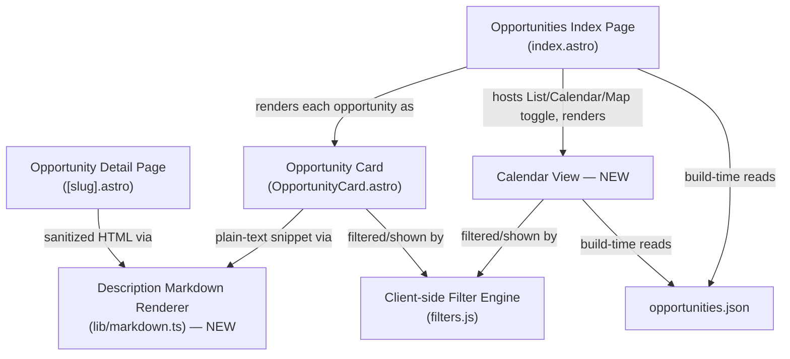

<!-- CLASI: Before changing code or making plans, review the SE process in CLAUDE.md -->

# Sprint 007: Descriptions, calendar view, and flagship dates

## Goals

Ship three independent, stakeholder-reported fixes from the live beta:

1. **Issue 15** — render Markdown and decode HTML entities in opportunity
   descriptions instead of showing raw `**bold**` / `&#8211;` source text.
2. **Issue 16** — add a Calendar view (month grid) alongside the existing
   List/Map toggle on the Opportunities page.
3. **Issue 14** — get the flagship museums (San Diego Natural History
   Museum, San Diego Air & Space Museum, Fleet Science Center) contributing
   a realistic count of dated, upcoming events instead of 0-1 each.

## Problem

**Descriptions (issue 15)**: `site/src/pages/opportunities/[slug].astro`
renders `{opp.description}` as escaped plain text and
`OpportunityCard.astro` truncates the same raw string. Scraped/synced
descriptions routinely carry Markdown (LeagueSync/Pike13 class copy uses
`**bold**` and `\n\n` paragraph breaks) and numeric HTML entities
(`&#8211;`, `&#8217;` from ~22 records) — both show up literally to
readers.

**Calendar view (issue 16)**: The Opportunities page only offers List and
Map views (`site/src/pages/opportunities/index.astro`'s `.view-toggle`).
There is no way to browse opportunities by date, even though every
opportunity already carries a `date_start`.

**Flagship dates (issue 14)**: a live diagnostic run
(`--source X --no-enrich`) showed SDNHM and Air & Space exporting **0**
dated upcoming events and Fleet exporting **1** of 11 discovered pages,
despite the generic HTML extraction ladder (JSON-LD → `<time>` → OG →
title fallback → URL date → body regex,
`partner_scrape/extract/ladder.py`) already existing and working for most
other sources. A live re-check during this sprint's planning
(2026-07-20, read-only `curl`, no code changes) found the failure is
**not one uniform cause** — it differs per source:

- **Air & Space Museum**: `sitemap.xml`, `sitemap_index.xml`,
  `sitemap-index.xml`, and `wp-sitemap.xml` all return HTTP 200 but serve
  the site's homepage HTML (a soft-404/catch-all), not real sitemap XML.
  Sitemap Discovery's existing root-element validation (sprint 005's
  hardening — `discovery/sitemap.py`'s `_SITEMAP_ROOT_TAGS` check)
  correctly *rejects* all of these, so Discovery most likely resolves
  **zero** candidate URLs for this source today — a Discovery-layer gap,
  not a date-extraction-ladder gap. `robots.txt` lists no `Sitemap:`
  directive either.
- **SDNHM**: `sitemap.xml` is real (892 URLs) and does surface
  `/calendar/...` pages that match Sitemap Discovery's existing
  `EVENT_PATH_RE` pattern (e.g. `/calendar/`, `/calendar/summer-camp/`,
  `/calendar/public-programs/`) — consistent with the issue's "39 raw
  events found." But a sampled page (`/calendar/summer-camp/`) is a
  program/category landing page, not a single dated event instance: it
  has no JSON-LD, only two bare `<time>` tags, and body text mixing a
  genuinely upcoming date ("August 7, 2026") with unrelated older dates
  ("March 9, 2015", "August 29, 2014"). The ladder's body-regex rung
  (lowest-confidence, first match within the first 3000 characters) is a
  plausible source of a wrong or dropped date on this kind of
  multi-date page.
- **Fleet Science Center**: a sampled page (`/events/camps`) carries
  20 valid ISO `<time datetime="...">` tags with real July/August 2026
  dates — contradicting the source registry's sprint-003 comment that
  Fleet's detail pages "carry no JSON-LD or `<time>` markup." Another
  sampled page (`/events/candlelight-concerts`) has zero `<time>` tags,
  suggesting some of the 11 discovered URLs are genuinely undated
  evergreen program pages (correctly excluded) while others may need
  different handling.

This heterogeneity — a Discovery gap for one source, a possible ladder
date-selection heuristic gap for another, and a partially-working case
for the third — is why this sprint treats issue 14 as an
investigation-then-fix pair rather than a single ladder change (see
Architecture and Tickets below). Birch Aquarium (`localist` adapter,
already yielding 2 events via a structured API) is explicitly **out of
scope** — it is not reported broken and is structurally unrelated to the
other three (no HTML extraction ladder involved).

## Solution

- **Descriptions**: add a small, build-time-only Markdown+entity
  rendering module the site already needs (Astro is a static build with
  a strict CSP), consumed by both the detail page (sanitized HTML) and
  the card (clean plain-text snippet).
- **Calendar**: add a third view, composed into the existing
  List/Map/`.view-toggle` pattern on the Opportunities page, kept in sync
  with the filter sidebar by extending the existing client-side filter
  engine rather than inventing a second filtering mechanism.
- **Flagship dates**: first diagnose the true per-source root cause
  (a short investigation ticket, informed by the live findings above),
  then apply the narrowest fix per source using mechanisms already built
  into this project's architecture — the existing `fetch_strategy =
  "headless"` config flag (Pipeline's lazy `PlaywrightFetcher`, built in
  sprint 005, currently unused by any registered source), a Discovery
  configuration/pattern adjustment, and/or a targeted fix to the ladder's
  date-selection heuristic — rather than bespoke per-site scrapers.

## Success Criteria

- A LeagueSync class detail page renders bold/paragraphs, not asterisks;
  a description with `&#8211;`/`&#8217;` shows the real characters; card
  previews show clean text (no `**`, no raw entities); no unescaped
  third-party HTML reaches the DOM.
- The Opportunities page toggle reads List · Calendar · Map; Calendar
  renders a month grid starting at the current month, ~3 months
  navigable; each event shows time+title and links to its detail page;
  filtering the sidebar updates the calendar the same way it updates the
  list.
- SDNHM, Air & Space, and Fleet Science Center each contribute a
  realistic count of dated, upcoming events (not 0-1), verified by a
  before/after yield check; `uv run pytest` passes (all ~845 existing
  tests, plus new coverage for whatever changed); `npm run build`
  succeeds for the site.

## Scope

### In Scope

- `site/src/lib/markdown.ts` (new): sanitized Markdown→HTML + HTML-entity
  decoding for the detail page; Markdown/entity-stripped plain text for
  card previews.
- `site/src/pages/opportunities/[slug].astro`, `OpportunityCard.astro`:
  wire in the new renderer.
- `site/src/pages/opportunities/index.astro`: third `data-view="calendar"`
  toggle + `#calendar-container`.
- A new Calendar view component/script (build-time month-grid render).
- `site/src/scripts/filters.js`: extend filtering to cover calendar
  entries via the existing data-attribute convention.
- `partner_scrape/registry/sources/sdnhm.toml`,
  `sandiego-air-space.toml`, `fleet-science-center.toml`: configuration
  fixes (e.g. `fetch_strategy`, discovery pattern/adapter-type) per the
  investigation ticket's findings.
- `partner_scrape/extract/ladder.py` and/or `partner_scrape/discovery/`
  modules: targeted fixes per the investigation ticket's findings, if the
  diagnosis calls for them.

### Out of Scope

- Birch Aquarium / the `localist` adapter (not reported broken).
- Promoting these changes to the production `stem-ecosystem` site (issues
  15 and 16 both note this sprint delivers the beta only; production sync
  is a separate, later effort).
- Any new calendar-library dependency, external CDN/font, or other
  addition that would violate the site's strict CSP / self-contained
  static build.
- Rewriting the extraction ladder's general priority order or its
  confidence-tier scheme; building bespoke per-site scrapers beyond what
  the investigation ticket's diagnosis calls for.
- Auto-detection of JS-rendered pages (the existing explicit
  `fetch_strategy` config flag is reused as-is, not replaced).

## Test Strategy

- **Site**: `npm run build` (`astro build`) must succeed for every site
  ticket — there is no JS test framework in `site/` (`package.json` has
  no `test` script), so behavioral acceptance is verified by the
  specific checks listed per ticket (rendered output, toggle behavior,
  filter sync) plus a successful static build.
- **Scraper**: `uv run pytest` must pass (all ~845 existing tests) for
  every scraper ticket, plus new unit tests for any changed ladder rung
  or discovery logic. A before/after yield check
  (`--source X --no-enrich` or equivalent) on SDNHM, Air & Space, and
  Fleet is required evidence, not just passing tests — the whole point
  of issue 14 is real yield, which unit tests alone don't prove.

## Architecture

**Sizing: Substantial.** Three largely independent fixes, but the sprint
as a whole touches 3+ modules across two subsystems (site:
`OpportunityCard.astro`, `[slug].astro`, `index.astro`, `filters.js`,
plus two new modules; scraper: registry config, and conditionally the
extraction ladder and/or discovery), introduces a **new external
integration** (a Markdown-rendering/sanitizing dependency in the site
build), and composes **two new modules** into existing pages (the
Markdown renderer consumed by two components; the Calendar view composed
alongside List/Map). Any one of "3+ modules," "new external
integration," or "new cross-module composition" independently clears the
Substantial bar per the effort decision, even though no single issue by
itself would.

### Architecture Overview

**Step 1 — Understand the Problem**: covered above (Problem section) —
three independent stakeholder reports, two site-side (rendering,
navigation) and one scraper-side (data quality), with the scraper one
now known to have heterogeneous per-source root causes rather than a
single ladder bug.

**Step 2 — Responsibilities** (each changes for its own, independent
reason — none share a change trigger):

- **R1 — Render safe, readable descriptions.** Turn a raw scraped
  description (Markdown + HTML entities) into a sanitized HTML form for
  the detail page and a clean plain-text form for card previews.
- **R2 — Present a calendar of filtered opportunities.** Render dated
  opportunities as a navigable month grid, kept in sync with whatever the
  filter sidebar currently shows.
- **R3 — Recover a correct date for flagship museum sources.** Per
  source, resolve to the true blocker (Discovery finding no/wrong
  candidate URLs, a fetch that needs a real browser, or a date-selection
  heuristic picking the wrong value) and apply the narrowest existing
  mechanism that fixes it.

**Step 3 — Modules**:

| Module | Purpose (one sentence) | Boundary | Serves |
|---|---|---|---|
| **Description Markdown Renderer** (new, `site/src/lib/markdown.ts`) | Produce a safe display form of one raw description string. | Inside: markdown parsing, entity decoding, sanitization, plain-text stripping — pure functions, build-time only, no DOM/runtime network access; exposes two entry points (sanitized HTML, clean plain text) over the same underlying transformation. Outside: deciding *where* each form is used; the scrape/normalize pipeline that produced the raw text (untouched). | SUC-001 |
| **Opportunity Detail Page** (changed, `[slug].astro`) | Render one opportunity's full detail. | Presentation only; now calls the renderer's sanitized-HTML function via `set:html` instead of raw interpolation. | SUC-001 |
| **Opportunity Card** (changed, `OpportunityCard.astro`) | Render one opportunity summary. | Presentation only; now calls the renderer's plain-text function before the existing `truncate()`. | SUC-001 |
| **Calendar View** (new, a component + client script) | Present the currently-filtered opportunities as a navigable month grid. | Inside: build-time month-grid render (current + 2 future months) from `opportunities.json`, tagged with the same filter data-attributes as cards. Outside: the filtering *decision* logic (owned by the Filter Engine, unchanged) and the List/Map views (untouched). | SUC-002 |
| **Opportunities Index Page** (changed, `index.astro`) | Switch which opportunity view (List/Calendar/Map) is visible. | Adds a third toggle button + `#calendar-container`, same show/hide pattern as the existing Map toggle; implements no calendar logic itself. | SUC-002 |
| **Client-side Filter Engine** (changed, `filters.js`) | Keep the visible set of opportunity representations in sync with the sidebar's filter state. | DOM query + show/hide only, no data fetching; the existing per-card match predicate is extracted and applied to a second element set (calendar entries) via the existing data-attribute convention — not a new filtering algorithm. The `results-count` denominator stays scoped to List's cards only (see Design Rationale) so a second, parallel element set doesn't corrupt "Showing X of Y." | SUC-002 |
| **Source Registry entries** (changed, `sdnhm.toml` / `sandiego-air-space.toml` / `fleet-science-center.toml`) | Declare each flagship source's fetch/discovery configuration. | Config only, no logic. Updated per the investigation ticket's diagnosis (e.g. `fetch_strategy`, discovery pattern/adapter-type). | SUC-003 |
| **Generic HTML Extractor / ladder** (conditionally changed, `extract/ladder.py`) | Recover canonical `Event` fields from one arbitrary page via a fixed priority ladder. | Responsibility unchanged; a fix here is a targeted adjustment to an existing rung's date-selection heuristic for multi-date pages, not a new rung category or per-site logic. Must not regress any other `generic_html`/`listing_html` source. | SUC-003 |
| **Sitemap Discovery** (conditionally changed, `discovery/sitemap.py`) | Resolve a source's sitemap into candidate event URLs. | Responsibility unchanged; a fix here (if needed) is a `config.sitemap_url` override or switching the source's `adapter_type`, not a new discovery mechanism. | SUC-003 |

Unchanged, reused as-is: Headless Fetcher / Pipeline's lazy
`PlaywrightFetcher` construction (sprint 005; this sprint is its first
real consumer among registered sources), Normalize & Dedup's recurring
collapse (`normalize/collapse.py`'s `_span()` already resolves a
recurring group to its next-upcoming occurrence, which Calendar relies
on), the Localist Adapter / Birch Aquarium (out of scope).

**Step 4 — Diagrams**:

Site-side component diagram (required: two new modules are composed
into existing pages — the Markdown Renderer has two new consumers, and
Calendar View is a new third branch of the existing List/Map toggle):

Scraper-side: **no diagram added.** The flagship-dates fix is confined to
existing modules (Source Registry config, the extraction ladder, and
possibly Discovery) with no new module and no new dependency edge — the
existing `Adapter → Extraction Ladder` / `Adapter → Discovery` layering
(documented in prior sprints' architecture) is unchanged. A diagram here
would repeat what's already on record without clarifying anything new
(same exception basis as sprint 020).

No ERD: no data-model change (`Event`/`Opportunity` schemas unchanged;
`SourceConfig.config` already accepts arbitrary keys, including
`fetch_strategy`). No separate dependency graph: the one component
diagram above is the sprint's only new composition; dependency direction
elsewhere is unchanged from the current architecture.

**Step 5 — What Changed / Why / Impact / Migration**: see Design
Rationale and Migration Concerns below, and the per-module table in Step
3 for what changed.

**Impact on Existing Components**: `OpportunityCard.astro` and
`[slug].astro` change how they source display text but keep their props
contract (`opportunity: {...}`) unchanged — no caller outside these two
files is affected. `index.astro`'s inline toggle script gains a third
branch; the existing List/Map branches are untouched. `filters.js`'s
`applyFilters()` gains a broader element selector; its filter-matching
algorithm (AND across groups, OR within) is unchanged, so every other
page using it (e.g. Partners) is unaffected as long as Calendar markup
follows the same data-attribute contract. On the scraper side, any
`extract/ladder.py` change must be proven not to regress the ~10 other
`generic_html`/`listing_html` sources already relying on the ladder —
this is why the fix is scoped to a targeted heuristic adjustment, not a
rung reordering.

### Design Rationale

**Decision: Calendar reuses the Filter Engine's existing data-attribute
show/hide convention rather than a new sync mechanism.**
Context: Calendar must reflect exactly the same filtered set as List/Map.
Alternatives considered: (a) a `MutationObserver` watching card
visibility and mirroring it onto calendar entries; (b) a shared
client-side filter-state store both views subscribe to; (c) tag calendar
entries with the same `data-*` attributes `filters.js` already queries
and extend its selector to include them. Why (c): smallest change, keeps
the filtering algorithm in exactly one place (no duplication, no
observer-based indirection prone to timing/ordering bugs), and matches
how the Map view is already just another DOM view kept in sync by the
same mechanism. Consequences: `filters.js`'s selector list grows by one;
Calendar markup must carry the same `data-*` contract cards do — a small,
documented coupling, not a new abstraction.

**Decision: Markdown rendering happens at build time only, never
client-side.**
Context: the site is a static Astro build with a strict CSP (no
runtime external scripts/fetches). Alternatives: (a) client-side
rendering on page load; (b) build-time rendering (chosen). Why: build
time keeps the CSP simple — no new client script, no risk of
unsanitized client-side `innerHTML` — and the site is already fully
static, so there's no reason to defer work to the browser. Consequences:
whatever renderer/sanitizer package ticket 001 picks must run in Node at
build time, not browser-only; the exact package (Astro's built-in
Markdown support vs. a small `marked` + sanitizer pairing) is left to
that ticket (see Open Questions) rather than pinned here.

**Decision: reuse the existing `fetch_strategy = "headless"` config flag
as the primary lever for JS-rendered flagship pages, rather than building
new headless-detection logic.**
Context: `PlaywrightFetcher` and Pipeline's lazy per-run singleton
already exist end-to-end (sprint 005) but are exercised by zero
registered sources today. Alternatives: (a) auto-detect JS-rendering and
switch fetchers dynamically; (b) the existing explicit per-source config
flag (chosen). Why: the flag already exists exactly for this purpose;
auto-detection would be new speculative machinery for a problem three
explicit config edits can solve. Consequences: whichever sources the
investigation ticket flags get slower (real-browser) fetches — acceptable
given `rate_limit_seconds` already throttles these sources and headless
fetch would apply to at most 2-3 sources total.

**Decision: scope the Filter Engine's `results-count` update to List's
cards only, even though Calendar entries share the same filter predicate.**
Context: `filters.js` currently does
`document.querySelectorAll('[data-type]')` page-wide and drives both the
show/hide pass and the `"Showing X of Y"` header off that same node list
and its length. If Calendar's day-entries are also marked with
`data-type` (needed so they match the existing filter predicate),
folding them into the *same* `querySelectorAll('[data-type]')` call
would double-count entries and corrupt the header — a real risk
surfaced during this section's self-review, not present in today's
List/Map-only code (Map has no `data-type` elements of its own; it reads
`.opp-card`'s attributes instead). Alternatives: (a) one shared node list
for both counting and filtering (bug, as above); (b) scope the two
concerns separately — the existing `cards` query (and thus the counter)
stays scoped to the card grid (e.g. `#results-grid [data-type]`), while a
second, separately-scoped query (e.g. `#calendar-container [data-type]`)
gets the same match predicate applied for show/hide only, never feeding
the counter (chosen). Why: preserves today's counter semantics exactly
("Showing X of Y" always means List's cards) while still giving Calendar
the identical filtering behavior. Consequences: `applyFilters()`'s
per-card matching logic must be extracted into a small shared predicate
function called from two DOM-scoped loops instead of one — a minor
internal refactor of `filters.js`, not a behavior change to filtering
itself.

**Decision: split issue 14 into an investigation ticket and a fix
ticket, rather than one ticket that "fixes the ladder."**
Context: the live diagnostic run above showed the three sources fail for
three different reasons (Discovery finding nothing for Air & Space, a
probable ladder date-selection issue for SDNHM, partially-working
extraction for Fleet) — issue 14's title ("date extraction fails")
undersells what's actually broken for at least one source. Alternatives:
(a) one ticket, presuming a ladder fix; (b) investigate-then-fix
(chosen). Why: committing to "extend the ladder" before confirming each
source's actual blocker risks building the wrong fix (e.g. a ladder
change does nothing for Air & Space if Discovery never hands it any
candidate URLs). Consequences: one extra ticket, but each with a tight,
verifiable scope; ticket 004 depends on ticket 003's findings.

### Migration Concerns

None. No data migration: `Event`/`Opportunity` schemas are unchanged, and
`SourceConfig.config` already accepts arbitrary keys. No backward-
compatibility concern: `OpportunityCard`/`[slug].astro`'s props contract
is unchanged, and `opportunities.json`'s shape is unchanged (Calendar
reads it at build time the same way List does). No deployment sequencing
concern beyond the sprint's own ticket order: the scraper-side fix
(tickets 003-004) and the site-side changes (tickets 001-002) are
independently deployable — the site doesn't need the scraper fix to
build or work, and the scraper fix doesn't need the site changes to
verify via yield check.

### Open Questions

1. Which specific mechanism (headless flag, Discovery config/adapter-type
   change, or ladder heuristic fix) applies to each of SDNHM, Air &
   Space, and Fleet is not fully determined by planning-time diagnostics
   alone. The live findings above are a strong starting hypothesis, not a
   final diagnosis — ticket 003 resolves this before ticket 004 begins.
2. Does Air & Space Museum have a real sitemap at a non-standard path, or
   should it move to `listing_html` (mirroring Fleet)? Not determined —
   no `Sitemap:` directive was found in a live `robots.txt` check;
   ticket 003 to confirm directly against the site's `/events`-style
   pages.
3. The Markdown/sanitizer library choice (Astro's built-in Markdown
   support vs. a small `marked` + sanitizer pairing) is left to ticket
   001's implementer, constrained to "dependency-light, build-time only,
   CSP-safe" — deliberately not pinned here to avoid over-specifying an
   implementation detail with more than one acceptable answer.
4. Issue 16 says Calendar shows "current + next 2, navigable" without
   specifying behavior past that 3-month window. Ticket 002's default:
   no navigation past the pre-rendered window unless trivially cheap to
   extend — low risk either way, flagged rather than blocking.

## Use Cases

### SUC-001: A visitor reads a formatted opportunity description

- **Actor**: Site visitor browsing the public Opportunities pages.
- **Preconditions**: An opportunity's `description` field (scraped or
  synced) contains Markdown syntax and/or numeric HTML entities.
- **Main Flow**:
  1. Visitor opens an opportunity's detail page
     (`/opportunities/{slug}`).
  2. The page renders `description` through the Description Markdown
     Renderer: HTML entities are decoded, Markdown is parsed into HTML,
     and the result is sanitized before being emitted via `set:html`.
  3. Visitor sees real bold text, paragraph breaks, em-dashes, and curly
     apostrophes — not raw `**`, `\n\n`, or `&#8211;`.
  4. Visitor instead browses the Opportunities list/card grid.
  5. Each card renders a plain-text, Markdown/entity-stripped snippet of
     `description`, truncated to 120 characters as before.
- **Postconditions**: The detail page shows sanitized, formatted HTML;
  cards show a clean plain-text preview with no raw syntax.
- **Alternate Flow**: `description` is empty or has no Markdown/entity
  content — the renderer returns the (decoded, possibly unchanged)
  text unchanged; no visible difference from today's rendering.
- **Acceptance Criteria**:
  - [ ] A LeagueSync class detail page renders bold text and paragraph
        breaks, not literal asterisks or run-on text.
  - [ ] A description containing `&#8211;`/`&#8217;` shows the real
        em-dash/apostrophe characters, on both the detail page and the
        card.
  - [ ] Card previews never show `**`, `\n`, or a raw numeric entity.
  - [ ] No unescaped third-party HTML reaches the DOM (sanitizer strips
        `<script>`, inline event handlers, etc.) — verified against a
        description containing a deliberately unsafe HTML fragment.
  - [ ] `npm run build` succeeds.

### SUC-002: A visitor browses opportunities by date on a calendar

- **Actor**: Site visitor browsing the public Opportunities page.
- **Preconditions**: At least one opportunity has a `date_start` within
  the current month or the following two months.
- **Main Flow**:
  1. Visitor opens `/opportunities` (List view is the default, as today).
  2. Visitor clicks the "Calendar" button in the `.view-toggle`
     (List · Calendar · Map).
  3. The page hides the list grid and shows a month-grid calendar
     starting at the current month, with the next two months reachable
     via in-page navigation.
  4. Each dated opportunity appears on its day as compact time + title;
     clicking it navigates to that opportunity's detail page.
  5. Visitor applies a filter in the sidebar (type, age, cost, etc.).
  6. The calendar's visible entries update the same way the list's cards
     do — filtered-out opportunities disappear from their calendar day.
- **Postconditions**: Calendar shows exactly the opportunities the
  current filter selection would show in List view, positioned on their
  `date_start` day.
- **Alternate Flow**: An opportunity has no `date_start` (undated) — it
  never appears on the calendar; it remains visible only in List view,
  matching today's behavior for undated records.
- **Alternate Flow**: A recurring opportunity (already collapsed to its
  next-upcoming occurrence by Normalize & Dedup, per the issue-005
  collapse fix) — it appears once, on that upcoming occurrence's day,
  not on every historical occurrence.
- **Acceptance Criteria**:
  - [ ] The toggle reads List · Calendar · Map; clicking each shows only
        that view.
  - [ ] Calendar renders a month grid starting at the current month, with
        ~3 months (current + 2) reachable.
  - [ ] Each event shows time + title and links to its detail page.
  - [ ] Applying a sidebar filter changes which events the calendar
        shows, matching what List would show for the same filter.
  - [ ] The "Showing X of Y" count (List view) is unaffected by Calendar
        entries — it continues to reflect only the card grid, not
        card+calendar combined.
  - [ ] `npm run build` succeeds.

### SUC-003: A flagship museum's events appear as dated, upcoming opportunities

- **Actor**: The scrape pipeline (Discovery → Fetch → Extract →
  Normalize → Export), operating on the SDNHM, Air & Space, and Fleet
  Science Center sources.
- **Preconditions**: Each source's Source Registry entry and the current
  Discovery/Extraction ladder as diagnosed by ticket 003.
- **Main Flow**:
  1. Pipeline runs Discovery for the source, per its per-source diagnosis
     (e.g. a corrected sitemap/discovery configuration for Air & Space).
  2. Pipeline fetches each candidate page, using the headless fetcher
     where the diagnosis calls for it (JS-rendered content).
  3. The Generic HTML Extractor's ladder recovers a usable `start` date
     for the page (via an existing rung, or a targeted heuristic fix
     where the diagnosis found one rung selecting the wrong value).
  4. Normalize/Export includes the resulting `Opportunity` in
     `opportunities.json` because its date is current or upcoming.
  5. A before/after yield check
     (`--source X --no-enrich`) shows a realistic dated-event count for
     the source, not 0-1.
- **Postconditions**: SDNHM, Air & Space, and Fleet each contribute a
  realistic number of dated, upcoming events to the exported site data.
- **Alternate Flow**: A discovered page is a genuinely undated, evergreen
  program page (e.g. Fleet's `/events/candlelight-concerts`-style pages
  with no per-instance date markup) — it is correctly excluded, not
  forced to a fabricated date.
- **Acceptance Criteria**:
  - [ ] `uv run pytest` passes (all existing tests, plus new coverage for
        whatever changed).
  - [ ] Before/after yield check on SDNHM, Air & Space, and Fleet shows
        each contributing a realistic count of dated upcoming events.
  - [ ] No other registered `generic_html`/`listing_html` source's yield
        regresses.

## GitHub Issues

(GitHub issues linked to this sprint's tickets. Format: `owner/repo#N`.)

## Definition of Ready

Before tickets can be created, all of the following must be true:

- [ ] Sprint planning document is complete (sprint.md, including its
      Architecture and Use Cases sections)
- [ ] Architecture review passed (or skipped, for changes with no
      architectural impact)
- [ ] Stakeholder has approved the sprint plan

## Tickets

| # | Title | Issue | Depends On |
|---|-------|-------|------------|
| 001 | Markdown & entity rendering for opportunity descriptions | 15-render-markdown-in-descriptions.md | — |
| 002 | Calendar view for the Opportunities page | 16-calendar-view.md | — |
| 003 | Investigate flagship museum date-extraction failures (SDNHM, Air & Space, Fleet) | 14-flagship-museum-date-extraction.md | — |
| 004 | Fix flagship museum date extraction per ticket 003's diagnosis | 14-flagship-museum-date-extraction.md | 003 |

Tickets execute serially in the order listed. 001 and 002 are
independent of each other and of 003/004 (disjoint files — site vs.
scraper) and could in principle run in any relative order; 004 requires
003's Findings section to be filled in first.
