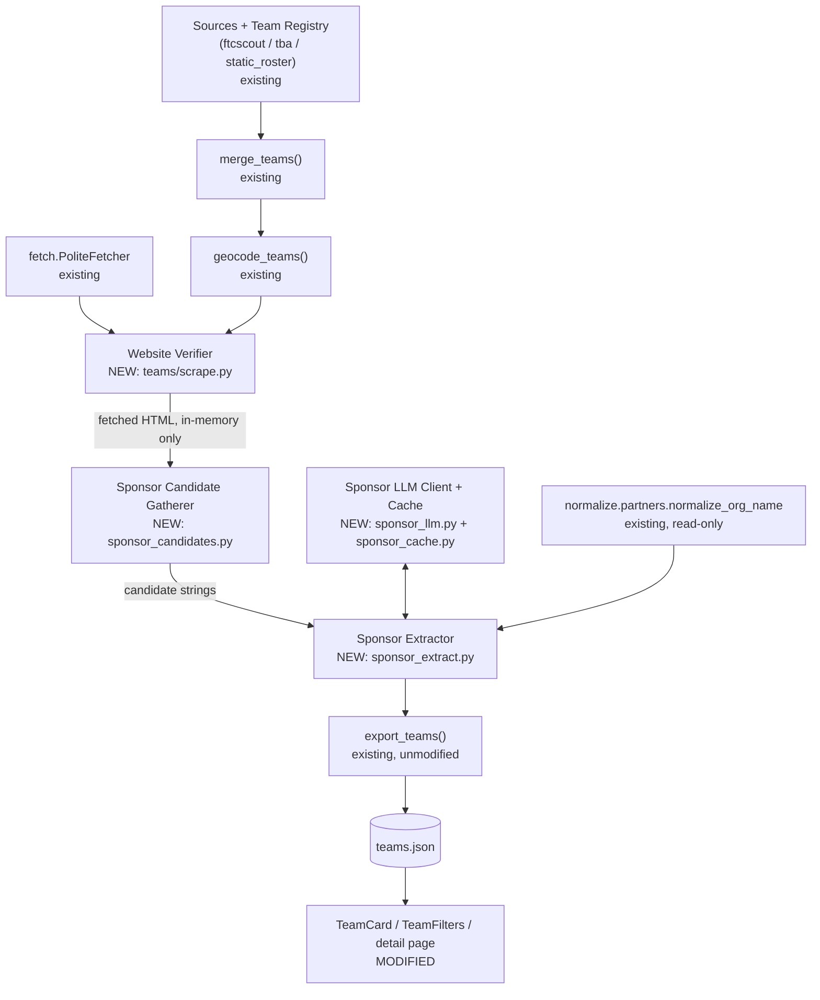
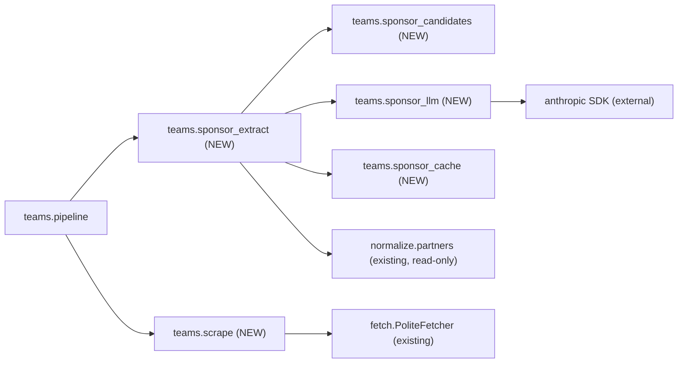

<!-- CLASI: Before changing code or making plans, review the SE process in CLAUDE.md -->

# Sprint 013: Team website surfacing and sponsor extraction

## Goals

Issue 21 (`clasi/issues/21-scrape-team-sites-for-sponsors.md`) asks three
things of the `teams/` directory shipped by sprints 011-012:

1. **Show, on the team entry itself, that a team has a web page** — so a
   visitor (or Fleet/League staff) knows which of the 278 teams are worth
   clicking, instead of opening pages one at a time.
2. **Where a team has a page, fetch it.**
3. **Extract sponsors from those pages**, to build a company-name signal
   useful for partner recruitment — the motivating ask. Qualcomm alone
   already sponsors 18 of the 49 teams with structured sponsor data; the
   53 unscraped FRC sites are where the rest of that picture lives.

This sprint treats (1)+(2) as one cheap, certain unit of work — fetching a
URL a team publicly declared as its own via the same `PoliteFetcher` every
other source in this project already uses — and lands it first so the
sprint delivers something visible early. (3) is the substantial, uncertain
part: there is no schema.org vocabulary for sponsorship, so it requires a
new extraction mechanism, built honestly around its dominant risk — a
wrong sponsor attributed to a real company is worse than an empty list.

## Problem

Measured against the live 278-team export (`site/src/data/teams.json`,
2026-08-27, issue 21):

| | Count | Source |
|---|---|---|
| Teams with `website` | 53 (all FRC) | TBA's structured field |
| Teams with `sponsors` | 49 (all FTC) | FTCScout's structured field |
| Team pages ever fetched | 0 | — |
| `website_status` populated | 0 of 278 | field exists, never written |

The two populated sets barely overlap: FRC teams have sites but no
structured sponsor data, FTC teams have sponsor data but no sites. Nobody
has looked at the 53 pages this project already knows the URL of.
`TeamCard.astro` declares `website`/`website_status`/`organization_website`
in its Props interface but renders none of them; `TeamFilters.astro` has
no website facet — only the detail page surfaces the link, so finding the
53 clickable teams today means opening all 278 pages by hand.

The 87 distinct sponsor strings already in the export carry near-duplicates
("Qualcomm" only today, but the shape of the problem is visible in other
fields); scraped names from arbitrary page HTML will be worse ("Qualcomm"
/ "Qualcomm Inc." / "Qualcomm Incorporated"). There is no existing
mechanism for this: `extract/ladder.py`'s confidence-ranked ladder is
scoped to `Event` fields via schema.org/OpenGraph/time-tag signals, none of
which exists for sponsorship — sponsors on a robotics team site are
typically an unstructured footer logo wall, `` tags whose `alt` text
or filename carries the name, sometimes under a "Sponsors"/"Our
Partners"/"Thank you to" heading.

## Solution

**Site surfacing (cheap, first).** Reuse the `fetcher` parameter already
threaded through `teams.pipeline.run_teams()` (a real `PoliteFetcher` in
production — robots.txt, per-domain throttling, and conditional-GET
caching all apply for free) to fetch each of the 53 known team websites,
classify `Team.website_status` (`confirmed` on a 2xx, `unverified`
otherwise, `none` with no known URL), and surface that on the site: a
website badge on `TeamCard`, a "Has a Website" facet on `TeamFilters`, and
a dead-link guard on the detail page's website link (never publish a link
this project already knows is broken).

**Sponsor extraction (the hard part).** A deterministic candidate-gathering
pass (headings matching `/sponsor|partner|thank/i`, `` `alt`/`title`
text, footer link text/hostnames) reduces each fetched page to a short,
bounded list of raw candidate strings — never the whole page. An LLM call
then *classifies* that candidate list (which of these are genuine
third-party sponsor names?) rather than *generating* one from open text —
the primary defense against hallucination, because the model structurally
cannot invent a company that was never on the page. Every returned name is
additionally validated against the original candidate list post-hoc (a
name not present verbatim is dropped, not trusted), and a small denylist
catches the categories the issue specifically warns about (the site's own
domain, common CMS/hosting vendors, the team's own school name). Sponsor
names are deduplicated against existing structured sponsors using the
project's one existing normalizer, `normalize.partners.normalize_org_name`
— never a second one — and every sponsor carries provenance
(`"structured"` vs `"scraped"`) so a consumer can tell a claim's strength.

Both stages are new modules inside `teams/`, mirroring — but never
importing — `enrich/`'s existing LLM-client/cache pattern, to preserve the
subsystem's standing, explicitly tested invariant that `teams/` has zero
edges into `enrich/`, `adapters/`, `normalize.run()`, or `pipeline.run()`.

## Success Criteria

- `TeamCard` shows a website indicator for, and only for, a team whose
  `website_status` is `confirmed`; `TeamFilters`' "Has a Website" facet
  count matches.
- `website_status` is populated for all 278 teams: `confirmed`/`unverified`
  for the 53 with a known URL, `none` for the rest.
- The team detail page never renders a clickable link for an `unverified`
  website.
- A live `partner-scrape teams --dry-run -v` run against the real 53 FRC
  sites reports pages fetched, 2xx rate, and how many teams gained a
  scraped sponsor.
- A human samples the scraped sponsor output before close and confirms no
  obviously-wrong entry (CMS vendor, hosting provider, school district,
  the site's own domain) shipped.
- No sponsor name is ever published that did not appear verbatim among a
  page's gathered candidates (structural guarantee, tested).
- "Qualcomm" (structured) and any scraped variant of the same company for
  the same team collapse to one entry, never two.
- Full existing test suite stays green; `just build` succeeds and the
  `/teams` page count still equals the team count.

## Scope

### In Scope

- `partner_scrape/teams/model.py`: `sponsor_provenance: dict[str, str]`
  field (`display sponsor name -> "structured" | "scraped"`).
- `partner_scrape/teams/scrape.py` (new): `verify_team_websites()` —
  per-team fetch via the existing `fetcher`, robots-checked, sets
  `website_status`, hands fetched HTML forward in-memory (never onto
  `Team`).
- `partner_scrape/teams/sponsor_candidates.py` (new): deterministic,
  offline candidate-gathering pass over one page's HTML.
- `partner_scrape/teams/sponsor_llm.py` (new): injectable
  `SponsorLLMClient` protocol, `EnrichmentResult`-shaped
  `SponsorExtractionResult`, JSON-schema-from-dataclass generation, real
  `AnthropicSponsorLLMClient`, fixture double — parallel to, never
  importing, `enrich/llm_client.py`.
- `partner_scrape/teams/sponsor_cache.py` (new): content-hash cache for
  sponsor-classification results, parallel to, never importing,
  `enrich/cache.py`.
- `partner_scrape/teams/sponsor_extract.py` (new): orchestration —
  candidate gathering → cache lookup → LLM classify → verbatim validation
  → denylist guard → normalize/dedup against structured sponsors →
  provenance.
- `partner_scrape/teams/sources/ftcscout.py`: set `sponsor_provenance =
  "structured"` for its existing structured sponsors.
- `partner_scrape/teams/pipeline.py`: sequence `verify_team_websites()`
  then `extract_sponsors()` after `geocode_teams()`; new `llm_client`/
  `sponsor_cache` parameters on `run_teams()`.
- `partner_scrape/cli.py`: a `--no-sponsors` flag on the `teams`
  subcommand (skips the LLM stage only; website verification always
  runs — it is the cheap, certain half).
- `site/src/components/TeamCard.astro`: website badge.
- `site/src/components/TeamFilters.astro`: "Has a Website" facet.
- `site/src/pages/teams/[slug].astro`: gate the website link on
  `confirmed` status.
- Tests per Test Strategy, including fixtures captured from real,
  live-fetched team pages (not hand-authored — see Test Strategy).
- `design/` overlay updates to `docs/design/design.md` and
  `partner_scrape/teams/DESIGN.md`.

### Out of Scope

- **Unattended search for an unknown team's website.** Issue 21's own
  Cause section reaffirms the robot-teams issue's original judgment: this
  sprint only ever fetches a URL a team has already declared (via TBA).
  No new website-discovery mechanism is built.
- **FLL and FTC websites.** 0 of 48 FLL teams and 0 of 152 FTC teams have
  a `website` value today (by construction — neither source populates
  one); this sprint does nothing for them, matching the issue's own
  framing.
- **Joining `teams.json` to the curated partner directory.** Still an open
  product question carried from sprints 011/012, not resolved here — see
  Open Questions.
- **Surfacing sponsor provenance in the site UI.** `sponsor_provenance`
  ships in the `teams.json` data contract for stakeholder/programmatic
  use (the sprint's stated motivation is partner-recruitment
  intelligence), not as a new public-facing visual distinction on the
  detail page. A future sprint can add UI treatment if wanted.
- **Persisting sponsor data across runs.** `Team` objects are rebuilt
  fresh from sources every run, with no read-back of the previous
  `teams.json`. A transient fetch failure on a later run does not carry
  forward a previously-scraped sponsor list — flagged honestly in Open
  Questions, not solved this sprint (matches the existing pipeline's
  stateless-rebuild convention throughout `teams/`).
- **A general HTML sponsor-detection framework for `partner_scrape/`
  proper (the `Opportunity` pipeline).** This is a `teams/`-scoped
  mechanism only; nothing here is wired into `adapters/`, `enrich/`, or
  `pipeline.run()`.

## Test Strategy

Fixture-based and hermetic by default, with an explicit live-validation
requirement carried forward directly from a sprint 011 defect: ticket
011-003 filtered TBA records on `state_prov != "CA"` when the real API
returns `"California"` for most records; every unit test passed because
the hand-authored fixture used the wrong value, and the bug (59 of 78 FRC
teams silently dropped) was caught only by running the real pipeline
during sprint validation. This sprint fetches 53 real third-party sites
and asks an LLM to classify what it finds on them — a fixture that
approximates real page structure instead of being captured from it is
exactly the failure mode that lesson warns about, with a higher cost this
time (a fabricated sponsor, not just an undercount).

- **`teams/scrape.py`**: fixture tests for 2xx → `confirmed`, non-2xx/
  transport-error(0) → `unverified` (logged), empty `website` → `none`,
  and a robots.txt disallow on one team never raising out of
  `verify_team_websites()` or affecting any other team's status. A
  regression test asserts no HTML body ever reaches a `Team` field or the
  written `teams.json` (`TEAMS_SCHEMA_FIELDS` derives from
  `dataclasses.fields(Team)`, so anything added to the dataclass
  auto-publishes — this must stay a plain in-memory hand-off, not a
  field).
- **`teams/sponsor_candidates.py`**: fixtures captured from real, live
  `partner-scrape teams` fetches of actual FRC team sites — at least one
  page with a footer logo wall (recovers its known sponsor names as
  candidates), one with a "Thank You to Our Sponsors" heading and one
  with a plain "Our Partners" heading (both recognized), and one with no
  sponsor-shaped section at all (returns `[]`, no LLM call downstream).
  Unparseable HTML returns `[]` with a logged warning, never raises.
- **`teams/sponsor_llm.py` / `sponsor_extract.py`**: a `FixtureSponsorLLMClient`
  double (mirroring `enrich/llm_client.py`'s `FixtureLLMClient`) drives
  every classification test with no network/API call. Required cases: a
  candidate list mixing real sponsor names with an obvious non-sponsor
  (the team's own school name, a CMS vendor name like "Wix"/
  "Squarespace") yields only the real sponsors; a fixture client that
  returns a name **not** present in the original candidate list has that
  name dropped and logged, never published (the structural
  anti-hallucination guarantee — tested directly, not just prompted for);
  "Qualcomm" (structured) and a scraped "Qualcomm Inc." for the same team
  collapse to one entry via `normalize_org_name`, keeping the structured
  display name and provenance; a cache hit (same team, same candidate
  content hash) makes zero LLM calls (call-counting assertion, matching
  `enrich/cache.py`'s own test convention); a missing `ANTHROPIC_API_KEY`
  or any LLM call failure is caught per-team and leaves that team's
  sponsors exactly as structured sources already set them, never aborting
  the run.
- **Site**: `TeamCard`/`TeamFilters`/detail-page tests (or `just build`
  smoke checks) against a fixture `teams.json` with a mix of `confirmed`/
  `unverified`/`none` teams — badge and facet count correctness, and that
  the detail page never emits a clickable `<a>` for an `unverified`
  website.
- **Regression**: the existing export privacy test (no email-address
  pattern anywhere in `teams.json`) is re-run against output that now
  includes scraped page content upstream of extraction — scraped pages
  are a new vector for picking up a coach's personal contact info even
  though `Team` itself still has no `email` field and sponsor extraction
  only ever publishes names, not free text.
- **Pre-close live validation (required, not optional)**: run
  `partner-scrape teams --dry-run -v` against the real, live registry (not
  fixtures) and report: pages fetched, 2xx rate, robots-disallowed count,
  teams gaining a scraped sponsor, and the new distinct-sponsor count.
  Then **a human samples the scraped sponsor output** — at minimum every
  team that gained a sponsor from scraping — and confirms no obviously
  wrong entry (CMS vendor, hosting provider, school district, the site's
  own domain, the program name itself) shipped. This is a stated
  pre-close verification step, matching sprint 011/012's precedent, not
  merely a test to write.
- Full existing suite (`uv run pytest`) stays green; `just build`
  succeeds with the `/teams` page count unchanged in cardinality.

## Architecture

**Substantial** — this sprint touches 3+ modules inside `teams/`
(`model.py`, a new `scrape.py`, three new `sponsor_*.py` modules,
`sources/ftcscout.py`, `pipeline.py`) plus three site components, adds a
new intra-subsystem dependency chain (`pipeline` → `scrape`/
`sponsor_extract` → `sponsor_candidates`/`sponsor_llm`/`sponsor_cache`),
and changes the data model (`Team.sponsor_provenance`, a new field). Any
one of these signals alone would clear the substantial bar; this sprint
has all three.

This project has the persistent per-subsystem design-doc set enabled
(`design_docs_opt_in`), so per `architecture-authoring`'s Mode 2a the full
per-module write-up (Purpose, Boundary, Interfaces, Constraints, Design,
Open Questions) lives in this sprint's `design/` overlay, not here:

- `design/design.md` — updates Sec. 3's "Sprint 011 addition" paragraph
  describing `teams/`'s scope, and Sec. 6's system-wide open questions.
- `design/teams-DESIGN.md` — documents the five new/changed modules, the
  new pipeline stages, the new `Team.sponsor_provenance` field, and the
  design decisions below in full, matching every other increment's level
  of detail in that file.

This section is the pointer and summary; the overlay is the source of
truth tickets are derived from.

**What changed, in one paragraph per capability:**

*Site surfacing.* A new `teams.scrape.verify_team_websites()` fetches each
`Team.website` through the same `fetcher` `run_teams()` already threads
through (a real `PoliteFetcher` in production, so robots.txt/throttle/
cache apply with zero new plumbing), setting `website_status` to
`confirmed`/`unverified`/`none` and handing the fetched body forward
in-memory — never onto the `Team` dataclass itself, since
`TEAMS_SCHEMA_FIELDS` auto-publishes every dataclass field to the public
`teams.json`. `TeamCard`, `TeamFilters`, and the detail page's website
link all key off `website_status` rather than raw `website` presence, so
a directory never advertises a link this project already knows is dead.

*Sponsor extraction.* Three new modules — `sponsor_candidates.py` (pure,
offline HTML → candidate strings), `sponsor_llm.py` (injectable
classification client + cache-friendly result type, mirroring but never
importing `enrich/llm_client.py`), `sponsor_cache.py` (content-hash cache,
mirroring but never importing `enrich/cache.py`) — are orchestrated by a
fourth, `sponsor_extract.py`, which runs once per team with a fetched
page: gather candidates, check the cache, classify via the LLM
(constrained to *selecting from* the candidate list, never generating
new names), validate every returned name is verbatim in that list, apply
a small denylist as defense-in-depth, then dedup/merge into
`Team.sponsors` against any existing structured sponsors via
`normalize.partners.normalize_org_name` (reused, not reimplemented),
recording provenance in the new `Team.sponsor_provenance` field.

### Architecture Overview

| Module | Change | Use case served |
|---|---|---|
| `teams/model.py` | + `sponsor_provenance: dict[str, str]` field | SUC-004 |
| `teams/scrape.py` (new) | `verify_team_websites()`: per-team fetch, robots-checked, sets `website_status`, hands HTML forward in-memory | SUC-001 |
| `teams/sponsor_candidates.py` (new) | `gather_sponsor_candidates()`: deterministic, offline HTML → candidate strings | SUC-003 |
| `teams/sponsor_llm.py` (new) | `SponsorLLMClient` protocol, `SponsorExtractionResult`, real `AnthropicSponsorLLMClient`, fixture double | SUC-004 |
| `teams/sponsor_cache.py` (new) | Content-hash cache for sponsor classification results | SUC-004 |
| `teams/sponsor_extract.py` (new) | Orchestrates gather → cache → classify → validate → guard → normalize/dedup → provenance | SUC-004 |
| `teams/sources/ftcscout.py` | Sets `sponsor_provenance="structured"` for its existing sponsors | SUC-004 |
| `teams/pipeline.py` | Sequences the two new stages after `geocode_teams()`; new `llm_client`/`sponsor_cache` params | SUC-001, SUC-004 |
| `cli.py` | `--no-sponsors` flag on the `teams` subcommand | SUC-004 |
| `site/.../TeamCard.astro` | Website badge, keyed on `website_status === 'confirmed'` | SUC-002 |
| `site/.../TeamFilters.astro` | "Has a Website" facet | SUC-002 |
| `site/.../teams/[slug].astro` | Website link gated on `confirmed` status | SUC-002 |

**Component/Module Diagram** (required: 6 new modules, new cross-module
dependencies):

**Dependency Graph** (required: new intra-subsystem edges introduced):

No new edge crosses into `enrich/`, `adapters/`, `normalize.run()`, or
`pipeline.run()` — the system-level dependency direction
`docs/design/design.md` Sec. 3 documents is unchanged. Every edge above is
either internal to `teams/` or a reuse of a dependency that already
existed (`fetch/`, `normalize.partners`).

No entity-relationship diagram: the only data-model change is one
additional field (`sponsor_provenance: dict[str, str]`) on the existing
`Team` entity, with no new entity or relationship — the field is fully
described in the table above and in Design Rationale below.

### Design Rationale

- **Decision: sponsor extraction lives entirely inside `teams/` as new
  modules that mirror, but never import, `enrich/llm_client.py`/
  `enrich/cache.py`.** *Context:* the issue explicitly points at
  `enrich/`'s JSON-schema-constrained LLM pattern and content-hash cache
  as the pattern to follow. *Alternatives considered:* import
  `enrich.llm_client`'s schema-builder helper and `enrich.cache`'s cache
  class directly — rejected. `enrich.llm_client.LLMClient.enrich_event`
  is typed to `partner_scrape.model.Event`, and `enrich.cache.EnrichmentCache`
  is keyed by `Event.identity_key()`; neither generalizes to a `Team`/HTML
  candidate list without changing their public signature, which would
  couple two modules that already, deliberately, change for unrelated
  reasons (mirrors `enrich/llm_client.py`'s own stated reason for not
  importing `normalize/taxonomy.py` despite vocabulary overlap: "duplication
  here is the accepted cost of keeping this module's one outward
  dependency the external Anthropic API, not another in-package module").
  *Why this choice:* `teams/DESIGN.md` states, and `tests/teams/
  test_sources_base.py` partially enforces, that `teams/` has zero edges
  into `enrich/`, `adapters/`, `normalize.run()`, or `pipeline.run()` —
  importing `enrich.llm_client` would be the first crack in that boundary,
  for a savings of roughly 60 lines of duplicated schema-building/cache
  logic. *Consequences:* `teams/sponsor_llm.py` duplicates a small
  (~15-line) JSON-schema-from-dataclass helper and `teams/sponsor_cache.py`
  duplicates `enrich/cache.py`'s content-hash-plus-schema-version shape;
  both are cheap, self-contained, and unlikely to drift since neither
  dataclass they serialize will change often.
- **Decision: the LLM's role is constrained classification over
  deterministically-gathered candidates, never open-ended generation.**
  *Context:* the issue names false positives as the dominant risk — an
  LLM asked "what are this page's sponsors?" over a full footer will
  confidently return the CMS vendor, the hosting provider, the school
  district, or the site's own domain. *Alternatives considered:* send the
  LLM the whole page (or footer HTML) and ask it to name sponsors freely —
  rejected as exactly the failure mode the issue warns about, with no
  structural way to catch a hallucinated name; a prompt-only guard with no
  candidate constraint — rejected as relying entirely on the model
  following instructions, with no code-level backstop. *Why this choice:*
  asking the model to *select from* a deterministically-gathered candidate
  list, then rejecting (in code, not just by not trusting) any returned
  name absent from that list, makes fabricating an unseen company
  structurally impossible, not merely discouraged — the deterministic pass
  is the actual security boundary, the LLM only narrows within it. *Consequences:*
  a genuine sponsor whose name never appears as a heading, `alt`/`title`
  text, or footer link (e.g. named only in flowing body prose) is missed —
  an accepted false-negative cost in exchange for a much stronger
  false-positive guarantee, matching the issue's own stated priority
  ("a wrong sponsor attributed to a real company is worse than an empty
  list").
- **Decision: fetched HTML is threaded through `run_teams()` as a local,
  non-model `dict[team_id, str]`, never stored on `Team`.** *Context:*
  `teams/export.py`'s `TEAMS_SCHEMA_FIELDS` is deliberately derived from
  `dataclasses.fields(Team)` so a new field publishes automatically with
  no `export.py` change — a real strength for `sponsor_provenance`, but a
  hazard for anything that must *not* publish. *Alternatives considered:*
  store the raw body on `Team` temporarily and strip it in `export.py` —
  rejected, `export.py`'s whole design point is never needing a
  field-specific exclusion list beyond the one existing `sources`
  exception; adding a second one for this purpose reintroduces exactly
  the drift risk that field was designed to avoid. *Why this choice:*
  keeping fetched bodies as a plain local variable inside
  `run_teams()`'s own call stack means there is no field to forget to
  strip — the same category of guarantee `model.Team`'s "no email field,
  ever" docstring already establishes for contact data, applied here to
  raw scraped page content, which could just as easily carry a coach's
  personal contact info. *Consequences:* `verify_team_websites()` and
  `extract_sponsors()` must be sequenced directly inside `run_teams()`
  (not run as fully independent CLI-invokable stages) to pass this dict
  between them — an acceptable coupling, matching how `merge_teams()` and
  `geocode_teams()` already require the same single-call sequencing.
- **Decision: `sponsor_provenance` is a new `dict[str, str]` field
  alongside the existing `sponsors: list[str]`, not a restructured
  `sponsors: list[SponsorRecord]`.** *Context:* `TeamCard`'s Props
  interface, the detail page's rendering
  (`team.sponsors.map((s: string) => ...)`), and every existing sponsor
  test/fixture (`tests/teams/test_model.py`, `test_sources_ftcscout.py`)
  already assume `sponsors` is a flat `list[str]`. *Alternatives
  considered:* replace `sponsors` with a list of a small
  name+provenance record — rejected; it would touch every one of those
  existing call sites for a benefit (structural typing) a parallel dict
  achieves losslessly. *Why this choice:* `sponsor_provenance[name]`
  answers "is this a structured or scraped claim?" for any name already
  in `sponsors`, at zero cost to existing code paths — the same "purely
  additive" shape sprint 012's Design Rationale chose for `Team.sources`
  answering a parallel "is this record static or live?" question.
  *Consequences:* a consumer wanting both a sponsor's name and its
  provenance together must join the two fields by key rather than reading
  one list of records — a minor ergonomic cost accepted for zero churn
  elsewhere.
- **Decision: sponsor name normalization reuses
  `normalize.partners.normalize_org_name` as the dedup key, never a
  second normalizer.** *Context:* the issue explicitly directs this;
  `teams/merge.py` already established a precedent of reusing this exact
  function, read-only, for a different purpose (cross-league organization
  linking) rather than writing something new. *Alternatives considered:*
  a school-name-style normalizer like `teams/geo.py`'s
  `normalize_school_name` — rejected; that function's whole justification
  is CDE/NCES's specific naming quirks (a government directory's
  conventions for *place* names), which do not apply to *company* names
  at all. Sponsor names are squarely `normalize_org_name`'s intended
  domain (it already exists to match organization-name variants against
  the partner directory), so — unlike `geo.py`'s deliberate divergence —
  there is no boundary-crossing concern reusing it here. *Why this
  choice:* one sponsor-name match key, project-wide, for the partner
  directory join and this new sponsor consolidation alike. *Consequences:*
  none identified.
- **Decision: the website-fetch and sponsor-classification stages reuse
  the single `fetcher`/new `llm_client` parameters already (or newly)
  threaded through `run_teams()`, rather than constructing their own.**
  *Context:* every existing `teams/` stage that touches the network
  (`sources/ftcscout.py`, `sources/tba.py`) already takes `fetcher` as an
  explicit parameter, never constructing a default itself except at the
  one CLI call site. *Why this choice:* `verify_team_websites()` calling
  the same `fetcher` gets robots.txt/throttle/cache for free with zero new
  plumbing, and gets a clean `FixtureFetcher` swap in tests automatically —
  the same seam `discovery/hub_scan.py` already uses for its own
  many-independent-pages fetch loop (`is_allowed()` checked explicitly
  per page before `fetcher.get()`, non-2xx logged and skipped, never
  raising out of the loop). This sprint's `verify_team_websites()` follows
  that exact, already-proven pattern rather than inventing a new one.
  *Consequences:* none identified.

### Migration Concerns

- **`ANTHROPIC_API_KEY` provisioning for the `teams` subcommand's
  scheduled runs is unverified** — mirrors the exact gap sprint 011
  flagged for `TBA_KEY` (provisioned locally, not yet confirmed in the
  scheduled workflow's secrets). The main `run` pipeline already depends
  on this key for event enrichment, so it likely already exists in CI,
  but this sprint's `teams` job may run under a different workflow/secret
  scope — verify before relying on scheduled sponsor extraction. A
  missing key degrades to a logged warning and structured-sponsors-only
  output (Design Rationale: fail-open per team), never aborts the run.
- **Bootstrap**: `partner-scrape teams` must run at least once with both
  `TBA_KEY` and `ANTHROPIC_API_KEY` set for `/teams` to show confirmed
  website badges and scraped sponsors — matching sprints 011/012's own
  bootstrap notes, now extended to this sprint's two new stages.
- **No schema/backfill migration** for `sponsor_provenance` — it defaults
  to an empty dict via `TEAMS_SCHEMA_FIELDS`'s `dataclasses.fields()`
  derivation, exactly as `org_key`/`sibling_team_ids`/`latitude`/
  `longitude` did in sprint 011 with no `export.py` change required.
- **Sponsor data is not persisted across runs** — see Open Questions for
  the full explanation; flagged here because it is a real operational
  behavior change from "sponsors only ever grow," not merely a
  theoretical edge case.
- **Pre-close live validation is required**, not optional — see Test
  Strategy.

### Open Questions

1. **Is `ANTHROPIC_API_KEY` actually available to whatever job invokes
   `partner-scrape teams` in CI?** Unverified — see Migration Concerns.
   Confirm before assuming scheduled sponsor extraction will run.
2. **Structured+scraped sponsor overlap for the same team is currently
   impossible in the live 278-team corpus** (FTC teams have no `website`;
   FRC teams have no structured `sponsors` field), so the
   normalize/dedup/provenance-merge logic in `sponsor_extract.py` is
   built to handle a real collision generally but is exercised only by
   fixture tests, never a live one, this sprint. If a future source ever
   supplies both for the same team, this is the first place to check.
3. **Is the false-positive guard (verbatim-candidate validation + small
   denylist) sufficient without a required human-sampling step on every
   future *scheduled* run, not just this sprint's one-time close-time
   review?** This sprint requires a human sample before close (Test
   Strategy); whether an unattended weekly/monthly re-run needs the same
   review, or can be trusted to the code-level guard alone, is not
   resolved here.
4. **Sponsor data is not carried forward between runs.** `Team` objects
   are rebuilt fresh from their sources every `run_teams()` call, with no
   read-back of the previous `teams.json` — the same "stateless rebuild"
   convention every other stage in this subsystem already follows
   (geocoding, merging). For deterministic stages that is harmless; for
   this sprint's sponsor scraping it means a transient fetch failure or a
   momentarily-down team site on a *later* run will silently drop that
   team's previously-scraped sponsors (they revert to whatever the
   structured sources alone provide — currently none, for an FRC team)
   until the next successful fetch, rather than preserving the last known
   good result. Not solved this sprint; worth flagging because "sponsors
   only ever grow" is not actually true of this design.
5. **Does the new sponsor company-name data change the calculus on
   joining `teams.json` to the curated partner directory**, an open
   product question already on record from sprints 011/012? Not resolved
   here — this sprint only makes the question more concretely answerable
   (which companies actually sponsor which teams), it does not answer it.

## Use Cases

`docs/design/usecases.md`'s twelve existing UCs predate `teams/` entirely.
Matching sprint 011's precedent, each SUC below parents to the closest
existing UC by shape rather than minting a new top-level UC.

### SUC-001: Fetch and verify each team's declared website
Parent: UC-005

- **Actor**: Engine
- **Preconditions**: `merge_teams()`/`geocode_teams()` have run; at least
  one `Team` has a non-empty `website` (currently 53, all FRC, from TBA).
- **Main Flow**:
  1. `teams.pipeline.run_teams()` calls
     `teams.scrape.verify_team_websites(teams, fetcher)` after
     `geocode_teams()`.
  2. For each `Team` with a non-empty `website`, robots.txt is checked via
     `fetch.is_allowed()` before any request is made.
  3. An allowed URL is fetched through the same `fetcher` already threaded
     through `run_teams()` (a real `PoliteFetcher` in production —
     robots/throttle/cache apply with zero new plumbing).
  4. A 2xx response sets `website_status="confirmed"` and hands the body
     forward in-memory (never onto `Team`) to the sponsor-extraction
     stage.
  5. A non-2xx response, a transport error (status `0`), or a robots
     disallow sets/leaves `website_status="unverified"` and logs a
     warning naming the team and the reason.
  6. A `Team` with no `website` gets `website_status="none"`.
- **Postconditions**: every `Team`'s `website_status` is one of
  `confirmed`/`unverified`/`none`; a live run's log reports the aggregate
  2xx rate.
- **Error Flows**: a fetch failure or robots disallow is isolated per
  team — it never aborts the run or affects any other team's status,
  matching the project's "errors isolated at the level that owns the
  unit" convention.
- **Acceptance Criteria**:
  - [ ] Fixture test: a 2xx response sets `confirmed`; a 404/500/
        transport-error(0) sets `unverified` and logs; an empty `website`
        sets `none`.
  - [ ] Fixture test: a robots.txt disallow on one team's URL never
        raises out of `verify_team_websites()` and never touches any
        other team's status.
  - [ ] Regression test: no HTML body is ever present on a `Team` field
        or in the written `teams.json`.
  - [ ] A real `partner-scrape teams --dry-run -v` run against the live
        53 FRC URLs reports a 2xx rate and a per-status team count
        (Test Strategy's live-validation step).

### SUC-002: Visitor sees which teams have a verified website
Parent: UC-012

- **Actor**: Visitor
- **Preconditions**: `teams.json` carries populated `website_status`
  values (SUC-001 has run at least once).
- **Main Flow**:
  1. Visitor opens `/teams`.
  2. `TeamCard` renders a website indicator (the existing `SocialIcon`
     `website` platform) only for a team whose `website_status ===
     'confirmed'`.
  3. `TeamFilters` exposes a "Has a Website" facet with a build-time
     count of confirmed teams; checking it narrows the list.
  4. Visitor opens a team's detail page; the Team Website field renders
     as a clickable link only when `confirmed`, otherwise as plain
     (unlinked) text noting it is unverified.
- **Postconditions**: a visitor can identify and filter to teams worth
  clicking without ever landing on a link this project already knows is
  dead.
- **Error Flows**: a team with `website_status === 'unverified'` never
  renders a clickable link on the detail page (the issue's own "a broken
  link published is worse than no link" concern) but still appears,
  unfiltered, in the list view.
- **Acceptance Criteria**:
  - [ ] `TeamCard`'s badge appears for a `confirmed`-status fixture team
        and not for `unverified`/`none`.
  - [ ] `TeamFilters`' "Has a Website" count matches the number of
        `confirmed` teams in the fixture `teams.json`.
  - [ ] The detail page's Team Website field is a clickable `<a>` only
        when `confirmed`; `unverified` renders the bare URL as text with
        a note; `none` renders nothing (existing behavior, unchanged).
  - [ ] `just build` succeeds; `/teams` page count still equals the
        fixture team count.

### SUC-003: Gather sponsor-name candidates from a fetched team page
Parent: UC-003

- **Actor**: Engine
- **Preconditions**: SUC-001 fetched a team's page with a 2xx response;
  its HTML body is available in-memory to this stage.
- **Main Flow**:
  1. `teams.sponsor_candidates.gather_sponsor_candidates(html, page_url)`
     parses the page once (`lxml`, matching `extract/`'s existing
     dependency).
  2. It collects text from headings matching `/sponsor|partner|thank/i`
     and their following block, plus every ``/`` and
     outbound-link text/hostname inside any `<footer>` element.
  3. Candidates are deduplicated and capped (e.g. 40) before returning.
  4. A page with no matching heading and no footer signal returns an
     empty list.
- **Postconditions**: a short, bounded list of raw candidate strings per
  team — never the full page — ready to constrain the next stage's LLM
  call, or nothing at all when a page has no sponsor-shaped section.
- **Error Flows**: unparseable HTML returns `[]` with a logged warning,
  matching `extract/ladder.py`'s and `discovery/hub_scan.py`'s own
  precedent — never raises.
- **Acceptance Criteria**:
  - [ ] Fixture test against a real, live-captured team page containing a
        footer logo wall recovers its known sponsor names as candidates
        (not necessarily *only* those — filtering false positives is the
        next stage's job).
  - [ ] Fixture test against a real captured page with no sponsor section
        at all returns `[]`.
  - [ ] Unparseable HTML returns `[]` and logs, never raises.
  - [ ] A page with a "Thank You to Our Sponsors" heading and a page with
        a plain "Our Partners" heading are both recognized by the same
        pattern.

### SUC-004: Classify sponsor candidates and publish with provenance
Parent: UC-004

- **Actor**: Engine
- **Preconditions**: SUC-003 produced a non-empty candidate list for a
  team.
- **Main Flow**:
  1. `teams.sponsor_extract` looks up `(team_id,
     content_hash(candidates))` in the sponsor cache; a hit skips the LLM
     call entirely.
  2. On a miss, `teams.sponsor_llm.SponsorLLMClient.classify_sponsors(
     candidates, context)` asks the model to *select* — never
     *generate* — the subset of candidates that are genuine third-party
     sponsor names, explicitly excluding the team's own organization
     name, the FIRST/FTC/FRC program names, and common CMS/hosting vendor
     names.
  3. Every returned name is validated against the original candidate
     list; any name not present verbatim is dropped and logged rather
     than trusted.
  4. The surviving names are deduplicated against the team's existing
     (structured) sponsors via `normalize.partners.normalize_org_name`; a
     key already present from a structured source keeps its structured
     display name and provenance; a new key is added with provenance
     `"scraped"`.
  5. `Team.sponsors` and `Team.sponsor_provenance` are updated in place;
     the result is cached.
- **Postconditions**: `teams.json`'s `sponsors` carries both structured
  and scraped names with no duplicate normalized entries;
  `sponsor_provenance` lets a consumer tell which is which.
- **Error Flows**: an LLM call failure (network, malformed response,
  missing `ANTHROPIC_API_KEY`) is caught per-team and logged; that team's
  sponsors are left exactly as the structured sources already set them
  (fail-open, matching `enrich/`'s "fail open, always" project-wide
  convention) — it never aborts the run for any other team.
- **Acceptance Criteria**:
  - [ ] Fixture test: a candidate list containing both real sponsor names
        and an obvious non-sponsor (the team's own school name, a CMS
        vendor name) yields only the real sponsors in `Team.sponsors`.
  - [ ] Fixture test: a fixture LLM client that returns a name **not** in
        the candidate list has that name dropped and logged, never
        published.
  - [ ] Fixture test: "Qualcomm" (structured) and "Qualcomm Inc."
        (scraped, same team) collapse to one entry under
        `normalize_org_name`'s key, keeping the structured display name
        and provenance.
  - [ ] A cache hit (same team, same candidate content hash) makes zero
        LLM calls, verified via a call-counting fixture client (matching
        `enrich/cache.py`'s own test convention).
  - [ ] A live `partner-scrape teams --dry-run -v` run against the real
        53 FRC sites reports pages fetched, teams gaining a scraped
        sponsor, and the new distinct-sponsor count; a human samples the
        scraped output and confirms no obviously-wrong entry before this
        sprint closes.

## GitHub Issues

(GitHub issues linked to this sprint's tickets. Format: `owner/repo#N`.)

## Definition of Ready

Before tickets can be created, all of the following must be true:

- [ ] Sprint planning document is complete (sprint.md, including its
      Architecture and Use Cases sections)
- [ ] Architecture review passed (or skipped, for changes with no
      architectural impact)
- [ ] Stakeholder has approved the sprint plan

## Tickets

| # | Title | Depends On |
|---|-------|------------|
| 001 | Fetch and verify team websites | — |
| 002 | Site surfacing for team websites | 001 |
| 003 | Deterministic sponsor candidate extraction | 001 |
| 004 | Sponsor extraction LLM client and cache | 003 |
| 005 | Sponsor extraction orchestration and normalization | 001, 004 |

Tickets execute serially in the order listed. 001+002 are the cheap,
certain site-surfacing win and land first; 003→004→005 is the substantial,
uncertain sponsor-extraction chain, sequenced by real dependency (each
stage consumes the previous stage's output shape).
