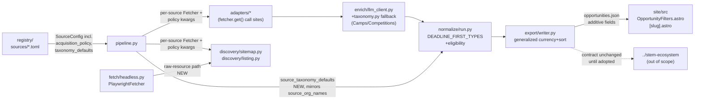

<!-- CLASI: Before changing code or making plans, review the SE process in CLAUDE.md -->

# Sprint 015: Unblock Headless Sources and Extend the Opportunity Schema

## Goals

1. Fix the two root-caused bugs (issue 37) that block all 9 sprint-014
   headless-flagged sources plus `sandiego` at the discovery step, and
   re-probe every affected source to record real yield.
2. Close the acquisition-policy gap issue 38 found live: thread
   `respect_robots`/`rate_limit_seconds` from each source's TOML into
   the actual fetch path, and populate Fleet's `Event.location` so the
   Balboa Park cross-source dedup can be re-measured honestly. Ship the
   five robots-gated feed registrations only if the stakeholder's
   robots-policy call lands during this sprint.
3. Extend the `Opportunity` schema end-to-end (issue 27) to express
   three shapes the gap analysis needs: `Camps`/`Competitions`
   opportunity types, deadline-first (apply-by) currency for any
   record whose type warrants it, and an honest `eligibility` note for
   closed-pipeline programs — coordinated with (but not requiring
   code changes in) the sibling `stem-ecosystem` repo.

## Problem

Three follow-up threads from sprint 014's live triage and registration
work, each already root-caused with live evidence, none yet fixed:

- **Issue 37**: `fetch/headless.py`'s `PlaywrightFetcher.get()` reads a
  navigated page's *rendered document* (`page.content()`), which is
  correct for HTML but silently mangles or aborts on a raw `.xml`
  sitemap — blocking all 9 headless-flagged sources at discovery even
  though their HTML pages already render correctly (sprint 014 ticket
  002). Separately, `discovery/sitemap.py`'s `_parse_urlset()` queries
  only the hardcoded `sitemaps.org/0.9` namespace while root-tag
  acceptance is namespace-agnostic, so a sitemap declaring any other
  namespace (confirmed live: `sandiego.edu`'s legacy 0.84 schema)
  parses successfully but yields zero URLs.
- **Issue 38**: `PoliteFetcher.get()`'s own docstring documents the
  intended design — "callers that have a `SourceConfig` pull
  `rate_limit_seconds`/`respect_robots` out of `acquisition_policy`
  themselves" — but no adapter or discovery call site actually does
  this. `leaguesync.toml`'s `respect_robots = false` has silently had
  no effect since it was written. Five live, high-yield, well-formed
  feeds (SD County Parks, SDAA, Mission Trails, Surfrider SD, SWE San
  Diego) are blocked solely by tockify/gcal `robots.txt`, and whether
  to treat an explicitly-published ICS subscription URL as feed-client
  traffic is a policy call for the stakeholder, not an engineering one.
  Separately, `fleet-science-center.toml`'s `listing_html` adapter
  never populates `Event.location`, which is exactly what blocked the
  one measured Balboa Park ↔ Fleet cross-source collapse.
- **Issue 27**: the gap analysis needs three content shapes the
  current schema cannot express — a `Camps`/`Competitions`
  `opportunity_type` (96% of records currently land in the generic
  "Out-of-school Programs" bucket), deadline-first currency for
  apply-by records beyond the one hardcoded `"Work-based Learning"`
  special case, and an `eligibility` note for programs that are real
  but restricted to specific schools/districts (Northrop HIP, Scripps
  REACH, SBP Preuss, Illumina/SD2, Zoo free field trips) rather than
  silently omitting them.

## Solution

Three independent-but-sequenced tracks, ordered so the highest-leverage
fix (unblocking real yield) lands first:

1. **Issue 37 track** (tickets 001-002): fix both bugs entirely inside
   their owning modules (`fetch/headless.py`, `discovery/sitemap.py`) —
   no adapter or discovery caller learns headless fetching exists, and
   no new Fetcher Protocol method is added — then re-probe live and
   record dispositions.
2. **Issue 38 track** (tickets 003-005): implement the acquisition-policy
   threading `PoliteFetcher.get()`'s docstring already specifies, at
   every existing `fetcher.get()` call site; populate Fleet's location
   via a new, adapter-generic `config.default_location` registry
   convention (not a Fleet-specific code constant); register the five
   robots-gated feeds only if the stakeholder's decision lands this
   sprint (ticket 005, explicitly gated, not blocking sprint close).
3. **Issue 27 track** (tickets 006-008): extend the controlled
   `opportunity_type` vocabulary and its two fallback layers (LLM
   prompt + keyword rule), generalize the existing `end`-as-deadline
   convention from one hardcoded type check to a small set-membership
   check reused in both the currency filter and the sort key, and wire
   `eligibility` through the same `SourceConfig.taxonomy_defaults`
   mechanism the registry schema already declares but nothing in the
   codebase currently reads.

Every change to the `Opportunity`/`opportunities.json` contract is
additive: new fields, new controlled-vocabulary values, and a widened
(never narrowed) currency rule. The sibling `stem-ecosystem` production
checkout keeps consuming today's contract unchanged until someone
there opts into the new fields.

## Success Criteria

- All 9 headless-flagged sources plus `sandiego` are re-probed live
  post-fix; each has a recorded, current disposition (re-enabled with
  a real yield, or still disabled with an updated reason).
- No adapter's `fetcher.get()` call site ignores its source's
  `acquisition_policy` any longer; `leaguesync.toml`'s existing
  `respect_robots = false` is verified to actually take effect.
- Fleet events carry a real `Event.location`; the Balboa Park ↔ Fleet
  dedup measurement from sprint 014 ticket 004 is re-run and its
  result (collapse count) is recorded, whatever it is.
- `Camps` and `Competitions` are selectable, correctly-populated
  `opportunity_type` values across the LLM prompt, keyword fallback,
  export contract, and this repo's `site/` filter UI.
- A non-internship record carrying a future application deadline
  (`Competitions`, or any type in the generalized deadline-first set)
  stays exported, displays "Apply by …", and sorts sensibly — matching
  the existing, already-shipped `Work-based Learning` behavior.
- The five named closed-pipeline programs display an honest
  eligibility note rather than being silently omitted, once their
  registry entries are edited.
- Full hermetic suite (1454+ tests, growing with this sprint's new
  fixtures) stays green throughout; no live network access from any
  committed test.

## Scope

### In Scope

- `fetch/headless.py`: raw/non-HTML resource retrieval for headless
  sources.
- `discovery/sitemap.py`: namespace-agnostic URL-set parsing.
- Live re-probe and registry (`registry/sources/*.toml`) disposition
  updates for the 9 headless-flagged sources + `sandiego`.
- Acquisition-policy threading (`respect_robots`, `rate_limit_seconds`)
  at every adapter and sitemap/listing-discovery `fetcher.get()` call
  site.
- `adapters/listing_html.py` + `fleet-science-center.toml`: registry-
  configured fallback location; Balboa Park dedup re-measurement.
- Conditional: five robots-gated feed registrations (`registry/sources/
  *.toml`), gated on a recorded stakeholder decision.
- `enrich/llm_client.py`, `normalize/taxonomy.py`: `Camps`/
  `Competitions` opportunity-type vocabulary, `PROMPT_VERSION` bump.
- `normalize/run.py`, `export/writer.py`: generalized deadline-first
  currency/sort rule.
- `normalize/run.py`, `pipeline.py`, targeted `registry/sources/*.toml`
  edits: `eligibility` field via `taxonomy_defaults` threading.
- `site/` (this repo's own Astro checkout): `OpportunityFilters.astro`
  facet list, `[slug].astro` eligibility display.

### Out of Scope

- Any code change in the sibling `../stem-ecosystem` checkout — a
  different repository with its own deploy; this sprint keeps the data
  contract additive/backward-compatible and flags the matching
  `OpportunityFilters.astro` edit there as a follow-up, not a ticket.
- A new adapter for LibCal (Carlsbad), the NPS events API, or any
  other source sprint 014 already deferred for adapter-shape reasons —
  untouched by this sprint.
- Fixing `registry/`'s pre-existing "no schema validation for `config`/
  `taxonomy_defaults`" gap generally — `eligibility` is read the same
  untyped way every other `taxonomy_defaults` key would be, once one
  is actually read for the first time.
- Wiring `specific_attention`/`financial_support`/`ngss_aligned`
  through `taxonomy_defaults` — those remain the pre-existing hardcoded
  stubs; only `eligibility` is newly wired, narrowly, for this sprint's
  named use case.
- A distinct "registration deadline" field separate from `end`/
  `date_end` — the deadline-first generalization reuses the existing
  `end`-as-deadline convention; see Design Rationale and Open
  Questions.
- Any mid-sprint version bump or tag — happens once, at `close_sprint`.

## Test Strategy

Hermetic-only, matching every prior sprint: no committed test touches
a real network. Live probing (headless re-fetch verification, sitemap
namespace confirmation, feed endpoint checks, Balboa Park dedup
re-measurement) is a diagnosis step during ticket execution, recorded
in ticket Notes, never shipped as a test.

- **Ticket 001** (headless raw-fetch + sitemap namespace): fixture
  tests for `PlaywrightFetcher.get()` against a fixture page double
  that simulates a raw-XML request; fixture sitemap XML in 0.9, 0.84,
  and unnamespaced variants for `_parse_urlset()`.
- **Ticket 002** (re-probe): no new hermetic tests expected beyond
  whatever registry disposition changes need (existing loader tests
  already cover generic TOML parsing).
- **Ticket 003** (acquisition-policy threading): a fixture `Fetcher`
  double per touched adapter/discovery call site asserting the actual
  `rate_limit_seconds`/`respect_robots` values passed through, plus a
  regression test proving `leaguesync.toml`'s `respect_robots = false`
  now reaches `PoliteFetcher.get()`.
- **Ticket 004** (Fleet location): fixture test for the registry-
  configured fallback in `listing_html.py`; the Balboa Park
  re-measurement itself is a live/staged script, not a committed test
  (matching sprint 014 ticket 004's own precedent).
- **Ticket 005** (conditional feeds): registry loader parsing only, if
  and when it ships.
- **Ticket 006** (Camps/Competitions): `FixtureLLMClient` cases for
  both new values; keyword-fallback fixture cases for `Camps` (and for
  `Competitions` only if a sufficiently conservative pattern is found —
  see Design Rationale); a cache-miss regression test proving the
  `PROMPT_VERSION` bump forces exactly one re-evaluation.
- **Ticket 007** (deadline-first generalization): fixture cases in
  `export/writer.py`'s existing `is_current_or_upcoming`/sort tests,
  extended from the single `Work-based Learning` case to a
  `Competitions`-typed record with a future/past `date_end`.
- **Ticket 008** (eligibility): fixture test for `taxonomy_defaults`
  threading through `normalize.run()`; existing `export`/site fixture
  coverage extended to assert the new field round-trips.

## Architecture

**Sizing: Substantial.** This sprint touches seven of the ten
`partner_scrape/` subsystems (`fetch`, `discovery`, `adapters`,
`enrich`, `normalize`, `export`, `registry`) plus this repo's own
`site/` checkout, and changes the `Opportunity` data model (`Opportunity`
gains an `eligibility` field; its deadline-first currency rule
generalizes from one hardcoded type check to a small set). No module's
one-way dependency direction changes and no new inter-subsystem import
edge is added (see Design Rationale) — the full 7-step methodology is
used because of module count and the data-model change, not because
new structural coupling is introduced.

### Architecture Overview

| Module | Sprint Change | Tickets |
|---|---|---|
| `fetch/headless.py` | `PlaywrightFetcher.get()` gains a non-HTML/raw-resource retrieval path | 001 |
| `discovery/sitemap.py` | `_parse_urlset()` falls back to namespace-agnostic matching | 001, 003 (policy kwargs) |
| `registry/sources/*.toml` (9 headless + `sandiego`) | Disposition re-recorded against real post-fix yield | 002 |
| `adapters/base.py` | New `acquisition_kwargs(source)` helper, shared by every call site below | 003 |
| `adapters/*.py` (every adapter with a `fetcher.get()` call) | Call sites use `acquisition_kwargs(source)` | 003 |
| `adapters/listing_html.py` | Registry-configured `location` fallback | 004 |
| `registry/sources/fleet-science-center.toml` | `config.default_location` set | 004 |
| `registry/sources/*.toml` (5 new, conditional) | New feed registrations, `respect_robots = false` | 005 (gated) |
| `enrich/llm_client.py` | `Camps`/`Competitions` added to `_OPPORTUNITY_TYPE_VALUES`; `PROMPT_VERSION` bumped | 006 |
| `normalize/taxonomy.py` | Keyword fallback for `Camps` (and `Competitions` if safe) | 006 |
| `normalize/run.py` | `DEADLINE_FIRST_TYPES`; `taxonomy_defaults`-sourced `eligibility` | 007, 008 |
| `export/writer.py` | `is_current_or_upcoming` + sort key generalized off `DEADLINE_FIRST_TYPES` | 007 |
| `pipeline.py` | Threads `source_taxonomy_defaults` into `normalize.run()`, mirroring `source_org_names` | 008 |
| `site/src/components/OpportunityFilters.astro` | `Camps`/`Competitions` added to the hardcoded facet list | 006 |
| `site/src/pages/opportunities/[slug].astro` | `eligibility` rendered as one more conditional `<dt>/<dd>` pair | 008 |

No component/dependency-graph diagram beyond the flow above is
included: every edge shown already exists in the current architecture
(`pipeline` → `registry`/`adapters`/`discovery`/`normalize`/`export`,
`export` → `normalize`) — this sprint widens what flows over three of
those edges (`fetcher.get()`'s policy kwargs, a new
`source_taxonomy_defaults` map alongside the existing
`source_org_names` one, and one new `Opportunity` field), it does not
add a new edge or invert an existing one.

### Design Rationale

**Fix headless raw-resource fetching entirely inside
`fetch/headless.py`, not by exposing a second Fetcher or teaching
`discovery/sitemap.py` about headless fetching.** *Context:* issue 37's
own "likely fix shape" note offers two options — route non-HTML URLs
through the plain HTTP fetcher, or use Playwright's request API
(`page.request.get()`) for raw resources instead of `page.goto()` +
`content()`. *Alternatives considered:* give `pipeline.py` a second,
"raw" fetcher and thread it through `adapters.run()`/`discovery.
discover_changed_urls()` for non-HTML URLs — rejected: it would break
`fetch/DESIGN.md`'s explicit invariant that "no adapter and no
discovery module ever learns that headless fetching exists," and would
widen `Adapter.fetch()`'s signature for every adapter, not just the
9-source headless minority. *Why this choice:* `PlaywrightFetcher.get()`
keeps its exact external contract (`Fetcher.get(url, headers=None) ->
FetchResponse`); internally, it branches on a content-type/extension
heuristic and issues a raw request (via Playwright's
`page.request`/`APIRequestContext` surface) instead of navigating and
reading `page.content()` when the target isn't HTML. `PoliteFetcher`,
every adapter, and every discovery module are unaffected by
construction. *Consequences:* the fix is fully contained to one
module's one method; both symptoms ticket 003-014 recorded (5 sites'
HTML-wrapped XML, 4 sites' `net::ERR_ABORTED`) share one root cause
(navigating to a raw resource at all) and one fix.

**Sitemap namespace fallback, not a namespace-agnostic query as the
only path.** `_parse_urlset()` tries the existing
`sm:url`/`_NS`-qualified query first (every currently-registered
sitemap already validates against it, and a qualified query is
marginally more precise) and falls back to `_local_name()`-based
matching — the same helper `_parse_sitemap_root()`/
`_parse_sitemap_index()` already use for root/child-tag acceptance —
only when the qualified query returns zero `<url>` elements. This is
additive and backward-compatible by construction: no currently-working
sitemap can regress, since the fallback only fires on today's silent
zero-URL failure mode.

**Acquisition-policy threading implements the pre-existing, already-
documented design — it does not introduce a new one.**
`PoliteFetcher.get()`'s own docstring states callers "pull the values
out of [`acquisition_policy`] themselves"; nothing does. *Alternatives
considered:* move `rate_limit_seconds`/`respect_robots` onto
`PoliteFetcher`'s constructor, baked in per source — rejected, because
`fetch/DESIGN.md`'s thread-safety argument depends on exactly one
shared `PoliteFetcher`/`Throttle` instance across the source-level
thread pool; a per-source instance would multiply that object and
undermine the documented "politeness is enforced per domain, shared
across the whole pool" property for no benefit. *Why this choice:*
every existing `fetcher.get(ref.url)` call site (in `adapters/*.py`
and the two `discovery/` modules that call `fetcher.get()` directly)
reads its already-in-scope `source.acquisition_policy` dict and passes
the two keys through, exactly as originally specified — mechanical,
not a redesign, and touches many files for exactly that reason.
Rather than duplicating the same `.get("rate_limit_seconds",
DEFAULT_RATE_LIMIT_SECONDS)` / `.get("respect_robots", True)` pair at
every one of those ~10+ call sites (a real, avoidable shotgun-surgery/
duplication risk flagged during this sprint's own architecture
self-review), `adapters/base.py` gains one small helper,
`acquisition_kwargs(source: SourceConfig) -> dict[str, Any]`, and
every call site becomes `fetcher.get(url,
**acquisition_kwargs(source))`. `adapters/base.py` is the right home:
it already imports both `SourceConfig` (the `adapters` → `registry`
edge) and `Fetcher`/fetch constants (the `adapters` → `fetch` edge),
and `discovery/sitemap.py`/`discovery/listing.py` already import
`adapters.base.EventRef` directly (`discovery/DESIGN.md`'s documented
exception), so importing one more name from the same module adds no
new inter-subsystem edge — it reuses two edges that already exist.

**Fleet location via a new, adapter-generic `config.default_location`
registry convention, not a Fleet-specific code constant.**
*Alternatives considered:* hardcode `"1875 El Prado"` inside
`listing_html.py` or a Fleet-specific branch — rejected as exactly the
kind of source-specific knowledge this generic adapter must not carry
(matches `registry/DESIGN.md`'s "onboarding is a data edit, not a code
change" design point). *Why this choice:* `ListingHtmlAdapter.extract()`
falls back to `source.config.get("default_location", "")` only when
the extraction ladder recovered no `location` field — any future
`listing_html` source with a fixed, undocumented-on-page venue gets the
same fix for free, as a one-line TOML edit.

**Deadline-first generalized via a small type-membership set, reusing
`end`/`date_end` — not a new `Event`/`Opportunity` field.**
*Alternatives considered:* add a distinct `application_deadline` field
(on `Event`, `EnrichmentResult`, and `Opportunity`) so "deadline" and
"event end" can never be confused — rejected as speculative generality
today: no adapter or the LLM prompt currently distinguishes a
registration deadline from an event's own end date/time for any
non-internship record, so a new field would have no real producer.
*Why this choice:* `WORK_BASED_LEARNING_TYPE` (internships) already
established the convention that `end` means "apply by" for a
deadline-first type; this sprint promotes that from one hardcoded
`opportunity_type ==` check to a `DEADLINE_FIRST_TYPES = {WORK_BASED_
LEARNING_TYPE, "Competitions"}` set, reused identically in `export.
writer.is_current_or_upcoming()` (currency) and in the availability/
sort-key derivation `normalize/run.py` already has for internships —
one mechanism, two call sites, matching the existing pattern exactly.
*Consequences:* whether a given `Competitions`-typed record's `end`
genuinely reads as a deadline depends on what that source's extraction
recovers, same trust model as every other field — see Open Questions.

**Eligibility sourced from `SourceConfig.taxonomy_defaults`, threaded
the same way `source_org_names` already is.** *Context:*
`taxonomy_defaults` is parsed into `SourceConfig` by `registry/schema.py`
but, before this sprint, is never read anywhere in the codebase —
`normalize/run.py`'s `specific_attention`/`financial_support`/
`ngss_aligned` fields are hardcoded stubs (`[]`/`"No"`/`"No"`), not
actually sourced from it, despite `registry/DESIGN.md`'s Open
Questions describing them as "populated only from `taxonomy_defaults`
in the registry, if at all." *Alternatives considered:* derive
eligibility via the LLM enrichment layer — rejected, since eligibility
restrictions are an institutional fact about the partner organization,
not something inferable from one scraped event's text, and would
duplicate yet another controlled concept into `llm_client.py` for a
value that's really registry-level metadata; hardcode a lookup table
in code — rejected, violates the project's "configuration is data"
global convention. *Why this choice:* `normalize.run()` gains an
optional `source_taxonomy_defaults: dict[str, dict] | None` parameter,
built in `pipeline.py` as `{source.source_id: source.taxonomy_defaults
for source in sources}` — the identical shape and construction site as
the existing `source_org_names` map — and `_to_opportunity()` reads
`taxonomy_defaults.get("eligibility", "")` via the already-resolved
`instance.event.source_id`, the same lookup key `org_name` already
uses. *Consequences:* this incidentally makes `taxonomy_defaults`'s
intended threading mechanism real for the first time, but only for
`eligibility` — `specific_attention`/`financial_support`/`ngss_aligned`
staying hardcoded stubs is an explicit Out of Scope call, not an
oversight.

### Migration Concerns

- **LLM cache re-evaluation.** Bumping `PROMPT_VERSION` (issue 27's
  vocabulary change is a prompt-semantics change, exactly the trigger
  `cache.py`'s independent `prompt_version` check exists for) forces
  one re-enrichment per previously-cached event — the same, real,
  one-time Anthropic-API cost mechanism sprint 014 already exercised
  for the relevance-gate widening. Accepted, not avoided.
- **`opportunities.json` gains one new key (`eligibility`) on every
  record.** `SITE_SCHEMA_FIELDS` derives from `Opportunity`'s dataclass
  fields automatically, so this is automatic and additive — every
  existing record gets `eligibility: ""` except the handful of
  registry entries this sprint edits. No site code anywhere requires
  the field's *absence*, so this cannot break an unmodified consumer.
- **No stored-data migration for the deadline-first generalization** —
  it changes which records an existing rule applies to (by
  `opportunity_type` string), not any on-disk or exported shape.
- **The sibling `../stem-ecosystem` checkout is unaffected until it
  chooses to consume the new fields/values** — its own
  `OpportunityFilters.astro` simply won't offer `Camps`/`Competitions`
  as filterable facets until someone applies the same one-line edit
  there (out of this sprint's scope; see Open Questions).
- **No version bump mid-sprint** — `close_sprint` bumps and tags once,
  per repo convention.

### Open Questions

- Whether `end`/`date_end` reliably reads as a genuine "application
  deadline" (versus the event/competition's own end date) for a
  `Competitions`-typed record depends on what each source's adapter or
  the LLM enrichment layer actually recovers for that field per
  source — the same trust model every other field in this pipeline
  already has, not a new judgment this sprint introduces, but worth
  watching once real `Competitions` data accumulates (mirrors
  `normalize/DESIGN.md`'s existing, unresolved "keyword taxonomy rules
  ... not validated against a labelled set" entry).
- The sibling `../stem-ecosystem` repo's `OpportunityFilters.astro`
  carries the identical hardcoded `opportunityTypes` array this sprint
  edits locally in `site/`; someone needs to apply the matching edit
  there, in that repo, on its own schedule — flagged for the
  stakeholder/team-lead, not solved here.
- Ticket 005 (five robots-gated feeds) ships only if the stakeholder's
  robots-policy decision (issue 38 point 2) lands during this sprint.
  If it doesn't, ticket 005 stays open and rolls to a future sprint
  rather than blocking this sprint's close — this is an explicit,
  planned outcome, not a risk.
- Whether a safe, low-false-positive keyword pattern exists for
  `Competitions`'s fallback rule is a ticket-006 implementation
  question, not resolved here — `normalize/taxonomy.py`'s existing
  precedent (no keyword rule for `"Funding Opportunities"`, because one
  was shown to false-positive) is the standard ticket 006 must meet or
  explicitly decline to meet, the same way.
- `registry/`'s pre-existing "no schema validation for `config`/
  `taxonomy_defaults`" gap (already on record in `registry/DESIGN.md`)
  now also covers `taxonomy_defaults.eligibility` — a typo'd key is
  silently ignored. Not solved here, consistent with that subsystem's
  existing, deliberate non-goal.

## Use Cases

### SUC-001: Headless source resolves a raw sitemap correctly
Parent: SUC-009 (sprint 003's Sitemap Discovery)

- **Actor**: Pipeline, on behalf of a `fetch_strategy = "headless"` source.
- **Preconditions**: The source's root or child sitemap is a raw
  `.xml`/non-HTML resource, fetched through the headless-wrapping
  `PoliteFetcher(fetcher=PlaywrightFetcher())`.
- **Main Flow**:
  1. `discovery/sitemap.py` calls `fetcher.get(sitemap_url)` exactly as
     it does for a static source.
  2. `PlaywrightFetcher.get()` detects the target is not HTML and
     issues a raw request instead of navigating and reading
     `page.content()`.
  3. The returned `FetchResponse.body` is the sitemap's real raw XML.
  4. `discovery/sitemap.py` parses it exactly as it would for any
     static source.
- **Postconditions**: The source's event URLs are discovered; no
  discovery-layer code needed to know the source is headless.
- **Acceptance Criteria**:
  - [ ] A fixture-backed `PlaywrightFetcher.get()` test proves a
        `.xml` target returns real raw body content, not
        HTML-wrapped or empty content.
  - [ ] `PoliteFetcher`, `discovery/sitemap.py`, and every adapter
        remain unaware headless fetching exists (no new parameter or
        branch outside `fetch/headless.py`).

### SUC-002: Sitemap in a non-default XML namespace still yields URLs
Parent: SUC-009 (sprint 003's Sitemap Discovery)

- **Actor**: Pipeline, on behalf of any source with a sitemap.
- **Preconditions**: A source's root or child sitemap validates as a
  recognized `<urlset>`/`<sitemapindex>` root but declares an XML
  namespace other than `sitemaps.org/schemas/sitemap/0.9` (e.g. the
  legacy 0.84 schema), or none at all.
- **Main Flow**:
  1. `_parse_urlset()` tries its existing namespace-qualified
     `sm:url` query first.
  2. If that query returns zero elements, it retries with a
     namespace-agnostic, `_local_name()`-based match.
  3. Matching `<loc>`/`<lastmod>` pairs are returned exactly as for a
     0.9-namespaced sitemap.
- **Postconditions**: A real, well-formed sitemap in any namespace
  contributes its URLs; a genuinely empty sitemap still returns `{}`.
- **Acceptance Criteria**:
  - [ ] Fixture tests cover 0.9-namespaced, 0.84-namespaced, and
        unnamespaced `<urlset>` documents, each yielding the expected
        URLs.
  - [ ] A currently-passing fixture for a 0.9-namespaced sitemap still
        passes unchanged (no regression from the fallback).

### SUC-003: Previously-blocked sources are re-probed and re-enabled
Parent: SUC-006 (sprint 014's Triage Zero-Yield Sources)

- **Actor**: Sprint-015 ticket executor (live diagnosis, not a test).
- **Preconditions**: SUC-001 and SUC-002's fixes are merged.
- **Main Flow**:
  1. Each of the 9 headless-flagged sources plus `sandiego` is
     re-probed live (`partner-scrape --source <id> --dry-run -v`).
  2. A source that now yields real records has its TOML disposition
     updated (`enabled = true`, any stale addendum comment resolved).
  3. A source that still yields nothing keeps `enabled = false` with
     an updated reason, or gets a new one if the cause changed.
- **Postconditions**: Every one of the 10 sources has a current,
  evidence-backed disposition; none is left on its sprint-014 comment
  if that comment is now stale.
- **Acceptance Criteria**:
  - [ ] All 10 sources are individually re-probed and dispositioned,
        not lumped into a generic note.
  - [ ] Any source re-enabled records its new live yield count in the
        TOML comment or ticket Notes.

### SUC-004: A source's acquisition policy actually governs its fetches
Parent: none (new)

- **Actor**: Pipeline, on behalf of any active source.
- **Preconditions**: A source's TOML sets
  `acquisition_policy.respect_robots` and/or `.rate_limit_seconds`.
- **Main Flow**:
  1. The owning adapter (or `discovery/sitemap.py`/`discovery/
     listing.py`) calls `fetcher.get(url,
     **acquisition_kwargs(source))`, the shared `adapters/base.py`
     helper that reads both keys from `source.acquisition_policy`
     with `PoliteFetcher`'s existing defaults as fallback.
  2. `PoliteFetcher.get()` applies exactly the passed values.
- **Postconditions**: `leaguesync.toml`'s existing `respect_robots =
  false` (and any future source's override) has real effect for the
  first time.
- **Acceptance Criteria**:
  - [ ] A fixture `Fetcher` double records the actual
        `rate_limit_seconds`/`respect_robots` values received, for at
        least one representative call site per adapter that calls
        `fetcher.get()` directly, plus both `discovery/` modules.
  - [ ] A regression test proves `leaguesync.toml`'s `respect_robots =
        false` now reaches `PoliteFetcher.get()` as `False`.

### SUC-005: Fleet events carry a location, enabling honest dedup measurement
Parent: SUC-008 (sprint 014's Register Verified Structured Feeds)

- **Actor**: Pipeline, on behalf of `fleet-science-center`.
- **Preconditions**: `fleet-science-center.toml` sets
  `config.default_location`.
- **Main Flow**:
  1. `ListingHtmlAdapter.extract()` runs the extraction ladder as
     today.
  2. If no rung recovered a `location` field, the adapter sets it from
     `source.config.get("default_location", "")`.
  3. The Balboa Park ↔ Fleet cross-source dedup measurement from
     sprint 014 ticket 004 is re-run live.
- **Postconditions**: Fleet `Event`s carry a non-empty `location`; the
  re-measured collapse count (whatever it is) is recorded in the
  ticket's Notes, per the "record the result either way" convention
  sprint 014 ticket 004 already established.
- **Acceptance Criteria**:
  - [ ] A fixture test proves the fallback fires only when the ladder
        left `location` empty, and never overrides a ladder-recovered
        value.
  - [ ] The re-measurement's collapse count is recorded, whatever it
        is — not silently omitted if still zero.

### SUC-006: Robots-gated feeds are registered once policy is decided (conditional)
Parent: SUC-008 (sprint 014's Register Verified Structured Feeds)

- **Actor**: Sprint-015 ticket executor, gated on a stakeholder
  decision.
- **Preconditions**: SUC-004 ships (acquisition-policy threading is
  real); the stakeholder has recorded a decision on treating an
  explicitly-published ICS subscription URL as feed-client traffic.
- **Main Flow**:
  1. If the decision is "fetch, ignoring robots for this URL class":
     the five drafted TOMLs (SD County Parks, SDAA, Mission Trails,
     Surfrider SD, SWE San Diego) are committed with
     `acquisition_policy.respect_robots = false`, each live-verified
     non-zero before commit.
  2. If the decision is "keep strict robots compliance," or does not
     land during this sprint, none of the five are registered and the
     ticket stays open/deferred.
- **Postconditions**: Either five new high-yield feeds are live, or
  the decision and its consequence are recorded for a future sprint.
- **Acceptance Criteria**:
  - [ ] No TOML in this set is committed without an explicit, recorded
        stakeholder decision.
  - [ ] If shipped, each source is live-verified non-zero via
        `--dry-run` before commit.

### SUC-007: Camps and Competitions are selectable opportunity types
Parent: none (extends sprint 009's opportunity-type classification)

- **Actor**: LLM enrichment (primary path) and the keyword fallback
  (fail-open path).
- **Preconditions**: A scraped record is a day/summer camp or a
  competition/tournament/challenge.
- **Main Flow**:
  1. `AnthropicLLMClient` classifies it as `"Camps"` or `"Competitions"`
     per the widened `_OPPORTUNITY_TYPE_VALUES` vocabulary.
  2. If enrichment is skipped or fails open, `normalize.taxonomy.
     classify_opportunity_type()` applies its keyword rule for
     `Camps` (and for `Competitions` only if a sufficiently
     conservative pattern exists).
  3. `normalize/run.py` maps the result onto `Opportunity.
     opportunity_type` exactly as every other type value already
     flows.
  4. `site/`'s `OpportunityFilters.astro` offers both as filterable
     facets.
- **Postconditions**: A record that is a camp or a competition is no
  longer forced into the generic "Out-of-school Programs" bucket.
- **Acceptance Criteria**:
  - [ ] `FixtureLLMClient` cases cover both new values.
  - [ ] `PROMPT_VERSION` is bumped; a cache-hit test proves a
        pre-bump cache entry is treated as a miss.
  - [ ] `site/src/components/OpportunityFilters.astro`'s hardcoded
        `opportunityTypes` array includes both values.

### SUC-008: A deadline-first record stays visible and sorts sensibly
Parent: SUC-004 (sprint 006's Site Export currency rule)

- **Actor**: `export.writer.export_opportunities()`.
- **Preconditions**: A record's `opportunity_type` is in
  `DEADLINE_FIRST_TYPES` (`Work-based Learning`, `Competitions`) and
  its `date_end` (the deadline) is in the future, even though
  `date_start` may be in the past.
- **Main Flow**:
  1. `is_current_or_upcoming()` checks `date_end` (or treats an unset
     `date_end` as always-current) for any type in
     `DEADLINE_FIRST_TYPES`, not only `Work-based Learning`.
  2. The record's `availability` text reads "Apply by <date>" (or
     "Rolling — apply anytime"), via the same derivation `Work-based
     Learning` already uses.
  3. `export_opportunities()`'s sort key uses `date_end` for a
     deadline-first record, `date_start` otherwise, so a winter-dated
     posting with a spring deadline sorts near other near-term
     deadlines rather than by its stale `date_start`.
- **Postconditions**: A Dec-Mar deadline for a Jun-Aug program stays
  exported through the deadline and sorts sensibly among current
  listings.
- **Acceptance Criteria**:
  - [ ] A fixture `Competitions`-typed record with a future `date_end`
        and a past `date_start` is exported.
  - [ ] The same record with a past `date_end` is excluded.
  - [ ] A sort-order fixture test proves deadline-first records sort
        by `date_end`, not `date_start`.

### SUC-009: A closed-pipeline program displays an honest eligibility note
Parent: none (new)

- **Actor**: `normalize.run()`, on behalf of a source whose
  `taxonomy_defaults.eligibility` is set.
- **Preconditions**: A source's TOML (e.g. Northrop HIP, Scripps
  REACH, SBP Preuss, Illumina/SD2, Zoo free field trips) sets
  `taxonomy_defaults.eligibility` to a short restriction note.
- **Main Flow**:
  1. `pipeline.py` builds `source_taxonomy_defaults` alongside the
     existing `source_org_names` map and passes it to `normalize.run()`.
  2. `_to_opportunity()` sets `Opportunity.eligibility` from
     `taxonomy_defaults.get("eligibility", "")`, keyed by the same
     `instance.event.source_id` already used for the org-name join.
  3. `export/writer.py` ships the field automatically
     (`SITE_SCHEMA_FIELDS` derives from `Opportunity`'s dataclass
     fields).
  4. `site/`'s `[slug].astro` renders a conditional `Eligibility`
     `<dt>/<dd>` pair, matching the existing `financial_support`/
     `ngss_aligned` conditional-block pattern.
- **Postconditions**: The five named programs ship with a visible
  restriction note instead of being omitted or shown as open to
  everyone.
- **Acceptance Criteria**:
  - [ ] A fixture test proves `taxonomy_defaults.eligibility` reaches
        `Opportunity.eligibility` unchanged.
  - [ ] A source with no `taxonomy_defaults.eligibility` key still
        produces `eligibility == ""` (no regression for the other
        ~120 sources).
  - [ ] At least the five named programs' TOMLs are edited with a
        real, reviewable eligibility note.
  - [ ] `[slug].astro` renders the note only when non-empty.

## GitHub Issues

(None — this sprint is scoped from CLASI issues 27, 37, and 38, not
GitHub issues.)

## Definition of Ready

Before tickets can be created, all of the following must be true:

- [x] Sprint planning document is complete (sprint.md, including its
      Architecture and Use Cases sections)
- [ ] Architecture review passed (or skipped, for changes with no
      architectural impact)
- [ ] Stakeholder has approved the sprint plan

## Tickets

| # | Title | Depends On |
|---|-------|------------|
| 001 | Fix headless raw-resource fetch and sitemap namespace parsing | — |
| 002 | Re-probe headless-flagged sources and `sandiego`; record dispositions | 001 |
| 003 | Thread acquisition_policy into every fetch call site | 001 |
| 004 | Populate Fleet Event.location and re-measure Balboa Park dedup | — |
| 005 | Register five robots-gated feeds (conditional on stakeholder decision) | 003 |
| 006 | Add Camps and Competitions opportunity types end-to-end | — |
| 007 | Generalize deadline-first currency and sort semantics | 006 |
| 008 | Add eligibility field end-to-end | 007 |

Tickets execute serially in the order listed.
