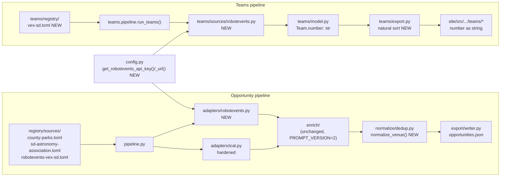

<!-- CLASI: Before changing code or making plans, review the SE process in CLAUDE.md -->

# Sprint 016: Feed Robustness, Venue Dedup, and the VEX League

## Goals

1. Fix the two live-confirmed `ical.py` parsing bugs that block the two
   highest-yield feeds in sprint 015's robots-gated batch, then register
   both (issue 40).
2. Give cross-source dedup an address-aware venue comparison so the
   Balboa Park ↔ Fleet "Educator Open House" pair — and any future
   hub-vs-institution pair like it — actually collapses instead of
   publishing twice (issue 39).
3. Bring VEX Robotics Competition (V5RC/VIQRC) into both pipelines: a
   RobotEvents API events adapter feeding Opportunities, and a VEX
   `TeamSource` feeding `teams.json` — the first robotics league besides
   FIRST this project has ever ingested (issue 26).

## Problem

Three independent, already-root-caused gaps, each left over from prior
sprints' own live measurement:

- **Issue 40.** Sprint 015 ticket 005 registered 3 of 5 robots-gated ICS
  feeds cleared by the stakeholder's robots-policy decision. The other
  two — `county-parks` (Tockify, 553 raw VEVENTs) and
  `sd-astronomy-association` (Google Calendar, 677 raw VEVENTs) — are
  the two highest-yield feeds in the batch and are blocked by genuine
  `ical.py` bugs, not the robots question: Tockify's non-standard
  `X-PUBLISHED-TTL:P15M` property fails `icalendar`'s strict duration
  parser before a single `VEVENT` is read (`InvalidCalendar`), and a
  `VEVENT` with more than one `RRULE` property crashes
  `_extract_component` (`AttributeError: 'list' object has no attribute
  'to_ical'`) in a way `extract()`'s existing per-record catch
  (`ValueError`, `TypeError`, `KeyError`) doesn't contain — so it aborts
  the whole source instead of skipping one record.
- **Issue 39.** Sprint 015 ticket 004 closed the empty-`Event.location`
  gap and re-measured Balboa Park ↔ Fleet live: still 0 collapses. Root
  cause is now precise — `dedup.cross_source_identity()`'s venue
  component is `normalize_title(event.location)`, which only
  lowercases/strips punctuation, so
  `"Fleet Science Center, 1875 El Prado, San Diego, CA"` (Balboa Park's
  TEC record) and `"1875 El Prado, San Diego, CA 92101"` (Fleet's own
  `default_location`) normalize to two different strings for the same
  physical address. With Balboa Park's hub calendar live, the same
  event publishes twice on the site today.
- **Issue 26.** VEX is the other major robotics league in San Diego
  (CA Region 4: ~12 local tournaments/season plus two ~96-team regional
  championships) and is entirely absent from both the opportunity
  pipeline and the teams roster — FIRST (FTC/FRC/FLL) is the only
  league either pipeline has ever ingested. RobotEvents API v2 is a
  free, bearer-token-gated structured API (`/events`, `/teams`,
  `/seasons`, `/programs`); plain scraping is blocked (`robotevents.com`
  403s a plain fetch).

## Solution

Three independent tracks, sequenced by dependency within each track,
not by cross-track priority — none of the three blocks another:

1. **Issue 40 track** (tickets 001-002): harden `ical.py` against both
   failure modes entirely inside the adapter — a tolerant pre-parse
   that strips the one non-standard property `icalendar` chokes on
   before `Calendar.from_ical()` runs, and a widened per-`VEVENT`
   salvage path that handles a list-valued `RRULE` (uses the first
   rule, logs the rest) and catches a broader exception set so no
   future malformed component can abort a source either — then register
   both previously-dropped feeds with `acquisition_policy.respect_robots
   = false` (the policy question is already decided; sprint 015 ticket
   003 already made the flag real) and live-verify non-zero output.
2. **Issue 39 track** (ticket 003): add a conservative,
   address-aware venue canonicalization used only by
   `dedup.cross_source_identity()`'s venue component — a
   street-number-plus-street-name token match when one is confidently
   detectable, ZIP-stripped and org-name-prefix-stripped, falling back
   to today's exact behavior whenever no street-address shape is found.
   This is a narrower, more conservative rule than a general address
   parser: it either finds a clear street-address token in both sides
   or it changes nothing.
3. **Issue 26 track** (tickets 004-005): a new `robotevents` adapter
   (structured API, same shape as `tec_rest`/`localist`) feeding
   RobotEvents' spectator-open tournament events into the Opportunity
   pipeline as ordinary `Event`s (classified `Competitions` by the
   existing, unmodified LLM enrichment — no prompt change needed, since
   `Competitions` already exists as of sprint 015), plus a new VEX
   `TeamSource` feeding the teams pipeline, following
   `sources/ftcscout.py`'s pattern. VEX team designations are
   alphanumeric (e.g. `90210A`), which `Team.number: int` cannot hold —
   this track also widens that field (see Architecture > Design
   Rationale) and repairs the two numeric sort call sites it touches.
   The bearer token is provisioned by config, documented the same way
   `TBA_KEY` is; neither ticket hard-blocks on the token being present.

## Success Criteria

- Both `ical.py` bugs are fixed with fixture tests built from this
  sprint's own live evidence (the exact `X-PUBLISHED-TTL:P15M` value,
  a synthesized multi-`RRULE` `VEVENT`); `county-parks` and
  `sd-astronomy-association` are registered and live-verified non-zero
  before commit.
- The Balboa Park ↔ Fleet "Educator Open House" (2026-09-24) pair
  collapses to one `Opportunity` in a live re-measurement; a negative
  fixture (two genuinely different Balboa Park venues, e.g. a
  different street number) proves the new venue rule does not
  over-collapse.
- `adapters/robotevents.py` and the VEX `TeamSource` both ship with
  full hermetic fixture coverage; `ROBOTEVENTS_KEY` config plumbing
  and the operator provisioning step are documented like `TBA_KEY`;
  both new sources are registered (matching the `frc-sd.toml`/TBA
  precedent — a registered-but-uncredentialed source degrades
  gracefully per-source isolation, it is not withheld); live
  verification happens if a token is available during ticket
  execution, and its absence does not block sprint close.
- `Team.number`'s type change does not silently corrupt existing
  FTC/FRC/FLL sort order — a natural (numeric-first) sort key backs
  every place that used to do bare arithmetic comparison.
- `PROMPT_VERSION` stays at 2 — no code in `enrich/llm_client.py`
  changes this sprint, so no re-enrichment cost is incurred.
- Full hermetic suite (1541+ tests, growing with this sprint's
  fixtures) stays green; no committed test touches a live network; no
  push to `origin`; no mid-sprint version bump.

## Scope

### In Scope

- `partner_scrape/adapters/ical.py`: TTL tolerant pre-parse, list-valued
  `RRULE` salvage, widened per-`VEVENT` exception handling.
- `partner_scrape/registry/sources/county-parks.toml`,
  `sd-astronomy-association.toml`: registration (drafts already exist
  from sprint 014 ticket 004; re-verified against the fixed adapter).
- `partner_scrape/normalize/dedup.py`: address-aware venue
  canonicalization for `cross_source_identity()`'s venue component.
- `partner_scrape/adapters/robotevents.py` (new): RobotEvents API v2
  events adapter.
- `partner_scrape/registry/sources/robotevents-vex-sd.toml` (new).
- `partner_scrape/config.py`: `get_robotevents_api_key()` /
  `get_robotevents_url()`, mirroring `get_tba_api_key()`/
  `get_tba_url()`.
- `config/prod/secrets.env` / `config/dev/secrets.env`: `ROBOTEVENTS_KEY`
  entry (provisioning is an operator step, matching `TBA_KEY`'s
  precedent — this sprint documents and plumbs the accessor; it does
  not guarantee a live value is present in every environment).
- `partner_scrape/teams/model.py`: `Team.number` widened from `int` to
  `str`; `League` type-alias documentation gains `"VEX"`.
- `partner_scrape/teams/export.py`: numeric-aware sort key for the
  now-`str` `number` field.
- `partner_scrape/teams/sources/robotevents.py` (new): the VEX
  `TeamSource`.
- `partner_scrape/teams/registry/vex-sd.toml` (new).
- `site/src/components/TeamCard.astro`, `site/src/pages/teams/
  index.astro`, `site/src/pages/teams/[slug].astro` (this repo's own
  Astro checkout): `number` type/sort-comparator updates to match the
  widened field.

### Out of Scope

- Any code change in the sibling `../stem-ecosystem` checkout — same
  precedent as sprint 015's `OpportunityFilters.astro` treatment: the
  data contract stays additive/compatible, and the matching site edit
  there is flagged, not shipped, from this repo.
- A general address parser or geocoding-grade venue matching for issue
  39 — the token-match rule is deliberately narrow (see Architecture);
  a fuzzy or ML-based venue matcher is not built this sprint.
- Drone-competition *team* rosters — issue 26's Aerial Drone Competition
  is in scope only for the *events* adapter (it rides the same
  RobotEvents platform as V5RC/VIQRC); no ADC `TeamSource` is built,
  since the issue's own proposed fix only asks for a VEX `TeamSource`.
- Any `enrich/llm_client.py` or prompt-vocabulary change — `Competitions`
  already exists as an LLM-classifiable value (sprint 015);
  RobotEvents' tournament events are expected to classify into it via
  the existing, unmodified prompt.
- CI/GitHub-Actions secrets provisioning for `ROBOTEVENTS_KEY` — like
  `TBA_KEY`, getting the token into the scheduled workflow's repo
  secrets is an operator action outside this sprint's write scope.
- Any mid-sprint version bump or tag — happens once, at `close_sprint`.

## Test Strategy

Hermetic-only, matching every prior sprint: no committed test touches
a real network. Live verification (feed dry-runs, the Balboa Park
re-measurement, RobotEvents live calls if a token is available) is a
diagnosis step recorded in ticket Notes, never shipped as a test.

- **Ticket 001** (`ical.py` hardening): a fixture `.ics` body built
  from the real `county-parks` `X-PUBLISHED-TTL:P15M` line (parses
  cleanly, `VEVENT`s recovered); a fixture `VEVENT` with two `RRULE`
  properties (source's other `VEVENT`s still yield, the multi-`RRULE`
  one salvages via its first rule); a regression fixture proving the
  pre-fix crash inputs no longer abort the whole `extract()` call.
- **Ticket 002** (registration): loader-level TOML parsing only —
  matches sprint 014/015's own precedent that data-only registration
  needs no new hermetic test beyond the loader's existing generic
  coverage.
- **Ticket 003** (venue canonicalization): fixture pairs built directly
  from the recorded Balboa Park/Fleet measurement (must collapse) plus
  at least one negative case — two Balboa Park venues sharing a street
  name but different street numbers, and at least one pair with no
  detectable street-address shape on either side (must fall back to
  today's exact `normalize_title` behavior, proving no regression).
- **Ticket 004** (RobotEvents events adapter): fixture JSON responses
  for `/events` (and `/seasons`/`/programs` if the probe needs them),
  malformed-record isolation fixtures matching every other structured
  adapter's convention, a fixture proving a missing/invalid token is
  isolated per-source (never aborts a run).
- **Ticket 005** (`Team.number` widen + VEX `TeamSource`): fixture
  JSON for `/teams` including at least one alphanumeric-suffix pair
  (`90210A`/`90210B`) to prove no `team_id` collision; a regression
  test proving `teams/export.py`'s sort still orders existing
  numeric-only FTC/FRC/FLL numbers correctly after the type widen; a
  fixture proving a missing/invalid token degrades to
  FTC/FRC/FLL-only output, matching `sources/tba.py`'s existing
  isolation contract.

## Architecture

**Sizing: Substantial.** This sprint touches both pipelines
(`adapters/`, `normalize/`, `registry/`, `teams/model.py`,
`teams/sources/`, `teams/export.py`), `config.py`, and this repo's own
`site/` checkout — well past the "one module" compact threshold — adds
a new external integration (RobotEvents API v2, a new
cross-module composition: two new modules, one new config accessor,
feeding two previously-separate pipelines), and changes a data model
field's type (`Team.number`, with a real ripple into two existing sort
call sites). The full 7-step methodology applies.

### Architecture Overview

| Module | Sprint Change | Tickets |
|---|---|---|
| `adapters/ical.py` | Tolerant TTL pre-parse; list-valued `RRULE` salvage; widened per-`VEVENT` exception handling | 001 |
| `registry/sources/{county-parks,sd-astronomy-association}.toml` | Registered, `respect_robots = false` | 002 |
| `normalize/dedup.py` | New `normalize_venue()` helper; `cross_source_identity()`'s venue component uses it | 003 |
| `adapters/robotevents.py` (new) | RobotEvents API v2 events adapter, `tec_rest`/`localist`-shaped | 004 |
| `registry/sources/robotevents-vex-sd.toml` (new) | Registration | 004 |
| `config.py` | `get_robotevents_api_key()` / `get_robotevents_url()`, mirroring `get_tba_api_key()`/`get_tba_url()` | 004 |
| `config/prod/secrets.env`, `config/dev/secrets.env` | `ROBOTEVENTS_KEY` entry, operator-provisioned | 004 |
| `teams/model.py` | `Team.number: int → str`; `League` gains `"VEX"` | 005 |
| `teams/export.py` | Numeric-aware sort key for `str`-typed `number` | 005 |
| `teams/sources/robotevents.py` (new) | VEX `TeamSource` | 005 |
| `teams/registry/vex-sd.toml` (new) | Registration | 005 |
| `site/src/components/TeamCard.astro`, `site/src/pages/teams/{index,[slug]}.astro` | `number` typed/sorted as a string | 005 |

Both new modules (`adapters/robotevents.py`, `teams/sources/
robotevents.py`) share only `config.py`'s new accessor and the
RobotEvents API's shape — they share no helper functions with each
other, matching `teams/DESIGN.md`'s existing "FTCScout/TBA share no
extraction code beyond the protocol shape" precedent. Every edge shown
above already exists in kind (`pipeline` → `adapters` → `registry`;
`teams.pipeline` → `teams/sources` → `teams/model.py`); this sprint
adds two new leaf nodes and one new shared config edge, not a new
inter-subsystem dependency direction.

### Design Rationale

**Fix the TTL failure with a targeted pre-parse strip, not a general
X-property sanitizer.** *Context:* `icalendar.Calendar.from_ical()`
raises `InvalidCalendar` on Tockify's `X-PUBLISHED-TTL:P15M` before any
`VEVENT` is read. *Alternatives considered:* a general pass that
attempts to validate and silently drop any unparseable `X-` property —
rejected as speculative generality with no second evidenced case
(matches `fetch/DESIGN.md`'s own precedent: `_RAW_RESOURCE_EXTENSIONS`
deliberately excludes `.txt` because only `.xml` had live evidence of
the bug). *Why this choice:* a small regex strips the exact
`X-PUBLISHED-TTL:` line (a property `extract()` never reads anyway)
before the body reaches `icalendar.Calendar.from_ical()`. *Consequences:*
a future feed with a different malformed `X-` property still fails
loudly (`extract()`'s existing broad `except Exception` around
`from_ical()` already logs and skips the whole source safely) until a
second real case justifies widening the pre-parse.

**Salvage a multi-`RRULE` `VEVENT` by using its first rule, not by
dropping the whole record.** *Context:* `component.get("rrule")`
returns a Python `list` when a `VEVENT` carries more than one `RRULE`;
`_extract_component` assumes a single `vRecur` and crashes.
*Alternatives considered:* treat any list-valued `RRULE` as an
unrecoverable per-record error (raise `ValueError`, let the existing
per-record catch skip it) — rejected: it is strictly safe but throws
away real recurrence data sprint 015 ticket 005 specifically flagged
this feed for (677 raw VEVENTs, one of the two highest-yield feeds in
the batch). *Why this choice:* `_extract_component` uses
`rrule_prop[0]` when the value is a list, logs a warning naming the
discarded rule count, and proceeds exactly as the single-rule path
already does. *Consequences:* a `VEVENT`'s secondary `RRULE` (RFC 5545
technically permits multiple, though most calendar tools write only
one) is not expanded — an accepted, logged information loss, not a
crash.

**Widen `extract()`'s per-`VEVENT` catch clause to `Exception`, not
just add `AttributeError`.** *Context:* the current catch
(`ValueError, TypeError, KeyError`) is already narrower than the
top-level `except Exception` around `Calendar.from_ical()` in the same
module — an inconsistency that let this exact bug propagate uncaught.
*Alternatives considered:* add only `AttributeError` to the tuple —
rejected as treating the symptom (this sprint's one measured crash
type) rather than the invariant `adapters/DESIGN.md` already states
("One malformed record in an otherwise good response is logged and
skipped, never raised"), which this module's own per-`VEVENT` loop was
violating for any exception type outside the original three.
*Why this choice:* matches the module's own top-level precedent and
the project-wide per-record-isolation invariant directly, rather than
re-deriving a narrower version of the same rule.

**Venue canonicalization is a conservative token-match, not a general
address parser, and lives in `dedup.py`, not `model.py`.**
*Context:* the measured pair — `"Fleet Science Center, 1875 El Prado,
San Diego, CA"` vs. `"1875 El Prado, San Diego, CA 92101"` — share a
street number and street name but differ in org-name prefix, ZIP
presence, and formatting. *Alternatives considered:* a fuzzy
string-similarity threshold (e.g. token-set Jaccard, matching
`teams/geo.py`'s school-name matcher) — rejected as exactly the kind of
imprecise match issue 39 explicitly warns against ("MUST NOT collapse
genuinely different venues"): two distinct addresses on the same
street (`"1875 El Prado"` vs. `"1889 El Prado"`, both real Balboa Park
buildings) would score highly similar under a fuzzy threshold but must
never merge. Extending `model.normalize_title` in place — rejected:
that function is shared by acquisition identity (`model.py`'s own
`identity_key()`) and cross-source dedup; folding address-specific
heuristics into it would change acquisition-identity behavior too, an
unrelated concern with its own risk profile. *Why this choice:* a new
`dedup.normalize_venue(location: str) -> str` requires the
comma-separated "Street, City, State ZIP" shape both measured examples
actually have (and every `tec_rest`/`listing_html` venue string this
registry has produced follows) — it splits `location` on commas and
looks for a segment whose stripped text matches `^\d+\s+\S` (a leading
street number followed by a street name). If found, *that segment
alone* (title-normalized, matching `normalize_title`'s
lowercase/strip-punctuation/collapse-whitespace rule) becomes the venue
identity component — deliberately not the ZIP or city/state segments,
so `"Fleet Science Center, 1875 El Prado, San Diego, CA"` and
`"1875 El Prado, San Diego, CA 92101"` both reduce to `"1875 el
prado"` regardless of org-name prefix or ZIP suffix. A location string
with no comma at all is *not* treated as a single street-address
segment even if it happens to start with a digit — matching on the
whole comma-less string risks swallowing trailing city/state/ZIP text
into the "venue token," silently reintroducing the exact ZIP-suffix
mismatch this function exists to strip. `normalize_venue()` falls back
to `normalize_title()` on the whole string whenever no comma-delimited
segment matches the street-address shape — covering both the
comma-less case and a comma-separated string where no segment starts
with a number — which is today's exact behavior, unchanged. This keeps
the function a single-consumer dedup helper (only
`cross_source_identity()` calls it), matching the project's existing
precedent that address-specific logic (`teams/geo.py`'s
`normalize_school_name`) stays local to its one consumer rather than
generalizing `model.py`'s shared primitive. *Consequences:* two venues
that are the same physical place but neither side's string contains a
comma-delimited street-number+name segment (e.g. two purely
name-based venue strings, "Fleet Science Center" vs. "The Fleet," or a
single comma-less address) will still not merge — an accepted,
conservative miss, not a false collapse; a stronger match would need
real address data (geocoding-grade), out of this sprint's scope.

**RobotEvents gets two independent new modules — one adapter, one
`TeamSource` — sharing only `config.py`'s accessor, not a shared
RobotEvents client module.** *Context:* the events adapter (Opportunity
pipeline) and the VEX `TeamSource` (teams pipeline) both call the same
external API with the same bearer token. *Alternatives considered:* a
shared `robotevents_client.py` with a common HTTP-call helper both
import — rejected, matching `teams/DESIGN.md`'s explicit precedent
("Why FTCScout/TBA share no extraction code beyond the `TeamSource`
protocol shape") and the project's broader "adapters and TeamSources
change for unrelated reasons" position: the two payloads (event
listings vs. team rosters) are structurally unrelated, and a shared
client would create one file two independently-changing concerns both
depend on. *Why this choice:* `adapters/robotevents.py` and
`teams/sources/robotevents.py` each build their own request/auth logic
against `config.get_robotevents_api_key()`/`get_robotevents_url()` —
the only code they share is that one config accessor, the same
reuse boundary `teams/merge.py` already established for
`normalize.partners.normalize_org_name`. *Consequences:* a small,
accepted amount of duplicated header-building code between the two
modules, traded for the same independence guarantee the codebase
already chose for FTCScout/TBA.

**Widen `Team.number` from `int` to `str`, not a `int | str` union or a
new parallel field.** *Context:* VEX team designations are alphanumeric
(`90210A`) — a numeric prefix plus a required letter suffix
distinguishing sibling teams from the same organization
(`90210A`/`90210B`/`90210C` are three distinct real teams). `Team.number:
int` cannot hold this, and truncating to the numeric prefix would
collide `team_id`s for every organization fielding more than one VEX
team. *Alternatives considered:* `number: int | str` — rejected, it
pushes a type check onto every consumer (`teams/export.py`'s sort key,
`site/`'s three Team-rendering files) for no benefit over a single
consistent type; a new `team_designation: str` field alongside the
existing numeric `number` — rejected as two overlapping identity-ish
fields where the codebase's own convention (`teams/DESIGN.md`'s
Design section) is one field, one property — every existing display
site already does bare string interpolation (`${team.number}`), which
needs no change under a `str` type; only the two *arithmetic* sort call
sites need work regardless of which alternative is chosen, so keeping
one field does not avoid that cost, and a second field would still
require touching the same sort sites plus reconciling two
near-duplicate identity concepts everywhere else. *Why this choice:*
`Team.number` becomes `str` uniformly; `teams/export.py`'s sort key and
`site/src/pages/teams/index.astro`'s comparator both switch from bare
subtraction/native ordering to a natural-sort key that extracts the
leading digit run for numeric comparison and falls back to the full
string as a tiebreaker — existing FTC/FRC/FLL purely-numeric values
sort identically to today (e.g. `"99"` before `"100"`, not the
lexicographic `"100"` before `"99"` a naive string sort would produce),
and VEX's alphanumeric siblings (`90210A`/`90210B`) sort adjacently.
`f"{league.lower()}-{number}"`'s `team_id` construction is unaffected —
string interpolation already worked identically for an int or a str.
*Consequences:* `teams.json`'s `number` field changes JSON type from
number to string for every team, not only VEX's — see Migration
Concerns.

### Migration Concerns

- **`teams.json`'s `number` field changes wire type from JSON number to
  JSON string, for every team, not only VEX's.** `teams/export.py`'s
  `TEAMS_SCHEMA_FIELDS` derives from `dataclasses.fields(Team)`
  automatically, so this is unavoidable once the dataclass field
  widens. This repo's own `site/` checkout (`TeamCard.astro`,
  `teams/index.astro`, `teams/[slug].astro`) is updated in the same
  ticket. The sibling `../stem-ecosystem` checkout, if it independently
  types `number: number` the way `TeamCard.astro`'s Props interface
  does today, will need the matching one-line type fix on its own
  schedule — flagged here, not shipped from this repo, matching
  sprint 015's `OpportunityFilters.astro` precedent for a
  cross-repo-visible contract change.
- **`opportunities.json` gains no new field and no schema change** —
  RobotEvents events are ordinary new `Event`/`Opportunity` records
  flowing through the existing, unmodified pipeline; `Competitions`
  already exists as a value (sprint 015).
- **`ROBOTEVENTS_KEY` provisioning is an operator step, not guaranteed
  by this sprint** — mirrors `TBA_KEY`'s exact precedent
  (`teams/DESIGN.md`'s Open Questions already tracks the equivalent gap
  for TBA's scheduled-workflow secret). Both new RobotEvents sources
  are registered regardless (matching `frc-sd.toml`'s precedent); a
  missing/invalid token degrades each pipeline to isolate that one
  source, never aborts a run.
- **No stored-data migration for the venue-canonicalization change** —
  it changes which `Instance`s a live run merges, not any on-disk or
  previously-exported shape; a previously-published duplicate pair
  simply stops recurring on the next run.
- **No version bump mid-sprint** — `close_sprint` bumps and tags once,
  per repo convention.

## Use Cases

### SUC-001: A Tockify feed's non-standard TTL property no longer blocks the whole source
Parent: none (new)

- **Actor**: Pipeline, on behalf of `county-parks`.
- **Preconditions**: The feed's raw ICS body carries
  `X-PUBLISHED-TTL:P15M` (or another value `icalendar`'s strict
  duration parser rejects).
- **Main Flow**:
  1. `ICalAdapter.extract()` pre-parses the raw body, stripping the
     `X-PUBLISHED-TTL:` line before handing it to
     `icalendar.Calendar.from_ical()`.
  2. `from_ical()` succeeds; every well-formed `VEVENT` is read
     normally.
- **Postconditions**: The source yields its real event count instead of
  zero.
- **Acceptance Criteria**:
  - [ ] A fixture `.ics` body built from the real `county-parks`
        `X-PUBLISHED-TTL:P15M` line parses without raising and yields
        the fixture's `VEVENT`s.
  - [ ] A fixture with no `X-PUBLISHED-TTL` property is unaffected
        (no regression for every other already-registered `ical`
        source).

### SUC-002: A VEVENT with multiple RRULE properties is salvaged, not fatal to its source
Parent: none (new)

- **Actor**: Pipeline, on behalf of `sd-astronomy-association`.
- **Preconditions**: A feed contains at least one `VEVENT` with more
  than one `RRULE` property, alongside other well-formed `VEVENT`s.
- **Main Flow**:
  1. `_extract_component` detects `rrule_prop` is a list, logs a
     warning, and expands using the first rule.
  2. Every other `VEVENT` in the same feed is processed unaffected.
- **Postconditions**: The source yields events from every `VEVENT`,
  including a salvaged (not dropped) multi-`RRULE` one; no exception
  propagates out of `extract()`.
- **Acceptance Criteria**:
  - [ ] A fixture feed with one multi-`RRULE` `VEVENT` among several
        normal ones yields events for all of them.
  - [ ] `extract()`'s per-`VEVENT` catch is proven to isolate an
        exception type outside the original
        `(ValueError, TypeError, KeyError)` tuple (a regression test
        for the exact `AttributeError` this issue measured).

### SUC-003: The two highest-yield robots-gated feeds are registered
Parent: SUC-006 (sprint 015's "Robots-gated feeds are registered once policy is decided")

- **Actor**: Sprint-016 ticket executor (live diagnosis, not a test).
- **Preconditions**: SUC-001 and SUC-002 are merged.
- **Main Flow**:
  1. `county-parks.toml` and `sd-astronomy-association.toml` (drafted
     in sprint 014 ticket 004) are committed with
     `acquisition_policy.respect_robots = false`.
  2. Each is live-verified via `partner-scrape --dry-run --source <id>`
     to return non-zero, dated output before commit.
- **Postconditions**: Both feeds are live sources; the robots-gated
  batch issue 40 references is now fully registered (5 of 5).
- **Acceptance Criteria**:
  - [ ] Both TOMLs are committed only after a real non-zero dry-run.
  - [ ] Neither is committed if its dry-run still returns zero (same
        withholding convention sprint 015 ticket 005 used).

### SUC-004: A hub calendar's listing of an institution's own event collapses with that institution's own record
Parent: SUC-005 (sprint 015's "Fleet events carry a location, enabling honest dedup measurement")

- **Actor**: Pipeline, on behalf of `balboa-park` and
  `fleet-science-center`.
- **Preconditions**: Both sources report the same real-world event
  ("Educator Open House", 2026-09-24) with matching title and date but
  differently-formatted venue strings for the same address.
- **Main Flow**:
  1. `dedup.cross_source_identity()` computes each `Event`'s identity
     tuple, now using `normalize_venue(event.location)` for the third
     component.
  2. `normalize_venue()` detects the shared street-number+name segment
     (`"1875 el prado"`) in both strings and returns it as the venue
     token, ignoring the org-name prefix and ZIP suffix.
  3. The identity tuples match; `dedup_cross_source()` merges the two
     into one `Instance`.
- **Postconditions**: One `Opportunity` is exported for this event, not
  two; a live re-measurement records the new collapse count.
- **Acceptance Criteria**:
  - [ ] A fixture pair built directly from the recorded Balboa
        Park/Fleet strings collapses under `dedup_cross_source()`.
  - [ ] The live re-measurement (script, not a committed test) is run
        post-fix and its collapse count recorded in the ticket's
        Notes.

### SUC-005: Genuinely different venues never collapse
Parent: none (new)

- **Actor**: Pipeline, cross-source dedup generally.
- **Preconditions**: Two `Event`s share a title and date but describe
  two real, different venues.
- **Main Flow**:
  1. `normalize_venue()` is applied to each `Event.location`.
  2. Either the extracted street-number+name segments differ (e.g.
     `"1875 el prado"` vs. `"1889 el prado"`), or neither side has a
     detectable street-address shape and the full-string fallback
     already differs.
  3. The identity tuples differ; the two `Instance`s are not merged.
- **Postconditions**: No false collapse; existing dedup behavior for
  every already-registered source is unchanged for every pair that
  doesn't share a real address.
- **Acceptance Criteria**:
  - [ ] A fixture pair with different street numbers on the same
        street does not collapse.
  - [ ] A fixture pair with no detectable street-address shape on
        either side reproduces exactly today's `normalize_title`-only
        outcome (proves the fallback path, not just the new path).

### SUC-006: A VEX tournament becomes a Competitions opportunity
Parent: none (new)

- **Actor**: Pipeline, on behalf of `robotevents-vex-sd`.
- **Preconditions**: RobotEvents API v2 lists a spectator-open V5RC or
  VIQRC tournament in CA Region 4 for the configured season.
- **Main Flow**:
  1. `RobotEventsAdapter.discover()`/`fetch()` retrieve the event list
     via the bearer-token-authenticated API.
  2. `extract()` maps each event to a canonical `Event`
     (`CONFIDENCE = 1.0`, first-party structured API).
  3. The existing, unmodified enrichment pipeline classifies it —
     expected to land on `opportunity_type = "Competitions"` given the
     LLM prompt's existing (sprint 015) definition, with no prompt
     change from this sprint.
- **Postconditions**: VEX tournaments are visible as opportunities
  alongside FTC/FRC events, for the first time.
- **Acceptance Criteria**:
  - [ ] A fixture `/events` response yields correctly-mapped `Event`s.
  - [ ] A malformed record in an otherwise-good response is isolated
        (logged, skipped), matching every other structured adapter.
  - [ ] A missing/invalid `ROBOTEVENTS_KEY` is isolated per-source by
        `pipeline.run()`'s existing mechanism; the run continues with
        every other source unaffected.

### SUC-007: VEX teams appear in the teams directory alongside FTC/FRC/FLL
Parent: none (new)

- **Actor**: `teams.pipeline.run_teams()`, on behalf of `vex-sd`.
- **Preconditions**: RobotEvents API v2 lists VEX teams for CA Region 4.
- **Main Flow**:
  1. `VexTeamSource.discover()`/`fetch()`/`extract()` retrieve and map
     each team, including alphanumeric-suffix siblings from the same
     organization (e.g. `90210A`/`90210B`).
  2. `Team.number` (now `str`) holds the full designation; `team_id`
     (`f"vex-{number}"`) stays collision-free.
  3. `merge_teams()`, `geocode_teams()`, and `export_teams()` run
     unchanged — all three are already source-agnostic.
- **Postconditions**: `teams.json` carries VEX teams with no
  `team_id` collision and correct display/sort order alongside
  existing leagues.
- **Acceptance Criteria**:
  - [ ] A fixture `/teams` response including a same-organization
        alphanumeric-suffix pair produces two distinct `Team`s, no
        `team_id` collision.
  - [ ] `teams/export.py`'s post-widen sort key orders a mixed
        FTC/FRC/FLL/VEX fixture set correctly — existing numeric-only
        leagues sort exactly as before.

### SUC-008: A missing RobotEvents token degrades gracefully, in both pipelines
Parent: none (new)

- **Actor**: `pipeline.run()` and `teams.pipeline.run_teams()`.
- **Preconditions**: `ROBOTEVENTS_KEY` is unset or invalid in the
  running environment.
- **Main Flow**:
  1. `adapters/robotevents.py`'s fetch/discover call fails
     (401/unauthorized or a config-read `RuntimeError`).
  2. `pipeline.run()`'s existing per-source isolation logs and skips
     `robotevents-vex-sd`; every other source completes normally.
  3. `teams/sources/robotevents.py`'s equivalent failure is isolated
     the same way `sources/tba.py`'s missing-`TBA_KEY` case already is.
- **Postconditions**: Both pipelines complete successfully with
  RobotEvents-sourced data simply absent, not degraded elsewhere.
- **Acceptance Criteria**:
  - [ ] A fixture proving a config-read failure (missing key) is
        caught at the source level in both pipelines, never propagates
        to abort the run.
  - [ ] Neither pipeline's existing per-source isolation test suite
        regresses.

## GitHub Issues

(None — this sprint is scoped from CLASI issues 26, 39, and 40, not
GitHub issues.)

## Definition of Ready

Before tickets can be created, all of the following must be true:

- [x] Sprint planning document is complete (sprint.md, including its
      Architecture and Use Cases sections)
- [ ] Architecture review passed (or skipped, for changes with no
      architectural impact)
- [ ] Stakeholder has approved the sprint plan

## Tickets

| # | Title | Issue | Depends On |
|---|-------|-------|------------|
| 001 | Harden the ical adapter against Tockify TTL and multi-RRULE parse failures | 40 | — |
| 002 | Register county-parks and sd-astronomy-association feeds | 40 | 001 |
| 003 | Address-aware venue canonicalization for cross-source dedup | 39 | — |
| 004 | RobotEvents API config plumbing and events adapter | 26 | — |
| 005 | Widen Team.number for alphanumeric IDs and add the VEX RobotEvents TeamSource | 26 | 004 |

Tickets execute serially in the order listed. 001→002 and 004→005 are
true dependencies (each fix/feature must exist before what registers or
builds on it); 003 has no dependency on either track and is ordered
between them by issue-linking order, not by a technical requirement.
