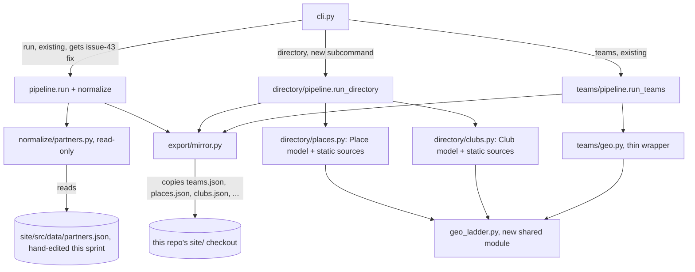

<!-- CLASI: Before changing code or making plans, review the SE process in CLAUDE.md -->

# Sprint 018: Partner Roster, Places, and Clubs

## Goals

1. Fix the biggest current data-quality problem — 51% of the 350 exported
   opportunities have no geocode/logo because their source org has no
   `partners.json` entry — by expanding the partner roster with the orgs
   sprint 014/016 already identified as candidates, and by fixing the
   existing roster's known bugs (hijacked domain, dead URLs, duplicate
   rows, a bad-geocoder centroid, silently-dropped out-of-bounds pins).
2. Fix the run-command's mirror step, which silently failed to update
   this repo's beta site checkout after the 2026-08-31 production run
   (issue 43).
3. Generalize the `teams/` standing-entity pattern into a new shared
   `directory/` module and deliver a full, curated Places directory plus
   one proof-of-concept Clubs type (Hack Club chapters) — deferring the
   remaining club types (issue 35b) to a future sprint.

## Problem

The partner roster (`site/src/data/partners.json`, 153 entries) was
inherited from the old Drupal site and never re-surveyed. Every source
registered since sprint 014 whose org has no matching roster entry
displays with a bare name and no logo/location — currently 51% of all
350 exported opportunities. Separately, the roster itself has known
defects (a hijacked domain that must never be linked, dead URLs,
duplicate CSV rows, 7 entries pinned at Google's bare-"California"
centroid, ~15 entries silently dropped by the map's bounding-box filter).
Independently, the default `partner-scrape` run's mirror step did not
copy the 2026-08-31 production export into this repo's beta checkout,
reproducing exactly the "beta silently serves a stale snapshot" failure
`mirror.py` was built to prevent. Finally, San Diego has two more
directories of standing (undated) entities the current
Opportunity/Event pipeline structurally cannot represent — clubs and
"where to go any day" places — following the same shape robot teams
already proved needs its own model.

## Solution

- **Roster (issue 32):** register the ~65 candidate organizations
  gathered from the 2026-08-30 gap analysis and sprint 014/016's own
  "issue 32 roster candidates" notes directly into this repo's beta
  checkout (`site/src/data/partners.json` and `data/partners_viable.csv`
  in parallel), using only offline/curated coordinates. Fix the
  housekeeping list (hijacked domain, dead URLs, duplicate rows, bad
  centroid, out-of-bbox drops, defunct-org negative signals) in the same
  pass.
- **Mirror bug (issue 43):** reproduce with `-v`, isolate why the default
  run path's mirror step (`cli.py:477`) didn't fire on 2026-08-31 despite
  the structurally identical `teams` command's mirror step (`cli.py:347`)
  firing correctly the same day, fix it, and add a regression test.
- **Places and Clubs (issue 35, split):** extract the general-purpose
  parts of `teams/geo.py`'s seven-rung offline geocoding ladder into a
  shared module; build a new `directory/` package with `Place` and
  `Club` models, a static-roster source pattern (the FLL precedent), and
  export/mirror/CLI wiring; populate Places in full (curated, ~15-20
  entries) and Clubs with Hack Club chapters only as the proof of
  concept. Every other club type is split off to issue 35b for a future
  sprint. Add site directory pages in this repo's beta `site/` checkout.

## Success Criteria

- The 350-opportunity export's no-geocode/no-logo rate drops
  substantially (not necessarily to zero — some orgs will remain
  unmatched by design, e.g. genuinely new sources found after this
  sprint closes).
- `batiquitosfoundation.org` appears nowhere in the roster;
  `mep.sdsu.edu` → `mesa.sdsu.edu`; `thegarden.org` corrected; no
  duplicate CSV rows remain; the 7 bare-California-centroid entries and
  the ~15 out-of-bbox entries no longer silently misrepresent or drop.
- A default (`uv run partner-scrape`, no flags) run demonstrably mirrors
  into this repo's `site/` checkout, proven by a regression test, not
  just a manual re-run.
- `site/src/pages/places/` and `site/src/pages/clubs/` exist and render
  the new directories, following `teams/index.astro`'s precedent.
- Full hermetic test suite stays green (1652-test baseline, growing with
  new regression tests).

## Scope

### In Scope

- Partner roster expansion (~65 new orgs) and housekeeping, in this
  repo's `site/src/data/partners.json` and `data/partners_viable.csv`.
- Best-effort logo backfill for newly-added roster orgs (missing logo
  is acceptable).
- Run-command mirror-step triage, fix, and regression test.
- A new shared offline geocoding ladder module, extracted from
  `teams/geo.py`.
- A new `directory/` module: `Place` model + full curated places
  dataset; `Club` model + Hack Club chapters as the one populated type.
- `mirror.py`/`cli.py` wiring for the new generated files
  (`places.json`, `clubs.json`).
- Site directory pages for places and clubs in this repo's beta `site/`
  checkout.

### Out of Scope

- Sibling repo (`../stem-ecosystem`) parity for any of this sprint's
  roster or directory changes — issue 41's concern, not this sprint's.
- Every club type beyond Hack Club chapters (CyberPatriot, Science
  Olympiad, 4-H, Girls Who Code, Civil Air Patrol, Sea Cadets) — split
  to issue 35b.
- Any new `location_precision` field on `partners.json`'s schema (would
  require Astro map-component changes and cross-repo coordination);
  the housekeeping ticket corrects bad entries in place instead.
- Live scraping for clubs or places — both are curated, static-roster
  datasets by design (issue 35's explicit instruction).
- Any change to `PROMPT_VERSION` (stays 2) or `ROBOTEVENTS_KEY`-gated
  functionality.
- Building a `data/partners_viable.csv` ↔ `partners.json` sync
  generator — this sprint edits both by hand (see Design Rationale).
- A scheduled refresh cadence for clubs/places (curated data changes
  rarely; no cron work this sprint).

## Test Strategy

Every ticket that touches code (mirror bugfix, geocoding-ladder
extraction, `directory/` module, CLI/mirror wiring) gets hermetic
regression tests following this codebase's existing per-module
conventions (fixture-based adapter/source tests, registry-loader
parsing tests). Tickets that are purely data edits (roster
registration/housekeeping, Hack Club chapter data, places dataset) are
verified by the existing registry/data-loader tests plus a live/dry-run
check where applicable (e.g. confirming the roster join actually
resolves the previously-unmatched orgs), matching sprint 014/016
ticket 004/002's own precedent for data-only tickets not requiring new
hermetic tests unless a genuinely new parsing shape appears. The
`teams/geo.py` extraction ticket is held to a stricter bar: its
regression test must show byte-identical `Team` geocoding output
before and after the refactor, since it touches well-tested, previously
fixed logic.

## Architecture

**Substantial** — this sprint introduces a new subsystem (the shared
`directory/` module for Places and Clubs, sized the same way sprint 018
sizes any new standing-entity subsystem after the `teams/` precedent),
a new cross-module dependency (the geocoding ladder extracted out of
`teams/geo.py` into a module both `teams/` and `directory/` depend on —
a real dependency-direction change to existing, well-tested code), and
touches 3+ modules (`teams/geo.py`, `export/mirror.py`, `cli.py`,
`normalize/` roster-ownership framing, plus the new `directory/`
package). The roster-registration and mirror-bugfix halves of this
sprint are each individually small/contained, but the sprint as a whole
is sized by its heaviest real structural change, per the "prefer the
heavier tier when borderline" rule.

### What Changed

- **`teams/geo.py` → shared geocoding ladder (new).** The
  general-purpose rungs of the existing seven-rung offline ladder
  (zip-centroid, city-centroid, the "never guess" honesty rule) move
  into a new shared module. `teams/geo.py` becomes a thin wrapper that
  calls the shared ladder and layers on Team-specific behavior (CDE/NCES
  school matching, `organization_website` population) the shared module
  does not need to know about.
- **`partner_scrape/directory/` (new module).** Houses `Place` and
  `Club` as two separate flat dataclasses (matching this codebase's
  existing `Team`/`Event` precedent of not forcing unrelated concerns
  into a shared base), a static-roster source pattern reused from
  `teams/sources/static_roster.py`'s shape, a `pipeline.py` (`run_directory()`),
  and `export.py` writing `places.json` and `clubs.json`.
  `directory/registry/` holds TOML source configs, mirroring
  `teams/registry/`.
- **`export/mirror.py`.** `MIRRORED_DATA_FILES` gains `"places.json"`
  and `"clubs.json"` — the same additive extension already exercised
  for `"teams.json"` in sprint 011. No change to `mirror.py`'s logic.
- **`cli.py`.** Gains a `directory` subcommand, structurally separate
  from `run`/`teams`/`discover-candidates` (this module's own
  established convention: each standing-data pipeline is its own
  subcommand, never routed through `pipeline.run()`). Also gets issue
  43's fix to the default `run` path's mirror step (`cli.py:477`).
- **Partner roster (`site/src/data/partners.json`,
  `data/partners_viable.csv`).** ~65 new rows; 7 bad-centroid rows
  corrected or blanked; ~15 out-of-bbox rows corrected or blanked;
  duplicate rows removed; 3 URLs fixed; the hijacked domain removed;
  defunct orgs recorded as negative signals (a documentation note, not
  a registry row) so they are not blindly re-registered later.
  `normalize/partners.py`'s "read-only, never writes" invariant is
  unchanged — these are direct data edits, not pipeline-written output.
- **Site (`site/src/pages/`).** New `places/index.astro` and
  `clubs/index.astro`, following `teams/index.astro`'s existing
  precedent (same repo, this beta checkout).

### Architecture Overview

The diagram omits `discover-candidates` (untouched this sprint) and the
Astro site pages (a downstream consumer of the JSON files, not a
pipeline dependency).

### Impact on Existing Components

- **`teams/geo.py`**: refactored, not behaviorally changed. Every
  existing `teams/` test must still pass unmodified against the new
  wrapper; the extraction ticket's regression test additionally proves
  byte-identical output for a representative fixture set.
- **`export/mirror.py`**: additive allowlist change only; existing
  `opportunities.json`/`ads.json`/`teams.json`/`scrape-meta.json`
  mirroring and the `public/data/` recursive-tree mirroring are
  untouched.
- **`cli.py`**: the `run` command's existing flags, defaults, and
  printed output are unchanged (module docstring's own "purely
  additive" convention for new subcommands, now extended to the
  `directory` subcommand); issue 43's fix is scoped to the mirror-step
  block only.
- **`normalize/partners.py` / `normalize/DESIGN.md`**: the "read-only,
  never writes" code invariant is reaffirmed, not changed. What is
  revised is the *process* framing in `normalize/DESIGN.md`'s own prose
  (sprint 014 said partners.json is externally owned; this sprint
  clarifies that this repo's own beta copy is the working roster for
  this repo's own tickets — see Design Rationale below).
- **`site/src/pages/teams/index.astro`**: unchanged; used only as the
  precedent the new `places`/`clubs` pages copy.

### Migration Concerns

- **No schema/DB migration** — every affected file is a flat JSON/CSV
  file, edited additively or in place.
- **`teams/geo.py` extraction is the sprint's main regression risk**:
  it touches logic with a real history of subtle bugs (the
  `REFRESH-INTERVAL`/`X-PUBLISHED-TTL` duration-property lesson from
  sprint 016 is a reminder that "small, well-tested" modules in this
  codebase still hide edge cases). Mitigated by requiring identical
  output on existing fixtures before any new caller (`directory/`) is
  wired up.
- **Roster edits touch existing IDs' data** (dedup, URL fixes). The
  partner join (`normalize/partners.py`) keys on normalized *name*, not
  numeric `id` — confirmed by reading `load_partners()`/`find_partner()`
  — so removing/merging duplicate-`id` rows is safe as long as name
  uniqueness is preserved; the housekeeping ticket must verify this
  explicitly rather than assume it.
- **Mirroring direction, confirmed during planning**: `mirror_site_data()`
  copies *from* the primary export target (`SITE_DIR`, default
  `../stem-ecosystem`) *into* mirror targets (`MIRROR_SITE_DIRS`,
  default this repo's own `site/`) — the opposite direction from a
  naive "beta pushes to production" reading. `partners.json` is
  explicitly excluded from this copy in either direction (`mirror.py`'s
  own documented `MIRRORED_DATA_FILES` boundary), so this sprint's
  roster edits in this repo's beta checkout carry **no risk of being
  overwritten by a mirror run**, and also **do not propagate to
  production** on their own — consistent with "sibling parity is issue
  41's concern," not an accidental side effect either way.
- **Sibling repo parity**: until issue 41 addresses it, `../stem-ecosystem`
  will not show the new roster orgs, the places directory, or the clubs
  directory. This is an accepted, visible product gap for this sprint,
  not a defect.

### Design Rationale

**Decision: this sprint's roster edits land directly in this repo's
`site/src/data/partners.json` (and `data/partners_viable.csv` in
parallel), not in the sibling repo.**
- *Context*: sprint 014 framed `partners.json` as an externally-owned,
  read-only input. Since sprint 015, every site feature has instead
  been built beta-first in this repo's own `site/` checkout, with
  sibling parity tracked separately as issue 41.
- *Alternatives considered*: (a) edit only `../stem-ecosystem` directly,
  off-process from this repo's tickets; (b) build a CSV↔JSON sync
  generator so `data/partners_viable.csv` and `partners.json` can never
  drift.
- *Why this choice*: (a) breaks the established since-015 workflow and
  puts the actual edit outside CLASI's tracking for this repo;
  (b) is speculative engineering for a double-entry problem that, at
  ~65 rows, is cheaper to do by hand once than to build and maintain a
  generator for.
- *Consequences*: the two files must be kept in sync by hand within
  this sprint's tickets; a future sprint could revisit a generator if
  double-entry becomes a recurring pain point (see Open Questions).

**Decision: extract a shared geocoding ladder rather than have
`directory/` depend on `teams/geo.py` directly, or duplicate the logic.**
- *Context*: Places and Clubs need the same offline "never guess"
  precision ladder Teams already has; Clubs in particular are often
  school-based (Hack Club chapters), so the school-matching rung is
  genuinely general-purpose, not robotics-specific.
- *Alternatives considered*: (a) `directory/` imports `teams/geo.py`
  directly; (b) duplicate the ladder logic into a new `directory/geo.py`.
- *Why this choice*: (a) creates a semantically backwards dependency (a
  general-purpose directory feature depending on a robotics-competition
  module) and risks a future circular dependency; (b) duplicates
  non-trivial logic that has already had real, hard-won bug fixes in
  it (school-name fuzzy matching, the "never guess" rung), meaning
  every future fix would need to land twice.
- *Consequences*: `teams/geo.py` becomes a thinner wrapper; the
  extraction itself is this sprint's main regression-risk item (see
  Migration Concerns).

**Decision: `Place` and `Club` are separate flat dataclasses, not a
shared base class.**
- *Context*: this codebase's existing `Team`/`Event` precedent
  (`teams/model.py`'s own docstring: "deliberately a separate dataclass
  ... for no reuse") establishes that distinct standing-entity concerns
  get distinct models rather than a shared inheritance hierarchy.
- *Alternatives considered*: a shared `DirectoryEntity` base class.
- *Why this choice*: a `Club` has membership/program concerns a `Place`
  doesn't (and a `Place` has hours/category concerns a `Club` doesn't);
  forcing a shared base would either grow speculative optional fields on
  both or under-model one of them.
- *Consequences*: some field-name duplication (name, website, location
  fields) between the two dataclasses is accepted, matching this
  codebase's existing convention.

**Decision: only Hack Club chapters are populated as issue 35's Clubs
proof of concept; every other club type is split to issue 35b.**
- *Context*: the original issue 35 named seven club types. Six of them
  (CyberPatriot, Science Olympiad, 4-H, Girls Who Code, Civil Air
  Patrol, Sea Cadets) have no ready curated source cited — each needs
  its own research pass to assemble a trustworthy roster, which is
  content work, not engineering the now-established pattern can absorb
  for free. Hack Club is the one type the issue itself already cites a
  ready static source for (`finder.hackclub.com`).
- *Alternatives considered*: (a) populate all seven types this sprint;
  (b) build the `Club` model this sprint with zero populated data.
- *Why this choice*: (a) is the "monster sprint" this planning
  explicitly rejected — alongside issues 32 and 43, curating six more
  club rosters does not fit one focused sprint; (b) would leave the new
  model unproven against real data, risking a design that looks right
  on paper but doesn't survive contact with a real curated source's
  messiness (the exact lesson `teams/sources/static_roster.py`'s own
  docstring documents from the FLL roster's real dirt).
- *Consequences*: issue 35b carries the remaining six club types as a
  clearly-scoped follow-up sprint's work, with San Diego Math Circle and
  SDAA explicitly excluded (they are single orgs belonging to the
  partner roster / event-source registry, not the `Club` model) to
  prevent future double-registration.

### Open Questions

- Should `data/partners_viable.csv` and `partners.json` eventually be
  kept in sync by a generator instead of hand edits? Deferred; revisit
  if double-entry becomes a recurring pain point in a future roster
  update.
- Should `partners.json`'s schema eventually carry a `location_precision`
  field (matching `Team`'s), letting the Astro map render low-precision
  partners as a labelled badge instead of a silent bbox-drop or a wrong
  pin? Explicitly out of this sprint (touches the Astro map component
  and crosses into sibling-repo territory); flagged for the stakeholder
  to decide whether it deserves its own future ticket.
- Should the new `directory` CLI subcommand cover both Places and Clubs
  in one command (recommended, mirrors `teams`), or split into two?
  Left to ticket 007/008's implementation judgment, not mandated here.
- Is a scheduled refresh cadence ever needed for clubs/places data, given
  they're described as "near-zero maintenance"? No cron work this
  sprint; revisit only if drift is actually observed.

## Use Cases

### SUC-001: Partner roster housekeeping removes broken and misleading data
Parent: UC-006

- **Actor**: Operator (roster maintainer), Visitor (indirect beneficiary).
- **Preconditions**: The roster carries a hijacked domain, dead URLs,
  duplicate rows, a bad geocoder centroid on 7 entries, and ~15 entries
  the map's bounding-box filter silently drops.
- **Main Flow**:
  1. Operator audits every partner URL for the same hijack pattern as
     `batiquitosfoundation.org` and removes any match.
  2. Operator corrects `mep.sdsu.edu` → `mesa.sdsu.edu` and the Water
     Conservation Garden's URL to `thegarden.org`.
  3. Operator dedupes the CSV rows named in issue 32 (Living Coast, EIS,
     GSDSEF, SDRPF, Fleet, Viasat, Media Arts, Ocean Connectors, SD
     Futures, Salk), preserving name-based join uniqueness.
  4. Operator corrects or blanks the 7 bare-California-centroid entries
     and the ~15 out-of-bbox entries so neither misrepresents nor
     silently vanishes.
  5. Operator records defunct orgs (EarthFair, Maker Faire San Diego,
     Fab Lab SD, SD Makers Guild, SD Science Alliance, KidzToPros) and
     paused/canceled programs (Academic Connections, JCVI internships)
     as a documented negative signal, not a registry row.
- **Postconditions**: No partner record links a hijacked domain; no
  duplicate rows; no entry silently mis-locates or vanishes from the
  map; defunct orgs are documented, not silently re-discoverable.
- **Acceptance Criteria**:
  - [ ] `batiquitosfoundation.org` does not appear anywhere in
        `partners.json` or `partners_viable.csv`.
  - [ ] `mep.sdsu.edu` and the old Water Conservation Garden URL no
        longer appear; their replacements do.
  - [ ] Every named duplicate org has exactly one row in each file.
  - [ ] None of the 7 known bad-centroid entries still carries
        `36.778261, -119.417932`.
  - [ ] Every entry within the roster either falls inside the site's
        map bounding box or has no coordinates at all (never a
        coordinate the map silently drops).

### SUC-002: Newly-registered source organizations gain a working roster entry
Parent: UC-008

- **Actor**: Operator (roster maintainer), Visitor.
- **Preconditions**: ~65 candidate organizations (from the 2026-08-30
  gap analysis and sprint 014/016's "issue 32 roster candidates" notes)
  have no `partners.json` entry, so their scraped opportunities display
  with a bare org name and no logo/location.
- **Main Flow**:
  1. For each candidate org, Operator adds a roster row with `org_name`
     exactly matching the string the registry source(s) use as the join
     key, organization type, a short description, website, and location
     with curated (never live-geocoded) coordinates where confident.
  2. Operator best-effort fetches a logo per org; a missing logo is
     accepted rather than blocking the entry.
  3. `normalize/partners.py`'s existing `find_partner()` now resolves
     each of these orgs on the next export.
- **Postconditions**: Opportunities from these orgs carry a partner
  link, description, and location/logo where available; the sprint's
  no-geocode/no-logo rate drops measurably from the current 51%.
- **Acceptance Criteria**:
  - [ ] Every org named in issue 32's candidate list has a
        `partners.json`/`partners_viable.csv` row, or is explicitly
        noted as deferred with a reason.
  - [ ] Every new row's `org_name` is verified against the actual
        registered source's org name (where one already exists) so the
        join resolves — spot-checked, not merely asserted.
  - [ ] No new row uses a live geocoder; every coordinate is
        curated/offline, consistent with the teams geo-ladder precedent.
  - [ ] A dry-run/live export measurement shows the previously-51%
        no-geocode/no-logo rate has dropped.

### SUC-003: The default run command mirrors into the beta checkout every time
Parent: none (new)

- **Actor**: `partner_scrape.cli.main()`'s default (no-subcommand) path.
- **Preconditions**: `MIRROR_SITE_DIRS` unset (default `site/`);
  `--dry-run`/`--no-mirror` not passed.
- **Main Flow**:
  1. `run()` completes and writes the export to the primary `SITE_DIR`.
  2. `publish.project()` runs.
  3. The mirror block (`cli.py:477`) calls `mirror_site_data()` with the
     resolved primary and target dirs, exactly as the structurally
     identical `teams` command's own mirror block
     (`cli.py:347`) already does.
- **Postconditions**: This repo's `site/src/data/opportunities.json`
  (and the other `MIRRORED_DATA_FILES`) reflect the run just completed,
  with no manual `mirror_site_data()` call required.
- **Acceptance Criteria**:
  - [ ] The root cause of the 2026-08-31 failure (default path
        mirror step not firing) is identified and recorded, not just
        worked around.
  - [ ] A regression test asserts the default (no-subcommand) run path
        invokes `mirror_site_data()` when `MIRROR_SITE_DIRS` is unset
        and neither `--dry-run` nor `--no-mirror` is passed.
  - [ ] A live re-run (`-v`) shows mirror log lines in stdout, unlike
        the 2026-08-31 run's silent tail.

### SUC-004: A family browses the curated Places directory
Parent: none (new)

- **Actor**: Visitor (family, student, educator).
- **Preconditions**: `directory/pipeline.run_directory()` has produced
  `places.json`; `site/src/pages/places/index.astro` is deployed.
- **Main Flow**:
  1. Visitor opens the Places directory.
  2. Sees curated San Diego STEM places — makerspaces, planetariums,
     observatories, tide pools, nature centers, library maker labs —
     each with a name, category, description, and location where
     confidently known.
  3. Visitor follows a place's website link for current hours/programs
     (this directory does not track live hours).
- **Postconditions**: Visitor has a "where to go any day" reference
  independent of any dated event.
- **Acceptance Criteria**:
  - [ ] Every place category named in issue 35 (makerspaces,
        planetariums, observatories, tide pools, nature centers,
        library maker labs) has at least one entry.
  - [ ] No place entry uses a live geocoder; coordinates are curated or
        absent, never guessed.
  - [ ] The places page renders with no dated-event assumptions (no
        "upcoming"/"past" framing borrowed from Opportunities).

### SUC-005: Hack Club chapters appear as a located, standing directory entry
Parent: none (new)

- **Actor**: Visitor; `directory.pipeline.run_directory()`.
- **Preconditions**: `finder.hackclub.com`'s static chapter list has
  been curated into a committed roster file, following the FLL
  `static_roster` precedent.
- **Main Flow**:
  1. `ClubStaticRosterSource` reads the committed chapter list (not a
     live fetch).
  2. Each chapter (University City HS, La Jolla HS, Helix Charter,
     Mater Dei Catholic, and any others the curated list contains) maps
     to a `Club`, then runs through the shared geocoding ladder
     (school-precision where the host school matches).
  3. `export.py` writes the result into `clubs.json`.
- **Postconditions**: Hack Club chapters appear in the clubs directory
  with school-precision location where matched, city precision
  otherwise — never a guessed coordinate.
- **Acceptance Criteria**:
  - [ ] Every Hack Club chapter named in issue 35 has a `Club` record.
  - [ ] `Club.location_precision` (or equivalent) is never fabricated —
        matches the shared ladder's existing "never guess" rung.
  - [ ] San Diego Math Circle and SDAA are **not** present as `Club`
        records (they stay the partner roster's / event-source
        registry's concern, per this sprint's Design Rationale).

## GitHub Issues

(None — this sprint's work is tracked via CLASI issues 32, 35 (split
into 35b for the deferred remainder), and 43, not GitHub issues.)

## Definition of Ready

Before tickets can be created, all of the following must be true:

- [x] Sprint planning document is complete (sprint.md, including its
      Architecture and Use Cases sections)
- [ ] Architecture review passed (or skipped, for changes with no
      architectural impact)
- [ ] Stakeholder has approved the sprint plan

## Tickets

| # | Title | Depends On |
|---|-------|------------|
| 001 | Fix the run-command mirror step | — |
| 002 | Partner roster housekeeping | — |
| 003 | Register roster batch A: parks, nature, astronomy, museums, libraries | 002 |
| 004 | Register roster batch B: youth orgs, competitions/clubs, research/health, pipeline/adult | 002 |
| 005 | Logo backfill for newly-registered roster organizations | 003, 004 |
| 006 | Extract the shared offline geocoding ladder from teams/geo.py | — |
| 007 | Places directory: model, static-roster source, curated dataset, and directory/ scaffolding | 006 |
| 008 | Clubs data model and Hack Club chapters proof of concept | 006, 007 |
| 009 | Site directory pages for places and clubs | 007, 008 |

Tickets execute serially in the order listed.
