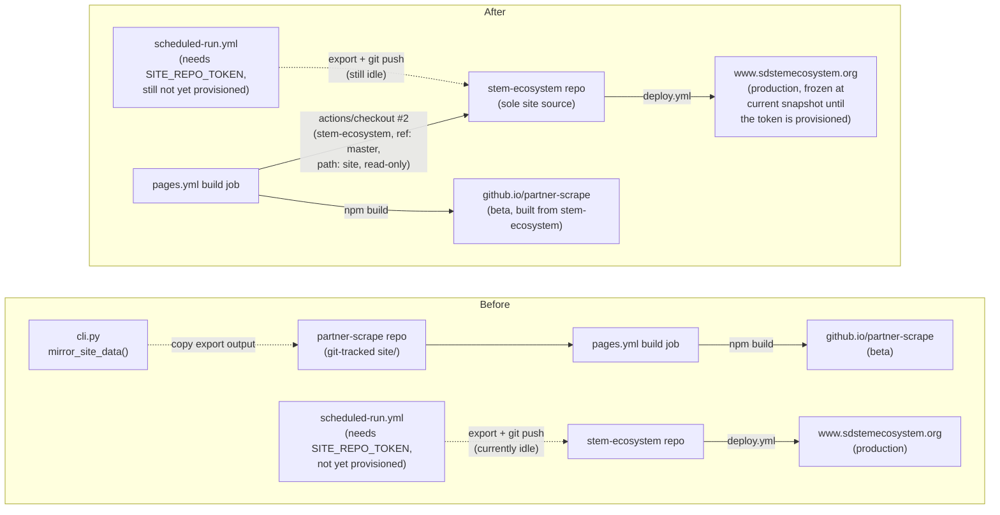

<!-- CLASI: Before changing code or making plans, review the SE process in CLAUDE.md -->

# Sprint 019: Consolidate Beta Site Onto Stem-Ecosystem Production

## Goals

1. Convert `partner-scrape/site/` from a second, independently-tracked copy
   of the Astro site into a **build-time-only checkout** of the real
   `stem-ecosystem` repo, so `pages.yml`'s beta deploy always builds from
   the same source stem-ecosystem's own production deploy does — no more
   drift between the two. This is this sprint's primary, unblocked work.
2. Remove the now-pointless `MIRROR_SITE_DIRS` mechanism in full
   (`config.py` constants/accessor, `export/mirror.py`, its 3 `cli.py`
   call sites, and its tests) — it existed solely to keep two independent
   directories in step, and after goal 1 there is only one.
3. Clear the repo of the dead weight this consolidation exposes: the
   pre-`partner_scrape/` legacy Scrapy-based scraper (`dev/`, `scraper/`,
   `run_mirrors.py`, `scrapy.cfg`, and the Docker tooling built only to run
   it) and the README/justfile sections that document it.

Two items from the linked issue's Proposed Fix are explicitly **not**
part of this sprint, with no ticket for either:

- **Item 1 (provisioning `SITE_REPO_TOKEN` / the scheduled-run
  workflow's first live run)** — the stakeholder has explicitly deferred
  this open-endedly ("deal with that later"), not scheduled it as a
  near-term follow-up. See **Deferred: Scheduled-Run Token
  Provisioning**, below, for the one consequence this has for this
  sprint's own scope.
- **Item 4 (`DATA_ORIGIN`/`llms.txt` parameterization)** — already done,
  on the stem-ecosystem side, ahead of this sprint.

## Problem

`partner-scrape/site/` (this repo's own Astro checkout) and
`stem-ecosystem` (the real production repo, deploys to
`www.sdstemecosystem.org`) have been maintained as two independent copies
of nearly the same site for months, and nothing kept them in step. Beta
pulled ahead on code (Teams, Places, Clubs, markdown rendering, image
fallbacks, several whole pages) while `stem-ecosystem`'s own copy of
`partners.json` — the pipeline's actual join target for every scheduled
production run — sat stale at 153 rows against beta's 211, silently
costing ~60 partner geocodes/logos on every real run. `pages.yml`'s own
comment already stated the intended relationship ("partner-scrape is the
beta ... stem-ecosystem is production ... promoted to when ready") but
that promotion never happened, so the two codebases diverged unchecked.
See the linked issue's Description and Cause for the full account.

A parallel session (`stem-ecosystem-8d`, working directly in the
`stem-ecosystem` repo) has already landed the content-side promotion
tonight: `stem-ecosystem`'s `src/` was promoted wholesale from this
repo's `site/`, `partners.json` swapped to the 211-row curated roster,
legacy scraper/`rundbat`/docker cleanup is in progress there, and the
`DATA_ORIGIN` parameterization fix is live. This sprint owns only the
`partner-scrape`-side half of the consolidation: stop tracking a second
copy of the site, and remove the machinery that existed to paper over
having two copies.

## Solution

Make `stem-ecosystem` the one canonical site codebase. `partner-scrape`
no longer tracks its own copy of the Astro source; instead,
`pages.yml`'s build job adds a second `actions/checkout` step that pulls
`league-infrastructure/stem-ecosystem` (`ref: master`) into the `site`
path immediately before the existing `npm ci`/build steps, which already
assume `working-directory: site` — so partner-scrape's beta preview
always builds from stem-ecosystem's actual current source, not a
snapshot that can drift. This work is unblocked and proceeds now: there
is no real technical dependency on item 1 (`scheduled-run.yml` and
`pages.yml` are fully decoupled — the checkout-based beta build needs no
cross-repo write credential, only public read access to
`stem-ecosystem`).

With one canonical site checkout, the `MIRROR_SITE_DIRS` mechanism
(`export/mirror.py`, its `config.py` accessors, and its 3 `cli.py` call
sites) has nothing left to do — its entire purpose was copying a
finished export into `partner-scrape`'s own `site/` to keep it in step
with `SITE_DIR` (`../stem-ecosystem`). It is removed outright, along with
its 28-test module and the mirror-specific tests in the three CLI test
modules. `SITE_DIR`/`config.get_site_dir()` (the actual pipeline write
target) is unaffected — it already points at `../stem-ecosystem` and
continues to.

Finally, this consolidation is the occasion to clear out the dead weight
it exposes: the pre-`partner_scrape/` legacy Scrapy-based mirror scraper
(`dev/`, `scraper/`, `run_mirrors.py`, `scrapy.cfg`, and the
`Dockerfile`/`docker-compose.yml`/`requirements.txt` built only to run
it — this repo's own README already calls it superseded) and the
README/justfile sections that document tooling this sprint removes.

## Success Criteria

- A real `gh workflow run` (or equivalent) against `pages.yml` succeeds
  end-to-end via the new build-time checkout, and
  `github.io/partner-scrape` renders correctly with current
  stem-ecosystem content — performed as part of ticket 002, before that
  ticket is considered done (see its Acceptance Criteria).
- Full `uv run pytest -q` is green with `mirror.py` and its tests removed
  entirely (ticket 001) — no replacement mechanism, no skipped tests.
- A real pipeline run (or dry run) confirms `config.get_site_dir()` /
  `DEFAULT_SITE_DIR` resolve correctly with no mirror step attempted —
  `--mirror-site-dir`/`--no-mirror` no longer exist as CLI flags.
- `git grep` for `scrapy.cfg`, `run_mirrors`, and `MIRROR_SITE_DIRS`
  across the repo returns nothing outside of `clasi/` history and this
  sprint's own artifacts once tickets 001–003 are done.

There is no scheduled-run-based verification in this sprint (no token,
no scheduled run to observe) — see **Deferred: Scheduled-Run Token
Provisioning**, below. The published `partners.json`
record-count-matches-`src/data/` check named in the linked issue is a
`stem-ecosystem`-side / cross-repo concern, already satisfied by the
parallel session's promotion tonight; re-verifying it is out of this
sprint's scope.

## Scope

### In Scope

- `pages.yml`: add the build-time `actions/checkout` step for
  `stem-ecosystem`; decide and implement the new trigger (`site/**`'s
  path filter can no longer match anything once `site/` is untracked).
- Untracking `site/` from `partner-scrape`'s own git history.
- Removing `MIRROR_SITE_DIRS`/`get_mirror_site_dirs()`/
  `DEFAULT_MIRROR_SITE_DIR` from `config.py`, `export/mirror.py` in full,
  its 3 `cli.py` call sites (and the `--mirror-site-dir`/`--no-mirror`
  flags that exist only to drive them), and every test that exercises any
  of the above.
- Reviewing `dev/`, `scraper/`, `run_mirrors.py`, `scrapy.cfg`,
  `Dockerfile`, `docker-compose.yml`, and `requirements.txt` for
  archival, and updating `README.md`/`justfile` accordingly.
- Clarifying `config.py`'s `DEFAULT_SITE_DIR` docstring, which currently
  references `dev/export_site.py` (a file this sprint archives) and the
  now-removed mirror relationship.
- Subsystem docs that describe any of the above:
  `partner_scrape/export/DESIGN.md`, `partner_scrape/DESIGN.md`,
  `partner_scrape/teams/DESIGN.md`.

### Out of Scope

- **Provisioning `SITE_REPO_TOKEN` and the scheduled-run workflow's first
  live run** (issue Proposed Fix item 1). The stakeholder has deferred
  this open-endedly — not "after this sprint," just "later," with no
  target sprint. No ticket; nothing in this sprint gates on it, and this
  sprint does not gate it either. See **Deferred: Scheduled-Run Token
  Provisioning**, below, for the one consequence worth stating plainly.
- **`DATA_ORIGIN`/`llms.txt` parameterization** (issue Proposed Fix item
  4) — already done, on the stem-ecosystem side, ahead of this sprint.
  No ticket.
- **Any change inside the `stem-ecosystem` repo.** That side is owned and
  already executed by the parallel `stem-ecosystem-8d` session; this
  sprint touches only `partner-scrape`.
- **`.github/workflows/scheduled-run.yml`.** Confirmed decoupled from all
  of this — it already resolves its own `--site-dir` against a fresh CI
  checkout, independent of `config.py`'s default. No ticket touches it.
- Prompt-semantic changes; mid-sprint version bumps (per project
  convention, version bumps happen once, at `close_sprint`).

## Deferred: Scheduled-Run Token Provisioning

Per the stakeholder's explicit, open-ended deferral, `SITE_REPO_TOKEN`
provisioning and the scheduled-run workflow's first live run
(`docs/deploy/scheduled-run.md`'s runbook) are **not** part of this
sprint and not scheduled as a follow-up — there is no ticket, and no
part of this sprint waits on it. Stated plainly, one consequence follows
from that deferral and from this sprint's own work, and is called out
here rather than left implicit:

Retiring `partner-scrape`'s own tracked `site/` build path, while
`scheduled-run.yml` is not yet running (no token), means
`stem-ecosystem`'s published data stays frozen at its current
2026-08-31 snapshot until someone provisions the token later — nothing
in this sprint changes that either way. The beta preview will keep
building and deploying fine regardless (ticket 002's build-time checkout
just pulls whatever is currently live in `stem-ecosystem`, and that
content is already current as of tonight's promotion); what does not
happen, until the token exists, is either repo's data refreshing further.
This is an accepted, known tradeoff of the stakeholder's deferral, not a
gap this sprint needs to solve — recorded here so it stays visible
rather than silently implied by two unrelated-looking scope decisions
(no token ticket; the beta build path changing).

## Test Strategy

Every existing test stays hermetic (fixture-based, no network) — that
convention does not change. Ticket-level strategy:

- **Ticket 001** (mirror mechanism removal): delete
  `tests/test_export_mirror.py` wholesale (28 tests) and every
  mirror-referencing test in `tests/test_cli.py`, `tests/test_cli_teams.py`,
  and `tests/test_cli_directory.py`. Per the sprint's constraints, these
  are deletions, not replacements — the mechanism itself is gone, so
  there is nothing left to test. `tests/test_config.py` carries no
  `MIRROR_SITE_DIRS`-specific assertions to remove (confirmed by
  inspection); its existing `TestSiteDir` class is unaffected since
  `SITE_DIR`/`DEFAULT_SITE_DIR` do not change value.
- **Ticket 002** (`site/` conversion + `pages.yml`): not unit-testable in
  the pytest sense — this is a CI workflow change. Verified by a real
  `gh workflow run` (or the equivalent manual trigger) against the new
  `pages.yml`, confirmed to build successfully via the build-time
  checkout and deploy to `github.io/partner-scrape` with current content.
  This verification is part of the ticket's Acceptance Criteria, not a
  follow-up.
- **Ticket 003** (dead-weight archival): no pipeline tests are affected
  (the archived code was never imported by `partner_scrape/`). Verified
  by `git grep` for `scrapy.cfg`/`run_mirrors`/`scraper.settings`
  returning nothing outside the archive, and by a full `uv run pytest -q`
  staying green throughout.
- Full `uv run pytest -q` must stay green after every ticket in this
  sprint, same as always.

## Architecture

**Sizing: Substantial.** Three-plus modules are touched directly
(`config.py`, `cli.py`, `export/mirror.py` — removed entirely — plus four
test modules and three subsystem `DESIGN.md` files that describe the
above), a cross-module dependency is removed (`cli.py`'s dependency on
`export.mirror` disappears completely; `config.get_mirror_site_dirs()` is
deleted), and a new external, cross-repository build-time dependency is
introduced in CI (`pages.yml`'s build job checks out a second GitHub
repository it did not depend on before). Any one of these signals alone
would justify the substantial tier; together they clearly do. The scope
is nonetheless mostly *removal* — no new subsystem is introduced — so one
diagram (the new CI/deploy topology, where the actual structural change
lives) is enough; no ERD is needed since no data model changes.

### Architecture Overview

**Responsibilities in play:**

1. **Beta preview build** — `pages.yml`'s `build` job, which currently
   assembles its Astro site from a git-tracked copy of the source living
   in this repo. This sprint changes *where that source comes from*
   (a build-time checkout of another repo) without changing what the job
   does with it once checked out (`npm ci` → `npm run build` →
   `upload-pages-artifact`, all still `working-directory: site`). This
   responsibility has no dependency on item 1's deferred token — the
   checkout of `stem-ecosystem` is read-only and public.
2. **Multi-checkout synchronization** — `export/mirror.py`,
   `config.get_mirror_site_dirs()`, and the 3 `cli.py` call sites that
   invoke `mirror_site_data()` after `run`/`teams`/`directory`. This
   responsibility is retired outright, not modified: with one canonical
   site codebase, "keep N checkouts in step" has no second checkout left
   to keep in step with.
3. **Repository hygiene** — the pre-`partner_scrape/` legacy Scrapy
   scraper and its Docker tooling, superseded since sprint 001 (the
   repo's own README already says so) but never removed. Consolidating
   the site is the natural occasion to also close this out, since both
   are "duplicate/dead tooling this repo has been carrying."

Responsibility 1 and responsibility 2 change independently of each other
(different files, different call graphs, no shared code) but are
sequenced together in this sprint because responsibility 2 exists
*because of* responsibility 1's old shape (two tracked copies) — removing
one without the other would leave `MIRROR_SITE_DIRS` defaulting to a
directory (`site/`) that no longer exists as tracked content, technically
harmless (the function already tolerates a missing target) but a
confusing transitional state. Responsibility 3 is independent of both;
it is included in this sprint because the consolidation is what surfaced
it, not because it is technically coupled to 1 or 2.

**Modules:**

| Module | Purpose (one sentence) | Boundary | Serves |
|---|---|---|---|
| `.github/workflows/pages.yml` | Build and deploy partner-scrape's beta preview of the Astro site. | Owns the beta build/deploy job only; never touches `stem-ecosystem`'s own `deploy.yml` or writes back to any repo. | SUC-001 |
| `partner_scrape/config.py` | Resolve environment-derived configuration, including the one site-dir the pipeline writes to. | The only module that reads `os.environ`; after this sprint it no longer resolves a *list* of mirror targets, only the one `SITE_DIR`. | SUC-002 |
| `partner_scrape/cli.py` | Parse flags and wire the pipeline's default concrete implementations. | Thin wrapper; after this sprint it no longer imports or calls `export.mirror` at all. | SUC-002 |
| `partner_scrape/export/mirror.py` | *(removed)* Previously copied a finished export into extra site checkouts. | — | — |
| Repo root (`dev/`, `scraper/`, `run_mirrors.py`, `scrapy.cfg`, `Dockerfile`, `docker-compose.yml`, `requirements.txt`) | Legacy pre-`partner_scrape/` mirror scraper and its container tooling. | Never imported by `partner_scrape/`; archived, not refactored. | SUC-002 |

**Diagram — CI/deploy topology, before and after** (the one place this
sprint's structural change is actually visible; no diagram is included
for the mirror-removal itself since deleting a module and its call sites
has no topology worth drawing beyond what the table above already
states). The dotted `scheduled-run.yml` edge below is present in both
halves and unaffected by this sprint either way — shown to make clear
the beta build path (top) and the data-publish path (bottom) are, and
remain, structurally independent:

The removed edge in the "after" half is exactly `mirror_site_data()`'s
copy step — there is no longer a second checkout for it to copy into.
The `scheduled-run.yml` edge is dotted in both halves for the same
reason in both: it needs `SITE_REPO_TOKEN`, which this sprint does not
provision (see **Deferred: Scheduled-Run Token Provisioning**) — that
fact is unrelated to, and unchanged by, this sprint's `pages.yml`/mirror
work.

### Design Rationale

**Decision: keep partner-scrape's own GH Pages beta deploy, via a
build-time-only checkout, rather than deleting `site/` and the beta
deploy entirely.**
*Context*: the stakeholder wants one canonical codebase but still wants
a way to preview partner-scrape/site changes ahead of promoting them to
stem-ecosystem's own production deploy — this is the issue's own
"Decided" note.
*Alternatives considered*: (a) a true `git submodule` — rejected, it
would pull stem-ecosystem's ~405MB `public/images` tree into every clone
that recurses submodules, and pin-bumping is a manual step, not
automatic, reintroducing exactly the kind of drift this sprint closes;
(b) delete `site/` and the beta deploy outright — rejected, it drops a
capability the stakeholder explicitly wants kept (this is what the
issue's "no directory deletion" phrase refers to — see the note below);
(c) build-time-only `actions/checkout` (chosen) — no submodule pin to
maintain, no large asset tree cloned onto every contributor's machine,
and CI always builds from stem-ecosystem's actual latest `master`, with
no cross-repo write credential required (a plain public checkout is
read-only), unlike the deferred scheduled-run publish path.
*Consequences*: `partner-scrape`'s git history no longer carries a
byte-for-byte duplicate of the site source (goal 2's whole premise); a
local `site/` directory, if a developer keeps one for local `just dev`
use, must be a personal, gitignored manual clone — nothing in this repo
tracks or updates it automatically.

> **Resolving an apparent tension in the issue text.** The issue's
> "Decided" note reads "no submodule, no directory deletion" immediately
> above Proposed Fix item 2's own instruction to "remove [`site/`] as a
> tracked directory entirely." These are not in conflict: the note's two
> clauses map 1:1 onto item 2's own two *rejected* alternatives — "no
> submodule" is alternative (a) above, and "no directory deletion" is
> alternative (b), "deleting `site/` entirely (drops the
> partner-scrape-hosted beta deploy the stakeholder explicitly wants
> kept)." "Directory deletion" in the Decided note means eliminating the
> beta deploy path altogether, not "don't `git rm` the tracked copy" —
> the latter is precisely what item 2 instructs and what this sprint
> implements. No exception is thrown here; this is stated explicitly so
> ticket 002's implementer does not second-guess a resolved ambiguity.

**Decision: `pages.yml`'s trigger becomes `workflow_dispatch` plus a
push trigger scoped to the workflow file's own changes; the
`push: paths: ['site/**']` trigger is removed.**
*Context*: the issue flags the trigger as needing a decision at
implementation time once `site/**` can no longer match anything (`site/`
is untracked), offering `workflow_dispatch`-only as "the simplest safe
default," and cautioning "don't over-engineer for a beta preview site."
*Alternatives considered*: `repository_dispatch` fired from
stem-ecosystem's own push — rejected for this sprint because it requires
a coordinating change in the stem-ecosystem repo, which is out of this
sprint's scope (owned by the parallel `stem-ecosystem-8d` effort) and
adds a second, harder-to-observe trigger path for what the issue's own
Related section calls an interim beta whose longer-term replacement is a
Docker deploy; hooking a rebuild off `scheduled-run.yml`'s weekly
data-push — rejected doubly: it is unnecessary cross-workflow, cross-repo
coupling for a preview surface whose job is to preview partner-scrape/
site code changes, not to mirror production's data instant-for-instant,
and `scheduled-run.yml` is not even running yet (deferred, per above), so
hooking anything off it would not fire at all right now.
*Consequences*: the beta preview can go stale between manual triggers
until a code or workflow-file change is pushed — an accepted tradeoff,
flagged as an Open Question below, not a defect.

**Decision: fold `Dockerfile`, `docker-compose.yml`, and
`requirements.txt` into ticket 003's archival scope, beyond what the
issue's Proposed Fix item 3 names explicitly (`dev/`, `scraper/`,
`run_mirrors.py`, `scrapy.cfg`).**
*Context*: `Dockerfile`'s `ENTRYPOINT` runs `run_mirrors.py` directly and
`docker-compose.yml`'s only service builds that `Dockerfile`; the three
are inseparable from the code item 3 already targets for archival.
*Alternatives considered*: leave them in place — rejected, it would leave
a broken, misleading Docker entry point in the repo root pointing at
code that no longer exists, exactly the kind of drift this sprint exists
to close.
*Consequences*: ticket 003's archival grep (required by the issue before
removing anything) also covers these three filenames, not only
`scrapy.cfg`/settings references.

### Migration Concerns

- **Sequencing.** No ticket in this sprint shares a file with another
  (001 touches `config.py`/`cli.py`/`export/mirror.py`/tests/subsystem
  docs; 002 touches `site/`/`pages.yml`/`justfile`, deliberately *not*
  `README.md`; 003 touches the repo-root legacy tree and the entirety of
  `README.md`, including the note documenting ticket 002's `site/`
  change), so there is no hard merge dependency between them. Ticket 002
  is listed with a soft `depends-on: ['001']` (not a file conflict, a
  sequencing preference — doing 001 first avoids `MIRROR_SITE_DIRS`
  briefly defaulting to a directory ticket 002 is about to untrack);
  ticket 003 has no dependency on either and could run anywhere in the
  order, but is listed last to match the issue's own item ordering.
  **None of the three depend on item 1's deferred token in any way.**
- **`SITE_DIR`/`DEFAULT_SITE_DIR` do not change value.** They already
  point at `../stem-ecosystem` for local interactive runs and are
  unaffected by this sprint; only the docstring needs a pass (it
  currently cites `dev/export_site.py`, archived by ticket 003, and
  describes a mirror relationship that ticket 001 removes).
  `scheduled-run.yml` needs no change at all — it already resolves its
  own `--site-dir` explicitly against a fresh CI checkout.
- **No data migration.** No `Opportunity`/`Team`/`Place`/`Club` schema
  changes; nothing published to `stem-ecosystem` changes shape.
- **Deployment sequencing.** This sprint's changes affect only
  `partner-scrape`'s own beta deploy (`pages.yml`) and its local dev/CLI
  surface — never `stem-ecosystem`'s `deploy.yml` or
  `scheduled-run.yml`'s publish step. Ticket 002's end-to-end
  verification (a real workflow run) must pass before that ticket is
  considered done; a failed beta build blocks nothing else in this
  sprint, but should not ship silently broken.
- **Data freeze during the deferral (stated plainly, not implicit).**
  See **Deferred: Scheduled-Run Token Provisioning**, above, in full —
  summarized here because it is a real operational consequence of this
  sprint's own change: with `site/` no longer separately tracked and
  `scheduled-run.yml` still idle (no token), `stem-ecosystem`'s data
  stays frozen at its current 2026-08-31 snapshot until the token is
  provisioned, on whatever later timeline the stakeholder chooses. The
  beta preview itself is unaffected — it builds fine from whatever is
  currently live.
- **Breaking change, scoped to CLI users.** `--mirror-site-dir` and
  `--no-mirror` disappear as flags on `run`/`teams`/`directory`. No
  external consumer is known to pass them (they were internal
  convenience flags for a mechanism only this repo used); still a
  user-visible CLI surface change, called out explicitly rather than
  silently dropped.

### Open Questions

- **Beta preview staleness.** With `workflow_dispatch`-only (plus the
  workflow-file-scoped push trigger), the beta preview does not rebuild
  automatically when `stem-ecosystem`'s `master` changes on its own
  (e.g. from a future `scheduled-run.yml` data push, once that is
  unblocked). This is accepted for the interim GH-Pages-direct-checkout
  beta; the issue's own Related section states the longer-term
  replacement is a Docker-based beta, out of this sprint's scope to
  build.
- **Local dev convention for `site/`.** A developer who wants `just dev`
  to work locally against real content must now maintain their own
  gitignored manual clone of `stem-ecosystem` at `site/` (or point
  elsewhere and adjust the `justfile`'s `site :=` variable). Ticket 002
  documents this; whether to add tooling that automates the local clone
  (a `just` recipe, say) is left to a future sprint if it turns out to be
  friction in practice — not manufactured speculatively here.

## Use Cases

### SUC-001: Beta preview builds from a build-time checkout of stem-ecosystem
Parent: UC-007

- **Actor**: Engine (CI) / Operator
- **Preconditions**: `pages.yml` is triggered (manually via
  `workflow_dispatch`, or by a push that changes the workflow file
  itself); `league-infrastructure/stem-ecosystem`'s `master` is
  reachable with the default `GITHUB_TOKEN`'s read access (public repo,
  no cross-repo secret needed for a checkout-only, read-only clone —
  unlike the deferred, credentialed `scheduled-run.yml` publish path).
- **Main Flow**:
  1. The build job checks out `partner-scrape` (unchanged first step —
     still needed for the workflow file itself and any repo-level
     config).
  2. The build job additionally checks out
     `league-infrastructure/stem-ecosystem` at `ref: master` into the
     `site` path, ahead of the existing `npm ci`/build steps.
  3. `npm ci` and `npm run build` run exactly as before, unaware their
     source now arrived via a second checkout rather than this repo's
     own tracked files.
  4. The built artifact deploys to `github.io/partner-scrape`, the beta
     preview URL.
- **Postconditions**: The beta preview reflects stem-ecosystem's actual
  current `master`, not a snapshot that can silently drift out of step.
- **Acceptance Criteria**:
  - [ ] `pages.yml`'s build job includes a second `actions/checkout` step
        for `league-infrastructure/stem-ecosystem` (`ref: master`,
        `path: site`), ahead of `npm ci`.
  - [ ] The `push: paths: ['site/**']` trigger is removed (nothing in
        this repo can match it once `site/` is untracked); the workflow
        remains triggerable via `workflow_dispatch` and via a push that
        touches `pages.yml` itself.
  - [ ] A real `gh workflow run` (or equivalent manual trigger) against
        the new `pages.yml` succeeds end-to-end and
        `github.io/partner-scrape` renders correctly with current
        stem-ecosystem content.
  - [ ] No absolute `/fonts/` path is introduced anywhere in `pages.yml`
        or its comments (stem-ecosystem's fonts are Vite-processed,
        base-aware, and live under `src/fonts/`, not `public/fonts/`).

### SUC-002: partner-scrape carries no duplicate or dead site-mirroring machinery
Parent: UC-006

- **Actor**: Engine / Operator
- **Preconditions**: A real or dry-run pipeline invocation
  (`run`/`teams`/`directory`) completes.
- **Main Flow**:
  1. The pipeline writes its export to exactly one resolved site
     directory (`--site-dir`, `$SITE_DIR`, or
     `config.DEFAULT_SITE_DIR`).
  2. No mirror step runs, because there is no mirror mechanism left to
     run — `--mirror-site-dir`/`--no-mirror` no longer exist as flags,
     and `cli.py` no longer imports `export.mirror`.
  3. Separately, a repository-hygiene check confirms the pre-
     `partner_scrape/` legacy scraper and its Docker tooling no longer
     exist as live, referenced code — either removed or clearly marked
     archived, with `README.md`/`justfile` describing only what actually
     runs today.
- **Postconditions**: There is exactly one site-write target, and the
  repository contains no tooling whose only purpose was reconciling two
  copies of something that no longer has two copies.
- **Acceptance Criteria**:
  - [ ] `export/mirror.py`, `config.MIRROR_SITE_DIRS_ENV_VAR`,
        `config.DEFAULT_MIRROR_SITE_DIR`, and
        `config.get_mirror_site_dirs()` no longer exist.
  - [ ] `cli.py` has no `--mirror-site-dir`/`--no-mirror` flags and no
        import of `partner_scrape.export.mirror`.
  - [ ] `tests/test_export_mirror.py` is deleted; no mirror-referencing
        test remains in `test_cli.py`/`test_cli_teams.py`/
        `test_cli_directory.py`; full `uv run pytest -q` is green.
  - [ ] `git grep -l 'scrapy.cfg\|run_mirrors\|MIRROR_SITE_DIRS'` outside
        `clasi/` returns nothing once tickets 001 and 003 are done.
  - [ ] `README.md` and `justfile` describe only the current
        `partner_scrape/` engine and the build-time-checkout beta
        preview — no leftover references to the removed mirror flags or
        the archived legacy scraper as if it were still runnable.

## GitHub Issues

None — this sprint tracks CLASI issue
`consolidate-partner-scrape-s-beta-site-into-stem-ecosystem-production.md`
only; no separate GitHub issue is linked.

## Definition of Ready

Before tickets can be created, all of the following must be true:

- [x] Sprint planning document is complete (sprint.md, including its
      Architecture and Use Cases sections)
- [x] Architecture review passed (or skipped, for changes with no
      architectural impact)
- [ ] Stakeholder has approved the sprint plan

## Tickets

| # | Title | Depends On |
|---|-------|------------|
| 001 | Remove the MIRROR_SITE_DIRS mirroring mechanism | — |
| 002 | Convert site/ to a build-time checkout of stem-ecosystem in pages.yml | 001 |
| 003 | Archive legacy pre-partner_scrape scraper tooling and update README/justfile | — |

Tickets execute serially in the order listed. Ticket 003 has no real
dependency on 001/002 (disjoint files) — listed last to match the
linked issue's own item ordering, not because it's blocked.
