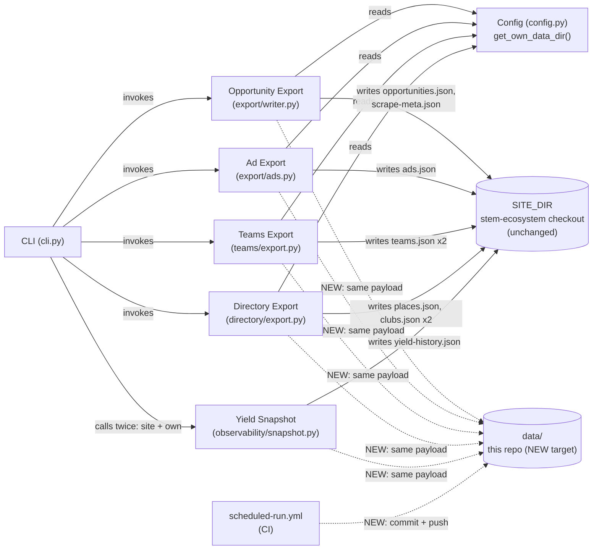

<!-- CLASI: Before changing code or making plans, review the SE process in CLAUDE.md -->

# Sprint 020: Publish Pipeline Output and Fix Currency Filter

## Goals

1. Give partner-scrape's own pipeline output a well-known, committed home
   in this repo's `data/` directory — today, everything the pipeline
   produces goes exclusively to the sibling `stem-ecosystem` checkout via
   `SITE_DIR`, and a clone of partner-scrape alone has no record of what
   the engine actually produces (issue 60).
2. Fix a currency-filter bug where a `DEADLINE_FIRST_TYPES` record (e.g.
   `opportunity_type="Competitions"`) with a past `date_start` and no
   `date_end` is treated as perpetually current, when it may in fact be a
   one-time event that has already happened (issue 61).

## Problem

**Issue 60**: tonight's site-consolidation sprint (019) removed
`partner-scrape/site/` as a tracked mirror, which took with it the only
thing that used to give partner-scrape a local copy of its own output.
Every export module (`export/writer.py`, `export/ads.py`,
`teams/export.py`, `directory/export.py`) writes exclusively to
`SITE_DIR` (`../stem-ecosystem`) — clone and run partner-scrape today and
nothing it produces is ever committed anywhere in its own git history.
Meanwhile `data/partners_viable.csv` and `data/robot-teams.json` occupy
the one directory that should be this home, and both are confirmed dead
(zero production readers).

**Issue 61**: `export/writer.py`'s `is_current_or_upcoming()` has a
`DEADLINE_FIRST_TYPES` branch (`Work-based Learning`, `Competitions`)
whose undated-`date_end` case unconditionally returns `True` — "no
deadline recorded" is read as "still accepting applications," which is
correct for a program just posted with rolling admission but wrong for a
one-time event that happened to be scraped without ever recording a
deadline. The reported case ("2nd Innovation in Women's Health Pitch
Competition," `opportunity_type="Competitions"`, `date_start`
2024-12-01, no `date_end`) is ~21 months stale and still exports as
current. `_span()` (`normalize/collapse.py`) is not implicated — the
issue's own diagnosis (1 of 350 live records affected) confirms it
already handles the general case correctly.

## Solution

**Issue 60**: extend the existing "one payload, multiple write paths"
pattern already used by `teams/export.py` and `directory/export.py`
(which each write their payload to both `src/data/` and `public/data/`
inside `SITE_DIR`, from a single computed payload, in one function call)
to a third path: partner-scrape's own `data/` directory, added to
`export_opportunities()`, `export_ads()`, `export_teams()`, and
`export_directory()`. A new `config.get_own_data_dir()` accessor
(mirroring `get_site_dir()`) resolves it, unconditionally, every
non-dry-run invocation. `cli.py`'s yield-history save (the one export not
owned by a data-contract module) gets a second `save_snapshot()` call.
`scheduled-run.yml` gains a new, independent step that commits and
pushes `data/` changes to partner-scrape's own `master`, mirroring its
existing stem-ecosystem publish step but same-repo (no new PAT). The two
dead legacy files are deleted and their one remaining test reference
removed.

**Issue 61**: bound the `DEADLINE_FIRST_TYPES` undated-`date_end` "still
open" rule to a recency window on `date_start`, rather than removing it —
an existing regression test
(`test_competitions_no_deadline_with_past_start_is_included`) locks in
the legitimate case (a 30-day-old posting with rolling admission) that
rule exists to protect. A record older than the window is presumed
closed. Fixed entirely in `export/writer.py`; `_span()` is untouched.

## Success Criteria

- A real (non-dry-run) `partner-scrape` run produces a diff-visible
  change under `data/` in this repo, with `opportunities.json`,
  `scrape-meta.json`, `teams.json`, `places.json`, `clubs.json`,
  `ads.json`, and `yield-history.json` present and matching the
  `SITE_DIR` copies' content exactly (bar path). `partners.json` and the
  raw scrape cache are never written there.
- `data/partners_viable.csv` and `data/robot-teams.json` are gone, with
  zero remaining references outside `clasi/`.
- A regression fixture shaped exactly like "2nd Innovation in Women's
  Health Pitch Competition" (`opportunity_type="Competitions"`,
  `date_start` far in the past, no `date_end`) is excluded from
  `is_current_or_upcoming()`; the existing 30-day-old no-deadline
  regression tests continue to pass unmodified.
- `uv run pytest -q` green.

## Scope

### In Scope

- `config.py`: new `get_own_data_dir()` / `DEFAULT_OWN_DATA_DIR`.
- `export/writer.py`: `export_opportunities()` third write path;
  `is_current_or_upcoming()` bug fix.
- `export/ads.py`: `export_ads()` third write path.
- `teams/export.py`: `export_teams()` third write path.
- `directory/export.py`: `export_directory()` third write path.
- `cli.py`: second `save_snapshot()` call for `data/yield-history.json`.
- `scheduled-run.yml`: `permissions.contents: write`; new commit+push
  step for this repo's own `data/`.
- Deletion of `data/partners_viable.csv`, `data/robot-teams.json`;
  update to `tests/test_roster_housekeeping.py`.

### Out of Scope

- `partners.json` — hand-curated input, owned exclusively by
  stem-ecosystem post-consolidation; not written here under any
  circumstance.
- `SCRAPE_CACHE_DIR` — stays off-repo, git-ignored, unchanged.
- Anything in the `stem-ecosystem` repo — owned by the parallel
  stem-ecosystem-8d session tonight.
- `_span()` / `normalize/collapse.py` — confirmed already correct by
  issue 61's own diagnosis.
- Any version bump (`close_sprint` handles that once, at sprint close).
- A configurable override (env var) for `get_own_data_dir()` — the
  location is fixed by design (see Design Rationale); revisit only if a
  real second consumer ever needs one.

## Test Strategy

Hermetic throughout — every export function's tests already pass an
explicit `tmp_path`-backed `site_dir` rather than touching the real
sibling checkout; the same convention extends to the new `own_data_dir`
parameter (tests pass an explicit `tmp_path`, never the real default).
Each of the four export-module tickets adds a test class mirroring the
existing `TestTargetDirIsolation`-style coverage already present for
`SITE_DIR` writes: own-data write happens, content matches the `SITE_DIR`
copy exactly, `dry_run` skips it, a missing `own_data_dir` is
auto-created rather than erroring. Issue 61's fix adds one regression
fixture reproducing the exact reported record shape, plus confirms the
existing `TestDeadlineFirstCurrentUpcomingFilterGeneralization` and
`TestInternshipCurrentUpcomingFilter` classes (30-day-old no-deadline
cases) still pass unmodified. `scheduled-run.yml`'s new step is not
unit-testable (it's a CI workflow) — verified by inspection against the
existing stem-ecosystem step's already-working shape; ticket 008 does not
execute or push anything during this sprint's own execution (the push
freeze governs this session, not a future scheduled/dispatched CI run).

## Architecture

**Substantial** — 3+ existing modules gain a new write path
(`export/writer.py`, `export/ads.py`, `teams/export.py`,
`directory/export.py`), a new config accessor is added, `cli.py` and
`scheduled-run.yml` each gain new orchestration, and a CI-side
same-repo commit/push mechanism is introduced. Issue 61's fix is a small,
single-function change contained entirely within `export/writer.py` and
is folded into "What Changed" below rather than treated as its own tier.

### Architecture Overview

**Step 1-2: Problem and Responsibilities.** Today, four independent
export modules each own exactly one data contract and write it to
`SITE_DIR` only (some to two paths inside `SITE_DIR` already —
`teams.json`/`places.json`/`clubs.json` also go to `public/data/`,
established sprint 017). This sprint adds one new, uniform
responsibility to each: also publish the identical payload into
partner-scrape's own `data/` directory. A fifth, CLI-orchestrated write
(`yield-history.json`, via `observability/snapshot.py`'s `save_snapshot`)
gets the same treatment at the call site rather than inside a
data-contract module, since it was already CLI-orchestrated, not
module-owned. A sixth, new responsibility (not an existing module's
concern at all) is committing and pushing `data/`'s changes back to
partner-scrape's own `master` from the scheduled CI run — this belongs
to `scheduled-run.yml` alone, mirroring its existing stem-ecosystem
publish step.

**Step 3: Modules.**

- **Config** (`config.py`): adds `get_own_data_dir()` /
  `DEFAULT_OWN_DATA_DIR`, resolving to `<repo_root>/data`, unconditional
  and not env-overridable (see Design Rationale). Boundary: this remains
  the only module in the package that touches `os.environ` directly (its
  own existing invariant, unchanged) — `get_own_data_dir()` needs no
  environment read at all, since the location is fixed.
- **Opportunity Export** (`export/writer.py`): purpose — filter, dedupe,
  serialize, and publish `Opportunity` records. Boundary unchanged;
  gains a third write of `opportunities.json`/`scrape-meta.json` and,
  separately, a bounded-recency fix inside `is_current_or_upcoming()`.
  Serves SUC-019 and SUC-020.
- **Ad Export** (`export/ads.py`): purpose — publish hand-authored ad
  content. Boundary unchanged; gains a third write of `ads.json`. Serves
  SUC-019.
- **Teams Export** (`teams/export.py`): purpose — publish acquired `Team`
  records. Boundary unchanged; gains a third write of `teams.json`
  alongside its existing two. Serves SUC-019.
- **Directory Export** (`directory/export.py`): purpose — publish
  `Place`/`Club` records. Boundary unchanged; gains a third write of
  `places.json` and (when clubs are given) `clubs.json`. Serves SUC-019.
- **CLI** (`cli.py`): purpose — parse flags and orchestrate. Gains one
  new orchestration line (a second `save_snapshot()` call for
  `data/yield-history.json`); no new responsibility category. Serves
  SUC-019.
- **Scheduled Run** (`.github/workflows/scheduled-run.yml`): purpose —
  run the pipeline unattended and publish its output. Gains a new,
  independent step publishing partner-scrape's own `data/` changes to
  its own `master`, structurally separate from (and sequenced after) the
  existing stem-ecosystem publish step. Serves SUC-019.

**Step 4: Diagram.** A component diagram is warranted here (3+ modules
touched, and a new destination — this repo's own `data/` — is
introduced as a target every one of them now writes to; not the "many
independent bugfixes, nothing new composed" case sprint 020's own prior
self-review exempted elsewhere). No ERD (no data-model change — every
payload's shape is unchanged, only its destinations grow) and no
separate dependency graph (no import edges change; every export module
already imports `config`, and none newly imports another).

**Step 5: What Changed / Why / Impact / Migration.**

*What Changed*:
1. `config.py` gains `get_own_data_dir()`/`DEFAULT_OWN_DATA_DIR`.
2. `export_opportunities()`, `export_ads()`, `export_teams()`,
   `export_directory()` each gain an `own_data_dir` keyword parameter
   (default: `config.get_own_data_dir()`), and write their existing
   payload into it unconditionally whenever not `dry_run` — created via
   `mkdir(parents=True, exist_ok=True)` if missing (unlike `SITE_DIR`'s
   `src/data`, which still fails loudly; see Design Rationale).
3. `cli.py`'s `main()` gains a second `save_snapshot()` call writing
   `data/yield-history.json`, guarded by the same existing
   `if not args.dry_run:` block.
4. `is_current_or_upcoming()`'s `DEADLINE_FIRST_TYPES` branch, when
   `date_end` is unset, now requires `date_start` to be within a bounded
   recency window of `today` to count as "still open"; older, it is
   excluded. Every other branch (dated `date_end`, non-deadline-first
   types) is unchanged.
5. `scheduled-run.yml`: `permissions.contents` moves from `read` to
   `write`; a new step, ordered after the existing stem-ecosystem
   publish step, runs `git add data/` (scoped, not `-A`) /
   `diff --cached --quiet` skip-if-empty / commit / `push origin
   HEAD:master` against the `partner-scrape` checkout, using the
   workflow's own default token (no new secret).
6. `data/partners_viable.csv` and `data/robot-teams.json` deleted;
   `tests/test_roster_housekeeping.py` loses its three CSV-dependent
   test classes and the `_load_partners_csv`/`PARTNERS_CSV` helpers —
   the three registry-TOML-based classes
   (`TestRegistrySourceNameStability`, `TestBatchARegistrySourceNames`,
   `TestBatchBRegistrySourceNames`) are untouched, since they never read
   the CSV.

*Why*: see Solution above and Design Rationale below.

*Impact on Existing Components*: every touched export function's
existing `SITE_DIR` write behavior, return value, and error contract is
byte-for-byte unchanged — this is additive (a new write, not a modified
one) everywhere except `is_current_or_upcoming()`'s one branch. No
change to `normalize/`, `adapters/`, `registry/`, `discovery/`, or
`partners.json`'s handling. No change to `SCRAPE_CACHE_DIR`. No change
to anything in `stem-ecosystem`.

*Migration Concerns*: a fresh clone's `data/` directory is now created
on first non-dry-run invocation rather than pre-populated (the two
legacy files it used to hold are gone); zero production readers were
confirmed for both before deletion. `scheduled-run.yml`'s permission
bump grants the default `GITHUB_TOKEN` `contents: write` on this one
repo only (no new PAT, no cross-repo scope). The new CI commit step
assumes `master` accepts a direct push from that token, matching the
existing (already-working) stem-ecosystem step's own assumption for its
target repo; if that assumption ever breaks (e.g. branch protection is
added later), the step fails loudly in CI rather than silently
corrupting anything, and the weekly cadence means a fix has a full week
before the next scheduled attempt. No `--force` anywhere, so a push
conflict (e.g. a same-week manual commit landing first) simply fails
that one step cleanly for a retry, never overwrites.

### Design Rationale

**Decision: extend each export module's own function with a third write
path, rather than centralizing "publish to own repo" in `cli.py`.**
Context: `cli.py` could instead re-serialize each export function's
already-returned payload after the fact. Alternatives: (a) CLI-level
re-serialization from returned payloads; (b) push a third write path
into each export module, matching the existing "one payload, two paths"
precedent `teams/export.py` and `directory/export.py` already establish
for `SITE_DIR`'s `src/data`/`public/data` split. Why this choice: (b) —
it guarantees zero drift between the `SITE_DIR` and own-repo copies
(same payload object, same timestamp, one function call), and it
requires no `cli.py` plumbing for five of the six new writes (only
`yield-history.json`, already CLI-orchestrated, needs a `cli.py` change).
(a) would need `export_opportunities()` to additionally return
`scrape-meta.json`'s timestamp (today it's an internal side effect, not
part of the return value) — a contract change this sprint doesn't
otherwise need. Consequences: four files instead of one carry a small,
uniform diff each; each module remains the sole owner of its own data
contract's serialization, unchanged from today.

**Decision: CI commit-and-push automation is in scope this sprint,**
added as a new, independent step in `scheduled-run.yml`, not deferred to
manual local commits. Context: issue 60 explicitly left this open.
Alternatives: (a) ship only the write mechanism, leave committing to a
manual local operator step; (b) automate in CI now. Why this choice:
(b) — the weekly scheduled run, not an occasional local run, is the
dominant real-world producer of fresh pipeline output; without CI
automation `data/` would almost never actually update in git in
practice, leaving issue 60's stated goal (a *committed* home) unmet for
the path that matters. The mechanism is a direct, lower-risk analog of
the cross-repo publish step `scheduled-run.yml` already runs for
`stem-ecosystem` today (`git add` / `diff --cached --quiet` / commit /
push) — same shape, but same-repo, using the workflow's own default
token instead of a new PAT, and added as a step structurally independent
of (sequenced after) the existing one so a failure in either never
touches the other. Consequences: `permissions.contents` moves to
`write`; this sprint's own execution does not push anything anywhere —
the new step only takes effect the next time GitHub Actions actually
runs the workflow (schedule or `workflow_dispatch`), which is unaffected
by tonight's push freeze on this session's own git operations. A local
operator run without waiting for CI still leaves `data/`
modified-but-uncommitted, which issue 60 itself calls "a real
improvement over no local copy at all" — that value is realized
immediately, CI automation realizes the rest.

**Decision: `own_data_dir` is auto-created if missing
(`mkdir(parents=True, exist_ok=True)`), unlike `SITE_DIR`'s `src/data`,
which still fails loudly if absent.** Context: `SITE_DIR`'s `src/data`
is guaranteed present by the site checkout's own skeleton; this sprint
deletes the only two files `data/` currently tracks, so a fresh clone
may have no `data/` at all. Alternatives: fail loudly here too,
matching `SITE_DIR`'s contract exactly; or auto-create. Why this choice:
auto-create — this exactly mirrors how `public/data/` (also not
guaranteed to pre-exist) is already handled in `teams/export.py` and
`directory/export.py` today, same reasoning, same precedent.
Consequences: a first-ever run on a clean clone self-heals `data/` into
existence rather than requiring a manual `mkdir`.

**Decision (issue 61): fix `is_current_or_upcoming()`'s
`DEADLINE_FIRST_TYPES` undated-`date_end` branch by bounding it to a
recency window on `date_start`, not by removing the "no deadline still
open" rule outright.** Context: an existing regression test
(`test_competitions_no_deadline_with_past_start_is_included`, sprint
015) locks in the legitimate case this rule protects — a record just
posted with rolling admission and no recorded deadline must stay
included; that is an already-approved use-case boundary (SUC-004,
sprint 006, generalized sprint 015), not something this sprint is free
to remove. Alternatives: (a) drop the no-deadline-still-open rule for
`DEADLINE_FIRST_TYPES` entirely, always requiring `date_end`; (b) bound
it to a recency window on `date_start`; (c) thread a real
recurrence/freshness signal (`Instance.repeat_count`/`last_seen`, today
internal-only bookkeeping that never reaches `Opportunity`) through to
the exported schema and branch on that instead. Why this choice: (b) —
(a) would regress the exact case SUC-004 exists to protect; (c) would
widen `Opportunity` and the site's own JSON contract with a new field, a
data-model change this bug fix does not need and that reaches into
`stem-ecosystem`'s schema, out of scope tonight (owned by the parallel
session). (b) fixes the reported case (~21 months stale) while leaving
the 30-day-old regression case untouched, using only data already on
`Opportunity` (`date_start`, `date_end`, `opportunity_type`) — no new
field, no cross-repo contract change, and it stays entirely inside
`export/writer.py`, matching the issue's own diagnosis that the fix
belongs in the currency filter, not `_span()`. Consequences: a new named
constant governs the exact cutoff (ticket 001 proposes 365 days — see
Open Questions); there is no large dataset to calibrate against beyond
the one reported outlier.

## Open Questions

1. **Issue 61's exact staleness threshold.** Ticket 001 proposes 365
   days (comfortably above the existing 30-day-old regression cases,
   comfortably below the reported ~638-day-old outlier) as a named,
   easily-tunable constant — not hard-calibrated against real data
   beyond the single reported case. Revisit if more stale-but-undated
   records surface in production.
2. **Should `get_own_data_dir()` ever become env-overridable**
   (mirroring `SITE_DIR_ENV_VAR`)? Deliberately not this sprint — the
   location is fixed by design (see Design Rationale). Revisit only if a
   real second consumer of this repo's `data/` needs a different path.
3. **No downstream trigger is added for a push to partner-scrape's own
   `master`.** partner-scrape is a data engine, not a deployed site;
   this sprint does not add (and none is requested) an equivalent to
   `stem-ecosystem`'s `deploy.yml`-on-push hook for this repo.

## Use Cases

### SUC-019: Pipeline output is published in partner-scrape's own repo
Parent: none (new use case; issue 60)

- **Actor**: operator (local run) or the scheduled CI job
  (`scheduled-run.yml`)
- **Preconditions**: a `partner-scrape` run (`run`, `teams`, or
  `directory` subcommand) is invoked without `--dry-run`.
- **Main Flow**:
  1. The pipeline computes its normal `SITE_DIR` export payload(s)
     exactly as before, for whichever subcommand ran.
  2. From that same computed payload, an identical copy is additionally
     written into partner-scrape's own `data/` directory —
     `opportunities.json`/`scrape-meta.json` (from `run`),
     `teams.json` (from `teams`), `places.json`/`clubs.json` (from
     `directory`), `ads.json` and `yield-history.json` (from `run`, when
     reporting is enabled).
  3. `data/` is created automatically if it does not yet exist.
  4. On a scheduled/dispatched CI run, once the existing
     stem-ecosystem publish step completes, a new step commits and
     pushes any changes under `data/` back to partner-scrape's own
     `master` — skipped cleanly if nothing changed this run, matching
     the existing stem-ecosystem step's own skip-when-unchanged
     behavior.
- **Postconditions**: partner-scrape's `data/` directory holds a
  current copy of every listed artifact; on CI, that copy is committed
  to `master`. `partners.json` and the raw scrape cache are never
  written here.
- **Acceptance Criteria**:
  - [ ] A non-dry-run `run`/`teams`/`directory` invocation writes the
        expected file(s) into `data/`, byte-identical in content to the
        corresponding `SITE_DIR` copy (aside from path).
  - [ ] `--dry-run` writes nothing to `data/`, matching its existing
        "nothing written" contract for `SITE_DIR`.
  - [ ] `partners.json` is never written to `data/` under any
        invocation.
  - [ ] A missing `data/` directory is created automatically rather
        than raising.
  - [ ] `data/partners_viable.csv` and `data/robot-teams.json` no
        longer exist, and no production code references them.

### SUC-020: A stale, undated-deadline record is excluded from the current/upcoming export
Parent: SUC-004 (sprint 006; generalized sprint 015) — refines, does not
replace, that use case's "no deadline recorded still counts as open"
rule (issue 61)

- **Actor**: site visitor (indirectly, via `export_opportunities()`'s
  filter)
- **Preconditions**: an `Opportunity` has `opportunity_type` in
  `DEADLINE_FIRST_TYPES` (`Work-based Learning`, `Competitions`) and no
  `date_end`.
- **Main Flow**:
  1. `is_current_or_upcoming()` compares the record's `date_start`
     against `today`.
  2. If `date_start` falls within the bounded recency window, the
     record is treated as still open (unchanged from today).
  3. If `date_start` is older than the window, the record is excluded —
     presumed closed, since a genuinely still-open program would have
     been re-posted or re-observed more recently.
- **Postconditions**: a record shaped like "2nd Innovation in Women's
  Health Pitch Competition" (`date_start` 2024-12-01, no `date_end`) is
  excluded; a record posted 30 days ago with no deadline remains
  included, unchanged from sprint 015's behavior.
- **Acceptance Criteria**:
  - [ ] A regression fixture reproducing the exact reported record shape
        is excluded from `is_current_or_upcoming()`.
  - [ ] `TestDeadlineFirstCurrentUpcomingFilterGeneralization` and
        `TestInternshipCurrentUpcomingFilter`'s existing 30-day-old
        no-deadline cases continue to pass unmodified.
  - [ ] A record with a set `date_end` is unaffected by this change,
        for both `DEADLINE_FIRST_TYPES` and ordinary types.

## GitHub Issues

(No GitHub issues linked to this sprint's tickets.)

## Definition of Ready

Before tickets can be created, all of the following must be true:

- [x] Sprint planning document is complete (sprint.md, including its
      Architecture and Use Cases sections)
- [x] Architecture review passed (or skipped, for changes with no
      architectural impact)
- [ ] Stakeholder has approved the sprint plan

## Tickets

| # | Title | Depends On |
|---|-------|------------|
| 001 | Fix currency filter: bound the deadline-first undated-deadline rule to a recency window | — |
| 002 | Establish data/ as the pipeline's own publish target: config accessor and legacy file removal | — |
| 003 | Publish opportunities.json/scrape-meta.json into data/ from export_opportunities() | 001, 002 |
| 004 | Publish ads.json into data/ from export_ads() | 002 |
| 005 | Publish teams.json into data/ from export_teams() | 002 |
| 006 | Publish places.json/clubs.json into data/ from export_directory() | 002 |
| 007 | Publish yield-history.json into data/ from cli.py | 002 |
| 008 | Scheduled CI: commit and push partner-scrape's own data/ changes to master | 003, 004, 005, 006, 007 |

Tickets execute serially in the order listed.
