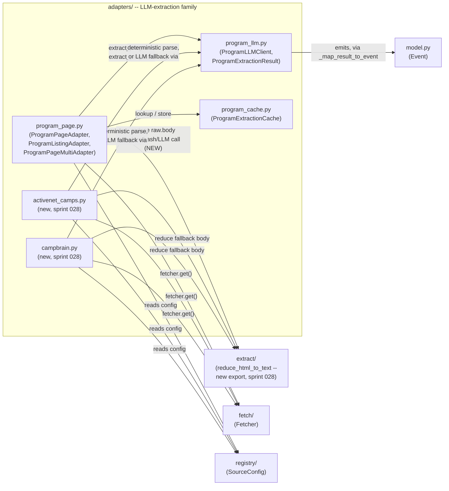

---
source_paths:
- /Volumes/Proj/proj/league-projects/infrastructure/partner-scrape/partner_scrape
---
# partner-scrape — System Design

**Owner:** Eric Busboom · **Last reviewed:** 2026-08-30 · **Status:** stable

This is the top-level design document for the `partner-scrape` repository. It covers
system-wide context, the subsystem map, and the global conventions every subsystem
document is allowed to assume without repeating.

---

## 1. What this project is

`partner-scrape` is the data engine behind **sdstemecosystem.org**, the San Diego STEM
Ecosystem's directory of STEM learning opportunities for **learners of all ages**
(sprint 014 widened this from an earlier K-12-only framing to match the site's own
stated audience and its `Adult` age facet — see §3's sprint 014 note and
`partner_scrape/enrich/DESIGN.md`).

It is one half of a two-repository architecture:

- **`partner-scrape`** (this repo) — a Python aggregator that visits ~100 partner
  organizations' websites and APIs, extracts events, programs, and internships,
  deduplicates and classifies them, and writes a JSON data contract.
- **`stem-ecosystem`** — an Astro static site that consumes that contract and renders the
  public directory.

The boundary between them is a small set of files written into the site checkout's
`src/data/` and `public/images/` directories. Nothing else crosses.

A run is scheduled, unattended, and expected to partially fail: with ~100 independent
third-party sources, some fraction is always broken, redesigned, or unreachable. The
system is built around that expectation — a partial result ships, and the gap is
*reported* rather than raised.

## 2. Repository layout

| Path | What it is |
|---|---|
| `partner_scrape/` | **The declared source root.** The whole engine. See [`partner_scrape/DESIGN.md`](../../partner_scrape/DESIGN.md) for the root overview and the top-level modules (`pipeline.py`, `cli.py`, `config.py`, `model.py`). |
| `tests/` | 905 fixture-based tests, one module per source module. No network. |
| `docs/` | This design set, plus `overview.md`, `specification.md`, `usecases.md`, and deployment notes. |
| `clasi/`, `.clasi/` | CLASI SE process artifacts — sprints, issues, reflections. |
| `site/` | This repo's own checkout of the Astro site (the beta the team develops against). |
| `dev/` | Pre-existing exploration scripts. Not a dependency of the package; logic was ported, not imported. |
| `config/` | Layered dotconfig `.env` files, assembled before the process starts. |

## 3. The pipeline

```
registry/       load_active_sources()            ~100 TOML files, one per organization
   ↓
adapters/       ThreadPoolExecutor(8):           per-source error isolation —
                discover → fetch → extract       a failure is logged and skipped
                   ↓         ↓        ↓
              discovery/  fetch/   extract/
   ↓
enrich/         LLMEnricher                      recover fields, classify, gate relevance
                                                 (fail-open; content-hash cache)
   ↓
normalize/      collapse → dedup → map           Event[] → Opportunity[]
   ↓
export/         opportunities.json, ads.json,    the cross-repo data contract
                images                           (+ mirror to extra checkouts, from cli.py)

observability/  runs alongside: per-source yield counts, deltas, alerts
store/          built, not wired in
```

**Sprint 011 addition — a second, independent pipeline.**
`partner_scrape/teams/` (own CLI subcommand: `partner-scrape teams`) is
deliberately **not** part of the flow above. It acquires San Diego FIRST
robotics team rosters (FTC via FTCScout, FRC via The Blue Alliance,
static FLL as of sprint 012), resolves cross-league identity, locates
each team through an offline-only geocoding ladder, and publishes
`teams.json` alongside `opportunities.json`/`ads.json`. It reuses
`registry/`'s schema/loader, `fetch/`'s `PoliteFetcher`, `config.py`,
and one function of `normalize/partners.py`, but never touches
`adapters/`, `enrich/`, `normalize.run()`, or `pipeline.run()` — a
`Team` is a standing entity with no date, and would be silently dropped
by `export/`'s current-and-upcoming filter if it were routed through
`Opportunity`. See
[`partner_scrape/teams/DESIGN.md`](../../partner_scrape/teams/DESIGN.md).

**Sprint 013 addition — website verification and sponsor extraction,
still inside `teams/`.** `run_teams()` gained two more stages after
geocoding: fetching each team's already-known `website` (through the
same `fetcher`/`PoliteFetcher` seam, not a new one) to set
`website_status`, and — the substantial new piece — extracting sponsor
names from that fetched HTML via a deterministic candidate-gathering
pass constrained to an LLM *classification* call (never open-ended
generation, the guard against a hallucinated sponsor). This sprint adds
new modules (`teams/scrape.py`, `teams/sponsor_candidates.py`,
`teams/sponsor_llm.py`, `teams/sponsor_cache.py`,
`teams/sponsor_extract.py`) that mirror `enrich/`'s LLM-client/cache
pattern in shape only — the "never touches `enrich/`" boundary above is
unchanged; the new modules do not import it. See
`partner_scrape/teams/DESIGN.md`'s own sprint 013 section for the full
write-up.

**Sprint 014 addition — gate widening, ops reactivation, and registry growth,
no pipeline stage or dependency change.** Four independent, code-light changes:
`enrich/`'s relevance gate now judges "STEM learning opportunity for any audience"
rather than K-12-only, with a new `prompt_version` cache-key component
(`partner_scrape/enrich/DESIGN.md`) forcing exactly one re-evaluation per
previously-cached event; the already-built headless-fetch path (`fetch/headless.py`,
`pipeline.py`'s `fetch_strategy` wiring, both unchanged since sprint 003/005) gets
turned on in more environments and flagged for more sources purely via registry data
and CI/dependency configuration; roughly 33 previously zero-adapter-yield sources in
`registry/sources/` get a triage disposition, including two corrected
mis-registrations; and roughly 20 new sources are registered against the three
existing structured-API adapters (`tec_rest`, `ical`, `localist`) with zero new
adapter code. None of this moves the pipeline diagram in §3 above, changes which
subsystem depends on which, or changes the `Opportunity` data model — see
`partner_scrape/enrich/DESIGN.md`, `partner_scrape/registry/DESIGN.md`, and
`partner_scrape/normalize/DESIGN.md`'s own sprint 014 sections, and this sprint's
`sprint.md` Architecture section for why no component/dependency diagram is included.

**Sprint 028 addition — camp session extraction, plus an HTML-reduction step for the
sprint 027 LLM-extraction family.** Two independent changes inside `adapters/`, no new
pipeline stage: (1) closing issue 36, the `program_page`/`program_listing`/
`program_page_multi` family now reduces a fetched page's HTML to bounded plain text
(`extract.reduce_html_to_text()`, new — see `partner_scrape/extract/DESIGN.md`'s own
sprint 028 section) before every LLM call, fixing the `sd-foundation-community-
scholarship` and UCSD-card failures sprint 027 hit; (2) two new platform adapter types,
`activenet_camps` and `campbrain`, extract dated, priced camp-session records from two
camp-registration platforms, reusing the sprint 027 mechanism's own intermediate shape
(`ProgramExtractionResult`) rather than adding a camp-specific one. See
`partner_scrape/adapters/DESIGN.md`'s own sprint 028 section for the full write-up,
including the Design Rationale for reusing that shape, deferring the third
issue-29-listed platform (Pike13) to a follow-up issue, and excluding the one
commercial-chain camp (Camp Galileo SD) that issue 29 otherwise lists alongside its
verified nonprofit/institutional marketing-page targets.

This sprint touches enough of `adapters/`'s own internal shape (a new dependency on
`extract/`, plus two new adapter types) to warrant a component diagram — unlike sprint
014 above, this is new composition, not independent same-shape edits:



The one new edge that did not exist before this sprint is `program_page.py → extract/`
(bold in the write-up above, though Mermaid itself doesn't distinguish it visually) —
every other edge either already existed (sprint 027) or is the same shape repeated for
the two new adapter modules. No edge points backward into `pipeline.py`, `enrich/`, or
`normalize/` — this sprint's changes are fully contained inside `adapters/`'s existing
one-way dependency direction (`adapters` → `discovery`/`extract`/`fetch`/`registry`,
`partner_scrape/DESIGN.md`'s §5 convention, unchanged).

**Sprint 030 addition — a third `directory/` standing-entity type, `Offering`, plus a
third `adapters/` program-page extraction profile.** Two independent, code-light
extensions of already-established patterns, no new pipeline stage or dependency-
direction change: (1) `directory/` (sprint 018's second, independent pipeline — see
that sprint's own note below) gains `Offering`, an undated standing-entity record
serving both a volunteer-org-profile use case and a free/Title-I-school-program use
case with one shape, extending the exact `Place`/`Club` generalization that module
already exists to house (see `partner_scrape/directory/DESIGN.md`'s own sprint 030
section); (2) `adapters/program_llm.py` gains a third `ProgramLLMClient` extraction
profile, `profile="pd"`, for educator-PD workshop/conference pages, alongside the
`"program"` and sprint-029 `"competition"` profiles (see
`partner_scrape/adapters/DESIGN.md`'s own sprint 030 section). Neither touches the
pipeline diagram in §3 above or changes which subsystem depends on which — `directory/`
remains structurally disjoint from `adapters/`/`enrich/`/`normalize/`/`pipeline.run()`
exactly as sprint 018 established, and the `adapters/` change is contained entirely
inside that package's existing one-way dependency direction, matching sprint 014's own
"no diagram needed" precedent for a same-shape, no-new-composition addition. **Scope
note, not an architecture change:** this sprint's `offerings.json` export is this
repo's data contract only — see `partner_scrape/directory/DESIGN.md`'s sprint 030
Migration Concerns for why rendering it as a site page is out of this repo's scope
(sprint 019 converted `site/` to a build-time-only checkout of the separate
`stem-ecosystem` repository).

## 4. Subsystem map

The source root itself carries an overview doc; each subsystem carries its own, co-located
in its own directory.

- [`partner_scrape/DESIGN.md`](../../partner_scrape/DESIGN.md) — **root overview**: the
  run end to end, the four top-level modules, and the shared conventions.
- [`partner_scrape/adapters/DESIGN.md`](../../partner_scrape/adapters/DESIGN.md) —
  sixteen per-vendor `discover → fetch → extract` strategies behind a one-line
  dispatch table (sprint 027 adds the LLM-extraction `program_page`/
  `program_listing`/`program_page_multi` trio — see that doc's own sprint 027 section
  and its ticket 006 exception-cycle Revision note; sprint 028 adds the
  `activenet_camps`/`campbrain` camp-platform pair and an HTML-reduction step shared by
  the whole LLM-extraction family — see that doc's own sprint 028 section).
- [`partner_scrape/directory/DESIGN.md`](../../partner_scrape/directory/DESIGN.md) —
  (sprint 018) a second, independent pipeline alongside `teams/`: curated, undated
  standing-entity directories — Places, Clubs, and (sprint 030) Offerings (volunteer
  org profiles and free/Title-I school programs) — published as `places.json`/
  `clubs.json`/`offerings.json`. Never touches `adapters/`, `enrich/`,
  `normalize.run()`, or `pipeline.run()`, the same "standing entity, not a dated
  event" boundary `teams/` established. *(This bullet was missing from this document
  before sprint 030 — an unrelated pre-existing gap from sprint 018, fixed here since
  this sprint substantially extends the subsystem it should have already linked.)*
- [`partner_scrape/discovery/DESIGN.md`](../../partner_scrape/discovery/DESIGN.md) —
  resolving sources into fetchable URLs; plus hub scanning for organization leads,
  structurally firewalled from the event pipeline.
- [`partner_scrape/enrich/DESIGN.md`](../../partner_scrape/enrich/DESIGN.md) — the LLM
  layer: field recovery, classification, relevance gating, cost-control cache.
- [`partner_scrape/export/DESIGN.md`](../../partner_scrape/export/DESIGN.md) — every write
  across the repo boundary, plus image self-hosting and multi-checkout mirroring.
- [`partner_scrape/extract/DESIGN.md`](../../partner_scrape/extract/DESIGN.md) — the
  confidence-ranked extraction ladder for arbitrary HTML, plus (sprint 028) a
  bounded HTML-to-text reduction function shared by the LLM-extraction adapter family.
- [`partner_scrape/fetch/DESIGN.md`](../../partner_scrape/fetch/DESIGN.md) — the only
  network access in the system: robots, throttling, caching, optional headless browser.
- [`partner_scrape/normalize/DESIGN.md`](../../partner_scrape/normalize/DESIGN.md) —
  recurrence collapse, cross-source dedup, taxonomy, partner join; owns `Opportunity`.
- [`partner_scrape/observability/DESIGN.md`](../../partner_scrape/observability/DESIGN.md)
  — per-source yield accounting and regression alerting.
- [`partner_scrape/registry/DESIGN.md`](../../partner_scrape/registry/DESIGN.md) — the
  data-driven catalog of sources, hubs, ads, and candidates.
- [`partner_scrape/store/DESIGN.md`](../../partner_scrape/store/DESIGN.md) — durable
  SQLite event table; built and tested, not wired into the pipeline.
- [`partner_scrape/teams/DESIGN.md`](../../partner_scrape/teams/DESIGN.md) — (sprint 011)
  a second, independent pipeline: scrapes, geocodes, and publishes San Diego FIRST
  robotics teams (FTC/FRC) as `teams.json`, structurally disjoint from the
  `Opportunity` pipeline above. (Sprint 013) also verifies each known team
  website and extracts sponsor names from it, via new modules that mirror
  but never import `enrich/`.

## 5. Global conventions

These hold throughout the codebase. Subsystem docs assume them and describe only their own
departures.

**Injectable protocols with fixture doubles.** Every boundary to the outside world is a
`typing.Protocol` passed in as an argument — `Fetcher`, `LLMClient`, `ImageFetcher`,
`HeadlessPage`, `Enricher`, `Reporter`. Production wiring happens at the outermost layer
(`cli.py`, `pipeline.run()`); tests inject doubles. This is why the whole suite runs with
no network and with the optional `playwright` dependency uninstalled.

**Structural satisfaction, never a backwards import.** Modules that satisfy
`pipeline.Enricher` or `pipeline.Reporter` do not import them. Python Protocols are
structural, so the import would buy nothing and would invert the dependency direction.

**One-way dependency direction.** `pipeline` → everything; `adapters` →
`discovery`/`extract`/`fetch`/`registry`; `export` → `normalize`; never the reverse.
`normalize/` never imports `export/`. `fetch/`, `extract/`, and `model.py` are leaves.

**Errors are isolated at the level that owns the unit.** Per-record inside an adapter's
`extract()`; per-source inside `pipeline.run()`; per-page inside discovery and the
extraction ladder; fail-open for LLM calls. A partial result ships; `observability/`
reports the gap.

**Provenance travels with values.** `Event.set(field, value, source, confidence)` records
origin and trust for every field. Structured APIs and JSON-LD are 1.0, the extraction
ladder descends to 0.2, LLM enrichment is 0.7, its keyword fallback 0.3. `normalize/` uses
those numbers to choose between competing records — so a confidence constant is a
project-wide contract.

**Configuration is data; environment is read in one place.** Onboarding an organization is
a new TOML file. `config.py` is the only module that touches `os.environ`.

**Datetimes are naive San Diego wall clock,** enforced by a single coercion in
`normalize.run()`.

**Minimal, deliberate dependencies.** `lxml`, `icalendar`, `python-dateutil`, `anthropic`,
`certifi`. HTTP is stdlib `urllib`, TOML is stdlib `tomllib`, the store is stdlib
`sqlite3`. `playwright` is an optional extra with a deferred import.

**Tests are fixture-based and hermetic** — 905 of them, one module per source module.

## 6. System-wide open questions

- `store/` is complete but unwired; the policy it implies (should a failed source keep
  publishing last run's data?) is undecided.
- The site data contract is unversioned and unvalidated in either direction.
- Yield alerts have no delivery channel beyond console output in the scheduled run's log.
  **(Sprint 014)** This gap is more consequential now that the weekly cron is actually
  reactivated (§3's sprint 014 addition): a zero-yield or cliff alert on an unattended
  Monday run is visible only in that run's GitHub Actions job summary, which nobody is
  guaranteed to open. Not solved this sprint — `observability/DESIGN.md`'s own Open
  Questions already named this gap; sprint 014 makes it a live operational risk rather
  than a theoretical one, and is not a scope change to `observability/` itself.
- A circular import between `adapters.listing_html` and `discovery.listing` is worked
  around by import ordering rather than fixed.
- **(Resolved, sprint 012)** DST is now handled: `normalize/run.py` resolves each
  naive datetime's UTC offset from `zoneinfo.ZoneInfo("America/Los_Angeles")` at
  serialization time instead of a hard-coded `-07:00` constant. See
  `partner_scrape/normalize/DESIGN.md` for the fold-convention decision on the
  two DST-transition edge cases.
- (Sprint 011) Whether `teams.json` is ever joined to the curated partner directory
  is an open product question, not resolved here: only 1 of 105 distinct team
  organizations is already a partner, while the other 104 are a candidate
  recruitment list for Fleet/League staff to act on, not an architectural decision.
  (Sprint 013) The new per-team sponsor company-name data makes this question more
  concretely answerable — which companies sponsor which teams is now visible — but
  does not answer it; still an open product decision, not an architectural one.
- (Sprint 012) `partner_scrape/teams/` now carries a third source,
  `static_roster` (FLL, 48 teams, one-time-dated per season), alongside the two
  live sources (FTCScout, TBA) — see `partner_scrape/teams/DESIGN.md`. FLL's
  season is documented as the program's last (`sunset_season = "2026-27"`); what
  replaces it, if anything, is unresolved and out of this project's control.
- (Sprint 013) `ANTHROPIC_API_KEY` provisioning for the `teams` subcommand's
  scheduled CI runs is unverified — mirrors the exact `TBA_KEY` gap sprint 011
  flagged (provisioned locally, not confirmed in the scheduled workflow's
  secrets). A missing key degrades sponsor extraction to a logged warning and
  structured-sponsors-only output; it does not abort the run. See
  `partner_scrape/teams/DESIGN.md`'s sprint 013 section.
- (Sprint 013) Sponsor data is not persisted across `teams` runs — `Team`
  objects are rebuilt fresh from their sources every call, with no read-back
  of the previous `teams.json`, so a transient fetch failure on a later run
  silently drops that team's previously-scraped sponsors rather than
  preserving them. Not solved; see `partner_scrape/teams/DESIGN.md`'s Open
  Questions.
- (Sprint 014) Registering Balboa Park's park-wide calendar alongside the individual
  institutions it already covers exercises `normalize/`'s known "different titles for
  the same event never merge" limitation for the first time at meaningful scale; some
  duplicate publication is accepted, not fixed, this sprint. See
  `partner_scrape/normalize/DESIGN.md`'s sprint 014 Open Questions entry.
- (Sprint 014) `registry/`'s "no schema validation for `config`" limitation extends to
  cross-field consistency generally — `sandiego-gov.toml`'s `org_name`/`site_url`
  mismatch (corrected this sprint) was exactly this kind of silent error, and nothing
  added this sprint prevents a similar one from recurring for any other source. See
  `partner_scrape/registry/DESIGN.md`'s sprint 014 Open Questions entries.
- (Sprint 014) LibCal (Carlsbad, Escondido) and the NPS events API (Cabrillo National
  Monument) were evaluated but not registered — deferred, not engineered, pending
  confirmation the existing plain `ical` adapter can consume their feeds unchanged. If
  it cannot, they need either adapter work or are dropped; that decision is explicitly
  out of this sprint's scope.
- (Sprint 028) An in-season-only camp source (Fleet) registered year-round legitimately
  yields zero records off-season — indistinguishable from a broken source in
  `observability/`'s yield report. Accepted, not solved: see
  `partner_scrape/adapters/DESIGN.md`'s sprint 028 Design Rationale for why a
  seasonal-recheck subsystem was deliberately not built.
- (Sprint 028) Pike13 (issue 29's third-priority camp-platform adapter) is deferred to a
  follow-up issue, carrying forward an unresolved question of its own: whether it
  supersedes gaps in the already-shipped `leaguesync` adapter for the League's own camps.
  See `partner_scrape/adapters/DESIGN.md`'s sprint 028 Design Rationale.
