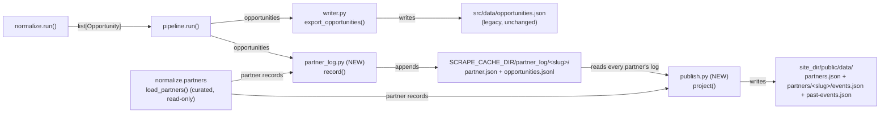

# Export

**Owner:** Eric Busboom · **Last reviewed:** 2026-08-28 · **Status:** in-flux

---

## 1. Purpose

`export/` publishes finished data across the repo boundary into the `stem-ecosystem`
Astro site's checkout(s). It is a subsystem because that boundary is a *data contract* with
another repository: file locations, JSON shapes, and field sets that the site consumes
verbatim. Concentrating every write to the site here means the contract is stated in one
place and cannot be violated by a stage that merely thought it knew the schema. It also
owns the "what is publishable" judgment — the current/upcoming filter — and the
self-hosting of remote images. Nothing upstream writes to the site.

**Sprint 009 addition.** `export/` now also owns a second, additive data contract: a
persistent, per-partner, append-only record of every `Opportunity` ever seen (never
pruned, unlike the flat `opportunities.json`), and a build-time projection of that record
into a published `public/data/` tree — a partner roster plus per-partner current and past
event files, self-describing enough that a consumer needs no other data source (issue 15).
This is still squarely "every write across the repo boundary" — it is a second *shape* of
write, not a new responsibility for the subsystem.

**(Sprint 033) `scrape-meta.json` gains a `"regions"` key.** `writer.py`'s
`export_opportunities()` now also computes a per-region count over the exported
(current/upcoming) payload — using `Opportunity.region`, a value `normalize/` has already
derived (`normalize/DESIGN.md`'s sprint 033 addition) — and writes it into
`scrape-meta.json` alongside the existing `last_updated`. This is additive: an existing
consumer reading only `last_updated` is unaffected. See §4 and Migration Concerns in
`sprint.md`.

## 2. Orientation

Five independent modules, each owning one output (three pre-existing, two new in sprint 009):

- `writer.py` · `export_opportunities(opportunities, site_dir=None, *, today=None,
  dry_run=False)` — the main contract. Filters to current+upcoming, runs a defensive
  slug-uniqueness pass, serializes exactly the site's field set (dropping
  `Opportunity.sources`), and writes `src/data/opportunities.json` and
  `src/data/scrape-meta.json`. Sprint 009: its current/upcoming filter and its
  field-set/serialization helpers are promoted to shared, non-underscore names
  (`is_current_or_upcoming`, `SITE_SCHEMA_FIELDS`, `to_json_dict`) so `publish.py` (below)
  reuses them verbatim instead of re-implementing the same judgment a second time.
  `writer.py`'s own behavior and output are otherwise unchanged.
- `ads.py` · `export_ads(ad_configs, site_dir=None, *, dry_run=False)` plus
  `load_ad_configs(directory=None)` — a small, structurally parallel contract publishing
  hand-authored League ad-slot content as `src/data/ads.json`. Shares no code with
  `writer.py`. Unchanged this sprint.
- `images.py` · `EventImageDownloader(dest_dir, *, fetcher=None, min_dimension=80,
  max_bytes=5MB)` with `.download(image_url) -> str` — fetches an already-extracted remote
  image URL, quality-gates it, dedupes by content hash, and self-hosts a local copy under
  `public/images/opportunities/`. Unchanged this sprint.
- **`partner_log.py` (NEW, sprint 009)** · `record(opportunities, *, log_dir=None,
  partners_path=None, dry_run=False)` — the persistent per-partner accumulation layer.
  For each `Opportunity`, resolves a partner slug (from the curated partner join, via
  `normalize.partners`) and an event identity (`Opportunity.slug`, reworked this sprint —
  see `normalize/DESIGN.md`), computes `published_content_hash(opportunity)` over the
  published schema fields, and appends a line to that partner's
  `{log_dir}/<partner-slug>/opportunities.jsonl` only if the `(slug, content_hash)` pair
  is not already present — never rewriting existing lines. `log_dir` defaults to
  `{SCRAPE_CACHE_DIR}/partner_log/`. Called from `pipeline.run()`, alongside
  `export_opportunities`/`export_ads`, so every real run accumulates.
- **`publish.py` (NEW, sprint 009)** · `project(site_dir=None, *, log_dir=None,
  partners_path=None, today=None, dry_run=False) -> dict` — the build-time projection.
  Reads *every* partner's accumulated `.jsonl` (not only this run's), collapses each to
  one record per event slug (last line wins), splits current/upcoming from past (reusing
  `writer.is_current_or_upcoming`), and writes the published
  `{site_dir}/public/data/partners.json` (every curated partner, including ones with no
  accumulated events) plus each partner's `public/data/partners/<slug>/events.json` and
  `.../past-events.json`. Deliberately *not* called from inside `pipeline.run()` — see
  Design below — but from `cli.py`, after `run()` returns.

`pipeline.run()` calls `export_opportunities`, `export_ads`, and (sprint 009)
`partner_log.record`, and constructs the `EventImageDownloader` it passes into
`normalize.run()`. `cli.py`, after `run()` returns, calls (sprint 009) `publish.project`
— not part of `pipeline.run()`, skipped under `--dry-run`.

**Sprint 019.** `mirror.py` (and its `MIRRORED_DATA_FILES` allowlist) was removed
outright, along with `config.get_mirror_site_dirs()` and the `--mirror-site-dir`/
`--no-mirror` CLI flags. `partner-scrape` no longer tracks a second, independently
mirrored-into site checkout — `site/` becomes a build-time-only CI checkout of
`stem-ecosystem` (sprint 019 ticket 002) — so the "keep N checkouts in step" mechanism
has no second checkout left to copy into. `export_opportunities`/`export_ads`/
`publish.project` now write to exactly one resolved `SITE_DIR`, full stop.

## 3. Constraints and Invariants

- **A missing or unwritable `site_dir` fails loudly.** Both `export_opportunities` and
  `export_ads` raise rather than skipping. A silently-skipped export leaves the site
  serving stale data with no signal — the exact failure that went unnoticed for five weeks
  and originally motivated the (sprint 019-removed) `mirror.py` mechanism.
- **Undated records are excluded.** An `Opportunity` with neither `date_start` nor
  `date_end` can never be judged "today or later" and does not ship. This is a filter,
  not an error.
- **`opportunity_type in DEADLINE_FIRST_TYPES` uses a different currency rule.** An
  internship's `date_start` is the posting-observed date, routinely in the past; the
  ordinary rule would expire every still-open role. Such a record is current if
  `date_end` (the application/registration deadline) is unset or still in the future.
  Every other type keeps the ordinary rule unchanged. **(Sprint 015, ticket 007, issue
  27.)** Originally special-cased on `opportunity_type == WORK_BASED_LEARNING_TYPE`
  alone; generalized to `normalize.run.DEADLINE_FIRST_TYPES` (`{WORK_BASED_LEARNING_TYPE,
  "Competitions"}`) so a Competitions record with a future registration deadline is kept
  the same way, and the export sort key (`_export_sort_key`) uses the same set to sort
  such a record by `date_end` instead of its possibly-stale `date_start` — a
  winter-observed posting with a spring/summer deadline now sorts near other near-term
  deadlines rather than by when it was first seen. Rejected alternative: a new
  `application_deadline` field. No adapter or the LLM prompt currently distinguishes a
  registration deadline from an event's own end date/time for any non-internship record,
  so a new field would have no real producer yet; reusing `end` is not speculative — it
  extends an already-shipped convention (sprint 006) to one more already-shipped type
  value rather than inventing a second one. See `normalize/DESIGN.md`'s matching sprint
  015 addendum. **(Sprint 027, issue 28 item 4)** `DEADLINE_FIRST_TYPES` gains a third
  member, `"Funding Opportunities"` — the SD Foundation Community Scholarship's own
  type — so this exact currency/sort rule now also applies to it, with **zero code
  change in this module**: `is_current_or_upcoming`/`_export_sort_key` already branch on
  `opportunity_type in DEADLINE_FIRST_TYPES`, a set they import from `normalize.run`
  rather than hardcoding, which is precisely what makes a third member a
  `normalize/run.py`-only change. See `normalize/DESIGN.md`'s sprint 027 addendum for
  why the set gained a member instead of `Opportunity` gaining a `kind` field.
- **`export/` re-derives nothing.** No field mapping, no taxonomy, no dedup. Its inputs
  arrive finished from `normalize/`. Adding a derivation here would apply it after
  deduplication chose a winner, silently diverging from what the rest of the pipeline
  computed. **(Sprint 033)** The `scrape-meta.json` region count is a plain aggregation
  (a `Counter` over an already-finished `Opportunity.region` value each record already
  carries when it arrives here) — not a derivation. `writer.py` does not compute what a
  record's region *is*; `normalize/` already decided that. This constraint is about
  re-deciding a record's own classification after dedup already chose a winner; counting
  an existing, finished field's already-decided values is the same "no re-derivation"
  discipline `observability/yield_report.py`'s own found/dated counting already follows
  for a different field.
- **`Opportunity.sources` is dropped on serialization.** It is `normalize/`'s
  cross-source bookkeeping, not part of the site's Opportunities table. **(Sprint 033)**
  `Opportunity.region` is dropped the same way — also `normalize/`'s internal bookkeeping,
  not part of the site's Opportunities table — while its *aggregate* (a per-region count,
  not the per-record value) is written into `scrape-meta.json` instead. `SITE_SCHEMA_FIELDS`
  now excludes both `sources` and `region`.
- **`images.py` never interprets downloaded bytes as anything but a static asset,** and
  refuses any URL that is not `http(s)://` before performing any I/O — `file://`, `data:`,
  and everything else are rejected without a fetch.
- **`.download()` never raises.** A missing, unreachable, or rejected image returns `""`
  and the record exports normally with an empty `image_src`.
- **`dry_run` means no disk writes anywhere,** including image downloads. `pipeline.run()`
  does not even construct an `EventImageDownloader` under `dry_run`.
- **Deliberate non-goal — no UI, placement, or rotation decisions for ads.** `ads.json`
  is a flat, advertiser-agnostic array; how the site renders it is the site repo's own
  work.
- **`partner_log.py`'s log is strictly append-only** (sprint 009), matching
  `EnrichmentCache`'s and `EventStore`'s convention of never destroying prior state: a
  line is written only for a new-or-changed `(slug, content_hash)` pair; an existing line
  is never edited or removed. This is what makes past events survive across runs — nothing
  ever prunes the log; `publish.py`'s projection is what decides, at read time, whether a
  given collapsed record is current or past.
- **`publish.py` re-derives nothing new** — same non-goal as `writer.py`'s existing "no
  field mapping, no taxonomy, no dedup" rule, extended to also cover "no re-deciding
  current-vs-past by a different rule": it reuses `writer.is_current_or_upcoming` rather
  than reimplementing the current/upcoming judgment, so the two published contracts
  (`opportunities.json` and `public/data/`) cannot silently disagree about which events are
  current.
- **The new `public/data/` tree is additive, not a replacement for `src/data/opportunities.json`.**
  Both are written every real run; `writer.py`'s behavior is completely unchanged by this
  sprint. See `sprint.md`'s Design Rationale for why (out of this sprint's scope to decide
  whether the Astro site itself is ever refactored onto the new shape).
- **`public/data/` lives outside `src/data/`, deliberately.** Astro's `src/` is build-time
  input the framework itself reads and compiles; a file placed there is not, by itself,
  fetchable at a public URL. `public/` is copied verbatim to the site root and *is*
  runtime-fetchable — required for issue 15's "given `partners.json` + event files, no
  other data source" promise and for issue 16's future agent-facing consumers (sprint 010)
  to be able to `fetch()` it at all.
- **`partner_log.py` and `publish.py` key partner directories by the already-resolved
  partner identity** (`Opportunity.partner_name`/`partner_id`, from `normalize/`'s
  existing partner join), never by raw scraper `source_id`. An `Opportunity` can carry
  several contributing `source_id`s (`Opportunity.sources`, from cross-source dedup) but
  always resolves to exactly one partner — see `sprint.md`'s Design Rationale.
- **`dry_run` extends to both new modules,** matching every existing export function's
  contract: `partner_log.record(..., dry_run=True)` and `publish.project(...,
  dry_run=True)` compute and can report what they would do without touching disk.

## 4. Design

**Why `writer.py` is deliberately thin.** Its four responsibilities are filter, slug
uniqueness, serialize, write. The slug pass is defensive: `normalize/` already dedupes by
title+date+venue, but distinct records can still collide on a *truncated* slug (same org
and title on nearby dates). Fixing it properly belongs upstream; the pass here guarantees
the site never receives duplicate keys regardless.

**Why `ads.py` shares no code with `writer.py`.** They look parallel — load config,
serialize, write into `src/data/` — but they are different contracts with different
schemas and different lifecycles. The shared surface would be about six lines of JSON
writing; coupling them would mean an ad-schema change could break the opportunities
export.

**The image quality gate is ordered cheapest-first.** URL scheme → HTTP status and
non-empty body → `Content-Type` starts with `image/` → size cap → structural decode as
real PNG/JPEG/GIF/WebP → minimum dimension. The structural decode is the load-bearing
check: it catches non-image content wearing an image `Content-Type`, truncated downloads,
and HTML error pages, which a header check alone would pass. The dimension floor rejects
1×1 tracking pixels and spacer graphics.

**Deduping images by SHA-256 of raw bytes** matters because the common real case is one
generic partner-site banner reused across dozens of unrelated events. One
`EventImageDownloader` instance per run means that cache is shared across every source.

**Pixel downscaling is intentionally absent.** The recurring pipeline keeps zero external
binary dependencies (matching `fetch/`'s stdlib-only rationale), so neither Pillow nor an
ImageMagick shell-out was added. `MAX_IMAGE_BYTES` provides comparable size discipline.
The one-off partner-logo sourcing script does downscale, but it is explicitly not part of
the recurring pipeline.

**Image fetching uses its own `ImageFetcher` Protocol,** not `fetch.Fetcher`, because
images are `bytes` and `FetchResponse.body` is `str`. `UrllibImageFetcher` is the default;
tests inject a fixture.

**Why `partner_log.py` is a new module, not a reuse of `store/event_store.py`** (sprint
009). Both are "durable, cross-run, identity-keyed" stores, which makes them look
redundant at a glance — they are not. `EventStore` persists raw, pre-normalization
`Event`s keyed by *acquisition* identity ("have we already seen this exact record from
this source"), for the purpose of skipping re-crawling. `partner_log.py` persists
finished, post-dedup `Opportunity`s keyed by *publish* identity (the reworked
`Opportunity.slug`), for the purpose of never losing a published event. `normalize/DESIGN.md`
already states these two identity concepts must not be conflated; building one store to
serve both would do exactly that, and would also force `EventStore` (currently unwired,
pre-normalization) to sit downstream of `normalize/`, an entirely different position in
the pipeline than its own design describes.

**Why `partner_log.py` computes its own content hash, not `enrich.cache.content_hash`.**
The enrichment cache's hash exists to answer "did the LLM's *input* change" (title,
description, and the other enrichable fields, pre-enrichment) so a cache hit can skip an
LLM call. `partner_log.py` needs to answer a different question — "did the *published*
content change" (post-enrichment, post-taxonomy, post-dedup — the fields that actually
end up in `events.json`) — over a materially different field set and a materially
different record type (`Opportunity`, not `Event`). Reusing the same function name or
the same hash for two different questions is exactly the kind of drift
`store/event_store.py`'s own docstring warns against for its *own* reuse of
`enrich.cache.content_hash` (a case where reuse is correct because the question is
identical); here the question differs, so the hash is a new, separately named function
(`published_content_hash`) rather than a third call site of the existing one.

**Why partner directories are keyed by the resolved partner, not `source_id`.** See
`sprint.md`'s Design Rationale for the full argument; in short, `Opportunity` already
carries a single resolved `partner_name`/`partner_id` from `normalize/`'s existing join,
while `Opportunity.sources` can list several contributing `source_id`s for a
cross-source-merged record — keying by the already-resolved partner avoids inventing an
answer to "which of several sources owns this persisted copy."

**Why `publish.py` is CLI-sequenced, not called from inside `pipeline.run()`.** Unlike
`partner_log.record` (which only needs *this run's* Opportunities), `publish.project`
needs *every* partner's accumulated history to produce a correct current/past split — an
invocation scoped to one source (`--source`) or a `--limit`-truncated run must not
regenerate the published tree from a partial view of the data: "operate on the finished,
accumulated state," not "part of processing this run's records."

**`publish.py` depends on `partner_log.py` for the on-disk layout, never the reverse.**
`publish.py` needs to know exactly one thing about `partner_log.py`'s convention — the
per-partner log's filename (`opportunities.jsonl`) — to read what `record()` wrote;
it imports that as a shared constant rather than re-guessing the filename, so the two
modules' notions of "where the log lives" cannot drift apart. It does *not* need to
duplicate `partner_log.py`'s slug-computation logic to *enumerate* partners — it lists
whatever partner-slug subdirectories already exist under `log_dir` — but it does reuse
`model.slugify` directly (the same shared primitive, not a call into `partner_log.py`) to
compute each *curated* partner's slug when deciding whether that partner already has an
accumulated log. `partner_log.py` never imports `publish.py` — the dependency is one-way.

## 5. Interfaces

### Exposes
- **`export_opportunities(opportunities, *, today=None, dry_run=False, own_data_dir=None)
  -> list[dict]`** — writes `opportunities.json` and `scrape-meta.json` into
  `own_data_dir` (sprint 025's sole write target, see that sprint's `sprint.md`); returns
  the payload it wrote (or would have written). Raises on an unwritable target. **(Sprint
  033)** `scrape-meta.json` gains a `"regions"` key: a `dict[str, int]` mapping each known
  region (plus `"unclassified"`) to its count over the exported payload.
- **`export_ads(ad_configs, site_dir=None, *, dry_run=False)`** — writes
  `src/data/ads.json`. Same loud-failure contract.
- **`load_ad_configs(directory=None) -> list[AdConfig]`** — parses ad TOML files
  (default `registry/ads/`). Raises `InvalidAdConfig` on a missing required field
  (`headline`, `body`, `link`, `logo_src`).
- **`EventImageDownloader(dest_dir, ...)` / `.download(image_url) -> str`** — returns the
  stored local filename, or `""` for anything rejected. Never raises. Instance-scoped
  content-hash dedup.
- **`AdConfig`, `ImageFetcher`, `UrllibImageFetcher`, `ImageFetchResponse`.**
- **`is_current_or_upcoming(opportunity, today) -> bool`, `SITE_SCHEMA_FIELDS`,
  `to_json_dict(opportunity) -> dict`** (sprint 009, `writer.py`, promoted from
  `_is_current_or_upcoming`/`_SITE_SCHEMA_FIELDS`/`_to_json_dict`) — the current/upcoming
  judgment and the site-schema serialization, now shared with `publish.py` so both
  published contracts agree on both questions by construction.
- **`partner_log.record(opportunities, *, log_dir=None, partners_path=None,
  dry_run=False) -> None`** (NEW, sprint 009) — appends this run's new-or-changed
  Opportunities into their partner's `.jsonl` log. Never raises for an unmatched partner
  (matches `find_partner`'s existing non-fatal convention); never rewrites an existing
  line.
- **`partner_log.published_content_hash(opportunity) -> str`** (NEW, sprint 009) — the
  published-schema-fields hash `record()` uses for its append/skip decision. A distinct
  function from `enrich.cache.content_hash` — see Design above.
- **`publish.project(site_dir=None, *, log_dir=None, partners_path=None, today=None,
  dry_run=False) -> dict`** (NEW, sprint 009) — the build-time projection; returns a
  summary (partner count, event counts) of what it wrote (or would have written).
  Raises on an unwritable `site_dir`, matching `export_opportunities`'s loud-failure
  contract.

### Consumes
- **`Opportunity` (from `normalize/`)** — the input record. One-way: `export/` depends on
  `normalize/`, never the reverse. See `normalize/DESIGN.md`.
- **`config.get_site_dir()`, `config.get_scrape_cache_dir()` (from `config.py`)** — the
  default target checkout and (sprint 009, `partner_log.py`'s default `log_dir`) the
  default accumulation-store location, when the caller does not supply one. No new
  environment variable was added for the accumulation store — it is a subdirectory of the
  already-configured `SCRAPE_CACHE_DIR`, matching `enrich/cache.py`'s and
  `store/event_store.py`'s existing convention.
- **`normalize.partners.load_partners`/`find_partner`** (sprint 009, `partner_log.py` and
  `publish.py`) — the curated partner roster, read-only, reused rather than
  reimplemented. This is a new, explicit dependency edge (`export/` → the specific
  `normalize.partners` module) alongside the pre-existing `export/` → `normalize/`
  dependency on `Opportunity`/`DEADLINE_FIRST_TYPES` (sprint 015 ticket 007; previously
  `WORK_BASED_LEARNING_TYPE` alone).
- **`model.slugify`** (sprint 009, `partner_log.py`) — the shared text-to-slug primitive,
  for partner slugs. See the root `partner_scrape/DESIGN.md` and `normalize/DESIGN.md`
  (which uses the same function for event slugs).
- Standard library only for I/O; no dependency on `fetch/` (images use their own
  fetcher protocol).

## 6. Open Questions / Known Limitations

- The image store has no garbage collection: files for opportunities that have since
  expired are never removed from `public/images/opportunities/`.
- Image dedup is per `EventImageDownloader` instance, so it holds within a run but not
  across runs — a rerun re-downloads and rewrites identical files.
- `scrape-meta.json`'s shape is inherited from the pre-existing export script and is not
  documented anywhere in this repo.
- There is no schema validation against the site's expectations. A field rename on the
  site side surfaces as missing data on the rendered page, not as an export failure.
- **(Sprint 009)** `past-events.json`'s retention window is unbounded for now: the
  `.jsonl` log never prunes, so every past event ever seen is published, forever. The
  store starts empty this sprint, so this is not an immediate problem, but there is no
  policy yet for when (or whether) to cap it — flagged in issue 15 as an open question,
  deliberately not resolved speculatively here.
- **(Sprint 009, risk, not just the question above)** `publish.project()` reads and
  parses *every* partner's full `.jsonl` on every invocation — cost grows with total
  accumulated history, not with a single run's yield, since nothing is ever pruned from
  the source log. Negligible at this sprint's (empty) starting state; worth
  re-measuring once real history accumulates over months, independent of whatever the
  retention-for-*publication* policy above ends up being (that governs what ships in
  `past-events.json`, not how much `publish.py` has to read to produce it).
- **(Sprint 009)** The link-based event-slug branch assumes a per-event `link` is unique
  to that event. A source whose adapter surfaces the *listing* page URL (rather than a
  per-event detail URL) as `link` for multiple events would collide them onto the same
  slug, silently merging two distinct events in the persisted log. No adapter is known to
  do this today; worth checking once real per-partner logs accumulate rather than
  guarding against speculatively. See `normalize/DESIGN.md`'s matching entry.
- **(Sprint 009)** `public/data/partners.json` and the curated `src/data/partners.json`
  are two different files with the same basename, at different paths, serving different
  purposes (one is hand-curated input, the other is generated output). This is
  deliberate (see `sprint.md`'s Design Rationale) but is a real naming trap for anyone
  reading `git grep partners.json` without the path — not fixed this sprint, since
  renaming either file is a bigger, separate decision (the curated one is read by the
  Astro site's own build; the published one's name comes directly from issue 15's own
  language).
- **(Sprint 009)** Whether `src/data/opportunities.json` and `public/data/`'s per-partner
  files are unified into one contract, or the Astro site is refactored to read the new
  shape directly, remains an open, stakeholder-level product decision (issue 15's own
  framing) — this sprint deliberately keeps both live rather than deciding it.
- **(Sprint 033)** `scrape-meta.json`'s `"regions"` key is written only by
  `export_opportunities()` (the `own_data_dir`/`opportunities.json` contract) — not
  threaded into `publish.py`'s separate `public/data/` projection, which has no
  equivalent per-partner-projection meta file to add it to. Regional counts are a
  whole-corpus measurement, not a per-partner one, so this is not considered a gap for
  `publish.py` to close, only a note that the two contracts' meta shapes are not
  symmetric (unchanged from before this sprint — see the sprint 009 entry above).
- **(Sprint 033)** Whether `stem-ecosystem` ever surfaces `scrape-meta.json`'s regional
  counts (an internal dashboard, a build-time check, a site footer stat) is out of this
  repo's scope to decide — this sprint's job ends at publishing the count. See
  `sprint.md`'s Migration Concerns.
