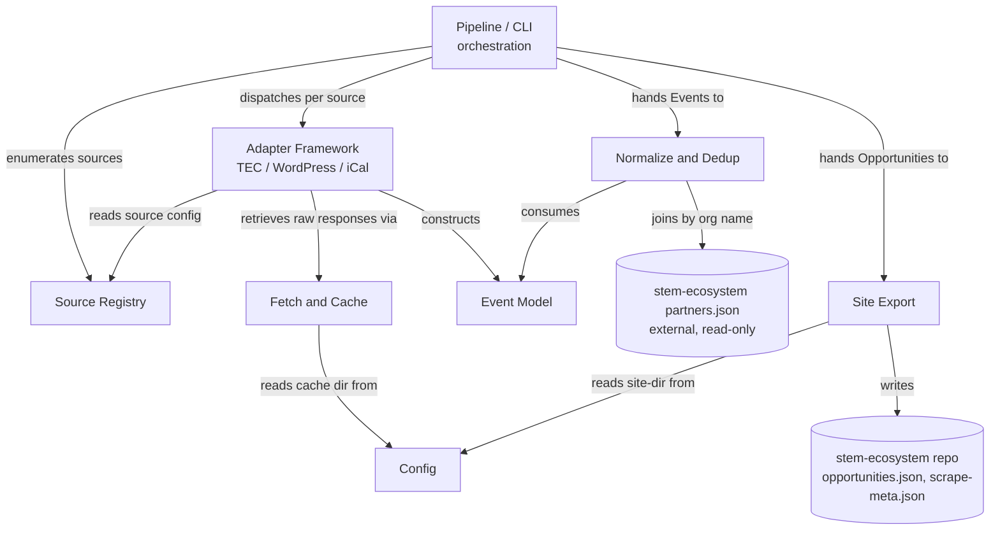
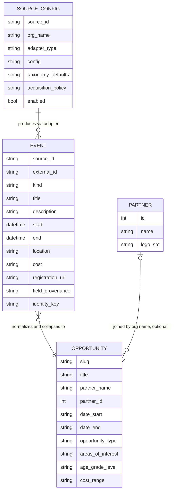

<!-- CLASI: Before changing code or making plans, review the SE process in CLAUDE.md -->

# Sprint 001: Aggregator engine foundation

## Goals

Build a runnable, tested, end-to-end aggregator engine — a walking
skeleton — that supersedes the throwaway `dev/` / `run_mirrors.py` /
`scraper/` mock-up with a real Python package. By the end of this sprint
the engine can: read a data-driven Source Registry, politely fetch and
incrementally cache remote sources, ingest events from structured-API
sources (The Events Calendar REST, WordPress REST, iCal/RSS) into one
canonical Event record, normalize those records into the site's
`opportunities.json` schema with cross-source dedup, and export
current+upcoming opportunities into the sibling `stem-ecosystem` repo —
all covered by fixture-based tests that run with no network access.

## Problem

The current pipeline (`dev/` scripts + `run_mirrors.py`/Scrapy) is ~150
one-off HTML extractors bolted onto a full 40GB re-mirror model. It can't
run unattended, silently drops whole sources (Fleet Science Center and
Birch Aquarium currently yield zero events), has no formal internal data
model (ad hoc dicts passed between scripts), no automated tests, and
treats every source as a bespoke scrape rather than a registered,
declared source. Nothing about it is a foundation to build the
self-updating loop, LLM enrichment, or the company/internship expansion
on top of.

## Solution

Replace the mock-up with a fresh `partner_scrape/` package built around
seven cohesive modules — Config, Event Model, Source Registry, Fetch &
Cache, Adapter Framework (+ TEC/WordPress/iCal adapters), Normalize &
Dedup, and Site Export — wired together by a thin Pipeline/CLI
orchestrator. Structured-API sources are ingested first because they are
highest-quality-per-effort (100% dated, no HTML parsing, per
`dev/SCRAPER_GUIDELINES.md`). The design leaves two explicit,
unimplemented seams for later sprints: the Adapter contract's
`discover()` step (for sitemap-diff and generic-HTML adapters, issue 03)
and an `Enricher` hook in the Pipeline (for LLM enrichment, issue 04) —
both are typed and wired this sprint but ship with zero implementations.

## Success Criteria

- The `partner_scrape` package exists with the module layout described
  in Architecture, replacing `dev/`/`scraper/`/`run_mirrors.py` as the
  active codebase (the legacy mock-up is left in place, untouched, as
  reference — not deleted this sprint).
- Given seeded Source Registry entries for the known TEC sites
  (coastalrootsfarm.org, thelivingcoast.org, eefkids.org, cleansd.org,
  oceanconnectors.org, visitcmod.org), running the pipeline end-to-end
  against recorded fixtures produces normalized, deduplicated
  Opportunity records and writes `opportunities.json` +
  `scrape-meta.json` matching the site's schema.
- All tests pass with no network access and no `ANTHROPIC_API_KEY` use —
  fixtures only.
- `dev/`, `run_mirrors.py`, `scraper/` are not extended or modified by
  any ticket in this sprint.

## Scope

### In Scope

- Source Registry: schema, loader, seed data for the known TEC sites.
- Fetch & Cache layer: robots.txt, rate limiting, conditional GET
  (etag/last-modified), on-disk cache under `SCRAPE_CACHE_DIR`.
- Canonical Event model: `kind` (event/program/internship), per-field
  provenance + confidence, a stable identity key.
- Adapter interface (discover → fetch → extract → emit) + The Events
  Calendar REST, WordPress REST, and iCal/RSS adapters.
- Normalize (controlled-vocabulary derivation), cross-source dedup,
  recurring-instance collapse, partner join.
- Site export: current+upcoming filter, `opportunities.json` +
  `scrape-meta.json` write, matching `dev/export_site.py`'s schema.
- Pipeline/CLI orchestration wiring the above into one runnable, tested
  command, with per-source error isolation.
- Deferred seams, present but unimplemented: a generalized
  `Adapter.discover()` shape future sitemap/HTML adapters can implement
  without changing the interface; an empty `Enricher` hook point in the
  Pipeline.

### Out of Scope

- Sitemap-diff discovery and the generic HTML/JSON-LD extractor
  (issue 03 — sprint 2+).
- LLM enrichment and the relevance gate (issue 04 — sprint 2+).
- Flagship adapter completion for Fleet Science Center / Birch Aquarium
  (issue 06).
- The scheduled self-updating loop, site rebuild/deploy (issue 07).
- Source-yield observability/monitoring (issue 08).
- The company events/internships extension (issue 11), League content
  and advertising (issue 12), and issues 09-10.
- Deleting or migrating the existing `dev/`/`scraper/`/`run_mirrors.py`
  mock-up. It is left in place as reference; removal is a later cleanup
  sprint's job, not this one's.

## Test Strategy

Every module gets unit tests using recorded fixtures — no live HTTP, no
Anthropic API calls, ever. Fixtures: recorded TEC API JSON, WordPress
REST JSON, and `.ics` feed responses, captured once and checked into
`tests/fixtures/`. The Fetch & Cache layer is tested by injecting a
fixture-backed `Fetcher` in place of the real stdlib-based one, so
cache/robots/rate-limit/conditional-GET logic is exercised without
sockets. Adapters are tested by feeding fixture responses through
`discover → fetch → extract → emit` and asserting on the resulting
canonical Events, including `kind`, provenance, and confidence.
Normalize/dedup/collapse/export are tested against hand-built and
adapter-derived Event fixtures, asserting the final `Opportunity`
records match the site's schema and that cross-source duplicates
collapse to one record retaining the highest-confidence data. One
end-to-end test runs the full Pipeline over a small fixture-only
registry (2-3 sources) and asserts a valid `opportunities.json` /
`scrape-meta.json` pair is produced in a temp directory standing in for
the site repo. `pytest` is added as a dev dependency; a clean `pytest`
run with `SCRAPE_CACHE_DIR` pointed at an empty temp directory is this
sprint's test gate.

## Architecture

**Sizing: Substantial** — this sprint stands up a new subsystem from a
standing start: seven new modules with new cross-module dependencies,
and a new internal data model (the canonical Event record and the
Source Registry schema) that did not exist before. The full 7-step
methodology applies, diagrams included.

### Responsibilities

Distinct responsibilities this sprint introduces:

1. Describe, in data, which organizations exist and how to reach their
   events (Source Registry).
2. Retrieve remote resources politely and cache them incrementally
   (Fetch & Cache).
3. Define one canonical shape every adapter emits, with per-field
   provenance/confidence (Event Model).
4. Turn a registered source into canonical Events via a pluggable,
   per-source-type strategy (Adapter Framework + TEC/WordPress/iCal
   adapters).
5. Transform canonical Events into deduplicated, taxonomy-tagged
   opportunity records (Normalize & Dedup).
6. Publish current-and-upcoming opportunity records into the sibling
   site repo's data contract (Site Export).
7. Wire the above into one runnable command with per-source error
   isolation (Pipeline/CLI).
8. Centralize environment-derived configuration so no other module reads
   `os.environ` directly (Config) — small, but genuinely cross-cutting.

### Modules

| Module | Purpose (one sentence) | Boundary | Use cases served |
|---|---|---|---|
| **Config** (`partner_scrape/config.py`) | Centralizes reading of environment-derived configuration. | Inside: `SCRAPE_CACHE_DIR`, site-dir default, future config keys. Outside: how those values are used. | Infrastructure for all others |
| **Event Model** (`partner_scrape/model.py`) | Defines the canonical Event record, including its per-field provenance/confidence tracking. | Inside: the `Event` dataclass, `kind`, a `field_provenance` map, identity-key derivation. Outside: how adapters populate it, how Normalize consumes it. | SUC-004 |
| **Source Registry** (`partner_scrape/registry/`) | Describes, in data, which organizations exist and how to reach their events. | Inside: the `SourceConfig` schema, a loader that reads one file per organization, validation. Outside: actually fetching or adapting anything. | SUC-001 |
| **Fetch & Cache** (`partner_scrape/fetch/`) | Performs polite, cache-aware retrieval of remote resources. | Inside: an injectable `Fetcher`, robots.txt check, per-domain rate limiting, conditional-GET cache read/write under `SCRAPE_CACHE_DIR`. Outside: interpreting fetched content (adapters' job), deciding *what* to fetch beyond what an adapter's `discover()` step requests. | SUC-002 |
| **Adapter Framework** (`partner_scrape/adapters/`) | Converts a registered source into canonical Events via a pluggable, per-source-type strategy. | Inside: the `Adapter` protocol (`discover → fetch → extract → emit`), dispatch by registry `adapter_type`, the TEC REST / WordPress REST / iCal-RSS adapters. Outside: fetch mechanics (delegates to Fetch & Cache), the Event schema itself (imports from Event Model), normalization. | SUC-003, SUC-004 |
| **Normalize & Dedup** (`partner_scrape/normalize/`) | Transforms canonical Events into deduplicated, taxonomy-tagged opportunity records. | Inside: controlled-vocab field derivation, cross-source identity matching + merge, recurring-instance collapse, partner join (reads the site's `partners.json` read-only). Outside: how records are written to disk, how Events were acquired. | SUC-005, SUC-006 |
| **Site Export** (`partner_scrape/export/`) | Publishes the live opportunity set into the sibling site repo's data contract. | Inside: current+upcoming filter, defensive slug-uniqueness pass, `opportunities.json` + `scrape-meta.json` write. Outside: normalization logic, the site's own build/deploy. | SUC-007 |
| **Pipeline/CLI** (`partner_scrape/pipeline.py`, `cli.py`) | Wires Registry → Adapters → Normalize → Export into one runnable command with per-source error isolation. | Inside: orchestration, the empty `Enricher` hook list, per-source try/except so one bad source doesn't kill the run. Outside: the business logic of any module it calls. | SUC-008 |

### Component & Dependency Diagram

Every edge below is also a build-time import dependency — for a
green-field subsystem there is no distinction yet between "component
relationship" and "dependency," so one diagram serves both purposes.

Dependency direction check: Event Model and Source Registry are leaves
(no outward dependencies — they are the domain vocabulary and its
config). Config is infrastructure, depended on but depending on nothing.
Adapter Framework and Normalize & Dedup are business logic, depending
downward on infrastructure and the domain model, never the reverse.
Pipeline/CLI is the sole presentation/orchestration layer at the top.
No cycles. Pipeline/CLI's fan-out is 4 (Registry, Adapter Framework,
Normalize & Dedup, Site Export) — at the edge of the 4-5 guideline but
expected and not a god-component smell: its entire job is sequencing
existing business logic, not containing any of its own (see Design
Rationale below).

### Data Model (ERD)

The data model changes: this sprint introduces both the internal
canonical `Event` shape and the `SourceConfig` registry schema; neither
existed before. `Opportunity` is the (already-specified, unchanged)
site-contract shape from `dev/export_site.py` / the site's
`site-implementation-spec.md`, now produced by a real module instead of
a one-off script. `Partner` is external, owned by the `stem-ecosystem`
repo, read-only from this side.

### What Changed

- New `partner_scrape/` package with the eight modules above.
- New internal data model: the canonical `Event` record (with `kind`,
  per-field provenance/confidence, an identity key) and the
  `SourceConfig` registry schema. Neither existed before this sprint —
  the old pipeline passed ad hoc dicts between scripts.
- New runtime dependency: `icalendar` (pure-Python RFC 5545 parsing) for
  the iCal/RSS adapter — hand-parsing iCal is a correctness trap not
  worth taking on. New dev dependency: `pytest` (the project has no test
  infrastructure today). Everything else (HTTP fetch, robots.txt
  parsing, TOML config reading) is covered by the stdlib — see Design
  Rationale.
- `pyproject.toml` gains these dependencies and a `tests/` tree.
- Zero changes to `dev/`, `scraper/`, `run_mirrors.py`, or their
  dependencies (`scrapy`, `w3lib`, `lxml` stay declared but unused by
  the new package).

### Why

The current mock-up cannot be incrementally hardened into the target
system: it has no registry (every source is bespoke code), no canonical
record (every script invents its own dict shape), no tests, and a
crawl-everything model that doesn't fit "poll six known APIs politely."
Issue 01 explicitly frames it as disposable. Building the new engine as
a proper package now — rather than patching `dev/` — is what makes every
subsequent sprint (sitemap discovery, LLM enrichment, the scheduled
loop, flagship adapters, the company/internship extension) additive
instead of another rewrite.

### Impact on Existing Components

- `dev/`, `scraper/`, `run_mirrors.py`: untouched. They remain on disk as
  reference (e.g., `dev/SCRAPER_GUIDELINES.md`'s tier analysis and known
  TEC endpoints directly seed this sprint's Source Registry data) but no
  ticket imports from or extends them.
- `data/partners_viable.csv`: read by nothing new this sprint. The
  partner join in Normalize & Dedup reads the *site's*
  `../stem-ecosystem/src/data/partners.json` directly, matching
  `dev/export_site.py`'s existing behavior — `partners_viable.csv` is
  the site repo's own CSV→JSON conversion input, out of this repo's
  concern.
- `SCRAPE_CACHE_DIR` (`/Volumes/Cache/stem-ecosystem`): currently empty
  (confirmed 0 bytes) — the new on-disk cache format is a fresh start,
  not a migration from any existing cache layout.
- `pyproject.toml`: gains `icalendar` and dev-dependency `pytest`.

### Design Rationale

**Decision: canonical Event uses a flat dataclass + a side-car
`field_provenance` map, not a per-field wrapper type.**
- Context: issue 01 requires per-field provenance and confidence.
- Alternatives considered: (a) wrap every field in a `Field[T]` type
  carrying value+provenance+confidence; (b) a flat dataclass with a
  separate `field_provenance: dict[str, Provenance]`; (c) record-level
  provenance only, no per-field tracking.
- Why this choice: (b) keeps adapter code ergonomic (`event.title =
  "..."`) while still meeting the per-field requirement; (a) adds
  boilerplate to every one of this sprint's three adapters for a sprint
  where all three are uniformly high-confidence structured sources; (c)
  fails the issue's explicit requirement outright.
- Consequences: adapters must remember to set provenance alongside each
  value. Mitigated by a small builder helper on `Event` (`event.set(field,
  value, source=..., confidence=...)`) that sets both atomically —
  ticket 001 should include this helper, not just the bare dataclass.

**Decision: drop Scrapy for the new engine's fetch layer; use the
stdlib wrapped behind a swappable `Fetcher` protocol.**
- Context: `run_mirrors.py`/`scraper/` is a full-crawl Scrapy spider,
  explicitly superseded per issue 01. The new engine does targeted
  API/feed pulls against a handful of known endpoints, not open-ended
  crawling.
- Alternatives considered: (a) keep Scrapy, write a custom spider per
  adapter; (b) a small `Fetcher` protocol over stdlib `urllib.request` +
  `urllib.robotparser`, with a fixture-backed fake for tests.
- Why this choice: (b) — Scrapy's crawl-and-follow-links model and
  Twisted reactor don't fit "poll six known endpoints," and unit-testing
  a single fetch without network is more direct with a plain synchronous
  client behind an injectable interface. It also costs zero new runtime
  dependencies (stdlib only), directly matching `dev/fetch_tec_api.py`'s
  proven approach.
- Consequences: `scrapy`/`w3lib` remain declared in `pyproject.toml` but
  become unused by the new package (still used by legacy `scraper/`,
  left in place). No spider-framework knowledge is needed to extend
  adapters going forward.

**Decision: Source Registry is one TOML file per organization under
`partner_scrape/registry/sources/`, not a single monolithic file.**
- Context: issue 01 wants "adding a source is a data edit, not code";
  the registry is expected to grow toward ~150 organizations across
  later sprints.
- Alternatives considered: (a) one JSON/YAML array; (b) one file per
  source.
- Why this choice: (b) — smaller diffs per PR, no merge conflicts when
  multiple sources are added concurrently, and it matches this repo's
  own convention for CLASI issues/tickets (one file per item). TOML
  specifically (not YAML/JSON) because Python 3.13's stdlib `tomllib`
  reads it with zero new dependencies, and it supports comments — useful
  for a hand-authored, hand-edited file — where JSON does not.
- Consequences: the loader globs a directory instead of parsing one
  file; trivial implementation cost.

**Decision: Normalize & Dedup and Site Export are separate modules, not
one combined "publish" module.**
- Context: issue 05 describes normalize+dedup+export as one contiguous
  piece of work.
- Alternatives considered: (a) a single module; (b) two modules split at
  "full deduplicated dataset" vs. "filtered, written subset."
- Why this choice: (b) mirrors the existing mock-up's own working split
  (`build_demo.py` produces the full dataset; `export_site.py` filters
  and writes it) and isolates the site's file-contract details (paths,
  JSON shape, the `scrape-meta.json` stamp) from deduplication logic, so
  a future site-schema change can't accidentally break dedup and vice
  versa.
- Consequences: Pipeline wires two modules instead of one — negligible
  cost given Pipeline already coordinates the whole chain.

**Decision: the `Enricher` hook and a generalized `Adapter.discover()`
shape are built now, even though nothing implements them this sprint.**
- Context: the sprint explicitly asks for clean seams for sitemap
  discovery, the generic extractor, and LLM enrichment (issues 03, 04)
  without implementing them.
- Alternatives considered: (a) don't touch Pipeline's shape at all this
  sprint, let sprint 2 insert stages wherever convenient; (b) define the
  `Enricher` protocol and an empty `enrichers: []` list in Pipeline now,
  and shape `Adapter.discover()` generally enough that a sitemap-diff or
  HTML adapter can implement it unchanged.
- Why this choice: (b) — inserting a pipeline stage after the fact,
  between "collect Events" and "normalize," risks reworking Pipeline's
  orchestration and its tests in sprint 2 for what should be a pure
  addition. Paying for the seam now (one protocol, one empty list) is
  cheap; discovering the need for it mid-sprint-2 is not.
- Consequences: sprint 2 gets a stable, already-tested insertion point.
  If sprint 2's actual needs don't fit this exact shape, revising an
  unimplemented seam is low-risk since nothing depends on it yet.

### Migration Concerns

None that involve moving existing data. `SCRAPE_CACHE_DIR` is currently
empty, so the new cache format starts fresh with no prior-format
records to migrate or invalidate. `dev/`, `scraper/`, and
`run_mirrors.py` are not modified, so nothing that currently runs is at
risk of breaking. The one sequencing concern: this sprint's Site Export
writes into `../stem-ecosystem/src/data/`, the same files
`dev/export_site.py` already writes — running both against the same
site checkout in the same session would just overwrite the same files
with (hopefully equivalent, eventually better) output; there is no
concurrent-write hazard beyond ordinary "don't run two exporters at
once," which is true of the mock-up today as well.

### Deferred Seams (explicit)

- **Discovery**: `Adapter.discover()` is part of the interface this
  sprint, but for all three adapters built now it collapses trivially
  (the API call *is* the discovery — there's no separate "find URLs"
  step for TEC/WP REST/iCal). Sprint 2's sitemap-diff and generic-HTML
  adapters implement the same method with real logic (fetch sitemap,
  diff by `<lastmod>`, enqueue changed URLs) without any interface
  change.
- **Enrichment**: Pipeline calls an ordered list of `Enricher` callables
  over the collected Event stream, between adapter collection and
  Normalize. This sprint ships the hook wired with `enrichers: []`.
  Sprint 2's LLM enrichment (issue 04) drops in as one more entry in
  that list.

### Open Questions

1. **Registry seed scope**: this sprint proposes seeding the registry
   with the six known TEC sites from `dev/SCRAPER_GUIDELINES.md`
   (coastalrootsfarm.org, thelivingcoast.org, eefkids.org, cleansd.org,
   oceanconnectors.org, visitcmod.org/sdcdm.org) as real data, so the
   walking skeleton produces real output. Confirm this is desired versus
   fixture-only registry entries with real-source population deferred.
2. **WordPress REST and iCal adapters have no confirmed production
   target** in this sprint's source material — only TEC has named,
   verified sites. Proposal: build both generically and fixture-test
   them, without live registry entries, leaving site selection to
   sprint 2. Confirm.
3. **`kind` default**: the stakeholder requires the field but hasn't
   specified per-source heuristics. Proposal: default `kind="event"` for
   all three structured adapters this sprint (every analyzed source is
   calendar-style), revisited only when an internship-capable adapter
   (issue 11) arrives. Confirm this assumption.
4. **Legacy code disposition**: this sprint adds `partner_scrape/`
   alongside `dev/`/`scraper/`/`run_mirrors.py` rather than deleting
   them, per the "don't touch legacy" scope boundary above. Confirm a
   later sprint (not this one) owns removing/archiving the mock-up once
   the new engine's output is validated against it.

## Use Cases

### SUC-001: Register a source in the Source Registry
Parent: UC-008

- **Actor**: Operator (authors the registry entry); Engine (reads it)
- **Preconditions**: A new or existing organization has a reachable
  events source (a TEC, WordPress REST, or iCal endpoint).
- **Main Flow**:
  1. Operator writes a `SourceConfig` (org name, `adapter_type`,
     endpoint/config, taxonomy defaults, acquisition policy) as one TOML
     file under `partner_scrape/registry/sources/`.
  2. Engine's Registry loader reads and validates all source files at
     startup.
  3. Invalid or disabled entries are skipped with a clear error, not a
     crash.
- **Postconditions**: The source is available for the Pipeline to
  dispatch to an adapter.
- **Acceptance Criteria**:
  - [ ] Loading a directory of valid TOML source files produces a list
        of validated `SourceConfig` objects.
  - [ ] A malformed or missing-required-field source file is reported
        and skipped, not fatal to the whole load.
  - [ ] The registry seed includes the six known TEC sites (see Open
        Question 1).

### SUC-002: Fetch and cache a remote resource politely
Parent: UC-001

- **Actor**: Engine
- **Preconditions**: A URL to fetch; `SCRAPE_CACHE_DIR` configured.
- **Main Flow**:
  1. Check robots.txt permission for the URL; refuse if disallowed.
  2. Check the on-disk cache for a prior response and its
     etag/last-modified.
  3. Issue a conditional GET; on `304 Not Modified`, treat the cached
     body as current without re-storing it.
  4. On a real response, respect the source's rate-limit/delay policy,
     then write the raw response + headers + fetch timestamp to the
     cache.
- **Postconditions**: A fresh or cache-confirmed raw response is
  available to the caller; the cache reflects the latest fetch.
- **Acceptance Criteria**:
  - [ ] A disallowed-by-robots.txt URL is never fetched.
  - [ ] A second fetch of an unchanged URL sends conditional headers and
        does not re-download the body on a simulated 304.
  - [ ] Cache reads/writes and rate limiting are exercised in tests via
        an injected fixture `Fetcher` — no real sockets.

### SUC-003: Ingest events from a structured-API source
Parent: UC-001

- **Actor**: Engine
- **Preconditions**: A `SourceConfig` with `adapter_type` of `tec_rest`,
  `wp_rest`, or `ical`.
- **Main Flow**:
  1. Pipeline dispatches the source to the matching adapter by
     `adapter_type`.
  2. Adapter's `discover()` step resolves to the source's own endpoint
     (no separate URL discovery for these three types).
  3. Adapter fetches (via Fetch & Cache) and paginates/reads the full
     result set, preferring future-dated events where the source
     supports filtering.
  4. Adapter maps source fields into a canonical `Event` per record.
- **Postconditions**: A list of canonical Events exists for the source,
  each carrying `kind`, per-field provenance/confidence, and an identity
  key — no HTML parsing involved.
- **Error Flows**: Endpoint unreachable or returns an unexpected shape →
  log and skip that source, Pipeline continues with the rest.
- **Acceptance Criteria**:
  - [ ] Given a recorded TEC API fixture, the adapter emits Events with
        correct title/date/venue/cost/url and `provenance="tec_rest"`.
  - [ ] Given a recorded WordPress REST fixture, the adapter emits
        Events (lower confidence than TEC where date/venue are absent).
  - [ ] Given a recorded `.ics` fixture, the adapter emits Events parsed
        via `icalendar`, correctly handling at least one recurring
        `VEVENT`.
  - [ ] A malformed or empty fixture response yields zero Events and a
        logged warning, not an exception that kills the run.

### SUC-004: Emit a canonical Event with per-field provenance and confidence
Parent: UC-003

- **Actor**: Engine (any adapter)
- **Preconditions**: An adapter has extracted raw field values from a
  source.
- **Main Flow**:
  1. Adapter constructs an `Event`, setting `kind` and each known field.
  2. Each set field records its provenance (adapter/source name) and a
     confidence value via the `Event.set(...)` helper.
  3. Adapter computes the Event's identity key (source id + external id,
     or source id + normalized title + start date if no stable external
     id exists).
- **Postconditions**: A well-formed `Event` exists with `kind`,
  provenance, confidence, and an identity key populated — regardless of
  which adapter produced it.
- **Acceptance Criteria**:
  - [ ] `Event.field_provenance` is populated for every field the
        adapter set; unset fields have no provenance entry.
  - [ ] Two Events with the same identity key are recognized as the same
        underlying record by the Event Model's equality/identity helper.
  - [ ] `kind` defaults to `"event"` for all three adapters this sprint
        (see Open Question 3).

### SUC-005: Normalize a canonical Event into the site opportunity schema
Parent: UC-005

- **Actor**: Engine
- **Preconditions**: A canonical Event exists.
- **Main Flow**:
  1. Map Event fields to the `Opportunity` schema (slug, title, dates,
     link, etc.).
  2. Derive `areas_of_interest`, `age_grade_level`, `time_of_day`,
     `cost_range` via keyword rules (matching `dev/export_site.py`'s
     existing rule set, reimplemented cleanly — no LLM this sprint).
  3. Join to the site's `partners.json` by normalized org name for
     `partner_id`/logo/geo.
- **Postconditions**: A site-schema-shaped `Opportunity` record exists.
- **Error Flows**: No partner match → keep the org name, leave
  logo/geo blank, do not fail the record.
- **Acceptance Criteria**:
  - [ ] A canonical Event maps to an `Opportunity` with all site-schema
        fields present (empty string/list where genuinely unknown, never
        missing keys).
  - [ ] An Event from an org not present in `partners.json` still
        produces a valid `Opportunity` with `partner_id` unset.

### SUC-006: Deduplicate across sources and collapse recurring instances
Parent: UC-005 (extends it to the cross-source case; the original UC-005
predates the aggregator framing and only anticipated within-org dedup —
issue 05's "why" is explicit that this no longer holds)

- **Actor**: Engine
- **Preconditions**: Two or more canonical Events represent what is
  plausibly the same real-world occurrence, either because the same
  event was pulled from multiple sources, or because it recurs.
- **Main Flow**:
  1. Compute a cross-source identity: normalized(title) + date + venue.
  2. Group Events sharing that identity across organizations; keep the
     highest-confidence/most-complete instance as the record of truth;
     retain the set of sources it was seen on.
  3. Separately, collapse same-(org, title) recurring instances into one
     record spanning first-to-last date, noting the repeat count in
     `availability`.
- **Postconditions**: The Opportunity set has no duplicate
  title+date+venue records across organizations, and no per-instance
  recurring duplicates within an organization.
- **Acceptance Criteria**:
  - [ ] Two Events from different sources with matching normalized
        title+date+venue collapse to one `Opportunity`, retaining the
        higher-confidence field values.
  - [ ] N same-(org, title) recurring Events collapse to one
        `Opportunity` with `availability` noting "Repeats N times...".
  - [ ] Events that merely share a title but differ in date or venue are
        NOT collapsed.

### SUC-007: Export current and upcoming opportunities to the site
Parent: UC-006

- **Actor**: Engine / Operator
- **Preconditions**: Normalized, deduplicated Opportunity records exist;
  the site repo path is known (defaults to `../stem-ecosystem`).
- **Main Flow**:
  1. Filter to records whose end (or start) date is today or later.
  2. Run a defensive slug-uniqueness pass (append a disambiguating
     suffix on collision).
  3. Write `src/data/opportunities.json` in the site repo.
  4. Write/update `src/data/scrape-meta.json` with a fresh
     `last_updated` timestamp.
- **Postconditions**: The site's data files reflect the latest run;
  historical (past) opportunities are excluded.
- **Error Flows**: Site path missing/unwritable → fail loudly, do not
  silently skip the export.
- **Acceptance Criteria**:
  - [ ] Past-only Opportunities are excluded from the written file.
  - [ ] The written `opportunities.json` matches the field set and
        types documented in `stem-ecosystem/docs/site-implementation-spec.md`.
  - [ ] `scrape-meta.json`'s `last_updated` changes on every export run.
  - [ ] A missing/invalid `--site-dir` fails the run with a clear error
        rather than writing nothing silently.

### SUC-008: Run the engine end-to-end and validate output
Parent: UC-008 (this sprint delivers the manual, on-demand run this use
case requires; the *scheduled* automation in UC-007 is explicitly out of
scope — see Scope)

- **Actor**: Operator
- **Preconditions**: The Source Registry has at least one valid entry.
- **Main Flow**:
  1. Operator runs the Pipeline/CLI once.
  2. Pipeline enumerates Registry sources, dispatches each to its
     adapter, collects Events (continuing past any single source's
     failure), runs the (currently empty) enrichers, normalizes and
     dedups into Opportunities, and exports current+upcoming.
  3. Operator inspects the written `opportunities.json` to validate the
     new source's output.
- **Postconditions**: The source contributes events on this and future
  runs; a broken source is visible in the run's log/summary rather than
  silently absent.
- **Error Flows**: One source's adapter raises → logged, run continues
  with remaining sources, non-zero sources still produce output.
- **Acceptance Criteria**:
  - [ ] An end-to-end test runs the full Pipeline over a small
        fixture-only registry (2-3 sources, at least one intentionally
        broken) using only recorded fixtures and asserts a valid
        `opportunities.json`/`scrape-meta.json` pair is produced.
  - [ ] The broken source does not prevent the other sources' data from
        being exported.
  - [ ] The whole test suite runs with no network access and no
        `ANTHROPIC_API_KEY` usage.

## GitHub Issues

(No GitHub issues linked yet — this sprint's issues are CLASI-local
files under `clasi/issues/`: 01, 02, 05.)

## Definition of Ready

Before tickets can be created, all of the following must be true:

- [x] Sprint planning document is complete (sprint.md, including its
      Architecture and Use Cases sections)
- [x] Architecture review passed (self-review, substantial tier —
      APPROVE; see `architecture_review` gate notes)
- [x] Stakeholder has approved the sprint plan (recorded on the basis of
      the detailed stakeholder brief in the sprint-planner dispatch —
      see `stakeholder_approval` gate notes; team-lead should confirm
      with the human stakeholder before execution, especially the four
      Open Questions in the Architecture section)

## Tickets

| # | Title | Depends On |
|---|-------|------------|
| 001 | Package scaffolding, Config, and canonical Event model | — |
| 002 | Source Registry: schema, TOML loader, and seed data | 001 |
| 003 | Fetch and Cache layer: polite HTTP, robots.txt, rate limiting, conditional GET | 001 |
| 004 | Adapter framework and The Events Calendar (TEC) REST adapter | 001, 002, 003 |
| 005 | WordPress REST and iCal/RSS adapters | 004 |
| 006 | Normalize, cross-source dedup, and recurring collapse | 004 |
| 007 | Site export: current+upcoming filter and opportunities.json write | 006 |
| 008 | Pipeline/CLI orchestration and end-to-end walking-skeleton test | 002, 004, 005, 006, 007 |

Tickets execute serially in the order listed.
