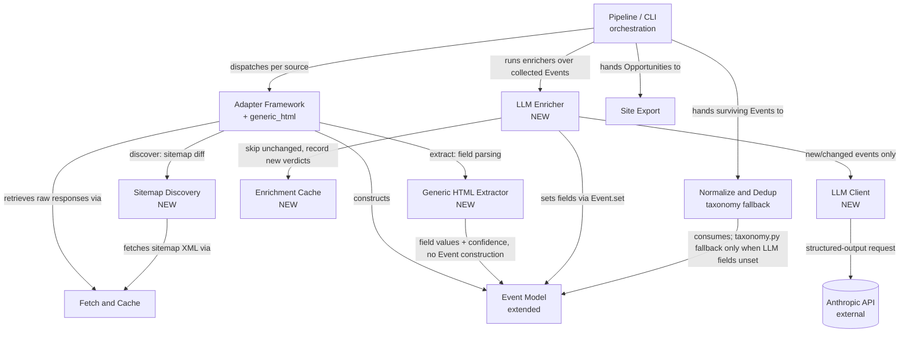
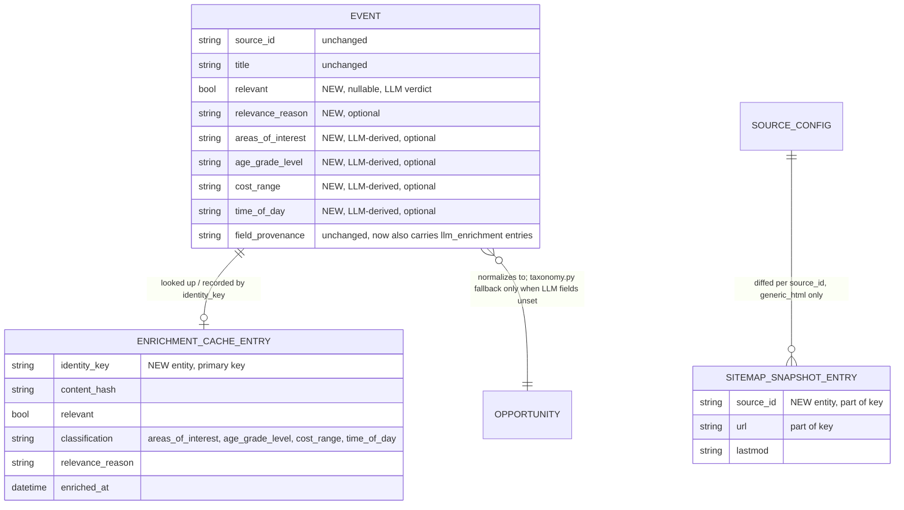

<!-- CLASI: Before changing code or making plans, review the SE process in CLAUDE.md -->

# Sprint 002: Discovery and enrichment

## Goals

Extend the aggregator engine's coverage from the six known structured-API
sources (sprint 001) to the long tail: sitemap-diff discovery plus a
generic HTML/JSON-LD extractor (issue 03) for the ~100 sites with no API,
and an LLM enrichment + relevance gate pass (issue 04) that recovers
dates/fields the deterministic extractors miss, applies controlled-vocab
classification, and decides "is this a STEM learning opportunity for
youth?" Issue 04 is the keystone of this roadmap: it is what makes every
later noisy source (04's own long tail, and sprint 005's discovery hubs)
safe to ingest without flooding the site.

**Dependencies**: builds directly on sprint 001's Adapter Framework
(`discover()` seam) and Pipeline `Enricher` hook, both stubbed but unused
until now. Enrichment uses `ANTHROPIC_API_KEY` (already configured in
`.env`); per sprint 001's testing policy, enrichment tests must be
mockable/offline — no live API calls in the test suite. 03 and 04 are
sequenced together in one sprint because 04 is explicitly designed to
clean up 03's low-confidence, undated output.

## Problem

Sprint 001 built a real, tested aggregator engine but limited it to the six
sites with structured APIs (TEC REST, WordPress REST, iCal) — about 6 of 144
known San Diego STEM orgs. The other ~100+ sites (dev/SCRAPER_GUIDELINES.md's
Tier 2 sitemap-capable sites) have no API, so nothing is published from them
today. Separately, even where content IS extracted, dates are frequently
unrecoverable by pattern matching alone (~57% real-date rate per
dev/SCRAPER_GUIDELINES.md), and there is no signal at all for whether a
scraped record is actually a STEM opportunity for youth versus adjacent noise
(adult programs, unrelated announcements) — a distinction that becomes
existential the moment noisy long-tail and future discovery sources
(sprint 005) are switched on.

## Solution

Flesh out the two seams sprint 001 built and shipped empty:
`Adapter.discover()` gets a real implementation for sitemap-diff sources, and
`pipeline.py`'s `Enricher` hook gets its first real implementation.
Concretely: (1) a `generic_html` adapter that discovers new/changed event
URLs via sitemap diffing and extracts canonical Events from arbitrary HTML
through a JSON-LD → `<time>` → OpenGraph → URL-date → body-regex priority
ladder; (2) an `LLMEnricher` that recovers missing fields, assigns
controlled-vocabulary classification, and renders a STEM-for-youth relevance
verdict over new/changed events only, via an injectable LLM client kept
offline-testable behind one thin real implementation.

## Success Criteria

- A `generic_html` `SourceConfig` can be pointed at any sitemap-bearing site
  and, run through the Pipeline against recorded fixtures, produces canonical
  Events with per-field confidence set by which extraction rung matched — no
  site-specific code required.
- Re-running sitemap discovery against an unchanged sitemap fixture enqueues
  zero URLs; a `<lastmod>`-bumped entry is the only one enqueued.
- A concrete `LLMEnricher` satisfies `pipeline.Enricher` with zero changes to
  `pipeline.py`'s hook signature, confirming sprint 001's seam was shaped
  correctly.
- Given fixture events with a mocked LLM response, the Enricher recovers a
  missing date, assigns `areas_of_interest`/`age_grade_level`/`cost_range`/
  `time_of_day`, and a fixture event verdicted not-relevant is excluded from
  the Enricher's returned list (and therefore from export).
- Re-running the Enricher over an unchanged event a second time makes zero
  LLM calls (verified via a call-counting fixture `LLMClient`).
- The full test suite runs with no network access and no `ANTHROPIC_API_KEY`
  use, per sprint 001's testing policy — including every new test this
  sprint adds.

## Scope

### In Scope

- Sitemap-diff discovery: fetch sitemaps, pattern-match event/program
  URLs, diff by `<lastmod>`, enqueue only changed pages (issue 03).
- Generic page extractor: JSON-LD Event → `<time datetime>` → OpenGraph →
  URL date pattern → body-text regex priority ladder (issue 03).
- LLM enrichment pass: date/field recovery, controlled-vocab
  classification, and the youth-STEM relevance gate, run only on
  new/changed records to control cost (issue 04).

### Out of Scope

Detailed module/ticket breakdown is deferred to this sprint's detail
planning pass. Flagship adapters (06), headless/JS fetch (10), automation
(07), observability (08), discovery-as-leads (09), companies/internships
(11), and League content/advertising (12) are later sprints.

## Test Strategy

Every module gets unit tests using recorded/synthesized fixtures — no live
HTTP, no live Anthropic API calls, ever, matching sprint 001's precedent. New
fixture types this sprint: recorded sitemap XML (index + child, with
`<lastmod>` variants for the diff tests), synthesized HTML pages per
extraction rung (a JSON-LD page, a bare `<time datetime>` page, an
OpenGraph-only page, a URL-date-only page, and a body-regex-only page, each
isolating one rung so the priority order is independently verifiable), and
canned LLM responses (valid structured JSON, a not-relevant verdict, a
malformed/error response) fed through a `FixtureLLMClient` test double that
never opens a socket — the same pattern `FixtureFetcher` already established
for `Fetcher` in sprint 001. The `LLMEnricher`'s cache-skip behavior is
tested by asserting call counts on the fixture `LLMClient` across two
`enrich()` calls with identical vs. changed event content. One end-to-end
test extends sprint 001's fixture-registry pattern with a `generic_html`
source and the `LLMEnricher` wired in, asserting the final
`opportunities.json` reflects both the extraction and the relevance gate.
`pytest` remains the test gate; the existing "no network, no
`ANTHROPIC_API_KEY`" CI assertion from sprint 001 covers this sprint's
additions with no changes needed to how that assertion runs.

## Architecture

**Sizing: Substantial** — this sprint touches 3+ modules (a new Adapter
Framework member plus two new supporting packages for it, a new Pipeline
Enricher plus two new supporting packages for it, and edits to Event Model
and Normalize & Dedup), introduces new cross-module dependencies (an
Enricher that depends on a new outbound integration — the Anthropic API —
where none existed before), and changes the data model (Event gains
LLM-derived classification and relevance fields). The full 7-step
methodology applies, diagrams included.

### Responsibilities

Distinct responsibilities this sprint introduces or changes:

1. Resolve a source's sitemap into the set of event URLs that are new or
   changed since the last run (Sitemap Discovery) — fulfills
   `Adapter.discover()`'s deferred seam for the first time.
2. Extract canonical Event fields from one arbitrary HTML page via a fixed
   priority ladder of extraction strategies (Generic HTML Extractor).
3. Compose the two responsibilities above into a working `Adapter`
   (`generic_html` Adapter), registered in the existing dispatch table with
   no change to `adapters/base.py`.
4. Call an LLM to recover fields, classify, and render a relevance verdict
   for one Event, behind one thin, mockable interface (LLM Client).
5. Track which Events have already been enriched at their current content,
   so unchanged events skip a fresh LLM call (Enrichment Cache).
6. Orchestrate cache-aware LLM calls over the collected Event stream,
   apply results to Events, and gate not-relevant Events out (LLM
   Enricher) — fulfills `pipeline.Enricher`'s deferred seam for the first
   time.
7. Prefer LLM-derived classification over keyword-rule classification when
   both are available, demoting `taxonomy.py` to a fallback (Normalize &
   Dedup, changed).

### Modules

| Module | Purpose (one sentence) | Boundary | Use cases served |
|---|---|---|---|
| **Sitemap Discovery** (`partner_scrape/discovery/sitemap.py`) | Resolves a source's sitemap into the set of new-or-changed event URLs since the last run. | Inside: fetching `sitemap_index.xml`/`sitemap.xml` via the injected `Fetcher`, event/program sitemap-name and URL-path pattern matching, a per-source `<lastmod>` snapshot read/written under `SCRAPE_CACHE_DIR`. Outside: fetching the event pages themselves (the adapter's `fetch()`), interpreting page content. | SUC-009 |
| **Generic HTML Extractor** (`partner_scrape/extract/ladder.py`) | Extracts canonical Event field values from one arbitrary HTML page via a fixed extraction-strategy priority ladder. | Inside: JSON-LD `Event` schema parsing, `<time datetime>` reading, OpenGraph meta reading, URL/slug date-pattern matching, body-text date regex, and the site-specific patterns from `dev/` (BiblioCommons, Drupal, title-embedded date) folded in as additional ladder strategies rather than bespoke scripts. Outside: which URLs to fetch (Sitemap Discovery's job), constructing the final `Event` object (the adapter's job — this module returns field values + confidence, not an `Event`). | SUC-010 |
| **`generic_html` Adapter** (`partner_scrape/adapters/generic_html.py`) | Implements the `Adapter` protocol for arbitrary sitemap-discoverable sites by composing Sitemap Discovery and the Generic HTML Extractor. | Inside: `discover()`/`fetch()`/`extract()` glue, `Event` construction from the Extractor's field+confidence output, registration in `ADAPTERS["generic_html"]`. Outside: the discovery and extraction logic themselves (delegated). | SUC-009, SUC-010 |
| **LLM Client** (`partner_scrape/enrich/llm_client.py`) | Defines the injectable interface to one LLM enrichment call. | Inside: the `LLMClient` protocol and its one real implementation, `AnthropicLLMClient` (thin wrapper over the `anthropic` SDK — paired in one module the same way `fetch/fetcher.py` already pairs the `Fetcher` protocol with `UrllibFetcher`), structured-output request/response shape, the enrichment request/response schema. `AnthropicLLMClient` constructs `anthropic.Anthropic()` with no explicit key argument, letting the SDK resolve credentials itself (see Design Rationale — this is *not* a new `os.environ` read inside `partner_scrape`). Outside: deciding *which* Events need a call or *what to do* with the result (the Enricher's job) — this module is a single stateless call-and-parse boundary, the "one thin, mockable place" the sprint brief requires. | SUC-011 |
| **Enrichment Cache** (`partner_scrape/enrich/cache.py`) | Tracks which Events have already been enriched at their current content, so unchanged events skip a fresh LLM call. | Inside: a persisted `identity_key -> (content_hash, last verdict/classification)` map under `SCRAPE_CACHE_DIR`, content-hash computation over an Event's enrichable fields. Outside: calling the LLM, deciding relevance (both the Enricher's job). | SUC-011 |
| **LLM Enricher** (`partner_scrape/enrich/enricher.py`) | Implements `pipeline.Enricher` as a cache-aware LLM classification pass over the collected Event stream (relevance is one classification dimension among the ones this pass produces, so gating not-relevant Events out is part of that one pass, not a second responsibility). | Inside: cache-aware dispatch to the LLM Client, applying results to `Event` via `Event.set(...)`, the fail-open fallback path, filtering not-relevant Events out of the returned list. Outside: the LLM call mechanics (LLM Client's job), the cache's storage format (Enrichment Cache's job), keyword-based classification (Normalize's job, invoked only in this module's absence or failure, not its presence), call concurrency/rate limiting (deferred — see Open Questions). | SUC-011, SUC-012 |
| **Event Model** (`partner_scrape/model.py`, extended) | Unchanged purpose from sprint 001 (the canonical Event record); this sprint adds fields for LLM-derived classification and relevance, populated the same way every other field is — via `Event.set(...)`. | Inside (new this sprint): `relevant`, `areas_of_interest`, `age_grade_level`, `cost_range`, `time_of_day`, `relevance_reason` fields. Boundary otherwise unchanged from sprint 001. | SUC-011, SUC-012 |
| **Normalize & Dedup** (`partner_scrape/normalize/run.py`, `taxonomy.py`; extended) | Unchanged purpose from sprint 001; this sprint changes exactly one thing — `_to_opportunity` now prefers an Event's own LLM-set classification fields when present, falling back to `taxonomy.py`'s keyword rules only when they are absent. | Boundary unchanged from sprint 001 (see that sprint's Architecture) except this one conditional. | SUC-012 |

### Component & Dependency Diagram

3+ modules are touched and a new cross-module dependency (LLM Enricher →
Anthropic API) is introduced, so a diagram is required. Only new/changed
components and the existing components they directly touch are shown;
sprint 001's own diagram (in its closed sprint.md) remains the reference
for everything else (Registry, partner join, Site Export internals).

Dependency direction check: Sitemap Discovery, Generic HTML Extractor,
Enrichment Cache, and LLM Client are all infrastructure/leaf modules —
depended on, depending on nothing in this package except Fetch and Cache
and Event Model (both themselves leaves or domain vocabulary, per sprint
001). LLM Client's one outward edge is to the external Anthropic API, which
is exactly the "Infrastructure is a plugin" shape the dependency-direction
principle calls for. LLM Enricher and the `generic_html` Adapter are
business logic, composing the infrastructure modules above them and
depending downward only. Pipeline/CLI remains the sole orchestration layer
at the top, with fan-out of 4 (Adapter Framework, LLM Enricher, Normalize &
Dedup, Site Export) — unchanged in kind from sprint 001's own
already-justified fan-out of 4, now with one more sequencing step
(enrichment) rather than one more piece of contained logic. No cycles.

### Data Model (ERD)

The data model changes: `Event` (sprint 001's canonical record) gains
fields for LLM-derived classification and relevance, and two new persisted
entities are introduced — an `EnrichmentCacheEntry` (Enrichment Cache's
storage) and a `SitemapSnapshotEntry` (Sitemap Discovery's storage). Both
are internal bookkeeping, not part of the site export contract. Fields
unchanged from sprint 001's `Event`/`Opportunity`/`SourceConfig` ERD are
omitted below for brevity — see that sprint's closed architecture for the
full shape.

### What Changed

- New `partner_scrape/discovery/` package (Sitemap Discovery).
- New `partner_scrape/extract/` package (Generic HTML Extractor).
- New `partner_scrape/adapters/generic_html.py`, registered as
  `ADAPTERS["generic_html"]` via the existing one-line extension point in
  `adapters/__init__.py` — no change to `adapters/base.py`.
- New `partner_scrape/enrich/` package: `llm_client.py` (`LLMClient`
  protocol + `AnthropicLLMClient`), `cache.py` (Enrichment Cache),
  `enricher.py` (`LLMEnricher`, the first real `pipeline.Enricher`
  implementation) — no change to `pipeline.py`'s `Enricher` protocol or
  `run()` signature.
- `partner_scrape/model.py` gains six new `Event` fields (additive; every
  existing adapter and test is unaffected).
- `partner_scrape/normalize/run.py`'s `_to_opportunity` gains one
  conditional: prefer `Event`'s own classification fields when
  `field_provenance` shows they were set, else call `taxonomy.py` as
  before. `taxonomy.py` itself is unchanged.
- `partner_scrape/cli.py` gains enrichment wiring (instantiates
  `LLMEnricher(AnthropicLLMClient())` by default) and a `--no-enrich` flag
  for enrichment-free local/dry runs.
- New runtime dependency: `anthropic` (the official SDK) for the LLM
  Client. `pyproject.toml` gains it.
- Two new subdirectories under `SCRAPE_CACHE_DIR` (sitemap snapshots,
  enrichment cache), both starting empty.

### Why

Sprint 001 deliberately paid for two unimplemented seams —
`Adapter.discover()`'s general shape and Pipeline's `Enricher` hook — so
that filling them in would be additive, not a rework. This sprint is the
test of that bet: `adapters/base.py` and `pipeline.py`'s `Enricher`
protocol require zero changes to accommodate either new capability, which
is itself evidence the seams were shaped correctly. Sitemap-diff discovery
and the generic extractor are sequenced with LLM enrichment in one sprint,
per sprint.md's own stated dependency, because 03's output is exactly what
04 exists to clean up: partial dates, no classification, no relevance
signal. Splitting them across sprints would mean 03 ships with visibly
degraded output for a full sprint cycle for no benefit — the two were
scoped together from the roadmap stage precisely because they're one
coherent capability (turn arbitrary HTML into safe-to-publish
opportunities), not two.

### Impact on Existing Components

- `pipeline.py`: no changes. The `Enricher` protocol and the `enrichers`
  parameter on `run()` are used exactly as sprint 001 shaped them.
- `adapters/base.py`: no changes. `discover()`/`fetch()`/`extract()` and
  the `ADAPTERS` dispatch table work unchanged for the new adapter type.
- `adapters/__init__.py`: one new line (`ADAPTERS["generic_html"] =
  GenericHtmlAdapter`), matching the existing extension pattern used for
  `tec_rest`/`wp_rest`/`ical`.
- `model.py`: additive fields only. `TecRestAdapter`, `WordPressRestAdapter`,
  `ICalAdapter`, and every sprint 001 test are unaffected.
- `normalize/run.py`: one new conditional in `_to_opportunity`;
  `normalize/taxonomy.py`, `collapse.py`, `dedup.py`, `partners.py` are
  unchanged.
- `cli.py`: new default behavior (enrichment on by default) plus one new
  flag; every existing flag and the `--dry-run`/`--limit`/`--source`
  behaviors are unchanged.
- `registry/schema.py`: no change. `SourceConfig.acquisition_policy`'s
  existing `discovered_via` field was considered as a lever to scope the
  relevance gate by source trust and deliberately not used this sprint —
  see Design Rationale.
- `config.py`: no change, and — worth stating explicitly, since it is
  otherwise the kind of thing a reviewer has to go verify — no violation
  of its documented boundary ("the single place in `partner_scrape` that
  reads `os.environ`... no other module should call `os.environ`
  directly"). `enrich/llm_client.py` never reads `ANTHROPIC_API_KEY`
  itself; it constructs `anthropic.Anthropic()` with no key argument and
  lets the SDK resolve credentials through its own chain (env var, OAuth
  profile, etc.). That resolution happens inside the `anthropic` package,
  not inside `partner_scrape`, so `config.py` gains no new accessor and
  its boundary is unchanged.
- `pyproject.toml`: gains `anthropic`. `scrapy`/`w3lib`/`lxml` dispositions
  are unchanged from sprint 001 (`lxml` is now actually used by the new
  package, via the Generic HTML Extractor, where sprint 001 declared it
  but only the legacy `dev/` scripts used it).

### Design Rationale

**Decision: LLM-derived classification/relevance fields live on `Event`
via the existing `Event.set(...)` provenance mechanism, not a separate
side-car "Classification" type.**
- Context: sprint 001's Design Rationale already chose a flat `Event`
  dataclass + `field_provenance` side-car specifically so future fields
  could be added without a new wrapper type ("adapters must remember to
  set provenance alongside each value... mitigated by the builder
  helper").
- Alternatives considered: (a) a separate `Classification` dataclass
  attached to `Event`; (b) new flat fields on `Event`, set via the
  existing `.set()` helper.
- Why this choice: (b) — this is precisely the extension sprint 001's
  Design Rationale anticipated and paid for. A new wrapper type would
  duplicate the provenance/confidence tracking `Event` already has and
  would need its own equality/merge rules inside `collapse.py`/`dedup.py`,
  which currently only know about `Event`.
- Consequences: `normalize/run.py` can check "did the LLM set this field"
  the same way it would check any other field's provenance — no new
  inspection API needed.

**Decision: Sitemap Discovery and the Generic HTML Extractor are separate
modules from the `generic_html` Adapter itself, not folded into one file.**
- Context: sprint 001's three adapters (`tec.py`, `wordpress.py`,
  `ical.py`) are each self-contained, single-file modules — their
  `discover()` is a trivial API-call probe with no separate logic worth
  splitting out.
- Alternatives considered: (a) one `adapters/generic_html.py` file
  containing sitemap diffing, the extraction ladder, and the `Adapter`
  glue; (b) split sitemap diffing and extraction into their own packages,
  composed by a thin adapter.
- Why this choice: (b) — unlike the sprint 001 adapters, sitemap diffing
  and HTML field extraction are each non-trivial (multiple strategies,
  independent test surfaces) and change for different reasons: a new
  sitemap naming convention doesn't touch extraction logic, and a new
  extraction strategy doesn't touch sitemap parsing. Cohesion test: each
  module's purpose is one sentence with no "and" (Sitemap Discovery:
  "resolves new/changed URLs"; Extractor: "extracts field values from one
  page") — a combined file would fail that test.
- Consequences: two more packages than the sprint 001 adapter convention,
  justified by genuine internal complexity on both sides; the adapter
  module itself stays thin (glue only), matching `adapters/base.py`'s own
  framing of adapters as "a pluggable, per-source-type strategy."

**Decision: the Enrichment Cache is a new module, not reuse of Fetch &
Cache's on-disk cache.**
- Context: issue 04 requires enriching only new/changed records to control
  cost; Fetch & Cache already has an on-disk, conditional-GET cache keyed
  by URL.
- Alternatives considered: (a) key enrichment skip-logic off Fetch &
  Cache's existing cache (e.g., "URL wasn't refetched this run"); (b) a
  dedicated cache keyed by `Event.identity_key()` and a content hash of
  the Event's own enrichable fields.
- Why this choice: (b) — Fetch & Cache's cache answers "did this URL's raw
  bytes change," a question about one specific source (and only sources
  fetched via HTTP through it — TEC/WordPress/iCal Events never round-trip
  through a per-page URL fetch the same way). Enrichment needs "did this
  *Event's* content change," which is a question about the canonical
  record regardless of which adapter produced it — a TEC API field edit
  should trigger re-enrichment even though no "page" was fetched. Reusing
  Fetch & Cache's URL-keyed cache would either miss that case or leak
  Adapter-layer identity concepts into a module whose sprint 001 boundary
  is explicitly "never interprets [fetched content]."
- Consequences: one more small persisted store under `SCRAPE_CACHE_DIR`,
  with its own (simple) format; no changes needed to Fetch & Cache.

**Decision: the relevance gate applies uniformly to every source's Events,
not scoped by `SourceConfig.acquisition_policy.discovered_via`.**
- Context: `acquisition_policy.discovered_via` already exists (sprint
  001, default `"manual"`) and could plausibly mean "an operator vetted
  this org, so skip gating its events." Sprint 005's "discovery hubs" are
  expected to set it to something like `"auto"`.
- Alternatives considered: (a) skip the relevance gate for
  `discovered_via="manual"` sources, apply it only to auto-discovered
  ones; (b) apply the gate uniformly regardless of `discovered_via`.
- Why this choice: (b) — vetting an *organization* as a legitimate STEM
  partner does not vet every *event* that organization ever publishes; a
  manually-registered library source (a real near-term candidate) will
  legitimately emit both STEM programming and unrelated adult programming
  from the same feed. Scoping by source trust would let exactly the kind
  of noise issue 04 exists to catch through the door for any manually
  registered source. Relevance is a per-event question, not a per-source
  one.
- Consequences: a legitimate partner's genuinely-STEM event could in
  principle be misclassified as not-relevant by the LLM and dropped — a
  real, accepted risk, not eliminated by this design (see Open Questions).
  The fail-open error-handling decision below mitigates *systemic* LLM
  failure, not *per-event* misclassification, which is a different risk
  this sprint does not fully close.

**Decision: on any LLM/API failure, the Enricher fails open (keeps the
Event, uses `taxonomy.py`'s keyword fallback, marks `relevant=True`) rather
than failing closed (drops the Event) or aborting the run.**
- Context: the relevance gate exists to keep noise out, but its failure
  mode matters — a systemic LLM outage should not silently empty the site.
- Alternatives considered: (a) fail closed (drop any Event the LLM
  couldn't classify); (b) fail the whole Pipeline run; (c) fail open
  (keep the Event, degrade to keyword classification, default to
  relevant).
- Why this choice: (c) — this sprint's aggregator engine has no
  observability yet (sprint 008, out of scope) to surface a silent
  systemic failure, so failing closed would risk quietly emptying the
  site's opportunity list with no operator signal beyond a log line. (b)
  is strictly worse than sprint 001's already-established per-source
  isolation philosophy (SUC-008: one bad source shouldn't kill the run;
  one bad *enrichment* call shouldn't either). (c) matches the pre-issue-04
  status quo for any Event the Enricher can't classify — not a regression,
  a degraded-but-functioning fallback.
- Consequences: a systemic LLM outage silently disables the relevance gate
  (site behaves as if issue 04 didn't ship) rather than emptying the site
  — the tradeoff is explicit and logged, not silent to an operator reading
  logs, even though there's no dashboard yet to surface it automatically.

**Decision: `normalize/taxonomy.py`'s keyword rules are demoted to a
fallback, not retired.**
- Context: issue 04 explicitly asks this sprint to "decide and document"
  whether taxonomy.py is retired or demoted.
- Alternatives considered: (a) delete `taxonomy.py`, require LLM
  classification for every Opportunity; (b) keep it, used only when an
  Event lacks LLM-set classification fields.
- Why this choice: (b) — `taxonomy.py` is cheap, deterministic, and
  already tested; it is exactly what the fail-open path above (and a
  `--no-enrich` local/dry run) needs to fall back to. Deleting it would
  mean any enrichment gap — a failed call, a disabled Enricher, a future
  Event source that opts out — produces Opportunities with empty
  classification instead of an approximate keyword tag, which is a worse
  outcome for the site than an imperfect tag.
- Consequences: `normalize/run.py`'s `_to_opportunity` needs one small
  conditional (prefer LLM fields, else call `taxonomy.py`), not a rewrite;
  `taxonomy.py` itself needs no code changes this sprint.

**Decision: the LLM Client defaults to `claude-opus-4-8`, not the Haiku
tier `dev/SCRAPER_GUIDELINES.md`'s original cost estimate assumed.**
- Context: `dev/SCRAPER_GUIDELINES.md` §5 estimated "$2-5 for the full
  corpus at Haiku pricing" for a similar LLM date-recovery pass; current
  Anthropic guidance is to default to the top-tier model unless a
  stakeholder explicitly chooses otherwise.
- Alternatives considered: (a) default to `claude-opus-4-8`; (b) default
  to a cheaper tier (e.g. Haiku) to match the original cost estimate.
- Why this choice: (a) for the architecture default, but this is flagged
  as an Open Question below rather than settled unilaterally — model
  choice at this volume (thousands of records) is a real cost tradeoff
  the stakeholder should make deliberately, not one sprint-planning should
  decide by default alone.
- Consequences: ticket 004 (LLM Client) should measure actual per-call
  cost against a representative fixture sample before the first real
  production run, and the model ID should be a named constant, not
  scattered inline, so a later downgrade is a one-line change.

### Migration Concerns

None that involve moving existing data. `SCRAPE_CACHE_DIR` gains two new,
initially-empty subdirectories (sitemap snapshots, enrichment cache) —
first-run behavior is "every event URL is new" / "every event needs
enrichment," consistent with sprint 001's cache precedent for a fresh
cache directory. One sequencing note worth flagging explicitly: the first
production run with the Enricher on incurs one real LLM call per collected
event across *every* source (TEC/WordPress/iCal included, not only
`generic_html`), since the Enrichment Cache starts cold — this is a
one-time cost the stakeholder should expect from day one of this sprint's
work going live, not a bug to investigate.

### Open Questions

1. **LLM model choice and cost at scale.** This architecture defaults the
   LLM Client to `claude-opus-4-8` per current guidance, but
   `dev/SCRAPER_GUIDELINES.md`'s original estimate assumed Haiku-tier
   pricing for a similar pass over thousands of records. Proposal: ship
   with `claude-opus-4-8` as the default but make the model ID a single
   named constant, and have ticket 004 report actual measured cost per
   call against representative fixtures before the first real production
   run, so the stakeholder can make an informed downgrade decision with
   real numbers rather than a guess. Confirm this sequencing is
   acceptable.
2. **Registry seeding for the long tail is out of this sprint's scope.**
   This sprint delivers the `generic_html` *capability* (discovery +
   extraction + enrichment working end-to-end against fixtures); it does
   not bulk-register the ~100 real sitemap-bearing sites into the Source
   Registry as `SourceConfig` entries — that is an operational follow-up,
   not a code change, and can happen incrementally without another
   sprint. Confirm this matches the stakeholder's expectation of what
   "ships" this sprint (a working `generic_html` adapter type others can
   register sources against) versus what doesn't (the ~100 sites actually
   registered and live on the site).
3. **Uniform relevance gating is a real, accepted risk, not a solved
   problem.** As documented in Design Rationale, a legitimate partner
   event could in principle be misclassified as not-relevant and silently
   excluded from export, with no observability (sprint 008, out of scope)
   to surface it. Confirm the stakeholder accepts this risk for this
   sprint, understanding that the mitigation (dashboards/alerting on gate
   activity) is deliberately deferred.
4. **Enrichment Cache has no eviction or pruning strategy this sprint** —
   it only grows, one entry per distinct `identity_key` ever seen.
   Proposal: acceptable for now given the corpus size this sprint targets
   (hundreds to low thousands of records, not millions); revisit if/when
   volume or disk usage becomes a real operational concern. Confirm.
5. **Enrichment defaults to on in the CLI, escapable via `--no-enrich`.**
   This means every real (non-`--no-enrich`) `partner-scrape` invocation —
   including ad hoc manual runs during development, not just scheduled
   production runs — incurs real Anthropic API cost and requires
   `ANTHROPIC_API_KEY`. Proposal: default-on matches issue 04's framing of
   enrichment as normal production behavior, not an opt-in extra; the
   escape hatch exists for exactly the cases (local dev on a stale
   registry, CI-adjacent manual smoke tests) where cost/network access is
   undesirable. Confirm this default is what's wanted versus flipping it
   (default off, `--enrich` to opt in).
6. **LLM call concurrency/latency at scale is unaddressed by this
   architecture.** The design as written calls the LLM Client once per
   new/changed Event, sequentially, with no batching or parallelism
   specified — fine for the fixture-scale tests this sprint requires, but
   a full run across even the six sprint 001 sources plus a handful of
   `generic_html` sources could mean tens to low hundreds of sequential
   round trips, each with real network latency. Proposal: ticket 005
   (LLM Enricher) should measure wall-clock time against a representative
   fixture batch and note it in the ticket's results; if it's a real
   problem, a later ticket (or a fast-follow, not necessarily this
   sprint) can parallelize calls behind the same `LLMClient` interface
   with no change to the Enricher's contract. Confirm sequential-for-now
   is acceptable rather than a blocking requirement for this sprint.

## Use Cases

### SUC-009: Discover new/changed pages via sitemap diff
Parent: UC-002

- **Actor**: Engine
- **Preconditions**: A `SourceConfig` with `adapter_type = "generic_html"`;
  the source exposes `sitemap_index.xml` or `sitemap.xml`.
- **Main Flow**:
  1. The `generic_html` adapter's `discover()` fetches the source's sitemap
     via Fetch & Cache.
  2. Sitemap Discovery identifies event/program-related child sitemaps and
     URL-path patterns.
  3. Extracted `(url, lastmod)` pairs are diffed against the prior snapshot
     for this `source_id`.
  4. Only new or `<lastmod>`-changed URLs are enqueued as `EventRef`s; the
     snapshot is updated to the current state.
- **Postconditions**: Only genuinely new/changed event pages are fetched
  and extracted this run.
- **Error Flows**: No prior snapshot exists → every discovered event URL is
  treated as new (first-run behavior, matching sprint 001's cache
  precedent). Malformed/unreachable sitemap → log and yield zero
  `EventRef`s for this source, not an exception that kills the run
  (per-source isolation, unchanged from sprint 001).
- **Acceptance Criteria**:
  - [ ] Given a fixture sitemap with all-unchanged `<lastmod>` values
        against a stored snapshot, `discover()` yields zero `EventRef`s.
  - [ ] Given a fixture sitemap with one bumped `<lastmod>`, `discover()`
        yields exactly that one `EventRef`.
  - [ ] A first-run source (no snapshot on disk) yields every
        event-pattern-matching URL.
  - [ ] A malformed sitemap fixture yields zero `EventRef`s and a logged
        warning, not an exception.

### SUC-010: Extract a canonical Event from an arbitrary HTML page
Parent: UC-003

- **Actor**: Engine
- **Preconditions**: A raw HTML response for a discovered event URL.
- **Main Flow**:
  1. The Generic HTML Extractor tries JSON-LD `Event` schema first; if it
     yields a title and date, those fields are used at the highest
     confidence.
  2. Any field JSON-LD didn't supply falls through to `<time datetime>`,
     then OpenGraph meta, then URL/slug date patterns, then body-text date
     regex — each successive rung only fills fields still missing, at a
     lower confidence than the rung above it.
  3. The `generic_html` adapter constructs a canonical `Event`, setting
     each field via `Event.set(...)` with the confidence of whichever rung
     supplied it.
- **Postconditions**: A canonical Event exists, with `kind="event"`,
  whatever fields the ladder could recover, and per-field confidence
  reflecting extraction certainty (never uniform across a
  partially-recovered record).
- **Error Flows**: No rung produces a usable title → the record is dropped
  (not a valid event), matching sprint 001's per-record isolation
  convention. No rung produces a date → the Event is still emitted,
  undated — this is exactly the gap issue 04's LLM enrichment (SUC-011)
  exists to close.
- **Acceptance Criteria**:
  - [ ] A JSON-LD fixture page yields a fully-dated Event at the highest
        confidence tier.
  - [ ] A page with only `<time datetime>` (no JSON-LD) yields a dated
        Event at a lower confidence tier than the JSON-LD case.
  - [ ] A page with only OpenGraph meta yields title/description but no
        date.
  - [ ] A page with a URL-embedded date and no other structured signal
        yields a dated Event from the URL pattern alone.
  - [ ] A page with none of the above but a body-text date string yields a
        dated Event at the lowest confidence tier.
  - [ ] A page with no usable title is dropped, not emitted as a blank
        Event.

### SUC-011: Recover fields and classify an Event via LLM enrichment
Parent: UC-004

- **Actor**: Engine
- **Preconditions**: A collected Event stream exists (from any adapter,
  not only `generic_html`); `ANTHROPIC_API_KEY` is configured for the real
  `AnthropicLLMClient`.
- **Main Flow**:
  1. Pipeline runs `LLMEnricher.enrich(events)` between adapter collection
     and Normalize.
  2. For each Event, the Enricher computes a content hash and checks the
     Enrichment Cache by the Event's `identity_key`.
  3. If the hash matches a cached entry, the cached classification/verdict
     is reapplied to the Event with no LLM call.
  4. If the hash is new or changed, the Enricher calls the LLM Client with
     the Event's available fields, requesting date/field recovery,
     `areas_of_interest`/`age_grade_level`/`cost_range`/`time_of_day`
     classification, and a relevance verdict; the result is written to
     both the Event (via `Event.set(...)`) and the cache.
- **Postconditions**: Every Event carries a relevance verdict and
  classification, either freshly computed or reused from cache; the cache
  reflects the latest content hash seen per identity key.
- **Error Flows**: LLM call fails (network, API, malformed response) →
  log, fall back to `taxonomy.py`'s keyword classification for that Event,
  mark it relevant (fail-open — see Design Rationale), and do not write a
  cache entry (so the next run retries the LLM rather than caching a
  degraded result).
- **Acceptance Criteria**:
  - [ ] Given a fixture Event with a missing date and a mocked LLM
        response supplying one, the returned Event has that date set with
        `source="llm_enrichment"`.
  - [ ] Given two `enrich()` calls with the same Event content, the
        fixture `LLMClient`'s call count increases by exactly one call
        total (the second call is a cache hit).
  - [ ] Given a fixture Event whose content changed since the last cached
        hash, `enrich()` calls the LLM again rather than reusing the stale
        cache entry.
  - [ ] Given a fixture `LLMClient` that raises, the Event survives in the
        returned list with keyword-derived classification and
        `relevant=True`, and a warning is logged.

### SUC-012: Gate irrelevant events out of the export via LLM relevance verdict
Parent: UC-004 (extends it to make the relevance decision explicit and
gating — the original UC-004 predates issue 04's framing of "decide what
belongs on the site" as a first-class output, not just a date-recovery
side effect)

- **Actor**: Engine
- **Preconditions**: An Event has been classified per SUC-011 with
  `relevant` set to `True` or `False`.
- **Main Flow**:
  1. `LLMEnricher.enrich(...)` excludes any Event with `relevant=False`
     from its returned list.
  2. Pipeline passes only the surviving Events to Normalize & Dedup,
     unchanged from sprint 001's flow.
- **Postconditions**: Opportunities exported to the site never include an
  Event the LLM verdicted as not a STEM learning opportunity for youth.
- **Error Flows**: Verdict genuinely ambiguous or the LLM declines to
  answer → treated as `relevant=True` (fail-open, matching SUC-011's error
  flow — the gate's job is to catch clearly-irrelevant noise, not to
  require proof of relevance).
- **Acceptance Criteria**:
  - [ ] Given a fixture Event with a mocked `relevant=False` LLM response,
        that Event is absent from `enrich()`'s returned list.
  - [ ] Given a mixed batch of relevant and not-relevant fixture Events,
        only the relevant ones reach the end-to-end test's final
        `opportunities.json`.
  - [ ] A source's other Events are unaffected by one Event being gated
        out (no whole-source failure).

## GitHub Issues

(GitHub issues linked to this sprint's tickets. Format: `owner/repo#N`.)

## Definition of Ready

Before tickets can be created, all of the following must be true:

- [x] Sprint planning document is complete (sprint.md, including its
      Architecture and Use Cases sections)
- [x] Architecture review passed (self-review, substantial tier — APPROVE
      after three fixes applied in place; see `architecture_review` gate
      notes)
- [x] Stakeholder has approved the sprint plan (recorded on the basis of
      the team-lead's explicit delegation for this multi-sprint run — see
      `stakeholder_approval` gate notes; six Open Questions in the
      Architecture section still want stakeholder confirmation before or
      during execution, most notably LLM model/cost choice (#1) and
      uniform relevance gating's accepted risk (#3))

## Tickets

| # | Title | Depends On |
|---|-------|------------|
| 001 | Sitemap-diff discovery | — |
| 002 | Generic HTML extraction ladder and the `generic_html` adapter | 001 |
| 003 | Event model classification fields and Normalize taxonomy fallback | — |
| 004 | Injectable LLM client (Anthropic) | 003 |
| 005 | Enrichment cache and `LLMEnricher` (relevance gate) | 003, 004 |
| 006 | Pipeline/CLI wiring and end-to-end discovery+enrichment test | 002, 005 |

Tickets execute serially in the order listed.
