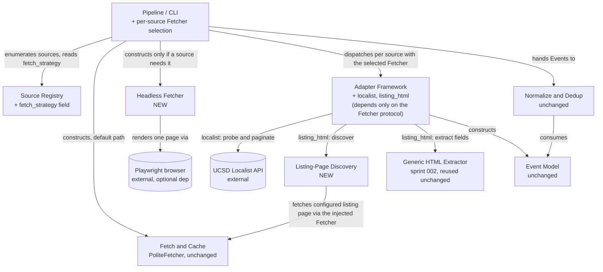

<!-- CLASI: Before changing code or making plans, review the SE process in CLAUDE.md -->

# Sprint 003: Flagship and JS-rendered sources

## Goals

Close the two most visible source gaps and add a fetch path for
client-rendered sites. Build the Fleet Science Center adapter and the
Birch Aquarium / UCSD Localist API adapter (issue 06) — a Fleet-hosted
directory with zero Fleet events is the first thing the Fleet will
notice, and Localist also unlocks other UCSD/campus sources. Add a
headless-browser fetch strategy (issue 10), selectable per source in the
registry, for the ~9 known Wix-style sites whose mirrored HTML is
effectively empty, feeding the same generic extractor from sprint 002.

**Dependencies**: Birch is a straightforward Localist structured adapter.
Fleet's approach is not yet known — it may resolve via the generic
extractor (sprint 002) alone, or may require the headless fetch path
built in this same sprint; investigate fleetscience.org's actual
publishing mechanism first. Headless/JS support depends on the Fetch
layer (sprint 001) and generic extractor (sprint 002); issue 10 itself
flags it as lower priority, to land after the structured and sitemap
tiers are in place. High priority overall for the stakeholder demo; can
run in parallel with sprint 004's automation work.

## Problem

Two flagship organizations — the Fleet Science Center itself (the site's
own host) and Birch Aquarium — currently yield zero events, which is the
single most visible failure mode the stakeholder demo can hit. Separately,
sprint 002's `generic_html` adapter assumes server-rendered HTML; it
cannot see anything on the ~9 known Wix sites (and any future
client-rendered source) because their mirrored HTML bodies are
effectively empty until JavaScript hydrates them, per
`dev/SCRAPER_GUIDELINES.md` §1/§4. Neither gap closes itself with the
tools sprints 001-002 built.

## Solution

Investigate each flagship source's actual publishing mechanism before
designing its adapter, rather than assuming one — this planning pass
confirmed both live:

- **Birch Aquarium** publishes through UCSD's Localist calendar API
  (`calendar.ucsd.edu/api/2/events`), filterable by `group_id` — clean,
  structured JSON in the same spirit as sprint 001's TEC adapter. A new
  `localist` adapter type follows TEC's proven single-file pattern.
- **Fleet Science Center** (`fleetscience.org`) is a server-rendered
  Drupal 9 site with no XML sitemap at any conventional path, so sprint
  002's sitemap-diff discovery cannot find its ~10 event/program pages —
  but the pages themselves are NOT client-rendered, so headless fetching
  is not needed. A new discovery strategy (crawl a configured listing
  page for outbound links, in place of sitemap diffing) plus a new
  `listing_html` adapter type reuse sprint 002's extraction ladder
  unchanged.
- **JS-rendered sites** (the ~9 Wix sites this sprint's headless
  capability targets) get a new `PlaywrightFetcher`, implementing the
  existing `Fetcher` protocol so it drops into `PoliteFetcher`/Pipeline
  with no adapter changes, selected per source via a new
  `acquisition_policy.fetch_strategy` registry field. Playwright is an
  optional dependency; the default (non-headless) install and test suite
  never import it.

## Success Criteria

- A `localist` `SourceConfig` for Birch Aquarium (group_id
  `49845193640602`), run through the Pipeline, produces canonical Events
  with title/date/location/cost/registration-url and no duplicate Events
  for a recurring occurrence the API returns as repeated daily rows.
- A `listing_html` `SourceConfig` for Fleet Science Center (site_url
  `https://www.fleetscience.org`, listing page `/events`), run through
  the Pipeline, produces canonical Events for its ~10 published
  event/program pages via the unchanged extraction ladder.
- Both flagship sources' Events survive Normalize/Dedup/Export and appear
  in a fixture-driven end-to-end run's `opportunities.json`-shaped
  output.
- A `PlaywrightFetcher` satisfies the `Fetcher` protocol with zero
  changes to `fetch/fetcher.py`'s protocol or `PoliteFetcher`'s
  constructor signature, and is selectable per source via
  `acquisition_policy.fetch_strategy` with no change to the `Adapter`
  protocol or dispatch table.
- The full test suite runs with no network access, no real browser
  launch, and no `ANTHROPIC_API_KEY`/`playwright` requirement by default
  — matching sprints 001-002's testing policy exactly.

## Scope

### In Scope

- `localist` adapter type + Birch Aquarium's real `SourceConfig` (issue
  06).
- Listing-page discovery (new discovery strategy for no-sitemap sites) +
  `listing_html` adapter type + Fleet Science Center's real
  `SourceConfig` (issue 06).
- `PlaywrightFetcher` (headless `Fetcher` implementation), selectable per
  source via a new `acquisition_policy.fetch_strategy` registry field,
  wired into Pipeline's per-source fetch selection (issue 10).
- Verify both flagship sources appear in exported opportunities.

### Out of Scope

- Bulk-registering the ~9 known Wix sites against the new headless
  capability. This sprint delivers and proves the capability (fixture
  tests + the module-level design below); registering the real Wix
  `SourceConfig`s is operational follow-up, matching sprint 002's own
  precedent for the long-tail `generic_html` sites (see that sprint's
  Open Question 2). See this sprint's Open Questions.
- Incremental (changed-only) diffing for listing-page discovery. Unlike
  sitemap diffing, a listing page carries no `<lastmod>` signal; this
  sprint's discovery re-crawls every configured listing page in full on
  every run. Acceptable at Fleet's ~10-page scale; flagged as an Open
  Question for a future larger no-sitemap source.
- Automation (07), observability (08), discovery-as-leads (09),
  companies/internships (11), and League content/advertising (12) remain
  later sprints.

## Test Strategy

Every module gets unit tests using recorded/synthesized fixtures — no
live HTTP, no live Anthropic API calls, no real browser launch, matching
sprints 001-002's precedent exactly. New fixture types this sprint: a
recorded UCSD Localist API JSON page (including one event's `id`
repeated across multiple daily-occurrence rows, to exercise the
required id-based dedup-within-page step), a synthesized Fleet-style
listing page (several `<a href="/events/...">` links, no sitemap
available) and a synthesized Fleet-style detail page (no JSON-LD, no
`<time>` tag — matching what live investigation found, so the existing
extraction ladder's title/OpenGraph/body-regex rungs are what's actually
exercised, not JSON-LD), and a fixture `Page`/browser double for
`PlaywrightFetcher` that returns canned rendered HTML with no real
`playwright` import or browser process involved. `PlaywrightFetcher`'s
constructor defers its `import playwright` to the (untested-by-default)
real-browser path only; the injected fixture double never triggers it,
so `playwright` need not even be installed for the default suite to
import or exercise this module. If a real-browser smoke test is added,
it is marked skip-by-default behind an environment variable (e.g.
`RUN_BROWSER_SMOKE_TEST`), matching this sprint's explicit constraint.
One end-to-end test extends sprints 001-002's fixture-registry pattern
with `localist` and `listing_html` sources (plus one source flagged
`fetch_strategy = "headless"` using the fixture Page double) wired
through Pipeline, asserting the final `opportunities.json`-shaped output
includes both flagship organizations' Events. `pytest` remains the test
gate; the existing "no network, no `ANTHROPIC_API_KEY`" CI assertion
extends to "no real browser" with no changes needed to how that
assertion runs.

## Architecture

**Sizing: Substantial** — this sprint touches 3+ modules (a new Adapter
Framework member for Localist, a new Adapter Framework member plus a new
supporting Discovery module for Fleet, a new Fetch & Cache member for
headless rendering, plus Registry schema and Pipeline changes),
introduces a new cross-module/external dependency (Pipeline → Playwright,
where none existed before), and changes the data model (`SourceConfig`'s
`acquisition_policy` gains a `fetch_strategy` key). The full 7-step
methodology applies, diagrams included.

This section is grounded in live investigation performed during this
planning pass (both flagship sites and the UCSD Localist API were probed
directly — see field values cited throughout), not assumption. That
investigation is itself the resolution to issue 06's explicit open
question ("Fleet's approach is not yet known") and issue 10's ask to
"investigate cheaper server-render triggers first": Fleet turned out not
to need a server-render trigger investigation at all, because it was
never client-rendered to begin with.

### Responsibilities

Distinct responsibilities this sprint introduces or changes:

1. Convert UCSD Localist calendar events, filtered to one group, into
   canonical Events via a structured JSON API (Localist Adapter) —
   extends the same "structured API, trivial discovery" pattern sprint
   001 established for TEC, now serving Birch Aquarium and, per issue
   06's framing, any future UCSD/campus source for free (a new
   `SourceConfig`, zero new code).
2. Resolve a source's configured listing page(s) into event/program URLs
   by crawling and pattern-matching anchor links, for sites with no
   sitemap (Listing-Page Discovery) — a second discovery strategy
   alongside sprint 002's sitemap-diff discovery, not a replacement for
   it.
3. Compose Listing-Page Discovery with sprint 002's existing extraction
   ladder into a working `Adapter` (`listing_html` Adapter), registered
   in the existing dispatch table with no change to `adapters/base.py` —
   serves Fleet Science Center this sprint.
4. Retrieve one URL's fully client-rendered HTML via a real headless
   browser, behind the existing `Fetcher` protocol (Headless Fetcher) —
   fulfills issue 10's capability, validated this sprint against
   fixtures rather than a live Wix site (see Scope).
5. Select, per source, whether to fetch statically or via the Headless
   Fetcher, and construct the (expensive) headless Fetcher only when at
   least one active source actually needs it (Pipeline + Registry
   schema, changed) — the one piece of new cross-cutting wiring this
   sprint adds.

### Modules

| Module | Purpose (one sentence) | Boundary | Use cases served |
|---|---|---|---|
| **Localist Adapter** (`partner_scrape/adapters/localist.py`) | Converts UCSD Localist calendar events, filtered to one group, into canonical Events. | Inside: Localist API URL construction (`group_id`, `days`, `pp`, `page`), field mapping (`title`, `description_text`, `first_date`/`last_date`, `location_name`, `ticket_cost`, `ticket_url`/`url`→`registration_url`, `tags`/`keywords`), and deduplication by the API's own `id` within one fetched page — required because Localist's `/api/2/events` returns one row per matching *day* for a recurring event, not one row per event (confirmed live: a single Birch "Shark Summer" event with `id=52950294007943` appeared as 9 separate rows across a 180-day window, all sharing that `id`). Outside: HTTP mechanics (Fetch & Cache), cross-source dedup (Normalize & Dedup — this module's dedup is purely "don't emit the same Localist `id` twice within one page," a narrower concern). | SUC-013 |
| **Listing-Page Discovery** (`partner_scrape/discovery/listing.py`) | Resolves a source's configured listing page(s) into event/program URLs by crawling and pattern-matching anchor links. | Inside: fetching each `source.config["listing_urls"]` entry via the injected `Fetcher`, extracting `<a href>` targets matching a URL-path pattern (configurable per source; defaults to the same event-path convention `discovery/sitemap.py`'s `EVENT_PATH_RE` already uses), returning one `EventRef` per matched link. No `<lastmod>`-equivalent diffing — every matched link is always returned (see Design Rationale). Outside: sitemap parsing (unrelated — `discovery/sitemap.py` is unchanged and untouched by this module), interpreting page content (the adapter's/extraction ladder's job). | SUC-014 |
| **`listing_html` Adapter** (`partner_scrape/adapters/listing_html.py`) | Implements the `Adapter` protocol for sites with a known listing page but no sitemap, by composing Listing-Page Discovery with sprint 002's existing extraction ladder. | Inside: `discover()`/`fetch()`/`extract()` glue, structurally parallel to `generic_html`'s (same `fetch()`, same `extract.ladder.extract_fields` call, same `Event` construction) but delegating `discover()` to Listing-Page Discovery instead of Sitemap Discovery. Registered as `ADAPTERS["listing_html"]`. Outside: the discovery and extraction logic themselves (both delegated, matching sprint 002's Design Rationale for why the adapter stays thin glue). | SUC-014 |
| **Headless Fetcher** (`partner_scrape/fetch/headless.py`) | Retrieves one URL's fully client-rendered HTML via a real headless browser, behind the existing `Fetcher` protocol. | Inside: `PlaywrightFetcher`, implementing `Fetcher.get(url, headers=None) -> FetchResponse` — browser/page lifecycle, navigation + a wait strategy (network-idle with a bounded timeout) before reading rendered content, populating `FetchResponse.status` from the real navigation response (not a hardcoded 200, so `PoliteFetcher`'s caching/error-handling behaves identically for static and headless fetches). An injectable `page_factory` (defaulting to a lazily-imported real Playwright browser, only constructed on first real use) lets tests substitute a fixture double with zero `playwright` import. Outside: robots.txt/rate-limiting/caching (unchanged — `PoliteFetcher` wraps `PlaywrightFetcher` exactly as it wraps `UrllibFetcher` today, via the same `fetcher=` constructor parameter), deciding *which* sources use it (Pipeline's job). | SUC-015 |
| **Source Registry** (`partner_scrape/registry/schema.py`, extended) | Unchanged purpose from sprint 001; `acquisition_policy` gains one more defaulted key. | Inside (new this sprint): `acquisition_policy["fetch_strategy"]`, defaulted to `"static"` in `_ACQUISITION_POLICY_DEFAULTS`, alongside the existing `rate_limit_seconds`/`respect_robots`/`discovered_via` keys it already lives beside. Boundary otherwise unchanged from sprint 001. | SUC-016 |
| **Pipeline/CLI** (`partner_scrape/pipeline.py`, extended) | Unchanged purpose from sprint 001 (sequencing, per-source error isolation); this sprint adds one more sequencing decision — which `Fetcher` instance a given source's adapter call receives. | Inside (new this sprint): reading `source.acquisition_policy.get("fetch_strategy", "static")` per source in the existing enumeration loop and passing either the existing default `Fetcher` or a lazily-constructed `PlaywrightFetcher`-wrapped `PoliteFetcher` to `adapters.run(source, fetcher)`. The headless fetcher is constructed at most once per run, only if at least one active source needs it — never eagerly. A source flagged `headless` when `playwright` isn't installed fails that one source's `adapters.run(...)` call, caught by the *existing* per-source try/except (SUC-008's error flow) with no new error-handling code required. Outside: everything else, unchanged from sprints 001-002. | SUC-016 |
| **`generic_html` Adapter, Sitemap Discovery, Generic HTML Extractor, Event Model, Normalize & Dedup, Site Export** (all sprint 001/002 modules) | Unchanged. Sprint 002's extraction ladder is reused by `listing_html` verbatim; Normalize & Dedup's existing recurring-instance collapse (SUC-006) is a second line of defense if the Localist Adapter's id-dedup step were ever imperfect; the existing LLM Enricher (SUC-011) is what recovers Fleet's frequently-missing dates, since Fleet's detail pages carry no JSON-LD or `<time>` markup (confirmed live) — no new enrichment logic is needed for either flagship source. | — | (existing) |

### Component & Dependency Diagram

3+ modules are touched and a new external dependency (Headless Fetcher →
Playwright) is introduced, so a diagram is required. Only new/changed
components and the existing components they directly touch are shown;
sprints 001-002's own diagrams remain the reference for everything else.

Dependency direction check: Localist Adapter, Listing-Page Discovery, and
Headless Fetcher are all infrastructure/leaf modules — depended on,
depending on nothing in this package beyond Fetch & Cache, Config,
`registry.schema`, and `adapters.base`'s plain `EventRef`/`RawResponse`
shapes (matching Sitemap Discovery's existing dependency shape). Critically,
Adapter Framework (and Listing-Page Discovery) depend only on the
*abstract* `Fetcher` protocol, never on `HEADLESS` or `FETCH` concretely —
Pipeline is the only module that imports and constructs
`PlaywrightFetcher`, and it does so conditionally. This is what makes
"drops into `PoliteFetcher`/pipeline unchanged" true at the dependency
level, not just the interface level: no adapter or discovery module's
import graph changes based on whether headless fetching is used anywhere
in a run. Pipeline/CLI remains the sole orchestration layer at the top,
fan-out of 4 (Registry, Adapter Framework, Normalize & Dedup, Site
Export — Headless Fetcher is a conditional fifth *construction*, not a
sequencing fan-out target) — unchanged in kind from sprints 001-002's own
already-justified fan-out. No cycles.

### Data Model

The data model changes minimally: `SourceConfig.acquisition_policy`
(already a plain, intentionally under-typed dict per sprint 001's Design
Rationale) gains one more defaulted key, `fetch_strategy: "static" |
"headless"`. No new entity is introduced and no existing entity's shape
otherwise changes — sprint 001's `SourceConfig`/`Event`/`Opportunity` ERD
and sprint 002's `EnrichmentCacheEntry`/`SitemapSnapshotEntry` additions
remain the complete, accurate reference. A dedicated ERD diagram for one
new dict key would not clarify anything beyond this paragraph, so none is
included (matching sprint 020's precedent for a reasoned diagram
omission).

### What Changed

- New `partner_scrape/adapters/localist.py` (`localist` adapter type),
  registered in `adapters/__init__.py`.
- New `partner_scrape/discovery/listing.py` (Listing-Page Discovery,
  no-diffing).
- New `partner_scrape/adapters/listing_html.py` (`listing_html` adapter
  type), registered in `adapters/__init__.py`.
- New `partner_scrape/fetch/headless.py` (`PlaywrightFetcher`), exported
  from `fetch/__init__.py`.
- New real `SourceConfig` TOML files: `birch-aquarium.toml`
  (`adapter_type = "localist"`, `config.group_id = "49845193640602"`,
  `config.api_base = "https://calendar.ucsd.edu/api/2/events"`) and
  `fleet-science-center.toml` (`adapter_type = "listing_html"`,
  `config.site_url = "https://www.fleetscience.org"`,
  `config.listing_urls = ["/events"]`) — both endpoint/ID values
  confirmed live during this planning pass, not placeholders.
- `partner_scrape/registry/schema.py`: `_ACQUISITION_POLICY_DEFAULTS`
  gains `"fetch_strategy": "static"`.
- `partner_scrape/pipeline.py`: the source-enumeration loop gains
  per-source `Fetcher` selection (lazy `PlaywrightFetcher` construction).
  `Enricher`/`Adapter` protocols and `run()`'s public signature are
  unchanged.
- `pyproject.toml` gains an optional dependency group,
  `[project.optional-dependencies] headless = ["playwright>=1.40"]` — NOT
  a base dependency, per this sprint's explicit constraint. Base install
  and default test suite never require it.
- Zero changes to `adapters/base.py`, `extract/ladder.py`,
  `discovery/sitemap.py`, `model.py`, `normalize/`, or `export/`.

### Why

Both flagship gaps and the JS-rendered gap looked, from the roadmap-level
issue text alone, like they might all converge on "we need a headless
browser." Live investigation (this planning pass) shows that isn't true
for either flagship source: Birch is a clean structured API (no fetch
change needed at all, just a new adapter matching TEC's proven shape),
and Fleet is ordinary server-rendered HTML blocked only by the *absence*
of a sitemap, not by client-side rendering. Building the headless
capability as a route only Pipeline selects — never something an adapter
or discovery module knows about — means the real JS-rendered work (the
~9 Wix sites) can land independently of, and without disturbing, either
flagship adapter. This also directly answers issue 10's own instruction
to "investigate cheaper server-render triggers first": the investigation
here found Fleet needs no trigger at all, because it isn't client-
rendered to begin with — there was nothing to trigger.

### Impact on Existing Components

- `adapters/base.py`: no changes. `discover()`/`fetch()`/`extract()` and
  `ADAPTERS` work unchanged for both new adapter types.
- `adapters/__init__.py`: two new lines (`ADAPTERS["localist"] =
  LocalistAdapter`, `ADAPTERS["listing_html"] = ListingHtmlAdapter`),
  matching the existing extension pattern.
- `discovery/sitemap.py`: untouched. Listing-Page Discovery is a sibling
  module, not a modification of this one.
- `extract/ladder.py`: untouched, reused verbatim by `listing_html`.
  Fleet's detail pages have no JSON-LD and no `<time>` tags (confirmed
  live), so in practice the OpenGraph/title-fallback/body-regex rungs are
  what fire for Fleet — the ladder's priority order already handles this
  gracefully; no new rung is needed.
- `fetch/fetcher.py`, `fetch/cache.py`, `fetch/robots.py`,
  `fetch/throttle.py`: no changes. `PoliteFetcher` already accepts any
  `Fetcher` via its `fetcher=` constructor parameter (confirmed by
  reading its current implementation) — `PlaywrightFetcher` plugs into
  that existing seam with zero changes to any of these four files.
- `registry/schema.py`: one new defaulted key, additive; every existing
  source's TOML file (no `fetch_strategy` line) is unaffected and
  resolves to `"static"`, today's exact behavior.
- `pipeline.py`: the one real code change outside new modules — see
  Modules table above.
- `cli.py`: no changes needed. Headless selection is entirely
  registry-driven (per source), not a CLI flag; the existing
  `--source`/`--limit`/`--no-enrich` flags are unaffected.
- `pyproject.toml`: gains the `headless` optional-dependency group only.

### Design Rationale

**Decision: Fleet gets a new `listing_html` adapter type + Listing-Page
Discovery module, not the headless Fetcher.**
- Context: issue 06 flagged Fleet's acquisition path as unknown and
  explicitly named headless as one candidate ("or may require the
  headless fetch path"); this planning pass investigated
  `fleetscience.org` live rather than assuming.
- Evidence: `fleetscience.org` serves `X-Generator: Drupal 9` and returns
  full server-rendered HTML (71,662 bytes on `/events`, 95
  `views-row`-classed elements — a Drupal Views listing, not a JS shell)
  with zero JavaScript-hydration signal. `sitemap_index.xml`,
  `sitemap.xml`, and two other conventional sitemap paths all return 404.
  `robots.txt` disallows only `/core/` and `/profiles/`, not `/events`.
- Alternatives considered: (a) headless fetch for Fleet, since the site
  has no sitemap and sprint 002's `generic_html` therefore can't discover
  it; (b) a new discovery strategy (crawl a configured listing page) +
  new adapter type, no headless involved.
- Why this choice: (b) — the site is already fully server-rendered;
  headless would pay Playwright's real cost (browser startup, memory, a
  new heavy optional dependency) to solve a discovery problem, not a
  rendering problem. The actual blocker is "no sitemap," which a small,
  reusable listing-page-crawl discovery module solves directly and far
  more cheaply.
- Consequences: Fleet's ~10 event/program pages are re-crawled in full on
  every run (no incremental diffing — see the next decision below); this
  is cheap at Fleet's scale. Fleet's detail pages have no JSON-LD/`<time>`
  markup, so most of its events will rely on sprint 002's existing LLM
  enrichment (or arrive undated) rather than the ladder's top rungs — an
  accepted, pre-existing limitation of the extraction ladder, not a new
  one this sprint introduces.

**Decision: Listing-Page Discovery is a new module, not a fallback branch
inside `generic_html`'s existing `discover()`.**
- Context: `generic_html`'s own docstring frames its purpose as "sites
  discoverable [via sitemap]" — one sentence, no "and" (sprint 002's own
  cohesion test).
- Alternatives considered: (a) teach `generic_html.discover()` to fall
  back to a configured listing page when its sitemap fetch fails; (b) a
  new `listing_html` adapter type composing a new Listing-Page Discovery
  module with the same, unmodified extraction ladder.
- Why this choice: (b) — (a) would give `generic_html` two independent
  discovery strategies and a config-driven branch between them, failing
  the cohesion test sprint 002 explicitly established ("a combined file
  would fail that test," said of Sitemap Discovery vs. the Extractor;
  the same reasoning applies to Sitemap Discovery vs. Listing-Page
  Discovery inside one adapter). (b) matches this repo's own established
  convention: one adapter type, one discovery mechanism, sharing the
  extraction ladder — exactly how `generic_html` itself relates to
  Sitemap Discovery.
- Consequences: one more (small) adapter file and dispatch-table entry
  than folding the logic into `generic_html`; `generic_html` itself is
  completely untouched, so no regression risk to any of its existing
  tests or registered sites.

**Decision: Listing-Page Discovery does no incremental (changed-only)
diffing — every configured listing page is re-crawled in full, every
run.**
- Context: Sitemap Discovery's whole value proposition is "only fetch
  what changed," enabled by `<lastmod>`. A listing page carries no
  per-link modification timestamp.
- Alternatives considered: (a) hash each listing page's raw body and skip
  re-crawling on an unchanged hash (misses within-page changes to
  individual links' surrounding text, and still requires fetching the
  listing page itself every run to know if it's unchanged — the savings
  would only apply to the *linked* detail pages, not the discovery step);
  (b) no diffing at all — always return every matched link, treating each
  as if it's always new.
- Why this choice: (b) — at Fleet's confirmed scale (~10 links on one
  page, unaffected by a `?page=1` pagination probe, i.e. the listing page
  itself is small and static), the "wasted" re-fetch of 10 detail pages
  every run costs nothing meaningful and avoids inventing a diffing
  scheme with no `<lastmod>`-equivalent signal to anchor it to. Building
  (a) now for a problem that doesn't yet exist at this scale would be
  speculative generality.
- Consequences: `listing_html` sources always re-extract every discovered
  page on every run — fine for Fleet; would need revisiting if
  `listing_html` were later pointed at a no-sitemap site with hundreds of
  listing links (see Open Questions).

**Decision: Headless fetch strategy is selected by Pipeline via a new
`acquisition_policy.fetch_strategy` registry field, constructed lazily —
not a new Adapter concept, and not eager construction on every run.**
- Context: issue 10 requires headless to be "selectable per source in the
  registry" and "used sparingly (it's expensive)"; the existing `Adapter`
  protocol's methods all receive a `Fetcher` as an explicit argument
  (never store one on the adapter instance, per `adapters/base.py`'s own
  docstring), and `PoliteFetcher` already accepts any inner `Fetcher` via
  its constructor.
- Alternatives considered: (a) give `Adapter` implementations their own
  logic for choosing a Fetcher (e.g., a `uses_headless` class attribute
  each adapter type checks); (b) Pipeline reads
  `source.acquisition_policy["fetch_strategy"]` per source and passes the
  already-chosen `Fetcher` instance into the existing `adapters.run(source,
  fetcher)` call, unchanged; construct the headless-wrapping
  `PoliteFetcher` at most once, only if at least one active source needs
  it.
- Why this choice: (b) — fetch strategy is a property of *how to reach a
  URL*, which is exactly Fetch & Cache's and Pipeline's existing
  responsibility split (Pipeline already picks and constructs the single
  `Fetcher` every source gets today); (a) would leak a Fetch-layer
  concern into every `Adapter` implementation, including the three
  sprint-001 adapters and `generic_html`/`listing_html`, none of which
  should need to know headless fetching exists. Lazy construction
  directly satisfies "used sparingly" — a run with zero headless-flagged
  sources never imports or starts a browser.
- Consequences: `pipeline.py`'s source loop gains one small conditional;
  every `Adapter` implementation (existing and new) needs zero changes to
  support headless fetching, now or for any future adapter type.

**Decision: `PlaywrightFetcher` defers its real `import playwright` call
to first real (non-fixture) use, and is declared as an optional
dependency group, not a base dependency.**
- Context: explicit sprint constraint — Playwright is a heavy dependency
  requiring a browser binary; the default install and test suite must
  stay offline and browser-free.
- Alternatives considered: (a) import `playwright` at module top level,
  matching how `anthropic` is imported in `enrich/llm_client.py`; (b)
  defer the import into the code path that constructs a real (non-fixture)
  browser/page, injectable via a `page_factory` constructor parameter
  tests can override with a fixture double.
- Why this choice: (b) — `anthropic` (sprint 002) is a base dependency the
  stakeholder already accepted as always-installed; Playwright, per this
  sprint's explicit constraint, is not. A top-level import would make
  `partner_scrape.fetch` unimportable without `playwright` installed,
  breaking the base install. Deferred import + injectable factory matches
  this repo's own established DI pattern (`Fetcher` for
  `UrllibFetcher`/tests, `LLMClient` for `AnthropicLLMClient`/tests) —
  applied one level deeper here because the *dependency itself*, not just
  the network call, must be avoidable.
- Consequences: `PlaywrightFetcher`'s module-level code and its
  fixture-backed unit tests both work with zero `playwright` installed;
  only a source actually flagged `headless` in a real run needs the
  optional dependency group installed, and a helpful, actionable error
  (not a bare `ImportError`) should surface if it isn't — caught by the
  existing per-source error isolation either way.

### Migration Concerns

None that involve moving existing data. `_ACQUISITION_POLICY_DEFAULTS`
gaining `fetch_strategy` is purely additive — every existing registered
source (the six sprint-001 TEC/WordPress/iCal sources, any registered
`generic_html` sources) resolves to `"static"` with no TOML edit required,
identical to today's fetch behavior. The two new TOML files
(`birch-aquarium.toml`, `fleet-science-center.toml`) are new registry
entries, not migrations of existing ones — first-run behavior for both is
"every discovered event is new," consistent with sprint 001/002's cache
precedent. One sequencing note: the first production run with either new
adapter enabled will make real requests against `calendar.ucsd.edu` and
`fleetscience.org` under the existing polite-fetch defaults (1
request/second per domain, robots.txt respected — confirmed neither
site's robots.txt blocks the paths this sprint needs).

One risk worth naming explicitly (surfaced during self-review, not in
the original issue text): `PlaywrightFetcher` executes third-party
JavaScript inside a real browser process, which is a materially larger
attack surface than every existing `Fetcher` (all of which only ever
parse text/JSON, never execute remote code). This sprint's own scope
bounds the exposure — headless is only ever selected for sources an
operator has explicitly flagged `fetch_strategy = "headless"` in a
hand-authored registry TOML file (a small, curated set of already-vetted
partner domains), never for an arbitrary or user-supplied URL — but the
implementing ticket should still run the browser process with no
credentials or secrets in its environment/profile and, if the CI/runtime
environment supports it, in a sandboxed/containerized context, as a
baseline precaution rather than a bespoke security review this sprint.

### Open Questions

1. **Bulk Wix registration is out of this sprint's scope** (see Scope).
   This sprint delivers and proves the headless *capability*; it does not
   register the ~9 real Wix `SourceConfig`s. Confirm this matches the
   stakeholder's expectation of what "ships" this sprint (Birch + Fleet
   live, headless capability proven by fixtures) versus what doesn't (Wix
   sites actually live on the site) — mirrors sprint 002's Open Question
   2 pattern exactly.
2. **Listing-Page Discovery's no-diffing design is scale-appropriate for
   Fleet's ~10 pages today, not a general solution.** If `listing_html`
   is later pointed at a no-sitemap site with a much larger listing (tens
   to hundreds of pages), always-full-re-crawl would become a real cost.
   Proposal: accept this now, revisit with a content-hash-based diffing
   scheme only if/when a concrete larger source needs it. Confirm.
3. **Localist query window** (`days`/`pp` params): this architecture
   proposes `days=180, pp=50` as a generous default so Birch's
   current+upcoming events are reliably captured (Site Export's own
   current/upcoming filter does the real date-relevance trimming
   downstream, matching TEC's `start_date=now`-then-filter-downstream
   precedent). Confirm this window is acceptable rather than a smaller
   default.
4. **Headless wait strategy**: this architecture proposes a fixed
   network-idle timeout (e.g. 15s) as the default wait condition before
   reading rendered content, with no per-source tuning knob this sprint.
   If a specific site (once real Wix sources are registered, per Open
   Question 1) needs a different wait condition (a specific selector,
   a longer timeout), that becomes a follow-up `config` key, not a
   redesign. Confirm fixed-timeout-for-now is acceptable.
5. **Real production TOML registration this sprint** (`birch-aquarium.toml`,
   `fleet-science-center.toml`, with live values, not fixtures) is
   proposed and largely already required by this sprint's own Success
   Criteria ("Verify both flagship sources appear in exported
   opportunities"), matching sprint 001's precedent of seeding real
   sources rather than deferring registration. Confirm.

## Use Cases

### SUC-013: Ingest events from the UCSD Localist API, filtered to one group
Parent: UC-001

- **Actor**: Engine
- **Preconditions**: A `SourceConfig` with `adapter_type = "localist"` and
  `config.group_id` set (Birch Aquarium's is `49845193640602`, confirmed
  live).
- **Main Flow**:
  1. Pipeline dispatches the source to the `localist` adapter.
  2. `discover()` builds the paginated `/api/2/events?group_id=...`
     request (matching TEC's probe-then-paginate shape).
  3. `extract()` maps each raw event record's fields
     (`title`/`description_text`/`first_date`/`last_date`/
     `location_name`/`ticket_cost`/`url`/`tags`) into a canonical `Event`.
  4. `extract()` deduplicates by the API's own `id` within the fetched
     page before emitting Events — the API returns one row per matching
     *day* for a recurring event (confirmed live), not one row per event.
- **Postconditions**: A list of canonical Events exists for the source, no
  two sharing the same Localist `id`, each carrying `kind="event"`,
  provenance `"localist"`, and confidence matching TEC's 1.0 (a
  first-party structured feed).
- **Error Flows**: Endpoint unreachable or unexpected shape → log and
  skip the source, matching every other adapter's per-source isolation.
- **Acceptance Criteria**:
  - [ ] Given a recorded Localist API fixture containing the same event
        `id` repeated across multiple daily-occurrence rows, the adapter
        emits exactly one Event for that `id`.
  - [ ] Given a recorded Localist API fixture, the adapter emits Events
        with correct title/date-range/location/cost/registration-url and
        `provenance="localist"`, confidence `1.0`.
  - [ ] A malformed or empty fixture response yields zero Events and a
        logged warning, not an exception that kills the run.
  - [ ] The real `birch-aquarium.toml` `SourceConfig` (group_id
        `49845193640602`) is registered and loads successfully.

### SUC-014: Discover and extract events from a no-sitemap site via listing-page crawl
Parent: UC-002 (extends it: UC-002 anticipated sitemap diffing
specifically; this SUC covers the same underlying need — discover a
source's event pages without a full site crawl — for sites confirmed to
have no sitemap, via a different, simpler mechanism)

- **Actor**: Engine
- **Preconditions**: A `SourceConfig` with `adapter_type = "listing_html"`
  and `config.listing_urls` set (Fleet Science Center's is `["/events"]`,
  confirmed live — its site has no sitemap at any conventional path).
- **Main Flow**:
  1. Pipeline dispatches the source to the `listing_html` adapter.
  2. `discover()` delegates to Listing-Page Discovery, which fetches each
     configured listing URL and returns one `EventRef` per outbound link
     matching an event-path pattern.
  3. `fetch()`/`extract()` are identical to `generic_html`'s: retrieve
     each page, run it through sprint 002's unchanged extraction ladder,
     and construct a canonical Event from whatever fields the ladder
     recovered.
- **Postconditions**: A canonical Event exists for each of the source's
  discovered event/program pages, with per-field confidence set by
  whichever ladder rung matched — unchanged ladder behavior, a new
  discovery path feeding it.
- **Error Flows**: A listing page is unreachable → log and yield zero
  `EventRef`s for that page (per-page isolation, not fatal to other
  configured listing pages on the same source). A discovered page with no
  usable title in any ladder rung → dropped, matching sprint 002's
  existing per-record isolation.
- **Acceptance Criteria**:
  - [ ] Given a fixture listing page with several event-path-matching
        `<a href>` links, `discover()` yields one `EventRef` per matched
        link.
  - [ ] Given a fixture listing page with links that don't match the
        event-path pattern (e.g. a nav link to `/about`), those links are
        excluded.
  - [ ] A fixture detail page with no JSON-LD and no `<time>` tag
        (matching Fleet's confirmed real page shape) still yields an
        Event via a lower ladder rung (OpenGraph or title fallback), not
        a dropped record.
  - [ ] An unreachable listing page yields zero `EventRef`s and a logged
        warning, not an exception.
  - [ ] The real `fleet-science-center.toml` `SourceConfig` (site_url
        `https://www.fleetscience.org`, listing_urls `["/events"]`) is
        registered and loads successfully.

### SUC-015: Fetch a client-rendered page via a headless browser
Parent: UC-003 (extends it: UC-003 covers extracting from a mirrored HTML
page but predates any distinction between server- and client-rendered
sources; this SUC adds the fetch-layer capability that makes a
client-rendered page's HTML extractable by the same, unchanged UC-003
extractor)

- **Actor**: Engine
- **Preconditions**: A `SourceConfig` with
  `acquisition_policy.fetch_strategy = "headless"`.
- **Main Flow**:
  1. Pipeline, for a source flagged `headless`, constructs (lazily, at
     most once per run) a `PoliteFetcher` wrapping `PlaywrightFetcher` in
     place of the default `Fetcher`.
  2. `PlaywrightFetcher.get(url)` navigates a real (or, in tests, a
     fixture-double) browser page to `url`, waits for a network-idle
     condition (bounded timeout), and returns the rendered HTML as a
     `FetchResponse`, with `status` taken from the real navigation
     response.
  3. The adapter (any adapter type — this is Fetch-layer, not
     adapter-specific) receives this `FetchResponse` exactly as it would
     from a static fetch, and proceeds unchanged.
- **Postconditions**: A source flagged `headless` yields the same kind of
  `FetchResponse` a static source would, now containing rendered content
  a static fetch of the same URL would have missed.
- **Error Flows**: `playwright` not installed for a source flagged
  `headless` → that source's `adapters.run(...)` call raises, caught by
  Pipeline's existing per-source try/except (SUC-008's error flow) — no
  new error-handling code required, but the raised error should be
  actionable (name the missing optional dependency).
- **Acceptance Criteria**:
  - [ ] Given a fixture `Page` double returning canned rendered HTML,
        `PlaywrightFetcher.get(url)` returns a `FetchResponse` with that
        HTML as `body` and a real (non-hardcoded) `status`.
  - [ ] `PlaywrightFetcher` and its unit tests import and run with no
        `playwright` package installed (the fixture double never
        triggers the deferred real import).
  - [ ] `PlaywrightFetcher` satisfies the `Fetcher` protocol and, wrapped
        by `PoliteFetcher`, is exercised through the exact same
        robots.txt/rate-limit/cache code path as `UrllibFetcher` — with
        zero changes to `fetch/cache.py`, `fetch/robots.py`, or
        `fetch/throttle.py`.
  - [ ] If a real-browser smoke test exists, it is skipped by default and
        only runs behind an explicit environment variable.

### SUC-016: Select fetch strategy per source and verify flagship sources publish
Parent: UC-009 ("Fix the flagship-source gaps... Verify the host org's
own events now appear in the directory")

- **Actor**: Engine / Operator
- **Preconditions**: `birch-aquarium.toml` and `fleet-science-center.toml`
  are registered; a source may optionally set
  `acquisition_policy.fetch_strategy`.
- **Main Flow**:
  1. Pipeline enumerates active sources, and for each reads
     `acquisition_policy.get("fetch_strategy", "static")` to select that
     source's `Fetcher`.
  2. Pipeline dispatches each source to its adapter with the selected
     `Fetcher`, collects Events, and proceeds through the unchanged
     Normalize/Export chain.
  3. Operator inspects the exported `opportunities.json` and confirms
     both Fleet Science Center's and Birch Aquarium's events are present.
- **Postconditions**: Both flagship organizations contribute events on
  this and future runs; no existing source's fetch behavior changes
  (every pre-existing `SourceConfig` has no `fetch_strategy` key and
  resolves to `"static"`, today's exact behavior).
- **Error Flows**: One flagship source's adapter fails → logged, the
  other flagship source and all other sources still produce output
  (unchanged per-source isolation from sprint 001).
- **Acceptance Criteria**:
  - [ ] An end-to-end fixture-driven test runs Pipeline over a small
        registry including `localist` (Birch), `listing_html` (Fleet),
        and one `fetch_strategy = "headless"` fixture source, and asserts
        the final `opportunities.json`-shaped output includes events
        attributed to both Fleet Science Center and Birch Aquarium.
  - [ ] A pre-existing (sprint 001/002) fixture source with no
        `fetch_strategy` key produces byte-identical `Fetcher` selection
        behavior to before this sprint (i.e., the default `Fetcher` path
        is untouched).
  - [ ] The whole test suite (including every test this sprint adds)
        runs with no network access, no real browser, and no
        `ANTHROPIC_API_KEY`/`playwright` requirement.

## GitHub Issues

(GitHub issues linked to this sprint's tickets. Format: `owner/repo#N`.)

## Definition of Ready

Before tickets can be created, all of the following must be true:

- [x] Sprint planning document is complete (sprint.md, including its
      Architecture and Use Cases sections)
- [x] Architecture review passed (self-review, substantial tier —
      APPROVE after one fix applied in place; see `architecture_review`
      gate notes)
- [x] Stakeholder has approved the sprint plan (recorded on the basis of
      the team-lead's explicit delegation of full autonomy for this
      detail-planning pass — see `stakeholder_approval` gate notes;
      five Open Questions in the Architecture section still want
      stakeholder confirmation before or during execution, most notably
      whether bulk Wix registration is deferred (#1) and the real
      production TOML registration for both flagships this sprint (#5))

## Tickets

| # | Title | Depends On |
|---|-------|------------|
| 001 | Headless Fetcher: PlaywrightFetcher as an optional, injectable Fetcher | — |
| 002 | Localist adapter and Birch Aquarium registry entry | — |
| 003 | Listing-page discovery for no-sitemap sites | — |
| 004 | listing_html adapter and Fleet Science Center registry entry | 003 |
| 005 | Per-source fetch strategy wiring and end-to-end flagship verification | 001, 002, 004 |

Tickets execute serially in the order listed. Tickets 001, 002, and 003
have no interdependency and could, if the execution model allows it, run
in parallel worktrees before ticket 004 (depends on 003) and ticket 005
(the integration ticket, depends on 001, 002, and 004) converge.
