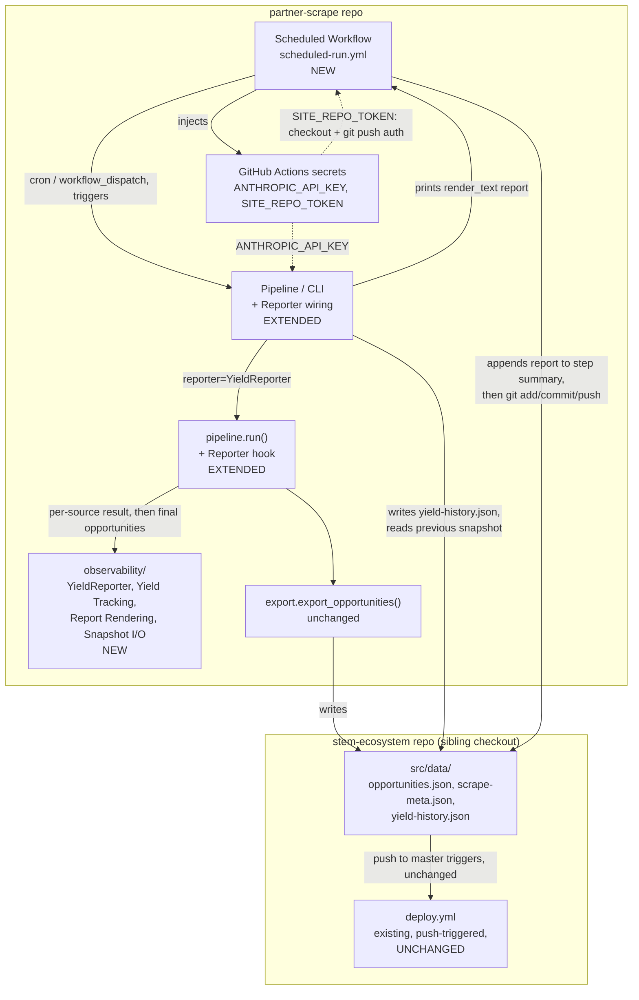

<!-- CLASI: Before changing code or making plans, review the SE process in CLAUDE.md -->

# Sprint 004: Automation and observability

## Goals

Make the engine run unattended, which is the core of the whole pitch. An
orchestrator runs adapters on a per-source cadence (frequent API pulls,
weekly sitemap diffs, monthly full mirror for API-less sites) with
failure isolation, so one broken source never empties the site or aborts
the run. The full scheduled loop — scrape → enrich → normalize → export →
site rebuild → deploy — runs with a visible "last updated" stamp and
automatic pruning of past events (issue 07), and a decision on the
automation home (GitHub Actions in this repo vs. the League's Docker
host, and how cross-repo publish is authenticated). Per-source yield
observability (issue 08) reports counts found/dated/new/dropped with
deltas per run, and flags zero-yield/cliff sources — cheap insurance
against the exact silent-breakage failure that let Fleet and Birch sit at
zero events unnoticed.

**Dependencies**: depends on Site Export (sprint 001) and needs sprints
002 and 003 actually producing data for the loop to be meaningful. Issue
08 explicitly depends on 07's orchestrator/run loop existing first to
report against, so within this sprint 07 is the foundation and 08 builds
on it. This sprint enables the "run clean unattended for a week or two,
then re-engage Fleet" plan.

## Problem

Every stage of the engine — scrape, enrich, normalize, export — already
runs correctly (sprints 001-003), but only when a human runs
`partner-scrape` by hand and then separately pushes the resulting
`opportunities.json`/`scrape-meta.json` into the `stem-ecosystem` site
repo. Nothing runs on a schedule, nothing commits or deploys
automatically, and nothing watches whether a given run actually produced
the yield it should have. That last gap is not hypothetical: Fleet
Science Center and Birch Aquarium both sat at zero events for an extended
period before anyone noticed (sprint 003's own motivation), precisely
because no per-source yield signal existed. Shipping the automation
without the observability would reintroduce the same failure mode, just
unattended instead of manual.

## Solution

Two additive pieces, sequenced so the second can hook into facts the
first already produces:

1. **Self-updating scheduled loop** (issue 07) — a GitHub Actions
   workflow in this repo, on a weekly cron plus manual
   `workflow_dispatch`, that checks out both repos, runs the existing
   `partner-scrape` CLI end-to-end (scrape → enrich → normalize →
   export), commits the changed site-data files into the `stem-ecosystem`
   checkout, and pushes to its `master` branch. `stem-ecosystem`'s
   existing, unmodified `deploy.yml` is already push-triggered on
   `master`, so pushing is the entire "trigger a rebuild" step — no new
   deploy logic is needed in either repo. Cross-repo push auth is a
   fine-grained PAT provisioned through the same `dotconfig`
   encrypted-secrets mechanism already used for `ANTHROPIC_API_KEY`.
2. **Source-yield observability** (issue 08) — a new `Reporter` hook on
   `pipeline.run()` (structurally identical to the existing `Enricher`
   seam) that lets a new `observability` package record each source's
   raw yield and the final normalized opportunities' source attribution,
   compute deltas against a snapshot of the previous run, flag
   zero-yield/cliff sources, and render a human-readable report the
   operator sees in the GitHub Actions job's step summary after every
   scheduled run.

Both pieces are purely additive to the existing pipeline: no adapter,
extractor, normalize, or export code changes: only new optional hook
points and new modules.

## Success Criteria

- A scheduled GitHub Actions run, triggered on cron with no human
  interaction, produces a fresh `opportunities.json`/`scrape-meta.json`
  committed to `stem-ecosystem`'s `master` and observably triggers its
  existing `deploy.yml`.
- The site's already-existing "last updated" stamp (`Footer.astro`
  reading `scrape-meta.json`) reflects the most recent scheduled run
  without any site-repo code change.
- Past events are absent from every scheduled run's output (already true
  via `export`'s current/upcoming filter — confirmed, not rebuilt).
- Every scheduled run prints a per-source yield report (found / dated /
  new / dropped, deltas vs. the previous run) that an operator can read
  directly in the job's step summary.
- A source that was previously productive and returns zero events on a
  run is flagged in that run's report as a zero-yield alert, without the
  operator having to compare runs by hand.
- No secret value (API key or cross-repo token) is ever committed to
  either repo; both are provisioned via `dotconfig`'s existing encrypted
  `secrets.env` → GitHub Actions secrets path.

## Scope

### In Scope

- Orchestrator running adapters on per-source cadence with failure
  isolation (issue 07).
- Scheduled loop: scrape → enrich → normalize → export → site rebuild →
  deploy, with a "last updated" stamp and past-event pruning (issue 07).
- Decision on automation home and cross-repo publish authentication
  (issue 07).
- Per-run, per-source yield report with deltas vs. previous run, plus
  zero-yield/cliff alerts (issue 08).

### Out of Scope

Detailed module/ticket breakdown is deferred to this sprint's detail
planning pass. Discovery-as-leads (09), companies/internships (11), and
League content/advertising (12) are later sprints.

## Test Strategy

All new Python (the `Reporter` protocol/hook, the `observability`
package's yield tracking, alert thresholds, and text rendering, and the
CLI's snapshot load/save wiring) gets offline, hermetic unit and
e2e-style tests, following this codebase's existing conventions: fixture
`Fetcher`/spy doubles, no real sockets, `tmp_path` for all file I/O,
explicit `today`/timestamps for determinism (see
`tests/test_pipeline_e2e.py`'s pattern). The `Reporter` hook is exercised
the same way `Enricher` already is — a real `pipeline.run()` call over
the existing `e2e_registry` fixtures, with a spy `Reporter` double
asserting call order and data, and a concrete `YieldReporter` asserting
end-to-end report content (including a run that reproduces a zero-yield
transition by construction: two `run()` calls over the same fixture
registry, the second with a source's fixture responses swapped to
empty). The GitHub Actions workflow YAML itself is not unit-tested — it
is config, not code — but must be YAML-valid, documented, and is a
dry-run-only deliverable this sprint: no ticket in this sprint actually
triggers a real scheduled run, pushes a real secret, or pushes a real
commit to `stem-ecosystem`. Activation is an explicit post-sprint
operator step.

## Architecture

**Substantial** — this sprint introduces a new external integration
(GitHub Actions cron driving a cross-repo git push, authenticated via a
new PAT) and a new cross-module dependency (`pipeline.run()` gains a
second hook, `Reporter`, alongside the existing `Enricher` seam, consumed
by a new `observability` package and wired by `cli.py`). That is 3+
touched modules (`pipeline.py`, `cli.py`, plus the new `observability`
package) with a new dependency edge and a new deployment surface, so the
full methodology applies, diagrams included.

### Responsibilities

Distinct responsibilities this sprint introduces or changes:

1. Let `pipeline.run()` report per-source raw yield (found count, or the
   error it isolated) and, after normalization, the final
   `Opportunity` list with its existing `.sources` attribution, to an
   injected observer — without `pipeline.py` itself computing anything
   about deltas, alerts, or formatting (`Reporter` protocol + hook
   calls, `pipeline.py` extended).
2. Track a source's yield across runs, compute found/dated/new/dropped
   counts and deltas against a persisted previous-run snapshot, and
   decide when a source counts as zero-yield or a cliff (new
   `observability` package).
3. Render the computed report as plain text an operator reads directly
   (new `observability` package, same responsibility group as #2 — see
   Modules).
4. Wire a default `YieldReporter` into every CLI run, load/save its
   snapshot at a stable path under the site repo, and print the
   rendered report after the run completes (`cli.py`, extended).
5. Run the full pipeline unattended, on a schedule, and publish its
   output across the repo boundary by committing and pushing into
   `stem-ecosystem` so its existing push-triggered deploy fires (new
   GitHub Actions workflow — pure CI configuration, no new Python).
6. Authenticate that cross-repo push, and the existing
   `ANTHROPIC_API_KEY` LLM-enrichment call, from GitHub Actions without
   ever committing a secret value to either repo (secrets provisioning,
   config-only — reuses `dotconfig`'s existing encrypted-secrets → GitHub
   Actions path, adds one new secret name).

Responsibilities 1-4 are issue 08's (they change independently of the
workflow — they're plain Python, testable with zero GitHub Actions
involved). Responsibilities 5-6 are issue 07's (they change independently
of the report's internals — the workflow only needs the CLI to print
*something* after it runs; it does not need to know the report's
structure). This is the same "07 is the foundation, 08 builds on the run
loop that already exists" split sprint.md's Goals describes, refined now
that the run loop turns out to need zero new code (`pipeline.run()`'s
Registry → Adapters → Enrich → Normalize → Export sequence is already
sprint 001-003's finished work) — 07's actual new work this sprint is the
schedule and the cross-repo publish, not the loop itself.

### Modules

| Module | Purpose (one sentence) | Boundary | Use cases served |
|---|---|---|---|
| **`Reporter` protocol + hook** (`partner_scrape/pipeline.py`, extended) | Lets `pipeline.run()` hand each source's raw `Event`s, and the final normalized opportunities, to an optional injected observer. | Inside: a `Reporter` `Protocol` (structurally parallel to the existing `Enricher`) with two methods — one called once per source in the existing enumeration loop, passing the source's own raw `list[Event]` on success (empty list + the isolated exception on failure, called in both branches of the existing try/except so a fetch failure and a genuine zero-event week are both reported, not conflated), one called once after `normalize_run()` with the full `Opportunity` list (still carrying `.sources`, before `export_opportunities()` strips it). `run()` gains one new optional keyword parameter, `reporter: Reporter \| None = None`, defaulting to a no-op so every existing caller/test is unaffected. Passing the raw domain objects (not a pre-computed count) is deliberate: deriving `found`/`dated` from a source's `Event` list is Yield Tracking's job, not `pipeline.py`'s — the same boundary that keeps `.sources` attribution out of `pipeline.py` too. Outside: computing counts, deltas, alerts, or rendering — `pipeline.py` only hands over facts it already has at the two points it already visits them, exactly the same "must not become a god component" boundary its own docstring holds `Enricher` to. | SUC-017, SUC-018 |
| **Yield Tracking** (`partner_scrape/observability/yield_report.py`, new) | Turns one run's raw per-source `Event`s and final `Opportunity` list, plus the previous run's persisted snapshot, into per-source found/dated/new/dropped counts, deltas, and zero-yield/cliff alert flags. | Inside: `SourceYield` (one source's this-run counts + delta + alert state), `YieldReport` (the full run's `SourceYield`s + generated timestamp), pure comparison/threshold logic (zero-yield: previous found > 0 and this run's found == 0; cliff: a configurable proportional drop, e.g. >50%, with previous found > 0). `found` = `len(events)` and `dated` = count with `event.start is not None`, both derived per source from the raw `Event` list `record_source` received — a source that finds records but fails to parse most of their dates is a different, and differently actionable, signal than one that finds nothing, and only the raw `Event` list (not a bare count) makes that distinction visible. `new`/`dropped` are computed from the final `Opportunity` list's `.sources` field (the post-dedup, post-enrichment, site-visible units), matched by slug against the previous snapshot's per-source slug sets. No I/O, no pipeline knowledge — pure data-in, data-out, which is what makes it hermetically testable. Outside: how a report is displayed (Report Rendering), how the previous run's data is loaded from disk (Snapshot I/O), calling any of this (the `YieldReporter` glue below). | SUC-018 |
| **Report Rendering** (`partner_scrape/observability/render.py`, new) | Formats a `YieldReport` as plain, human-readable text. | Inside: one function, `render_text(report) -> str` — a per-source line (found, delta, dated/new/dropped, alert marker) plus a summary line naming any zero-yield/cliff sources up front, so an operator scanning a GitHub Actions job log sees the alert without reading every line. Outside: computing the report's data (Yield Tracking) or where the text goes (`cli.py` prints it; the workflow captures stdout into the job's step summary). | SUC-018 |
| **Snapshot I/O** (`partner_scrape/observability/snapshot.py`, new) | Loads the previous run's per-source yield snapshot from disk, and saves the current run's, as a small JSON file. | Inside: `load_snapshot(path) -> dict` (empty dict, not an error, when the file is absent — the expected shape of "first run ever"), `save_snapshot(path, report)`. Plain-path parameters, no `Config`/env-var coupling, so tests use `tmp_path` directly. Outside: deciding *which* path (`cli.py`'s job, mirroring how it already resolves `site_dir`/`partners_path`), the snapshot's schema semantics (Yield Tracking owns the shape it reads/writes). | SUC-018 |
| **`YieldReporter`** (`partner_scrape/observability/reporter.py`, new) | Implements the `Reporter` protocol, accumulating one run's per-source facts for Yield Tracking to turn into a report. | Inside: the concrete class `pipeline.run(reporter=...)` receives — collects each `record_source(...)` call and the one `record_opportunities(...)` call into the shape Yield Tracking's comparison logic consumes, then exposes a `.report(previous_snapshot) -> YieldReport` method the CLI calls once `run()` returns. It satisfies `pipeline.Reporter` structurally (duck typing), with no import of `pipeline.py` at all — the exact same zero-import-coupling shape `enrich.enricher.LLMEnricher` already uses to satisfy `pipeline.Enricher` (verified: `LLMEnricher` imports neither `pipeline` nor `Enricher`). Outside: rendering, snapshot file I/O, CLI wiring. | SUC-017, SUC-018 |
| **CLI wiring** (`partner_scrape/cli.py`, extended) | Unchanged purpose (thin argparse wrapper over `pipeline.run()`); this sprint adds constructing the default `YieldReporter`, resolving the snapshot path, and printing the rendered report. | Inside (new this sprint): a `--yield-history` flag (default `{site_dir}/src/data/yield-history.json`, mirroring how `--site-dir` already resolves against `Config.get_site_dir()`), loading that path's snapshot before calling `run()`, passing `reporter=YieldReporter(...)` into `run()`, and after it returns, calling `.report()`, printing `render_text(...)` to stdout, and saving the new snapshot. A `--no-report` flag mirrors the existing `--no-enrich` escape hatch for symmetry and for tests that want `run()`'s original unobserved behavior. Outside: everything `pipeline.run()` already owns — CLI still makes zero real decisions of its own. | SUC-017, SUC-018 |
| **Scheduled Workflow** (`.github/workflows/scheduled-run.yml`, new, in this repo) | Runs the full pipeline unattended on a weekly cadence and publishes its output into `stem-ecosystem`. | Inside: `on: schedule` (weekly cron) + `on: workflow_dispatch` (manual trigger); checkout of this repo and, via a PAT, a checkout of `stem-ecosystem` into a sibling path; secret injection (`ANTHROPIC_API_KEY`, `SITE_REPO_TOKEN`) from GitHub Actions secrets into the job environment; a CI-scoped `SCRAPE_CACHE_DIR` (the runner's own temp directory — `config/prod/public.env`'s `/Volumes/Cache/...` value is a local Mac path and does not exist on a hosted runner), with an `actions/cache` step restoring/saving only that directory's `enrichment_cache/` subdirectory (keyed on a stable cache key, not on content) across scheduled runs — see Design Rationale for why this is scoped to the LLM cache specifically, not the whole raw-HTML mirror; running the `partner-scrape` CLI with explicit `--site-dir`; `git add`/`commit`/`push` of the checked-out `stem-ecosystem` working tree, skipped if nothing changed; the CLI's printed report appended to `$GITHUB_STEP_SUMMARY`. Outside: `stem-ecosystem`'s own `deploy.yml` (existing, unmodified, already push-triggered on `master` — this workflow's push *is* the trigger, nothing here duplicates or calls it directly), any Python business logic (all of it stays in the CLI it invokes). | SUC-017 |
| **Cross-repo secrets provisioning** (`config/prod/secrets.env` + `dotconfig gh-push`, config-only) | Gets `ANTHROPIC_API_KEY` (already provisioned this way) and a new `SITE_REPO_TOKEN` into this repo's GitHub Actions secrets, without either value ever being committed in plaintext. | Inside: a new key, `SITE_REPO_TOKEN`, added to `config/prod/secrets.env` (SOPS-encrypted, same mechanism `ANTHROPIC_API_KEY` already uses) holding a fine-grained GitHub PAT scoped to `stem-ecosystem` with `contents: write` only; `dotconfig gh-push -d prod --actions` pushes both keys to this repo's Actions secrets. Outside: any code — this is an operator-executed activation step, deliberately not performed during planning or ticket execution (see Test Strategy and Migration Concerns). | SUC-017 |

### Component & Dependency Diagram

3+ modules are touched and a new external dependency (GitHub Actions
cron, cross-repo git push, GitHub Actions secrets) is introduced, so a
diagram is required. Only new/changed components and the existing ones
they directly touch are shown; sprints 001-003's own diagrams remain the
reference for the untouched scrape/enrich/normalize chain.

Dependency direction check: `observability` depends only on the plain
`Reporter` protocol shape and the `Opportunity`/JSON data it's handed —
it imports nothing from `pipeline.py`, `cli.py`, or `export/` beyond
that. `pipeline.py` depends on the *abstract* `Reporter` protocol it
defines itself, never on the concrete `YieldReporter` — exactly the same
shape as its existing `Enricher`/`LLMEnricher` split, so this sprint adds
no new direction of dependency, only one more instance of a pattern
already proven safe. `cli.py` is the only module that imports and
constructs the concrete `YieldReporter`, same role it already plays for
`LLMEnricher`. Fan-out from `cli.py` grows from 2 concrete constructions
(`LLMEnricher`/`EnrichmentCache`, `AnthropicLLMClient`) to 3
(`YieldReporter` added) — still well under the 4-5 guideline. No cycles:
`observability` → (nothing in this package) → the dependency graph's one
new edge is `pipeline.py`/`cli.py` → `observability`, flowing the same
direction (orchestration → infrastructure/reporting) as every existing
edge in sprints 001-003's diagrams.

### Data Model

No existing entity (`SourceConfig`, `Event`, `Opportunity`) changes
shape. One new, narrow, file-shaped record is introduced:
`yield-history.json` (written to `stem-ecosystem/src/data/`, alongside
the existing `opportunities.json`/`scrape-meta.json`) — a flat JSON
object keyed by `source_id`, each value holding that source's most
recent run's `found` count and the set of opportunity slugs it
contributed (the minimum needed to compute next run's dated/new/dropped
deltas). It stores only the latest snapshot, not an append-only history —
git's own commit history on that file is the audit log if one is ever
needed, so the file itself stays small and O(1) to read/write. A
dedicated ERD would not clarify a single flat keyed-by-`source_id`
object beyond this paragraph, so none is included (matching sprint 020's
precedent for a reasoned diagram omission).

### What Changed

- `partner_scrape/pipeline.py`: new `Reporter` `Protocol`
  (`record_source`, `record_opportunities`); `run()` gains
  `reporter: Reporter | None = None`, called at the two points described
  above. No change to `run()`'s return type or any existing parameter.
- New package `partner_scrape/observability/`: `yield_report.py`
  (`SourceYield`, `YieldReport`, alert thresholds), `render.py`
  (`render_text`), `snapshot.py` (`load_snapshot`/`save_snapshot`),
  `reporter.py` (`YieldReporter`, implementing `pipeline.Reporter`).
- `partner_scrape/cli.py`: new `--yield-history` and `--no-report`
  flags; default-wires `YieldReporter` into `run()`; prints the rendered
  report after `run()` returns; saves the new snapshot.
- New `.github/workflows/scheduled-run.yml` in this repo (weekly cron +
  `workflow_dispatch`), including an `actions/cache` step scoped to
  `enrichment_cache/` (see Design Rationale) so LLM enrichment cost
  scales with new/changed events per week, not the full active registry.
- `config/prod/secrets.env` gains one new encrypted key,
  `SITE_REPO_TOKEN` (a fine-grained PAT scoped to `stem-ecosystem`,
  `contents: write` only) — provisioned by the operator via `dotconfig
  save` + `dotconfig gh-push -d prod --actions`, not by any ticket in
  this sprint actually running that push.
- Zero changes to `adapters/`, `registry/`, `enrich/`, `normalize/`,
  `export/`, or anything in `stem-ecosystem` (including its `deploy.yml`,
  which needed no change — its existing push trigger already does what
  issue 07 asks for).

### Why

The scrape → enrich → normalize → export chain is already sprint
001-003's finished, tested work; nothing about *that* sequence needed to
change to make it run unattended. What was actually missing was (a)
something to press the button on a schedule and get the result published
across the repo boundary, and (b) a way to know, after the button was
pressed, whether the run actually produced useful data. Framing both as
additive hooks onto the existing `run()`/CLI, rather than a rewrite of
the pipeline, keeps the blast radius small and — critically — keeps
sprint 001-003's own architecture and tests valid unchanged, matching
this sprint's Migration Concerns below. The `Reporter` protocol
deliberately copies the `Enricher` seam's shape rather than inventing a
new extension mechanism, because that shape is already proven in this
codebase to keep `pipeline.py` from absorbing responsibilities that
belong elsewhere (its own docstring's explicit "must not become a god
component" self-check).

### Impact on Existing Components

- `pipeline.run()`: additive only — one new optional keyword parameter
  with a no-op default. Every existing call site (`cli.py`,
  `tests/test_pipeline_e2e*.py`) is unaffected until it opts in.
- `cli.py`: its existing flags, defaults, and printed summary line
  (`"partner-scrape: wrote N opportunities..."`) are unchanged; the
  yield report is new output printed after that line, not a replacement
  for it.
- `export/writer.py`, `registry/`, `adapters/`, `enrich/`, `normalize/`:
  untouched.
- `stem-ecosystem`'s `deploy.yml`/`build.yml`: untouched — verified by
  reading both; `deploy.yml`'s `on: push: branches: ['master']` trigger
  already does exactly what an unattended publish needs, so this sprint
  adds a *sender* (the scheduled workflow's push), never a new receiver.
- `stem-ecosystem`'s `Footer.astro`: untouched — verified by reading it;
  it already renders `scrape-meta.json`'s `last_updated` as the visible
  "last updated" stamp issue 07 asks for. This sprint's job is only to
  make sure that file gets refreshed and published on a schedule, not to
  build the stamp.
- Branch protection: verified live (`gh api
  repos/league-infrastructure/stem-ecosystem/branches/master/protection`
  → 404 "Branch not protected") — a direct bot push to `master` is not
  blocked by a required-review rule. Noted here rather than as an open
  question because it was checked, not assumed.

### Design Rationale

**Decision: GitHub Actions (in this repo) as the automation home, not
the League's Docker host.**
Context: issue 07 explicitly asks for this decision. Alternatives
considered: (a) GitHub Actions scheduled workflow in `partner-scrape`;
(b) a cron job / systemd timer on the League's existing Docker host.
Why (a): GitHub Actions is already the deploy mechanism for
`stem-ecosystem` (its `deploy.yml`), already has a secrets store this
project can reuse via `dotconfig gh-push`, costs nothing at this run
volume (one run/week), and needs no host to provision or keep patched —
directly serving the "near-$0 hosting" business case sprint.md's Goals
names. Option (b) would work but adds an operational dependency (a host
someone maintains, monitors, and secures) for no capability GitHub
Actions lacks at this scale. Consequences: GitHub Actions runners are
ephemeral — no disk persists between scheduled runs, so `SCRAPE_CACHE_DIR`
provides no cross-run benefit in CI (every scheduled run re-fetches
everything fresh). This is treated as correct, not a gap: a weekly
refresh *should* see current content, and `PoliteFetcher`'s
rate-limiting/robots-respecting behavior is unaffected — only its
cross-run disk cache's benefit is CI-local. The workflow sets
`SCRAPE_CACHE_DIR` to the runner's own temp directory rather than
inheriting `config/prod/public.env`'s local Mac path, which would not
exist on a hosted runner.

`SCRAPE_CACHE_DIR` is, however, also where `EnrichmentCache` persists LLM
extraction results (`enrich/cache.py`, one JSON file per event identity)
— a second, cost-sensitive concern bundled under the same directory as
the freshness-sensitive raw-HTML mirror. Caught during this sprint's
self-review: a naive fully-ephemeral `SCRAPE_CACHE_DIR` would silently
make every scheduled run re-pay full LLM enrichment cost for every event,
including ones unchanged since last week, not just new/changed ones —
the opposite of `EnrichmentCache`'s whole purpose ("process only
new/changed records to control cost," UC-004). Fixed by scoping an
`actions/cache` step to only `{SCRAPE_CACHE_DIR}/enrichment_cache/`,
restored before the run and saved after, on a stable (not
content-derived) cache key — the raw-HTML mirror itself deliberately
stays uncached per run, since re-fetching it fresh each week is the
correct behavior, not a gap to fix.

**Decision: cross-repo publish auth via a fine-grained PAT provisioned
through `dotconfig gh-push`, not an SSH deploy key.**
Context: the scheduled workflow, running in `partner-scrape`, needs
write access to `stem-ecosystem` — the default `GITHUB_TOKEN` a workflow
receives is scoped to its own repo only. Alternatives considered: (a) a
fine-grained PAT, scoped to `stem-ecosystem` with `contents: write` only,
stored in `config/prod/secrets.env` and pushed to this repo's Actions
secrets via `dotconfig gh-push`; (b) an SSH deploy key added to
`stem-ecosystem` and stored as a separate secret by a separate mechanism.
Why (a): `ANTHROPIC_API_KEY` is already provisioned this exact way today
— reusing the mechanism means one secrets-management path for the whole
project (encrypted at rest, auditable via `dotconfig audit`, rotated via
`dotconfig save` + `dotconfig gh-push`) instead of two. Consequences:
fine-grained PATs expire on a schedule GitHub enforces (typically ≤1
year); rotation is a documented `dotconfig gh-push` re-run, not a code
change — flagged in Migration Concerns.

**Decision: `Reporter` as a protocol-shaped hook on `pipeline.run()`,
not a post-hoc report computed in `cli.py` from `run()`'s return value.**
Context: `run()` currently returns only the export payload — a list of
plain dicts already stripped of `Opportunity.sources` by
`export_opportunities()`'s `_to_json_dict`. Alternatives considered:
(a) a `Reporter` hook called from inside `run()`, at the two points it
already has source-attributed data; (b) have `cli.py` compute the report
itself after `run()` returns, either by widening `run()`'s return type to
include the pre-strip `Opportunity` list, or by having `export` stop
stripping `.sources`. Why (a): `.sources` attribution only exists inside
`pipeline.run()`, before `export_opportunities()` intentionally drops it
(that drop is itself a deliberate, documented boundary from sprint 001 —
`sources` is normalize's internal bookkeeping, not part of the site
schema). Widening `run()`'s return type or `export`'s output would touch
a contract every existing caller and test depends on, for a need only
the report has. The hook touches nothing's return type — same shape,
same reasoning, as why `Enricher` is a hook and not a post-processing
step on `run()`'s output.

**Decision: `yield-history.json` persisted inside `stem-ecosystem`'s
`src/data/`, committed each run, rather than a GitHub Actions
cache/artifact or a new persistent volume.**
Context: the previous-run snapshot the zero-yield/cliff comparison needs
must survive between scheduled runs, but GitHub Actions runners are
ephemeral (see automation-home decision above). Alternatives considered:
(a) commit it into `stem-ecosystem/src/data/` alongside the files this
sprint already commits there; (b) a `actions/cache` entry; (c) a new
persistent volume/host. Why (a): the site_dir checkout and commit/push
step already exist this sprint for `opportunities.json`/`scrape-meta.json`
— reusing that path costs nothing new, gives a versioned, diffable audit
trail for free via git history (a cache entry gives neither), and puts
the data exactly where issue 08's own "later, a surface on the site's
admin/meta" forward-looking note would want it, without committing this
sprint to building that surface now. Consequences: one more small JSON
file lands in `stem-ecosystem`'s git history each week — negligible size
(one row per source, latest snapshot only, not append-only).

**Decision (scope): implement one uniform weekly schedule this sprint,
not the per-source differential cadence (frequent API pulls / weekly
sitemap diffs / monthly full mirrors) sprint.md's Goals paragraph
describes as the eventual pitch.**
Context: issue 07's own proposed scope and sprint.md's Goals both name
per-source cadence. Alternatives considered: (a) ship one uniform
schedule now, defer true per-source differential cadence; (b) build
differential cadence this sprint (a registry `cadence` field plus
per-source last-run-timestamp state, consulted each run to skip sources
not yet due). Why (a): (b) is a materially larger feature — new registry
schema, new persisted state, new skip-logic tests — that is not required
to satisfy this sprint's actual success criteria (an unattended run,
publishing, and yield observability). A uniform weekly run already
delivers the "run clean unattended for a week or two" goal sprint.md's
Dependencies section names as this sprint's purpose. Consequences: flagged
as an explicit open question below rather than silently dropped — sprint
scoping is a planning decision within this role's authority (see
Planning Decisions), but the stakeholder should see it was a deliberate
cut, not an oversight.

### Migration Concerns

- **Backward compatibility**: `pipeline.run()`'s new `reporter` parameter
  defaults to a no-op; every existing test and call site is unaffected
  without modification. `cli.py`'s existing flags and printed summary
  line are unchanged; the report is additive output.
- **Deployment sequencing**: this sprint's tickets produce code, tests,
  and a workflow file — no ticket in this sprint actually runs
  `dotconfig gh-push`, triggers the scheduled workflow, or pushes a
  commit to `stem-ecosystem`. Activation (provisioning `SITE_REPO_TOKEN`,
  merging the workflow file, letting the first scheduled run fire, or
  triggering it manually via `workflow_dispatch`) is an explicit,
  separate operator step after this sprint closes.
- **First-run behavior**: `yield-history.json` will not exist before the
  first scheduled/manual run that uses it. `load_snapshot` treats a
  missing file as an empty snapshot (not an error) — the first run's
  report necessarily has no deltas or alerts to show, which is expected,
  not a defect.
- **Secret rotation**: the new `SITE_REPO_TOKEN` fine-grained PAT expires
  on GitHub's enforced schedule; rotation is `dotconfig save` +
  `dotconfig gh-push -d prod --actions`, the same operator action as
  initial provisioning — no code change.
- **No data migration**: no existing entity or file's shape changes;
  `yield-history.json` is a wholly new file with no predecessor to
  migrate from.
- **LLM enrichment cost**: without the `actions/cache` scoping described
  above, moving to GitHub Actions would have silently turned every
  scheduled run into a full-registry LLM re-enrichment, not an
  incremental one — flagged and fixed during this sprint's own
  self-review, not left for a ticket to discover at implementation time.
- **Forward compatibility with headless sources**: no currently-active
  registry source uses `fetch_strategy = "headless"` (verified), so the
  scheduled workflow's dependency install does not need the `headless`
  extra (`playwright`) this sprint. If a future source is flagged
  `headless`, the workflow's install step will need updating to include
  it and to run `playwright install`; until then, such a source would
  fail its one `adapters.run()` call, caught by the existing per-source
  isolation — and SUC-018's report would surface it as that source's
  error/zero-yield for the week, rather than the regression going
  unnoticed. Noted here as a case where issue 07 and issue 08 reinforce
  each other, not as work this sprint needs to do.

### Open Questions

- Per-source differential cadence (frequent/weekly/monthly, per
  sprint.md's Goals paragraph and issue 07's proposed scope) is
  deliberately deferred out of this sprint (see Design Rationale). Does
  the stakeholder want this as a follow-up issue, or is a uniform weekly
  schedule sufficient for the foreseeable future? Recommend filing a
  follow-up issue if/when a specific source's cadence needs actually
  diverge (e.g., a source that changes daily), rather than building the
  general mechanism speculatively now.
- This sprint's default cliff-alert threshold (a proportional drop,
  provisionally >50% with previous found > 0) is a reasonable starting
  default, not a value with strong evidence behind it yet. Tunable
  without an architecture change (it is a plain constant in
  `observability/yield_report.py`); revisit once a few real scheduled
  runs establish what normal week-to-week variance actually looks like
  per source.
- Should a zero-yield/cliff alert ever fail the GitHub Actions job (exit
  non-zero) rather than only appear in the report? This sprint's design
  keeps the job exit code green on an alert (report-only), consistent
  with the existing per-source failure-isolation philosophy — a single
  degraded source should not block the whole unattended publish. Worth
  revisiting if alerts turn out to go unread in practice.

## Use Cases

### SUC-017: Run the scheduled unattended loop and publish across repos
Parent: UC-007

- **Actor**: Operator (via GitHub Actions scheduler)
- **Preconditions**: `SITE_REPO_TOKEN` and `ANTHROPIC_API_KEY` are
  provisioned as GitHub Actions secrets in `partner-scrape` (via
  `dotconfig gh-push`); `stem-ecosystem`'s `master` branch accepts a
  direct authenticated push (verified: unprotected).
- **Main Flow**:
  1. On a weekly cron (or manual `workflow_dispatch`), the Scheduled
     Workflow checks out `partner-scrape` and, via `SITE_REPO_TOKEN`,
     `stem-ecosystem`.
  2. It runs the `partner-scrape` CLI with `--site-dir` pointing at the
     checked-out `stem-ecosystem` path — the existing Registry → Adapters
     → Enrich → Normalize → Export sequence runs unchanged, with
     per-source failure isolation already in place.
  3. The CLI writes `opportunities.json`, `scrape-meta.json` (with a
     fresh `last_updated`), and `yield-history.json` into
     `stem-ecosystem/src/data/`, and prints the yield report (SUC-018) to
     stdout.
  4. The workflow appends that report to the job's `$GITHUB_STEP_SUMMARY`,
     then commits and pushes the changed `stem-ecosystem` files to
     `master` — skipped if nothing changed.
  5. `stem-ecosystem`'s existing, unmodified `deploy.yml` triggers on
     that push and rebuilds/deploys the site to GitHub Pages.
- **Postconditions**: The live site reflects the run's data, including
  an updated visible "last updated" stamp; past events are absent (via
  export's existing current/upcoming filter); no secret value appears in
  either repo's git history.
- **Error Flows**: One source's adapter fails → isolated by
  `pipeline.run()`'s existing per-source try/except; the run continues
  and still publishes the other sources' data (unchanged from sprints
  001-003). Nothing changed in the checked-out `stem-ecosystem` tree
  (e.g. an empty-diff run) → the commit/push step is skipped, no empty
  commit, no spurious rebuild.
- **Acceptance Criteria**:
  - [ ] `scheduled-run.yml` defines both a weekly `schedule` trigger and
        a `workflow_dispatch` trigger, and is YAML-valid.
  - [ ] No secret value appears in the workflow file or any commit in
        this sprint; both `ANTHROPIC_API_KEY` and `SITE_REPO_TOKEN` are
        referenced only as `${{ secrets.* }}`.
  - [ ] `SCRAPE_CACHE_DIR` is set to a runner-local path in the workflow,
        not inherited from `config/prod/public.env`'s local Mac path.
  - [ ] An `actions/cache` step restores/saves only
        `{SCRAPE_CACHE_DIR}/enrichment_cache/` across scheduled runs, so
        LLM enrichment is not fully re-run on unchanged events every
        week; the raw-HTML mirror portion of `SCRAPE_CACHE_DIR` is not
        cached.
  - [ ] The commit/push step is a no-op when the CLI run produces no
        change to the checked-out `stem-ecosystem` tree.
  - [ ] A runbook (in this sprint's ticket or a docs file) documents the
        exact operator steps to provision `SITE_REPO_TOKEN` and activate
        the schedule — without this sprint performing that activation.

### SUC-018: Report per-source yield with deltas and flag zero-yield/cliff sources
Parent: UC-006 (extends it: UC-006's own error flow already names "Zero
upcoming events for a normally-productive source → warn (likely a broken
adapter)" as an expectation; this SUC turns that expectation into an
always-on, per-run report rather than something only visible if an
operator happens to notice)

- **Actor**: Engine (produces the report) / Operator (reads it)
- **Preconditions**: `pipeline.run()` is called with a `reporter`
  (`YieldReporter`, the CLI's default); a previous run's
  `yield-history.json` may or may not exist (first run: absent, treated
  as an empty baseline).
- **Main Flow**:
  1. For each active source, as `pipeline.run()`'s existing enumeration
     loop reaches it, the source's raw `list[Event]` (or an empty list
     plus the isolated exception, if its adapter failed) is reported to
     the `Reporter` — the raw list, not a pre-computed count, so
     Yield Tracking can derive both `found` (`len(events)`) and `dated`
     (events with a parsed `start`) itself.
  2. After `normalize_run()` produces the final `Opportunity` list (still
     carrying `.sources`), the full list is reported to the `Reporter`
     in one call.
  3. Once `run()` returns, the CLI asks the `YieldReporter` for a
     `YieldReport`, computed against the previous run's loaded snapshot:
     per-source found/dated/new/dropped counts and deltas.
  4. Any source that was previously productive (found > 0 last run) and
     returns zero this run is flagged zero-yield; any source whose found
     count drops more than the configured threshold is flagged a cliff.
  5. The CLI prints the rendered text report (alerts surfaced first) to
     stdout, and saves the new snapshot to `yield-history.json`.
- **Postconditions**: The operator can read, in the GitHub Actions job's
  step summary (SUC-017) or local console output, exactly which sources
  ran, how their yield changed, and which (if any) need investigation —
  without comparing runs by hand.
- **Error Flows**: A source's adapter raised (isolated by `pipeline.run()`)
  → reported as that source's yield for this run (found = 0, with the
  error noted), so an adapter failure and a genuine zero-event week are
  both visible, not silently conflated with "ran fine, found nothing."
  First run ever (no previous snapshot) → every source reports as new
  data with no delta and no alert; this is expected, not an error.
- **Acceptance Criteria**:
  - [ ] A spy `Reporter` double, exercised via a real `pipeline.run()`
        call over the existing `e2e_registry` fixtures, receives one
        `record_source` call per active source (including the
        deliberately-broken fixture source) and exactly one
        `record_opportunities` call, with data matching what the run
        actually produced.
  - [ ] `YieldReport` computation is covered by hermetic unit tests
        (`tmp_path`-based snapshots, no real files) for: a source's
        found/dated/new/dropped counts against a known previous
        snapshot; the zero-yield alert firing when a previously
        productive source returns nothing; the cliff alert firing (and
        not firing below threshold) on a partial drop; a first-ever run
        (no previous snapshot) producing no alerts.
  - [ ] `render_text()` output surfaces any zero-yield/cliff alerts
        before the per-source detail lines, verified by a unit test
        asserting alert text appears ahead of non-alert source lines.
  - [ ] An end-to-end test runs `pipeline.run()` twice over the same
        fixture registry (second run with one source's fixture responses
        swapped to empty) and asserts the second run's saved report
        flags that source zero-yield.

## GitHub Issues

None — this sprint implements internal CLASI issues `07` and `08`
(`clasi/issues/07-self-updating-scheduled-loop.md`,
`clasi/issues/08-source-yield-observability.md`), neither of which has a
corresponding GitHub-tracked issue in this repo.

## Definition of Ready

Before tickets can be created, all of the following must be true:

- [x] Sprint planning document is complete (sprint.md, including its
      Architecture and Use Cases sections)
- [x] Architecture review passed (self-review, substantial tier — three
      REVISE-caliber findings caught and fixed in place, APPROVE after
      fixes; see `architecture_review` gate notes)
- [x] Stakeholder has approved the sprint plan (recorded on the basis of
      the team-lead's explicit delegation of full autonomy for this
      detail-planning pass — see `stakeholder_approval` gate notes;
      three Open Questions in the Architecture section still want
      stakeholder confirmation during or after execution, most notably
      whether per-source differential cadence should become a follow-up
      issue)

## Tickets

| # | Title | Depends On |
|---|-------|------------|
| 001 | Pipeline Reporter hook | — |
| 002 | Yield observability package | 001 |
| 003 | CLI wiring for yield reporting | 002 |
| 004 | Scheduled GitHub Actions workflow and cross-repo publish | 003 |

Tickets execute serially in the order listed.
