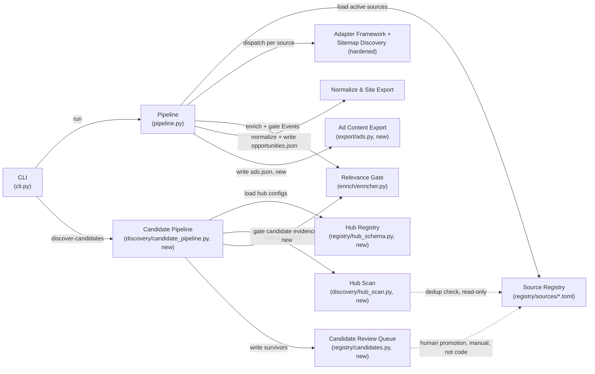

<!-- CLASI: Before changing code or making plans, review the SE process in CLAUDE.md -->

# Sprint 005: Discovery expansion and League content

## Goals

Two threads: growing the source list, and wiring in the business model
that funds this whole project. A discovery crawl scans curated regional
hubs (Balboa Park calendar, county library systems, regional STEM
networks such as the Barrio Logan/Southeastern SD Cureo network,
university calendars) to surface organizations and events not yet
covered — then source-back acquisition registers each discovered org and
acquires from its own site/feed. We are the aggregator; other
aggregators are discovery leads only, never a data source to republish
(issue 09). Separately, League content and advertising (issue 12) wires
in the return on the League's investment: jointheleague.org registered as
a source so League events flow into the directory like any partner's,
and a League-owned sidebar ad slot on the site (cross-repo with
`stem-ecosystem`).

**Dependencies**: issue 09 depends on the Source Registry (sprint 001)
and the relevance gate (sprint 002/issue 04) — the gate is precisely what
makes ingesting noisy, discovery-sourced orgs safe rather than flooding
the site. Issue 12's League-source piece is a normal registry addition
(a lightweight case of 001/002's existing source-onboarding path); its
ad-slot piece is cross-repo work in `stem-ecosystem` and can proceed in
parallel with detail planning here.

## Problem

Two related growth constraints on the current pipeline. First, every
source is added by hand: an operator must already know an org exists
before it can be registered, so growth is bottlenecked on an operator's
own awareness even though the acquisition tooling (sitemap/listing
discovery, adapters, the relevance gate) scales fine once a source is
known. Second, the business model funding this project — the League's
sponsorship — isn't yet represented anywhere in the data flow: League
events aren't in the directory, and there's no mechanism to give the
League the ad placement it's owed in exchange.

## Solution

Issue 09: add a discovery capability that treats curated regional hubs
(a Balboa Park-style calendar, library systems, university calendars,
regional STEM networks) purely as *lead generators*. It surfaces
candidate orgs and their own site URLs for human review and never
ingests a hub's own event records as our data — a promoted candidate
becomes a normal Source Registry entry, acquired the exact same way
every existing source is (Registry -> Adapter -> Enrich -> Normalize ->
Export). Issue 12: register jointheleague.org as a normal source —
confirmed live during this planning pass to be a static site with no
WordPress/TEC API, so it reuses the existing `generic_html` adapter
(sitemap discovery + the extraction ladder) rather than needing new
adapter code — and deliver the League's ad placement as a data contract
(`ads.json`) the separate `stem-ecosystem` site repo can build its own
sidebar component against, rather than this sprint's branch reaching
into that repo directly.

## Success Criteria

- A curated hub can be scanned and yields candidate org/source
  suggestions for human review, with zero Events or Opportunities ever
  produced from the hub's own content.
- jointheleague.org is a registered source; its class/program pages flow
  into `opportunities.json` attributed to the League's existing partner
  record (id 287 in `stem-ecosystem`'s `partners.json`), while its
  `/news/` blog and `/about/` pages are correctly excluded.
- `ads.json` is written into the site repo's data directory with the
  League's ad content, ready for the site's own (separately-scheduled)
  sidebar implementation to consume.

## Scope

### In Scope

- Discovery crawl over curated regional hubs to surface uncovered
  orgs/events; respects each hub's robots/ToS (issue 09).
- Source-back acquisition: register discovered orgs, fetch from their own
  site/feed, record "discovered via" provenance — never ingest a hub's
  own aggregated records as our data (issue 09).
- League (jointheleague.org) registered as a source; League events flow
  into the directory (issue 12).
- League-owned sidebar ad slot requirement, coordinated with the
  `stem-ecosystem` site repo (issue 12).
- A general hardening fix to sitemap discovery's root-sitemap probing,
  needed to make the League source (and future issue-09-discovered
  sources with unpredictable site quirks) work reliably — see
  Architecture > Design Rationale.

### Out of Scope

- Curating the full hub roster issue 09 names as examples (Balboa Park
  calendar, county library systems, the Barrio Logan/Southeastern SD
  Cureo network, university calendars) — each requires the same kind of
  live-site investigation this planning pass performed for
  jointheleague.org, and is deferred to operator/follow-up backlog. This
  sprint delivers the hub-scan *capability* plus one illustrative
  seed/template hub definition and fixture, not a populated hub list.
- Implementing the sidebar ad-slot UI component in `stem-ecosystem` —
  that repo is not under this CLASI process; this sprint delivers the
  data contract (`ads.json`) and a documented requirement, not a
  site-repo commit.
- Automated adapter-type detection for promoted candidates — an operator
  still manually investigates a candidate org's site (as this planning
  pass did for jointheleague.org) and hand-writes its
  `adapter_type`/`config` before promotion.
- Companies/internships (issue 11) — a later sprint.

## Test Strategy

Every new/changed module is offline/hermetic, matching this project's
existing convention (fixture-backed `Fetcher`, no real sockets in
tests):

- `discovery/sitemap.py`'s hardened root-sitemap resolution: a fixture
  reproducing the real jointheleague.org failure mode (a site that
  returns HTTP 200 with an HTML body for a nonexistent path) proves
  probing now falls through to a candidate that actually parses as
  sitemap XML; existing sources' sitemap-discovery tests must still pass
  unchanged (no regression).
- League source: a fixture-based sitemap + `/classes/*` + `/news/*` +
  `/about/*` page set proves discovery correctly includes class/program
  pages and excludes news/about pages, without any live network call.
- Hub scan: a fixture hub listing page with several event blurbs — some
  linking to orgs already present in `registry/sources/*.toml` (must be
  filtered out) and some to new orgs (must surface as candidates) —
  proves dedup and candidate surfacing both work.
- Candidate pipeline: asserts that running `discover_candidates()`
  against a fixture hub never calls `normalize.run()` or
  `export_opportunities()` and never writes `opportunities.json` — the
  concrete, testable form of issue 09's "never republish the hub's own
  data" mandate.
- Ads export: mirrors `export/writer.py`'s existing test pattern (a
  `tmp_path` site dir, asserts `ads.json`'s written shape, asserts a
  loud failure on an unwritable `site_dir`).
- No test touches a real socket, the real `stem-ecosystem` checkout, or a
  real hub/League URL — every fixture is a canned HTML/XML file under
  `tests/fixtures/`.

## Architecture

**Substantial** — this sprint introduces a new discovery-and-lead-
generation subsystem (hub scanning -> candidate review queue, issue 09)
with a new cross-module dependency (`discovery` -> `enrich`, reusing the
relevance gate for candidate filtering), a new site-facing data contract
(`export/ads.py`, issue 12's ad slot), and a behavior change to existing
infrastructure (`discovery/sitemap.py`'s root-sitemap resolution, needed
to make the League source — and future issue-09-discovered candidates
with unpredictable site quirks — work reliably). Four-plus modules
touched and a new dependency direction place this well past the
"compact" tier; the full 7-step methodology applies below.

### Architecture Overview

**Step 1 — Understand the problem.** Covered above (Problem/Solution):
growth is bottlenecked on an operator already knowing an org exists, and
the League's sponsorship isn't yet represented in the data flow. Both
threads reuse the existing Registry -> Adapter -> Enrich -> Normalize ->
Export pipeline rather than replacing any part of it.

**Step 2 — Responsibilities introduced or changed.**
1. Scan a curated external hub and surface *candidate* organizations —
   never event data — for human review (issue 09).
2. Persist those candidates as a reviewable queue, structurally separate
   from the live Source Registry (issue 09).
3. Reuse the existing relevance gate to filter candidate noise before it
   reaches a human reviewer (issue 09; explicit instruction to reuse
   `LLMEnricher`).
4. Make sitemap-based discovery robust against a site that returns
   HTTP 200 for a nonexistent path — a real, confirmed-live failure mode
   on jointheleague.org itself, not a hypothetical (issue 12, but
   general-purpose: it also de-risks every future issue-09-promoted
   candidate, whose sites are by definition unvetted).
5. Register jointheleague.org as a normal source (issue 12).
6. Publish League ad-slot content as a site-consumable data contract,
   distinct from the Opportunities data contract (issue 12).

Responsibilities 1-3 change together (they're one new subsystem: lead
generation) and are grouped into four new modules. Responsibility 4 is
an isolated, independently-motivated fix to one existing module.
Responsibilities 5-6 are, respectively, a registry-content addition (no
new code beyond consuming responsibility 4's fix) and one new, small,
independent export module.

**Step 3 — Subsystems and modules.**

| Module | Purpose (one sentence) | Boundary | Serves |
|---|---|---|---|
| **CLI** (`cli.py`, modified) | Dispatches command-line invocations to the right orchestrator. | Inside: argparse wiring, console output, the new `discover-candidates` subcommand. Outside: any pipeline/discovery decision logic. | SUC-001, SUC-003 |
| **Pipeline** (`pipeline.py`, modified) | Sequences the normal Registry->Adapter->Enrich->Normalize->Export run. | Inside: per-source error isolation, fetcher selection, one new sequencing step (call Ad Content Export after Site Export). Outside: any adapter/discovery/enrichment logic itself — unchanged god-component guard from sprint 001. | SUC-003, SUC-004 |
| **Source Registry** (`registry/schema.py`, `registry/loader.py`, `registry/sources/*.toml`; extended with one new TOML, zero code changes) | Describes each organization's own acquisition source of record. | Inside: `SourceConfig` shape, the League's new `jointheleague.toml`. Outside: candidate/hub definitions — deliberately different directories, never scanned by `load_sources()`. | SUC-003, SUC-005 |
| **Adapter Framework & Sitemap Discovery** (`adapters/*` unchanged, `discovery/sitemap.py` modified) | Turns one registered source into canonical Events via discover->fetch->extract. | Inside: the dispatch table, `generic_html`'s reuse for League, hardened root-sitemap probing plus an optional `config.sitemap_url` override. Outside: relevance/classification; hub/candidate concepts entirely. | SUC-003, SUC-005 |
| **Relevance Gate** (`enrich/enricher.py`, `enrich/llm_client.py`; unchanged, reused by a second caller) | Classifies and relevance-gates a stream of Events. | Inside: the existing cache-aware LLM classification pass. Outside: knows nothing about hubs, candidates, or site export — it only ever sees `Event`s, real or synthetic. | SUC-001, SUC-003 |
| **Normalize & Site Export** (`normalize/*`, `export/writer.py`; unchanged) | Dedupes, joins partners, and writes `opportunities.json`. | Unchanged from prior sprints. | SUC-003 |
| **Hub Registry** (`registry/hub_schema.py`, new) | Parses and validates a directory of curated hub definitions. | Inside: `HubConfig` shape (hub_id, hub_name, page URLs), TOML loading from a new `registry/hubs/` directory. Outside: any scanning/fetching logic (Hub Scan's job); never touches `registry/sources/`. | SUC-001 |
| **Hub Scan** (`discovery/hub_scan.py`, new) | Scans one hub's page(s) for organizations not already covered by the Source Registry. | Inside: anchor/text extraction over a hub's listing page(s), the `OrgCandidate` shape, robots.txt compliance via the existing `fetch/robots.py`. The dedup check calls the Source Registry's own public loader (`registry.load_sources()`) and reuses `normalize.partners.normalize_org_name` plus a domain comparison — it never parses `registry/sources/*.toml` itself, avoiding feature envy into the Registry's own concern. Outside: never constructs a real `Event`; never fetches an org's own site (only happens after human promotion, through the normal Adapter Framework); never writes the candidate queue itself. | SUC-001 |
| **Candidate Pipeline** (`discovery/candidate_pipeline.py`, new) | Sequences hub scanning through relevance-gated writes to the candidate review queue. | Inside: iterating configured hubs, building a synthetic `Event` from each candidate's hub-observed evidence text so the Relevance Gate can be reused unmodified, filtering to `relevant is not False`, delegating persistence to the Candidate Review Queue. Outside: scanning logic (Hub Scan's) or classification logic (Relevance Gate's) — this module composes, it implements neither. | SUC-001 |
| **Candidate Review Queue** (`registry/candidates.py`, new) | Persists discovered org candidates as review-marked TOML stubs for a human operator to promote. | Inside: writing/listing stub files under a new `registry/candidates/` directory, deliberately outside `registry/loader.py`'s scan path and deliberately missing `adapter_type`/`config` so a misdirected load attempt fails validation rather than silently loading. Outside: promoting a candidate into a real source — a human action, not a code path this module implements. | SUC-001, SUC-002 |
| **Ad Content Export** (`export/ads.py` + `registry/ads/league.toml`, new) | Publishes hand-authored ad-slot content into the site's data contract. | Inside: reading a small hand-authored ad config, writing `{site_dir}/src/data/ads.json`, failing loudly on an unwritable `site_dir` (mirrors `export/writer.py`'s existing contract). Outside: any UI/placement/rotation decision — the site repo's own, separately-scheduled work. | SUC-004 |

**Step 4 — Diagram.** Required: 3+ modules touched and a new
cross-module dependency (`discovery -> enrich`) are both present, so a
component diagram is warranted (not the "no diagram" exception sprint
020 used).

No ERD: none of this sprint's new data shapes (`HubConfig`,
`OrgCandidate`) join or relate to the existing `Event`/`Opportunity`/
partner model — they're a standalone, human-reviewed side channel that
only becomes a `SourceConfig` (an existing, unmodified shape) after
manual promotion. A relationship diagram would show one isolated box,
which clarifies nothing beyond this sentence.

No separate dependency graph: the component diagram above already is
one — every edge is a real import/call dependency in the stated
direction, so a second diagram would be node-for-node identical. The new
edges this sprint adds are: `CandPipe -> Relevance` (a second consumer
of the existing relevance-gate seam, not a new implementation),
`HubScan -> Registry` (read-only dedup lookup), `Pipeline -> AdsExport`
and `CLI -> CandPipe` (both mirror an existing same-direction edge in
kind). No cycles: `Registry` and `Relevance` remain leaves with zero
outward dependencies, exactly as before this sprint; dependency
direction (CLI/orchestration -> business logic -> infrastructure) is
preserved throughout.

**Step 5 — What Changed / Why / Impact / Migration.**

*What Changed*: four new modules (Hub Registry, Hub Scan, Candidate
Pipeline, Candidate Review Queue) implementing issue 09's lead-generation
capability; one new module (Ad Content Export) implementing issue 12's
data contract; one existing module hardened (`discovery/sitemap.py`);
one new registry entry (`registry/sources/jointheleague.toml`); `cli.py`
and `pipeline.py` each gain one new, additive call site.

*Why*: see Problem/Solution above — this is the minimum new surface area
that lets discovery scale past manual operator awareness while
structurally guaranteeing (not just documenting) that a hub's own data
never reaches the site, and that gives the League's sponsorship a real,
testable data contract.

*Impact on Existing Components*: `enrich/enricher.py`, `model.py`,
`normalize/*`, `export/writer.py`, and every existing `adapters/*` module
are **unchanged** — zero modification, reused as-is. `registry/loader.py`
and `DEFAULT_SOURCES_DIR` are **unchanged**: the candidates and hubs
directories are physically separate, so `load_sources()`/
`load_active_sources()` see exactly the same set of real, live sources
they did before this sprint — this is the core safety property behind
issue 09's "never republish" mandate, not just a convention. `pipeline.py`
gains exactly one new sequencing call (Ad Content Export); its per-source
isolation and fetcher-selection logic are untouched. `cli.py` gains one
new subcommand; the existing `run` command's flags and behavior are
untouched.

*Migration Concerns*: see the dedicated section below.

**Self-review note (fan-out)**: `Pipeline`'s outward fan-out reaches 5
(Registry, Adapters, Relevance, NormExport, AdsExport) with this
sprint's one addition — at the architecture-quality guideline's "4-5
without justification" threshold. Justified here because AdsExport is
the same *kind* of responsibility Pipeline already had (one more
"write a site data-contract file" sequencing step, structurally
identical to the existing NormExport call), not a new kind of
responsibility — it does not add branching business logic to
`pipeline.py`, only one more call in the existing linear sequence.
A sixth such addition in a future sprint should prompt reconsidering
whether Pipeline itself needs to split.

### Design Rationale

**Decision: Hub scanning is structurally separate from the Event/
Opportunity pipeline — a distinct CLI command, a distinct output
directory, and it never calls `normalize.run()`/`export_opportunities()`.**
- *Context*: the stakeholder was emphatic — "we are the aggregator";
  another aggregator's own records must never become our data.
- *Alternatives considered*: (a) treat a hub as just another Adapter
  (`discover -> fetch -> extract` producing Events directly from the
  hub's own pages) — rejected outright, this would literally republish
  the hub's data, exactly the anti-pattern the issue forbids. (b) Tag
  hub-sourced Events with a "candidate" flag and filter them out at
  export time — rejected: it still lets not-yet-vetted data flow through
  the same trusted pipeline, and a filter bug would silently ship it; a
  structurally separate pipeline with a separate output artifact is a
  code-level guarantee, not a runtime check that can be forgotten.
- *Why this choice*: enforces the principle architecturally, so it can't
  be silently disabled or bypassed by a future change to one filter.
- *Consequences*: one extra, small orchestrator module
  (`discovery/candidate_pipeline.py`) instead of reusing `pipeline.py` —
  accepted, given the correctness guarantee it buys.

**Decision: Candidate relevance filtering reuses the existing
`LLMEnricher` relevance gate via a synthetic `Event`, not a bespoke
candidate classifier.**
- *Context*: explicit sprint instruction — the relevance gate is "the
  natural filter for discovered candidates."
- *Alternatives considered*: a separate hub-specific prompt/heuristic —
  rejected, it would duplicate and risk drifting from the site's one
  existing definition of "STEM-relevant for K-12 youth in San Diego."
- *Why this choice*: single source of truth for relevance classification.
- *Consequences*: candidate evidence text (a hub's short blurb) is
  noisier/shorter than a full adapter-extracted Event, so verdicts on
  candidates are lower-confidence than on real Events — acceptable,
  since a human still reviews every surfaced candidate before promotion;
  this gate reduces review-queue noise, it doesn't replace human
  judgment.

**Decision: `discovery/candidate_pipeline.py` depends on
`enrich.enricher.LLMEnricher` (structurally, via its own small
Enricher-shaped Protocol) directly — never on `pipeline.Enricher`.**
- *Context*: `pipeline.py` already defines an `Enricher` Protocol that
  `LLMEnricher` satisfies structurally.
- *Alternatives considered*: import `Enricher` from `pipeline.py` for
  reuse — rejected: `discovery/` importing from `pipeline.py` would
  create a `discovery -> pipeline` edge running backwards against this
  codebase's established dependency direction (`pipeline` depends on
  `discovery`/`adapters`/`enrich`, never the reverse).
- *Why this choice*: Python Protocols are structurally typed, so a local
  Protocol (or a direct `LLMEnricher` type reference) gets the same
  reuse with the correct dependency direction, at zero cost.
- *Consequences*: one tiny duplicated Protocol shape instead of one
  shared import — a trivial price for not inverting a dependency edge.

**Decision: sitemap discovery accepts the first candidate that *parses*
as valid sitemap XML, not the first that returns HTTP 200; plus an
optional `config.sitemap_url` override.**
- *Context*: confirmed live during this planning pass — jointheleague.org
  returns HTTP 200 with an HTML "not found" body for every path,
  including `/sitemap_index.xml` (the first-tried conventional filename,
  which isn't where its real sitemap lives — that's `/sitemap-index.xml`,
  hyphenated). The existing "first 200 wins" logic would grab the wrong
  candidate and then fail XML parsing, never falling through to try the
  next filename.
- *Alternatives considered*: (a) just add `sitemap-index.xml` as a third
  hardcoded candidate filename — insufficient, it doesn't fix the
  underlying "trust status 200 alone" bug that will recur on the next
  misconfigured site, especially an issue-09-discovered org whose site is
  by definition unvetted. (b) Always require an explicit `sitemap_url`
  for every source — rejected, unnecessary manual work for the common
  case where a site's sitemap really is at a conventional path and
  returns real XML immediately.
- *Why this choice*: fixes the general failure mode while keeping the
  common path fully automatic; the override is an escape hatch for the
  cases even the broadened/hardened probing can't solve (e.g. a sitemap
  path that isn't any conventional filename at all).
- *Consequences*: up to one extra network round-trip in the rare
  multi-candidate-probe case — negligible given existing per-source rate
  limiting and that this only runs once per source per pipeline run.

**Decision: League registered via the existing `generic_html` adapter,
not a new League-specific adapter, `wp_rest`, or `tec_rest`.**
- *Context*: live investigation during this planning pass (HTTP fetches
  against jointheleague.org, not guesswork) found `<meta name="generator"
  content="Astro v5.16.0">`, no `/wp-json/` REST payload (only the site's
  own catch-all HTML), and no TEC signature — the League's own site is
  itself a static Astro build, not WordPress or a CMS with an events API.
  Its `sitemap-0.xml` lists `/classes/{slug}/` pages (weekly classes,
  camps, workshops — the League's actual offerings) and `/news/{date}/
  {slug}/` pages (a migrated blog, not offerings).
- *Alternatives considered*: `wp_rest`/`tec_rest` — ruled out, no matching
  platform is present to call. A bespoke League-specific adapter —
  rejected as unnecessary: `discovery/sitemap.py`'s existing
  `EVENT_PATH_RE` already includes literal `classes`/`class`/`program`/
  `workshop`/`camp` in its path-pattern, so `/classes/...` URLs are
  already correctly matched and `/news/...`/`/about/...` URLs are already
  correctly excluded, with zero pattern changes — confirmed by manually
  checking the pattern against the real sitemap URLs during this
  planning pass.
- *Why this choice*: reuses proven, tested code (`generic_html` +
  the extraction ladder) with no new adapter type to maintain; the only
  real gap was the sitemap-probing robustness issue above, already fixed
  as its own ticket.
- *Consequences*: League's extracted fields depend on the extraction
  ladder's OpenGraph/title-fallback rungs rather than a structured API
  (same trust tier as Fleet Science Center's existing `listing_html`
  source) — lower per-field confidence than TEC/Localist sources, an
  accepted, already-precedented trade-off.

**Decision: League's ad slot is delivered as a data contract
(`ads.json`) plus a documented site requirement, not as a UI commit into
`stem-ecosystem` from this sprint's branch.**
- *Context*: `stem-ecosystem` is a separate git repo, not under this
  CLASI process; its own `docs/site-implementation-spec.md` confirms the
  site currently has *no* ad-slot concept, no CMS, and is a fully static,
  JSON-data-driven Astro build — adding an ad component is new site-side
  design work (placement, static-vs-rotating, responsive behavior).
- *Alternatives considered*: implement the Astro component directly and
  commit it in `stem-ecosystem` from this sprint — rejected: no CLASI
  gate, no test coverage, and no code-review process covers that repo
  from here; it would blur repo/process ownership for a UI/design
  decision that's better iterated in the site repo's own review.
- *Why this choice*: keeps partner-scrape's sprint branch hermetic and
  testable (an `ads.json` writer is exactly the kind of artifact
  `export/writer.py` already proves out) while still delivering
  everything the site needs to build its component whenever that work is
  scheduled.
- *Consequences*: the actual ad slot won't appear on the live site until
  a separate, undated `stem-ecosystem` follow-up ships — tracked as an
  Open Question below, not a blocker to closing this sprint.

### Migration Concerns

`discovery/sitemap.py`'s change is additive and strictly backward
compatible for every currently-registered source — the candidate-
filename list only grows, and the new accept condition ("parses as
valid sitemap XML") is *stricter* than before ("any HTTP 200"), so a
source whose real sitemap already parses successfully today continues
to resolve identically; regression tests over the existing six
registered sources confirm this. `config.sitemap_url` is a new,
optional key inside the existing free-form `config` dict — no
`SourceConfig` dataclass field changes, no existing TOML needs updating.
The new `registry/candidates/`, `registry/hubs/`, and `registry/ads/`
directories are net-new with no prior state to migrate. `ads.json` is a
net-new file written into `stem-ecosystem/src/data/`; the site doesn't
yet reference it, so writing it early is inert (no build breakage) until
the site's own follow-up work consumes it.

### Open Questions

1. The full hub roster issue 09 names as examples (Balboa Park calendar,
   county library systems, the Barrio Logan/Southeastern SD Cureo
   network, university calendars) needs the same live-site investigation
   performed for jointheleague.org in this sprint before each can be
   added for real. This sprint delivers the capability and one
   illustrative seed hub/fixture; populating the real roster is
   operator/backlog work — which hubs to prioritize first is a
   stakeholder call.
2. Exact ad-slot placement/rotation/format (static vs. rotating, one
   advertiser vs. multiple later) is a `stem-ecosystem` design decision,
   not fixed here — the `ads.json` data contract is intentionally
   minimal so it doesn't over-constrain that follow-up work.
3. Candidate promotion (turning a reviewed stub TOML into a live,
   working source) stays a manual, human step in this sprint — the same
   kind of live-site investigation performed for jointheleague.org.
   Semi-automating adapter-type detection is a plausible future sprint,
   deliberately not attempted here (speculative generality risk if
   built before real promotion volume shows what's actually needed).
4. Hub ToS compliance is a curation-time human judgment (only add hubs
   whose terms permit this kind of automated lead-gen browsing) — code
   only enforces robots.txt, which is necessary but not sufficient for
   ToS compliance in general.
5. **Risk — LLM cost/latency for candidate filtering**: the Candidate
   Pipeline adds one more `LLMClient.enrich_event` call per hub-observed
   candidate, on top of the existing per-Event enrichment cost sprint
   002 already flagged (its own Open Question 6). Mitigated by scope:
   hub scanning is operator-triggered via its own CLI subcommand, not
   part of every scheduled `run`, and the candidate volume per invocation
   is bounded by the (currently small, curated) hub list — not a
   per-Event-at-site-scale cost. Revisit if the hub roster (Open
   Question 1) grows large enough to change that calculus.

## Use Cases

### SUC-001: Discover candidate organizations from a curated hub
Parent: UC-008 (Add a new partner source) — extends it with a discovery
precondition UC-008 assumes away ("A new/updated partner org with a
website" — SUC-001 is how that awareness now arises instead of relying
purely on an operator already knowing).

- **Actor**: Operator (via the `discover-candidates` CLI subcommand)
- **Preconditions**: At least one `HubConfig` is registered under
  `registry/hubs/`; the hub's page(s) are reachable and its robots.txt
  permits fetching.
- **Main Flow**:
  1. Load configured hubs (Hub Registry).
  2. For each hub, scan its page(s) for outbound organization links and
     nearby evidence text (Hub Scan), skipping any org already present in
     `registry/sources/*.toml` (domain or normalized-name match).
  3. Build a synthetic `Event` from each remaining candidate's evidence
     text and run it through the existing Relevance Gate.
  4. Write every candidate whose synthetic Event is not verdicted
     `relevant=False` as a review-marked stub TOML into
     `registry/candidates/`, recording `discovered_via` as the hub's id.
- **Postconditions**: Zero or more new candidate stub files exist under
  `registry/candidates/`; no `Event`/`Opportunity` was produced from the
  hub's own content; `opportunities.json` is untouched.
- **Acceptance Criteria**:
  - [ ] Running the pipeline against a fixture hub with events for orgs
        already in the registry filters those orgs out (no duplicate
        candidate).
  - [ ] Running it against a fixture hub with events for genuinely new
        orgs surfaces exactly those orgs as candidates.
  - [ ] `discover_candidates()` never calls `normalize.run()` or
        `export_opportunities()`, and `opportunities.json` is never
        written by this flow.
  - [ ] Each candidate stub records `discovered_via` and the hub-observed
        evidence text, and is missing `adapter_type`/`config` (so
        `SourceConfig.from_toml` would reject it if ever misdirected at
        the loader).
  - [ ] A hub whose robots.txt disallows the fetched path is skipped, not
        fetched.

### SUC-002: Promote a discovered candidate into a live source
Parent: UC-008 (Add a new partner source)

- **Actor**: Operator
- **Preconditions**: A candidate stub exists under `registry/candidates/`.
- **Main Flow**:
  1. Operator investigates the candidate org's own site (platform,
     sitemap/listing shape) the same way this planning pass investigated
     jointheleague.org.
  2. Operator fills in `adapter_type`/`config` on the stub and moves it
     into `registry/sources/`.
  3. The org's events now flow through the normal pipeline on the next
     run, exactly like any existing partner.
- **Postconditions**: The org's own events (never the hub's) appear in
  `opportunities.json`, attributed to its own source with
  `discovered_via` provenance preserved.
- **Acceptance Criteria**:
  - [ ] A promoted stub, once completed with a valid `adapter_type`/
        `config`, loads successfully via `load_active_sources()` with no
        further code change.
  - [ ] The promoted source's `acquisition_policy.discovered_via` reflects
        the originating hub, not `"manual"`.

### SUC-003: League events flow into the directory like any partner's
Parent: UC-010 (Feature League content and advertising)

- **Actor**: Engine (Pipeline)
- **Preconditions**: `registry/sources/jointheleague.toml` is registered
  (`adapter_type = "generic_html"`).
- **Main Flow**:
  1. Sitemap discovery resolves jointheleague.org's sitemap (via the
     hardened probing + `config.sitemap_url` override from SUC-005) into
     `/classes/*` URLs.
  2. `generic_html`'s extraction ladder recovers title/description/etc.
     from each class/program page.
  3. Normalize joins the resulting Events to the League's existing
     partner record (id 287) by normalized org name.
  4. Export writes current/upcoming League classes into
     `opportunities.json`.
- **Postconditions**: League class/program offerings appear on the site
  attributed to "The LEAGUE of Amazing Programmers."
- **Acceptance Criteria**:
  - [ ] A fixture-based run discovers and extracts `/classes/*` pages.
  - [ ] The same run excludes `/news/*` and `/about/*` pages (they don't
        match the existing event-path pattern).
  - [ ] Extracted League opportunities join to partner id 287 (no
        unmatched-org fallback).

### SUC-004: League ad content is available as a site data contract
Parent: UC-010 (Feature League content and advertising)

- **Actor**: Engine (Pipeline) / Operator (site follow-up, out of branch)
- **Preconditions**: `registry/ads/league.toml` exists with the League's
  ad copy/link/logo reference.
- **Main Flow**:
  1. On a normal pipeline run, Ad Content Export reads the League's ad
     config.
  2. It writes `{site_dir}/src/data/ads.json` with the ad content in a
     documented schema.
- **Postconditions**: `ads.json` exists and is ready for
  `stem-ecosystem`'s own (separately-scheduled) sidebar component to
  consume; no site-repo code was modified by this sprint.
- **Acceptance Criteria**:
  - [ ] `ads.json`'s written shape matches the documented schema.
  - [ ] An unwritable `site_dir` fails loudly (mirrors
        `export_opportunities`'s existing contract), never silently
        skips the write.
  - [ ] `dry_run` computes the payload without touching disk, matching
        `export_opportunities`'s existing convention.

### SUC-005: Sitemap discovery survives a site that returns HTTP 200 for nonexistent paths
Parent: UC-002 (Discover changed pages via sitemap diff)

- **Actor**: Engine (Sitemap Discovery)
- **Preconditions**: A source's true sitemap is not at the first-probed
  conventional filename, and the site returns HTTP 200 (with a non-XML
  body) for paths that don't exist — confirmed live on jointheleague.org.
- **Main Flow**:
  1. Probe each candidate root-sitemap filename in order.
  2. For each HTTP 200 response, attempt to parse it as sitemap XML with
     a recognized root element; on failure, continue to the next
     candidate instead of stopping.
  3. If `config.sitemap_url` is set, skip probing entirely and fetch that
     URL directly.
  4. Accept the first candidate that actually parses.
- **Postconditions**: Event discovery succeeds despite the false-200
  failure mode; a genuinely unreachable/malformed sitemap still yields
  `None` (unchanged existing error flow) once every candidate is
  exhausted.
- **Acceptance Criteria**:
  - [ ] A fixture reproducing jointheleague.org's exact failure mode
        (first candidate: 200 + HTML body; a later candidate or the
        explicit override: 200 + real sitemap XML) resolves successfully.
  - [ ] Every existing registered source's discovery behavior and test
        suite is unchanged (regression).
  - [ ] A source with no reachable/parseable sitemap at all (every
        candidate exhausted) still returns the existing `None`/logged-
        warning error flow, unchanged.

## GitHub Issues

None — this sprint's linked issues
(`clasi/issues/09-aggregator-as-discovery-not-source.md`,
`clasi/issues/12-league-content-and-advertising.md`) have no
corresponding GitHub-tracked issue in this repo.

## Definition of Ready

Before tickets can be created, all of the following must be true:

- [x] Sprint planning document is complete (sprint.md, including its
      Architecture and Use Cases sections)
- [x] Architecture review passed (self-review, substantial tier — four
      APPROVE-WITH-CHANGES-caliber findings caught and fixed in place,
      APPROVE after fixes; see `architecture_review` gate notes)
- [x] Stakeholder has approved the sprint plan (recorded on the basis of
      the team-lead's explicit delegation of full autonomy — see
      `stakeholder_approval` gate notes; five Open Questions in the
      Architecture section still want stakeholder input during or after
      execution, most notably which hubs to prioritize for the real hub
      roster)

## Tickets

| # | Title | Depends On |
|---|-------|------------|
| 001 | Sitemap discovery robustness: parse-based acceptance + sitemap_url override | — |
| 002 | Register jointheleague.org as a source (generic_html) | 001 |
| 003 | Hub Registry + Hub Scan: lead-generation discovery over a curated hub | — |
| 004 | Candidate review queue + relevance-gated candidate pipeline + CLI wiring | 003 |
| 005 | League ad-slot data contract (ads.json export) | — |

Tickets execute serially in the order listed. 001->002 (League's source
registration relies on the sitemap-probing fix) and 003->004 (the
candidate pipeline consumes hub_scan's output) are the only real code
dependencies; 003 and 005 have no code dependency on 001/002 and could
run in either order relative to them, but are sequenced after per this
sprint's narrative grouping (discovery-robustness-and-League first,
lead-generation second, ad contract last).
