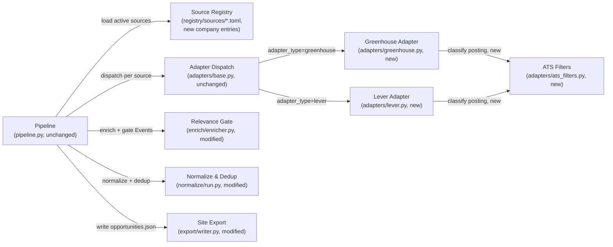

<!-- CLASI: Before changing code or making plans, review the SE process in CLAUDE.md -->

# Sprint 006: Companies and internships

## Goals

Extend the aggregator beyond nonprofit/education partners to San Diego
STEM employers (issue 11): a curated seed list of ~50-100 companies
(sourced from SD Regional EDC, BIOCOM, CONNECT, anchor firms, Fleet
corporate sponsors — curated, not web-crawled); ATS adapters for
Greenhouse and Lever's public JSON board APIs, filtered to
internship/early-career + local + STEM roles; a new Internship
opportunity-kind with deadline/term-date semantics (application deadline,
"Summer 2027") rather than the event datetime model, likely its own site
section/filter; and opportunistic company public-events capture via the
generic extractor (open houses, career fairs, hackathons) — low yield,
not a place to over-invest. Career pathways are mission-aligned and
fundable (e.g. NBCUniversal's youth-pathways grant), strengthening both
the product and the case to keep the site alive.

**Dependencies**: depends on the Source Registry (sprint 001), the
relevance gate (sprint 002/issue 04), and a schema/kind extension to
Normalize & Export (sprint 001/issue 05's lineage) to support Internship
as a distinct opportunity kind with its own date semantics. Company
public-events capture reuses the generic extractor from sprint 002. This
is a parallel track to the partner-event work, not a blocking dependency
of any other sprint in this roadmap; sequencing vs. depth is explicitly a
stakeholder call per issue 11.

## Problem

The aggregator's addressable audience stops at "STEM programs run by
nonprofits and museums" — it has no concept of employers, so it cannot
surface the single highest-value STEM opportunity for a
college-or-near-college-age visitor: a real internship. Two gaps stand in
the way. First, no source in the registry represents a company, and
nothing in the adapter framework knows how to talk to an Applicant
Tracking System (ATS) — Greenhouse's and Lever's public job-board APIs are
untouched. Second, even once postings are ingested, the pipeline has no
concept of an opportunity whose "when" is an application deadline or a
term ("Summer 2027") rather than an event's start/end datetime — every
module downstream of acquisition (recurring-collapse, cross-source dedup,
the LLM relevance gate, the site's current/upcoming export filter) was
built against event-shaped assumptions that, applied unmodified to
structured job-posting data, would misclassify, wrongly merge, or
silently expire genuine internship listings.

## Solution

Two new structured-API adapters (`greenhouse`, `lever`), mirroring the
proven `tec_rest`/`localist` pattern (injectable `Fetcher`, discover ->
fetch -> extract, per-record error isolation), use a new shared
classification module to deterministically decide, per posting: is this
an internship/early-career role, is it STEM, is it San Diego-local. Only
postings that pass all three become canonical `Event`s with
`kind="internship"` — a value `model.py`'s `Kind` literal has carried
since sprint 001 in anticipation of exactly this ticket, so **no model
change is required**. Three existing modules gain small, kind-aware
branches so internship Events flow correctly through the rest of the
pipeline without disturbing existing event/program behavior: the
Relevance Gate trusts the adapter's own classification instead of
re-judging job-posting text against a K-12-event-framed LLM prompt;
Normalize routes internships around recurring-collapse and cross-source
dedup (both built on an event-identity assumption that doesn't hold for
distinct job requisitions); and Site Export's current/upcoming filter
learns that an internship without a known deadline is still "current" as
long as it's still present in the ATS feed. `opportunity_type` (already a
site schema field) is set to the existing `"Work-based Learning"` value
for internships — no site-repo schema change. A handful of real,
live-verified San Diego companies are registered as the first company
sources; full roster curation (~50-100 companies) is scoped out as an
operator follow-up, mirroring sprint 005's hub-roster precedent.

## Success Criteria

- A real Greenhouse-backed company source and a real Lever-backed company
  source each produce zero or more `kind="internship"` Events end-to-end
  through a dry-run pipeline invocation, using recorded fixture JSON — no
  live network call in any test.
- On a fixture board mixing internship/full-time, STEM/non-STEM, and
  San-Diego/non-San-Diego postings, only the matching subset becomes
  Events.
- An internship Event reaches `opportunities.json` with
  `opportunity_type="Work-based Learning"`, a real `link`, and is present
  whether it has a future `date_end` (deadline) or no `date_end` at all
  (rolling) — the no-deadline case is not silently dropped.
- Two same-titled internship Events from the same company (distinct
  requisitions) both survive Normalize as separate records; likewise two
  same-titled internship Events from two different companies.
- An internship Event passes through `LLMEnricher.enrich()` with zero LLM
  calls recorded on a spy `LLMClient`.
- At least four real San Diego companies (a mix of Greenhouse and Lever)
  are registered, with board URLs/tokens confirmed live during this
  planning pass.

## Scope

### In Scope

- Two new structured-API adapters: `greenhouse` (Greenhouse Job Board
  public JSON API) and `lever` (Lever Postings public JSON API).
- A shared, offline-testable internship/STEM/San-Diego classification
  module used by both adapters.
- `kind="internship"` Event support end-to-end: Relevance Gate bypass,
  Normalize collapse/dedup bypass, `opportunity_type` mapping,
  deadline/rolling date semantics, Site Export current/upcoming filter
  fix.
- A handful (4-6) of real, live-verified San Diego STEM company sources
  (Greenhouse and/or Lever), enabled in the registry.
- Documentation of the opportunistic company-public-events pattern
  (reusing the existing `generic_html` adapter, sprint 005 precedent) —
  applied to a seeded company only if a genuine public events page is
  found while seeding sources; otherwise documented as a pattern for a
  future operator pass, not implemented speculatively.

### Out of Scope

- Full curation of the ~50-100 company roster issue 11 names as a target
  (SD Regional EDC, BIOCOM, CONNECT, Fleet corporate sponsor membership
  lists) — each requires its own live verification pass, the same kind
  this sprint performed for its handful of seed companies; deferred to an
  operator follow-up, mirroring sprint 005's hub-roster precedent ("Out
  of Scope: curating the full hub roster ... deferred to
  operator/follow-up backlog").
- Workday and iCIMS ATS integration — explicitly deferred by issue 11
  ("later"); no code seam beyond the existing `Adapter` protocol/
  `ADAPTERS` registration pattern is needed to add one later.
- Any change to the `stem-ecosystem` site repository — copy/label/CTA
  text ("Apply" vs. "Register"), Featured-Opportunities selection logic,
  and any future dedicated `opportunity_type` value are documented
  follow-ups, not commits on this branch.
- A general per-company events crawler — company public-events capture,
  where pursued at all, reuses the existing `generic_html` adapter
  unchanged; no new discovery/extraction code.

## Test Strategy

Every new/changed module stays within this project's existing
offline/hermetic convention (fixture-backed `Fetcher`, no real sockets in
tests; recorded JSON fixtures for both ATS APIs, captured during this
planning pass's live board verification — never live-called from tests):

- `adapters/greenhouse.py` / `adapters/lever.py`: fixture-based tests
  mirroring `test_adapters_tec.py`/`test_adapters_localist.py`'s pattern
  — a recorded fixture board JSON containing a mix of internship/
  full-time, STEM/non-STEM, and San-Diego/non-San-Diego postings proves
  filtering keeps exactly the matching subset and maps its fields onto
  `Event` correctly (title, external_id, start, location,
  registration_url, description).
- `adapters/ats_filters.py`: pure-function unit tests over the
  internship-title, STEM-keyword, and San-Diego-location heuristics,
  independent of either adapter.
- `enrich/enricher.py`: a test asserting a `kind="internship"` Event
  passed to `LLMEnricher.enrich()` survives unchanged with zero calls
  recorded on a `FixtureLLMClient` spy, alongside the existing
  event/program tests (must still pass unchanged — no regression).
- `normalize/run.py`: tests proving (a) two same-titled internship Events
  from one company both survive as separate Opportunities (collapse
  bypass), (b) same-titled/same-date/same-location-text internship
  Events from two different companies both survive (dedup bypass), and
  (c) `opportunity_type`/`availability`/date mapping for an internship
  with a known deadline and one without.
- `export/writer.py`: a test proving a `"Work-based Learning"` record
  with no `date_end` is included by the current/upcoming filter (would
  be wrongly excluded under the pre-sprint rule), alongside existing
  event-shaped filter tests (must still pass unchanged).
- An end-to-end dry-run test (mirrors `tests/fixtures/e2e_registry`'s
  existing pattern) wiring a fixture Greenhouse source and a fixture
  Lever source through `pipeline.run()` with `dry_run=True`, asserting
  the final `opportunities.json` payload's internship entries.
- No test touches a real socket, a real company's ATS board, or the real
  `stem-ecosystem` checkout.

## Architecture

**Substantial** — two new adapter modules (Greenhouse, Lever), a new
shared classification module, and kind-aware behavior changes to three
existing modules (Relevance Gate, Normalize, Site Export) driven by a
real data-model semantics decision (dual-use of `date_start`/`date_end`
for deadline-vs-event dates). Five-plus modules touched, well past the
"compact" (one module) tier; the full 7-step methodology applies.

### Architecture Overview

**Step 1 — Understand the problem.** Covered above (Problem/Solution):
internships need a company-facing acquisition path (two new ATS
adapters) and correct handling once acquired, because every existing
downstream module assumes event-shaped data.

**Step 2 — Responsibilities introduced or changed.**
1. Fetch and parse Greenhouse's public JSON board API into canonical
   `Event`s.
2. Fetch and parse Lever's public JSON board API into canonical
   `Event`s.
3. Deterministically decide, per posting: is this an internship/
   early-career role, is it STEM, is it San Diego-local — shared by both
   adapters so the heuristics live in one place, not duplicated.
4. Keep already-classified (adapter-set) internship Events out of the
   K-12-event-framed LLM relevance gate, which would otherwise silently
   re-judge and could overwrite/reject them.
5. Give `kind="internship"` Events a distinct grouping identity through
   Normalize (bypass recurring-collapse and cross-source dedup, both of
   which assume an event-shaped identity that risks merging genuinely
   distinct job requisitions or postings).
6. Map an Event's `kind` to the site's existing `opportunity_type`
   controlled vocabulary and give internships deadline-vs-event date/
   availability semantics in fields the site already reads — no
   site-schema change.
7. Register real company sources in the Source Registry.

Responsibilities 1 and 2 are two parallel, independently-testable
modules (mirroring the existing one-adapter-per-source-type convention).
Responsibility 3 is a new shared module both adapters depend on.
Responsibilities 4-6 are each a small, independently-motivated change to
one existing module. Responsibility 7 is registry content, no new code.

**Step 3 — Subsystems and modules.**

| Module | Purpose (one sentence) | Boundary | Serves |
|---|---|---|---|
| **Greenhouse Adapter** (`adapters/greenhouse.py`, new) | Turns one Greenhouse-backed company source into canonical internship `Event`s. | Inside: Greenhouse's job-list JSON shape, field mapping, calling the shared classifier. Outside: the classification heuristics themselves (Ats Filters' job); any other ATS's shape. | SUC-001 |
| **Lever Adapter** (`adapters/lever.py`, new) | Turns one Lever-backed company source into canonical internship `Event`s. | Inside: Lever's postings JSON shape, field mapping, calling the shared classifier. Outside: same as Greenhouse Adapter, for Lever's shape. | SUC-002 |
| **ATS Filters** (`adapters/ats_filters.py`, new) | Decides whether one raw ATS posting is an in-scope internship. | Inside: internship-title, STEM-job-keyword, and San-Diego-location heuristics; default classification-field values (`areas_of_interest`, `age_grade_level`, `cost_range`, `time_of_day`) for a matching posting. Outside: fetching, JSON parsing, or `Event` construction — both adapters own that. | SUC-003 |
| **Relevance Gate** (`enrich/enricher.py`, modified) | Classifies and relevance-gates a stream of Events. | Inside: one new early-continue branch for `kind="internship"`. Outside: the LLM prompt/client (`llm_client.py`, unchanged); any ATS-specific knowledge. | SUC-005 |
| **Normalize & Dedup** (`normalize/run.py`, modified) | Dedupes, joins partners, and maps Events to Opportunities. | Inside: one new partition step routing `kind="internship"` Events around `collapse_recurring`/`dedup_cross_source`; `opportunity_type`/`availability`/date mapping for internships in `_to_opportunity`. Outside: `collapse.py`/`dedup.py`'s own logic — unchanged, untouched. | SUC-004, SUC-006 |
| **Site Export** (`export/writer.py`, modified) | Filters to current/upcoming and writes `opportunities.json`. | Inside: one new branch in `_is_current_or_upcoming` keyed on `opportunity_type == "Work-based Learning"`. Outside: serialization/slug-dedup logic — unchanged. | SUC-004 |
| **Source Registry** (`registry/sources/*.toml`, new entries; zero code changes) | Describes each company's own acquisition source of record. | Inside: new `adapter_type = "greenhouse"`/`"lever"` TOML entries. Outside: adapter/classification logic. | SUC-007 |

**Step 4 — Diagram.** Required: 3+ modules touched and new
cross-module dependencies (`Greenhouse Adapter`/`Lever Adapter` ->
`ATS Filters`) are both present.

(`Pipeline` calls `normalize_run()` and `export_opportunities()` as two
separate, sequential calls of its own — per `pipeline.py`'s existing
code, Normalize does not call Export directly. The edge above was
corrected during this sprint's own self-review to match that.)

No ERD: `model.py`'s `Kind` literal (`"event" | "program" | "internship"`)
has included `"internship"` since sprint 001 — this sprint is the first to
populate it, not the first to define it. No new entity or relationship is
introduced; `Opportunity`'s existing fields are reused with redefined
internship-specific meaning (Design Rationale, below), not extended.

No separate dependency graph: every edge above is a real, one-directional
import/call dependency already shown in the component diagram, so a
second diagram would be node-for-node identical. The two new edges
(`GH -> ATSFilters`, `Lever -> ATSFilters`) run adapter-layer ->
adapter-layer, the same direction as every existing adapter's dependency
on `fetch`/`model`/`registry.schema`; `ATSFilters` remains a leaf with no
outward dependency of its own. No cycles: `ATSFilters`, `Relevance`'s LLM
client, and `Registry` all remain leaves; dependency direction
(Pipeline/orchestration -> business logic -> infrastructure) is
preserved throughout.

**Step 5 — What Changed / Why / Impact / Migration.**

*What Changed*: two new adapter modules (Greenhouse, Lever); one new
shared classification module (`adapters/ats_filters.py`); three existing
modules gain a small, kind-aware branch each (`enrich/enricher.py`,
`normalize/run.py`, `export/writer.py`); a handful of new, live-verified
company entries in `registry/sources/`.

*Why*: see Problem/Solution above — this is the minimum new surface area
that lets internship postings become first-class opportunities without a
site-repo schema change, while protecting the existing K-12-event LLM
relevance prompt and the event-shaped collapse/dedup logic from being
silently misapplied to structured job-posting data they were never
designed for.

*Impact on Existing Components*: `adapters/tec.py`, `adapters/localist.py`,
`adapters/wordpress.py`, `adapters/ical.py`, `adapters/generic_html.py`,
`adapters/listing_html.py` — **unchanged**, zero modification. `model.py`
— **unchanged**: `kind="internship"` has been a valid `Kind` value since
sprint 001. `normalize/collapse.py`, `normalize/dedup.py`,
`normalize/instance.py` — **unchanged**; their existing behavior and
tests for `kind="event"`/`"program"` Events are fully preserved, since
`normalize/run.py` only adds a partition step *around* calling them, never
changes their own logic. `enrich/llm_client.py` — **unchanged**: no
prompt change, no new LLM call shape, no risk to existing
event/program classification quality. `export/ads.py`,
`registry/hub_schema.py`, `discovery/*` — untouched, no interaction with
this sprint's work.

*Migration Concerns*: see the dedicated section below.

### Design Rationale

**Decision: Internship/STEM/San-Diego filtering happens deterministically
inside each adapter's `extract()` (via the shared `ats_filters.py`), not
via the existing LLM relevance gate.**
- *Context*: `enrich/llm_client.py`'s system prompt is written specifically
  around "STEM learning opportunity for K-12 youth ... not an adult-only
  program" — internship postings targeting HS/college applicants (often
  18+, and job-description prose, not program-description prose) don't
  reliably fit that framing without a prompt rewrite.
- *Alternatives considered*: (a) reuse the LLM relevance gate unmodified —
  rejected: real risk the existing prompt classifies a legitimate
  internship as `relevant=False` ("adult-only") and silently drops it,
  with no way to detect the loss short of re-reading every response; (b)
  rewrite the LLM system prompt to be kind-aware — rejected for this
  sprint: a shared-prompt change risks regressing the well-tested
  K-12-event classification path, and title/location/department
  heuristics on structured ATS fields are already reliable (unlike the
  free-text HTML this gate was built for) — an LLM call adds cost and
  nondeterminism to a problem that doesn't need it.
- *Why this choice*: deterministic, offline-testable with recorded
  fixtures (this project's existing hermetic-test convention), zero risk
  to the existing event-classification path, and appropriate to the
  input (structured API fields, not prose).
- *Consequences*: the adapter, not the Relevance Gate, decides "should
  this internship exist on the site"; `enrich/enricher.py` needs one
  small kind-aware branch (next decision) so it doesn't re-judge or
  overwrite that decision.

**Decision: `LLMEnricher.enrich()` passes `kind="internship"` Events
through unchanged, skipping the cache/LLM-call/relevance-overwrite path
entirely.**
- *Context*: `_apply_result()` unconditionally overwrites
  `areas_of_interest`/`age_grade_level`/`cost_range`/`time_of_day`/
  `relevant`/`relevance_reason` regardless of whether `field_provenance`
  already has a high-confidence entry — unmodified, every internship
  Event would be re-judged by the K-12-event prompt and could be dropped
  (the previous decision's risk), even though the adapter already gated
  it.
- *Alternatives considered*: (a) leave `LLMEnricher` untouched and rely on
  the adapter never being wired into `Pipeline`'s `enrichers` list for
  internship sources — rejected: `Pipeline.run()` applies its `enrichers`
  sequence to the whole combined Event stream with no per-kind filtering
  seam, so this would require inventing a parallel Pipeline path, a far
  larger change; (b) branch inside `_apply_result` on a passed-in kind —
  rejected: `_apply_result` has no Event-shape knowledge beyond field
  names by design, and adding kind logic there conflates two concerns.
- *Why this choice*: the smallest, most local change that preserves
  `LLMEnricher`'s existing behavior for every non-internship Event
  exactly as before, via one explicit, testable early-continue branch.
- *Consequences*: a future kind that also wants gate-bypass gets the same
  one-line pattern; internships never get a populated `relevant`
  verdict, which is fine since nothing downstream reads it for them.

**Decision: `kind="internship"` Events bypass both `collapse_recurring`
and `dedup_cross_source`.**
- *Context*: `collapse_recurring` groups by `(source_id, normalized
  title)` — a company with multiple simultaneous, identically-titled
  internship requisitions (a common real pattern: one "Software
  Engineering Intern" req per team) would have those genuinely distinct
  openings silently merged into one Instance. `dedup_cross_source`'s
  identity is `(normalized title, event date, normalized venue)` — for
  structured job postings, generic titles ("Software Engineering
  Intern") and a shared local venue string ("San Diego, CA") are common
  across *unrelated* companies, so this identity risks merging two
  different employers' postings and silently dropping a real, distinct
  opportunity — a failure mode collapse/dedup was never designed
  against, because two orgs' calendar *events* sharing a title+date+venue
  usually really is the same event (the assumption the identity was
  built on).
- *Alternatives considered*: (a) extend `recurring_key`/
  `cross_source_identity` to fold in `external_id` when
  `kind == "internship"` — rejected: makes two existing, well-tested,
  general-purpose identity functions kind-conditional, coupling
  Event-recurrence semantics to ATS-posting semantics inside logic that
  has nothing to do with either; (b) give internships their own dedup
  pass keyed on `external_id` — rejected as unnecessary: `model.py`'s
  `identity_key()` (unchanged since sprint 001) already gives every
  internship Event a stable, high-confidence acquisition identity via
  the ATS's own posting ID, and a posting is already atomic/canonical at
  the source — there is no cross-source "same internship posted by two
  orgs" case to dedup at all.
- *Why this choice*: preserves `collapse.py`'s/`dedup.py`'s existing,
  well-tested behavior and tests untouched for every event/program
  Event, and is the smallest change that avoids the false-merge risk for
  internships.
- *Consequences*: `normalize/run.py`'s `run()` gains one partition step
  (`kind == "internship"` bypasses the two calls, is wrapped 1:1 into an
  `Instance`); internships never show a "Repeats N times through..."
  availability string, which is fine — it isn't a meaningful concept for
  them.

**Decision: reuse the existing `opportunity_type` field (mapped to
`"Work-based Learning"`, an already-valid site enum value) as the
internship discriminator, instead of adding a new field.**
- *Context*: the site's controlled vocabulary
  (`stem-ecosystem/docs/site-implementation-spec.md`) already lists
  `"Work-based Learning"` and `"Career Connections"` among
  `opportunity_type`'s 8 values.
- *Alternatives considered*: (a) `"Career Connections"` — considered, but
  reads more naturally as career-exploration content (info sessions,
  mentorship) than an actual internship listing; (b) add a new
  `opportunity_type` value (e.g. `"Internship"`) — rejected: requires a
  site-repo schema/filter-UI edit, out of scope for this branch
  (constraints: "any site-schema addition is a documented follow-up, not
  a site-repo edit"); (c) add a dedicated `Opportunity.kind` or
  `is_internship` field — rejected: `opportunity_type` already exists for
  exactly this "what kind of thing is this" purpose and the site's
  Opportunity Type filter already surfaces it, so a second, overlapping
  field would be redundant and would itself need a site-repo change to
  be exposed as a filter.
- *Why this choice*: zero site-schema change, reuses an existing,
  already-filterable field exactly as the site's own filter UI already
  supports it — visitors can filter to "Work-based Learning" today, on
  the current site, with no site code change.
- *Consequences*: internships are indistinguishable from any other future
  `"Work-based Learning"` record by type alone — acceptable, since
  nothing else currently populates that value.

**Decision: reuse `date_start`/`date_end`/`availability` with redefined
internship-specific meaning (posting-observed date / application
deadline / free-text term-or-deadline text), rather than adding a
`deadline`/`term` field.**
- *Context*: neither Greenhouse's nor Lever's public board API exposes a
  reliable, structured application-close date in the common case
  (confirmed live against four company boards during this planning
  pass) — most postings simply disappear from the feed when filled, so
  "still present in the feed" is itself the primary "still open" signal,
  not a date field.
- *Alternatives considered*: (a) add a dedicated `deadline`/`term` field
  to `Opportunity` and the site schema — rejected per this sprint's
  "reuse existing fields sensibly" guidance and the "document, don't
  edit the site repo" constraint, mirroring sprint 005's `ads.json`
  precedent of shipping a coherent data contract now and documenting the
  site follow-up rather than reaching into that repo; (b) leave
  `date_start`/`date_end` unset for internships without an explicit
  deadline — rejected: `export/writer.py`'s current-or-upcoming filter
  excludes any record with neither date set, which would silently drop
  every internship without an explicit deadline (the common case) from
  the site entirely.
- *Why this choice*: keeps every internship representable in the existing
  schema with a real, meaningful `date_start` (when first observed) and,
  when known, a real `date_end` (the deadline); `availability` carries a
  human-readable "Apply by \<date\>" or "Rolling — apply anytime" string
  built from the same data.
- *Consequences*: `export/writer.py`'s current/upcoming filter needs one
  internship-aware branch (next decision); the site's card/detail-page
  date labels and CTA copy ("Register" vs. an "Apply" label) will read
  slightly off for internships until the site repo makes small,
  independently-scheduled copy/logic tweaks — documented as a follow-up
  (Migration Concerns), not fixed on this branch.

**Decision: `export/writer.py`'s `_is_current_or_upcoming` gains a branch
keyed on `opportunity_type == "Work-based Learning"`: current if
`date_end` is unset or still in the future; the ordinary event-shaped
`date_end or date_start >= today` rule is untouched for every other
`opportunity_type`.**
- *Context*: the previous decision makes an internship's `date_start`
  its "first observed" date, often in the past by a later scrape run —
  under the *existing*, unmodified filter rule, a still-open internship
  with no known deadline would incorrectly evaluate as expired and
  vanish, the opposite of "still live in the ATS feed = still open."
- *Alternatives considered*: (a) give `Opportunity` a new boolean/enum
  field so `writer.py` doesn't have to special-case a content value for
  control flow — considered, but `opportunity_type` already is that
  discriminator (previous decision) and adding a second, overlapping
  field purely for this branch would be exactly the redundant-field
  pattern already rejected; (b) always refresh `date_start` to "today" on
  every run for internships instead of using the ATS's own observed
  timestamp — rejected: would make `date_start` meaningless for
  sorting/display (every internship would tie for "soonest") and would
  still need the same expiry-logic fix for the no-deadline case.
- *Why this choice*: the smallest, most local fix — internship-vs-event
  branching lives in exactly the one function whose existing assumption
  (dates are event dates) this sprint invalidates for one
  `opportunity_type`.
- *Consequences*: a future `opportunity_type` that also needs non-event
  date semantics would extend this same branch, not duplicate it — worth
  a comment noting the pattern if a third case arrives.

### Migration Concerns

- **No data migration.** This is new record production; no existing
  `opportunities.json` record's shape changes.
- **Backward compatible.** Every field this sprint uses on `Event`/
  `Opportunity` already exists; no site-repo schema change, no
  site-repo commit on this branch.
- **Documented site-side follow-up** (mirrors sprint 005's `ads.json`
  precedent): the site's `OpportunityCard`/detail-page copy ("Register",
  a human-readable `date_start`) and the homepage's Featured-Opportunities
  soonest-`date_start` selection logic were written before
  `opportunity_type="Work-based Learning"` existed as real data. They
  will render technically correctly (a real date, a real link) but the
  copy will read a little off (e.g. "Register" instead of "Apply", a
  posting's first-seen date shown where a visitor might expect an event
  date) until the site repo makes small, independently-scheduled
  conditional tweaks — out of scope for this branch, same boundary
  sprint 005 drew around `ads.json`'s sidebar UI.
- **Deployment sequencing: none.** Additive — running the pipeline with
  zero enabled company sources reproduces today's behavior exactly, so
  company sources can be merged and enabled independently, one company
  at a time, exactly like any existing source.

### Open Questions

- Full 50-100 company roster curation (SD Regional EDC, BIOCOM, CONNECT,
  Fleet corporate-sponsor membership lists) is deferred to an operator
  follow-up pass, per this sprint's seed-vs-roster scoping — who owns
  compiling/vetting that list, and on what cadence, is a stakeholder/
  operator question, not a code question.
- Workday/iCIMS ATS support (explicitly deferred by issue 11 to "later")
  — a future adapter would follow the same `adapters/base.py` `Adapter`
  protocol + `ADAPTERS` registration pattern as Greenhouse/Lever, but
  Workday's public-API story (if any) needs its own live investigation
  before that sprint is planned.
- Site-side copy/UX follow-up (an "Apply" vs. "Register" CTA label, card
  date-label wording, and whether "Work-based Learning" records should
  be excluded from the homepage's soonest-`date_start` Featured-
  Opportunities selection so a stream of internships doesn't crowd out
  event listings) — flagged for the `stem-ecosystem` repo's own backlog,
  not resolved on this branch.
- Whether any seeded company additionally warrants a second
  `generic_html` source entry for opportunistic public-events capture is
  left to whoever curates the fuller roster — this sprint documents the
  pattern (ticket 006) but does not commit to scanning every seeded
  company's site for a public events page, per the issue's explicit "low
  yield, don't over-invest" guidance.

## Use Cases

### SUC-001: Ingest internship postings from a company's Greenhouse board
Parent: UC-011

- **Actor**: Engine
- **Preconditions**: A source is registered with `adapter_type = "greenhouse"`
  and a valid board token; the company's Greenhouse Job Board public JSON
  API (`boards-api.greenhouse.io/v1/boards/{token}/jobs`) is reachable.
- **Main Flow**:
  1. Fetch the board's job list (single response — Greenhouse's public
     list endpoint is not paginated, unlike TEC/Localist).
  2. For each posting, run it through the shared ATS classifier
     (internship? STEM? San Diego-local?).
  3. Map matching postings into canonical `Event`s with
     `kind="internship"`: `external_id` from the posting's numeric id,
     `start` from `updated_at`, `location`, `description`, and
     `registration_url` from `absolute_url`.
  4. Discard non-matching postings without emitting an Event.
- **Postconditions**: Zero or more `kind="internship"` Events exist for
  the source, each traceable to one real ATS posting id.
- **Acceptance Criteria**:
  - [ ] A fixture board with a mix of internship/full-time,
        STEM/non-STEM, and local/non-local postings yields Events only
        for postings matching all three.
  - [ ] A non-200 or unparseable response is logged and yields zero
        Events, never raises past `extract()` (per-record/per-page
        isolation, matching `tec.py`'s convention).
  - [ ] `external_id` round-trips the posting's own `id`.

### SUC-002: Ingest internship postings from a company's Lever board
Parent: UC-011

- **Actor**: Engine
- **Preconditions**: A source is registered with `adapter_type = "lever"`
  and a valid company slug; the company's Lever Postings public JSON API
  (`api.lever.co/v0/postings/{company}?mode=json`) is reachable.
- **Main Flow**:
  1. Fetch the postings list (single response — Lever's public postings
     endpoint is not paginated either).
  2. For each posting, run it through the shared ATS classifier, using
     `categories.commitment` as an additional internship signal when
     present (Lever's `commitment` field often says "Intern"/
     "Internship" directly).
  3. Map matching postings into canonical `Event`s with
     `kind="internship"`: `external_id` from the posting's `id`, `start`
     from `createdAt`, `location` from `categories.location`,
     `description` from `descriptionPlain`, and `registration_url` from
     `applyUrl` (falling back to `hostedUrl`).
  4. Discard non-matching postings without emitting an Event.
- **Postconditions**: Zero or more `kind="internship"` Events exist for
  the source, each traceable to one real ATS posting id.
- **Acceptance Criteria**:
  - [ ] A fixture board with a mix of internship/full-time,
        STEM/non-STEM, and local/non-local postings yields Events only
        for postings matching all three.
  - [ ] A non-200 or unparseable response is logged and yields zero
        Events, never raises past `extract()`.
  - [ ] `external_id` round-trips the posting's own `id`.

### SUC-003: Internship/STEM/San Diego classification keeps only matching postings
Parent: UC-011

- **Actor**: Engine
- **Preconditions**: A raw posting record (title, department/commitment
  text, location text) from either ATS.
- **Main Flow**:
  1. Test the posting's title (and commitment/department field, when
     available) against an internship/early-career keyword set.
  2. Test the posting's title/department text against a STEM job-keyword
     set (broader than `normalize/taxonomy.py`'s event-oriented
     `AREA_KEYWORDS`, since job titles like "Bioinformatics Intern" or
     "Data Science Intern" don't reliably match event-description
     keyword rules).
  3. Test the posting's location text against the source's configured
     `location_keywords` (default `["San Diego"]`).
  4. Return match/no-match; on match, also return default
     `areas_of_interest`/`age_grade_level`/`time_of_day` values for the
     adapter to set on the `Event`: `age_grade_level = ["Grades 9-12",
     "Undergraduate"]` (narrowed to `["Graduate"]` added when the title
     contains a PhD/graduate-level keyword), `time_of_day = ["All Day"]`
     (a full workday commitment, the closest fit in the existing
     enum). **`cost_range` is deliberately left unset** — see
     Acceptance Criteria and the note below.
- **Postconditions**: A deterministic, offline-computable verdict and
  default classification, with no LLM call.
- **Acceptance Criteria**:
  - [ ] "Software Engineering Intern", "Biology Research Intern", and
        "Data Science Co-op" match; "Senior Software Engineer" and "VP of
        Sales" do not.
  - [ ] A location of "San Diego, CA" matches; "Remote" and "Austin, TX"
        do not, under the default `location_keywords`.
  - [ ] A source-level `location_keywords` override (e.g. `["La Jolla",
        "San Diego"]`) changes the match set with no code change.
  - [ ] Neither adapter sets `Event.cost` or `Event.cost_range` for an
        internship — caught during this sprint's own architecture
        self-review: `cost_range`'s enum (`Free`, `Less than $25`, ...)
        represents *cost to the applicant*, and defaulting it to `"Free"`
        (true in the trivial sense that applying costs nothing) would
        make the site's `cost_range: "Free"` badge — which the site spec
        says to "highlight ... visually" on the card — read to a visitor
        as "this internship doesn't pay," which is neither true nor
        knowable from either ATS's public API. Leaving it unset
        (`map_cost("")` -> `""`, `_to_opportunity`'s existing fallback)
        renders no cost badge at all, which is the accurate state of
        knowledge.

### SUC-004: An internship's deadline or rolling status determines site currency
Parent: UC-011

- **Actor**: Engine
- **Preconditions**: A `kind="internship"` Opportunity exists with
  `opportunity_type="Work-based Learning"`.
- **Main Flow**:
  1. If the posting exposed a real deadline, it is set as `date_end`.
  2. Site Export's current/upcoming filter treats a `"Work-based
     Learning"` record with a future or unset `date_end` as current; a
     past `date_end` as expired.
  3. `availability` carries a human-readable "Apply by \<date\>" or
     "Rolling — apply anytime" string.
- **Postconditions**: An internship with no known deadline is never
  dropped from the export solely because its `date_start`
  (posting-observed date) is in the past.
- **Acceptance Criteria**:
  - [ ] No-deadline internship with `date_start` 30 days in the past:
        included.
  - [ ] Known deadline in the future: included. Known deadline in the
        past: excluded.
  - [ ] An ordinary `kind="event"` Opportunity's current/upcoming
        behavior is provably unchanged (existing tests still pass).

### SUC-005: Internship classification is not re-judged by the K-12-event relevance gate
Parent: UC-011

- **Actor**: Engine
- **Preconditions**: A `kind="internship"` Event with adapter-set
  `field_provenance` for its classification fields reaches
  `LLMEnricher.enrich()`.
- **Main Flow**:
  1. `LLMEnricher` recognizes `event.kind == "internship"`.
  2. It passes the Event through unchanged — no cache lookup, no LLM
     call, no field overwrite.
- **Postconditions**: The adapter's classification is the final
  classification; zero LLM cost is spent on internship Events.
- **Acceptance Criteria**:
  - [ ] A `FixtureLLMClient` spy records zero calls for a batch
        containing only `kind="internship"` Events.
  - [ ] Existing `kind="event"`/`"program"` `LLMEnricher` tests pass
        unchanged.

### SUC-006: Distinct internship postings are never silently merged
Parent: UC-011

- **Actor**: Engine
- **Preconditions**: Two or more `kind="internship"` Events with the same
  normalized title (same company or different companies).
- **Main Flow**:
  1. Normalize partitions `kind="internship"` Events around
     `collapse_recurring`/`dedup_cross_source`.
  2. Each is wrapped 1:1 into its own `Instance`.
- **Postconditions**: Every distinct internship posting (by
  `external_id`) survives Normalize as its own Opportunity.
- **Acceptance Criteria**:
  - [ ] Two same-titled internship Events from the same `source_id` both
        survive (collapse bypass proven).
  - [ ] Two same-titled, same-date, same-location-text internship Events
        from two different `source_id`s both survive (dedup bypass
        proven).
  - [ ] Existing recurring-event collapse and cross-source event dedup
        tests pass unchanged.

### SUC-007: Operator registers a San Diego STEM company as an ATS-backed source
Parent: UC-008

- **Actor**: Operator
- **Preconditions**: A company's public Greenhouse or Lever board
  URL/token has been confirmed live.
- **Main Flow**:
  1. Add `registry/sources/{company}.toml` with `adapter_type =
     "greenhouse"` or `"lever"` and the confirmed token/company slug.
  2. Optionally set `location_keywords` if the default San Diego match is
     too narrow or too broad for this company.
  3. Run the pipeline once; verify internship Opportunities appear (or,
     legitimately, that zero currently-open matching postings exist).
- **Postconditions**: The company contributes internship Opportunities on
  subsequent runs, exactly like any existing partner source.
- **Acceptance Criteria**:
  - [ ] At least 4 real companies (a mix of Greenhouse and Lever) are
        registered with URLs/tokens confirmed live during this planning
        pass.
  - [ ] A company source with zero currently-open matching postings is
        not an error (mirrors existing per-source zero-result handling).

## GitHub Issues

(GitHub issues linked to this sprint's tickets. Format: `owner/repo#N`.)

## Definition of Ready

Before tickets can be created, all of the following must be true:

- [x] Sprint planning document is complete (sprint.md, including its
      Architecture and Use Cases sections)
- [x] Architecture review passed (or skipped, for changes with no
      architectural impact)
- [x] Stakeholder has approved the sprint plan

## Tickets

| # | Title | Depends On |
|---|-------|------------|
| 001 | Internship opportunity-kind semantics in Normalize and Site Export | — |
| 002 | ATS internship/STEM/San Diego classification module | — |
| 003 | Greenhouse ATS adapter | 002 |
| 004 | Lever ATS adapter | 002 |
| 005 | Relevance Gate bypass for internship-kind Events | 001 |
| 006 | Company seed sources and public-events pattern | 001, 002, 003, 004, 005 |

Tickets execute serially in the order listed.
