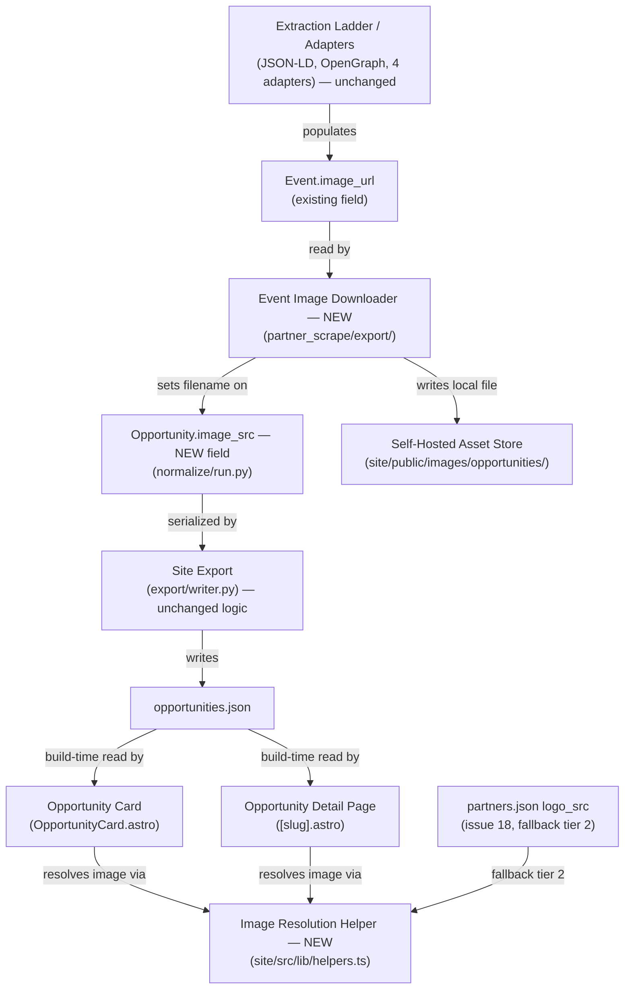

<!-- CLASI: Before changing code or making plans, review the SE process in CLAUDE.md -->

# Sprint 008: Site UX and branding polish

## Goals

Ship nine independent, stakeholder-reported UX and branding polish fixes
to the beta site (`partner-scrape/site`), closing the visible gap
between the beta and production `sdstemecosystem.org`, and giving every
partner — and, where the scraper can find one, every opportunity — a
real image instead of a placeholder:

1. **Calendar clarity** — issue 17 (suppress "12:00 AM" for
   no-real-time events) + issue 23 (separate the "today" cell from its
   event chips — both currently render in the same `--purple-light`).
2. **Card date readability** — issue 25 (weekday + weekend distinction
   on the opportunity card date).
3. **Map correctness** — issue 20 (drop the map / marker for
   opportunities with no real, mappable location).
4. **Brand identity** — issue 21 (real favicon sourced from
   sdstemecosystem.org) and issue 22 (home page rebuilt to match
   production's hero, button style, and hero cards, adapted to this
   site's actual pages).
5. **Home page completeness** — issue 24 (Upcoming Opportunities shows
   the entire next 7 days, not a capped handful).
6. **Visual completeness for partners** — issue 18 (every partner gets a
   real icon; 28 of 153 currently fall back to the generic placeholder).
7. **Event-specific imagery** — issue 19 (opportunities get their own
   image where the scraper can find one, extracted and self-hosted at
   scrape time, with a logo/placeholder fallback chain).
8. **Our Partners on the home page** — issue 26 (added after initial
   planning): an "Our Partners" section near the bottom of the rebuilt
   home page, guaranteed to feature The LEAGUE of Amazing Programmers.

## Problem

The beta site (`partner-scrape/site`) works functionally but reads as
visibly unfinished next to production (`sdstemecosystem.org`) and has
several small UX papercuts surfaced by direct use:

- The Calendar view shows a misleading "12:00 AM" for events whose
  scraped date has no real time component (`CalendarView.astro`'s
  `.cal-entry-time`), and the "today" cell's highlight uses the exact
  same `var(--purple-light)` background as its event chips
  (`global.css`), so the cell reads as one solid block instead of
  distinct entries.
- Opportunity cards show only a bare date ("July 22, 2026"), with no
  weekday and no visual cue that a program falls on a weekend
  (`helpers.ts`'s `formatDate()`).
- The detail page and the Map view can render a map / marker for
  opportunities with no real, geocodable location — including a latent
  `(0,0)` bug: `[slug].astro`'s `hasLocation` check and
  `opportunities/index.astro`'s marker-plotting loop both treat the
  string `"0"` as a truthy, valid coordinate today.
- The site still ships Astro's default `favicon.svg`, and the home page
  (`index.astro`) is a generic template rather than production's
  branded hero, shaded button treatment, and two hero cards.
- The home page's "Upcoming Opportunities" section caps at 4 items
  instead of showing the whole next week.
- 28 of 153 partners have no logo (`logo_src` empty in
  `partners.json`), falling back to the generic placeholder;
  opportunities have no image of their own at all today — cards and the
  detail page always show the partner's logo, even when a much more
  relevant event-specific photo exists on the source page (and is
  already being extracted into `Event.image_url` by the ladder/adapters,
  just never carried through to the site).
- The home page already has an "Our Partners" section (`index.astro`'s
  `.logo-grid`, capped at 16 partners, preferring those with active
  opportunities), but nothing guarantees any specific partner appears in
  it — including The LEAGUE of Amazing Programmers, the organization
  that builds and runs this project.

## Solution

Treat this as nine largely independent fixes, most confined to a single
site component, plus one feature (issue 19) that also touches the
scraper. The fully independent site-only fixes (17+23 together, 20, 21,
25) are narrow, one- or two-file changes with no shared triggers. Two
pairs are genuinely sequenced: issue 24 (upcoming-week section) depends
on issue 22's rebuilt home-page structure landing first; and issues 18
(partner logos) and 19 (event images) both feed the same card-image
rendering path, so 18's data lands, then 19's scraper-side
extraction/self-hosting, then a site-side fallback chain (event image →
partner logo → placeholder) that ties both together, in that order.
Every new external asset this sprint touches — favicon, hero image,
partner logos, event images — is downloaded and self-hosted at
scrape/build time; the site's static, strict-CSP build never hotlinks a
remote image at runtime. Issue 26 (added after initial planning) is
home-page work in the same family as 22/24: it depends on 22's rebuilt
structure (the "Our Partners" section's final position/style is decided
by the rebuild) and benefits from 18's logo-fallback work, without
being a hard technical dependency on it (The LEAGUE of Amazing
Programmers already has a `logo_src`).

## Success Criteria

- Calendar entries never show "12:00 AM" for time-less events; the
  "today" cell is visually distinguishable from its event chips.
- Every opportunity card (and the detail page) date reads e.g. "Wed,
  Jul 22"; weekend dates are subtly but visibly distinguished from
  weekdays.
- No opportunity without a real, mappable location renders a map
  section (detail page) or a marker (Map view); `(0,0)`/blank
  coordinates are treated as unmappable.
- The tab favicon matches sdstemecosystem.org's real icon.
- The home page's hero, button style, and two hero cards ("Find
  Opportunities", "View Partners") visually match production, using
  only sections this site actually has (Opportunities, Partners).
- The home "Upcoming Opportunities" section shows all opportunities in
  the next 7 days, sorted by date, with no arbitrary top-N cap.
- All 153 partners show a real icon (sourced automatically, or via a
  generated monogram fallback where sourcing genuinely fails) — none
  show the generic placeholder unless every sourcing option failed.
- `Opportunity` carries an optional `image_src`; where the scraper found
  a usable image, cards and the detail page show it, falling back to
  the partner logo, then the placeholder, when absent.
- The home page's "Our Partners" section sits near the bottom (matching
  production's placement) and always includes The LEAGUE of Amazing
  Programmers, regardless of the general partner-selection logic.
- `npm run build` succeeds (offline) after every site ticket;
  `uv run pytest` passes (all 848 existing tests, plus new coverage)
  after the scraper ticket, with evidence the new field populates on a
  real run.

## Scope

### In Scope

- `site/src/components/CalendarView.astro`, `site/src/styles/global.css`
  (calendar section) — issues 17, 23.
- `site/src/lib/helpers.ts` (`formatDate()`), `OpportunityCard.astro`
  — issue 25.
- `site/src/pages/opportunities/index.astro` (`#map-container`),
  `site/src/pages/opportunities/[slug].astro` (detail map) — issue 20.
- `site/src/layouts/BaseLayout.astro`, new favicon asset(s) under
  `site/public/` — issue 21.
- `site/src/pages/index.astro`, `site/src/styles/global.css` (hero /
  button section), a new hero image asset under `site/public/` —
  issues 22, 24.
- `site/src/pages/index.astro`'s existing `.logo-grid` "Our Partners"
  section (position + selection logic) — issue 26.
- `site/src/data/partners.json` (`logo_src` for 28 partners), new logo
  assets under `site/public/images/logos/`, possibly `helpers.ts`'s
  placeholder-fallback logic — issue 18.
- `partner_scrape/normalize/run.py` (`Opportunity.image_src`), a new
  image-download module under `partner_scrape/export/`,
  `OpportunityCard.astro` / `[slug].astro` (fallback-chain rendering) —
  issue 19.

### Out of Scope

- Promoting any of these changes to the production `stem-ecosystem`
  site (every issue's Notes say beta-only; production sync is a
  separate, later effort — matches sprint 007's precedent).
- Running a full re-scrape/re-export against every live partner site to
  populate real `image_src` values everywhere — the scraper ticket
  builds and proves the mechanism (with real evidence on at least one
  source); a full production refresh is normal recurring pipeline
  operation, not new sprint scope.
- Any new calendar-library, mapping-library, or CDN/font dependency, or
  anything else that would violate the site's strict CSP /
  self-contained static build.
- Rewriting the extraction ladder's rung order or adding new rungs for
  issue 19 — `Event.image_url` is already populated by the ladder's
  JSON-LD/OpenGraph rungs and by four existing adapters
  (`leaguesync`, `localist`, `bibliocommons`, `tec`); this sprint wires
  that existing field through to the site, it does not add new
  extraction sources.
- A general partner-logo-refresh pass (re-checking the 125 partners that
  already have a logo) — issue 18 covers only the 28 that are missing
  one.

## Test Strategy

- **Site**: `npm run build` (`astro build`, offline) must succeed for
  every site ticket — there is no JS test framework in `site/`
  (`package.json` has no `test` script, matching sprint 007's
  precedent). Behavioral acceptance is verified by each ticket's
  specific checks (rendered output, CSS/contrast, toggle/fallback
  behavior) plus a successful static build.
- **Scraper**: `uv run pytest` must pass (all 848 existing tests) for
  the scraper ticket, plus new unit tests for the image-download
  module (URL validation, size/quality gating, filename derivation,
  dedup) and for `Opportunity.image_src`'s presence in the exported
  schema. A before/after check showing `image_src` populated for at
  least one real source (a live or recorded-fixture run) is required
  evidence, not just passing unit tests — the point of issue 19 is real
  images reaching the site, which unit tests alone don't prove.

## Architecture

**Substantial.** The sprint touches 8+ site-side files (`CalendarView.astro`,
`global.css` in three independently-changing sections, `helpers.ts`,
`OpportunityCard.astro`, both Opportunities-page files, `BaseLayout.astro`,
the home `index.astro`) plus a new module and a changed dataclass on the
scraper side, adds a new field to the `Opportunity` data model
(`image_src`), and introduces a new external-asset-fetching integration
(self-hosted downloading of a favicon, a hero image, partner logos, and
event images — none hotlinked). Any one of "3+ modules," "data model
change," or "new external integration" independently clears the
Substantial bar. That said, most of the nine issues are genuinely
independent single-component fixes with no new composition between them
— in the sense of sprint 020's precedent, several of these would not by
themselves justify a diagram. The one place real new composition
happens is the event-image pipeline (issues 18+19), where a new
scraper-side module feeds a new field that a new site-side fallback
chain consumes — see Step 4, which includes a diagram for that part only.

### Architecture Overview

**Step 1 — Understand the Problem**: covered above (Problem section).
Ten stakeholder-reported papercuts (issue 26 added after initial
planning), nine entirely on the site and one (event images) spanning
site + scraper. Three genuine couplings exist: issue 24 depends on
issue 22's rebuilt home-page structure landing first; issue 26 (Our
Partners section) likewise depends on 22's rebuilt structure, since the
section's final position/style is decided by that rebuild, not by 26
itself; and issues 18+19 both feed the same card-image rendering path.
Every other issue (17+23 together, 20, 21, 25) is independent — no
shared trigger, no shared file outside `global.css`'s and `helpers.ts`'s
multiple independently-changing sections.

**Step 2 — Responsibilities** (one per issue/ticket; each changes for
its own, independent reason unless noted):

- **R1 — Present calendar entries clearly.** No fabricated "12:00 AM"
  for time-less events; the "today" cell reads as distinct from its own
  event chips. [issues 17, 23]
- **R2 — Show a scannable date on every opportunity.** Weekday prefix,
  subtle weekend distinction, applied everywhere `formatDate()` is
  used. [issue 25]
- **R3 — Only present a map when a real location exists.** One shared
  "is this opportunity mappable" decision, applied on both the detail
  page and the Map view. [issue 20]
- **R4 — Carry the site's real brand favicon.** [issue 21]
- **R5 — Give every partner a real visual identity.** Automated
  sourcing with a generated-monogram fallback for stragglers. [issue 18]
- **R6 — Match production's home-page brand presentation.** Hero,
  button style, hero cards — adapted to this site's actual pages.
  [issue 22]
- **R7 — Surface the full next week of opportunities on the home
  page.** Depends on R6's rebuilt structure existing first. [issue 24]
- **R8 — Recover and self-host a representative image per
  opportunity.** Scraper-side: read the already-extracted
  `Event.image_url`, quality-gate it, download, store locally. [issue
  19, scraper half]
- **R9 — Prefer an opportunity's own image over its partner's logo when
  rendering.** Site-side: a three-tier fallback chain (event image →
  partner logo → placeholder) consumed by both the card and the detail
  page. Depends on R5 (real logos to fall back to) and R8 (the
  `image_src` field to prefer). [issue 19, site half]
- **R10 — Guarantee The LEAGUE of Amazing Programmers appears in the
  home page's partner showcase.** The existing "Our Partners" section
  (`.logo-grid`) has no per-partner guarantee today; its final
  position/style is set by R6's rebuild, so this responsibility resolves
  after R6. [issue 26]

**Step 3 — Modules**:

| Module | Purpose (one sentence) | Boundary | Serves |
|---|---|---|---|
| **Calendar View** (changed, `CalendarView.astro`) | Render dated opportunities as a navigable month grid. | Inside: month-grid layout, per-cell entry rendering, the midnight-time-suppression decision. Outside: the Filter Engine (unchanged), the data source. | SUC-001 |
| **Global Stylesheet — Calendar section** (changed, `global.css` `.calendar-*`/`.cal-entry*`) | Style the calendar grid, the "today" cell, and event chips distinctly. | Inside: calendar-prefixed rules only. Outside: every other section of the same file (cards, buttons, hero) — independently-changing concerns that happen to share a file, not a shared responsibility. | SUC-001 |
| **Card Date Formatter** (changed, `helpers.ts` `formatDate()`) | Turn a raw ISO date string into its display string, including weekday. | Inside: pure string formatting plus a weekend predicate. Outside: how the result is styled (Card / Detail Page). | SUC-002 |
| **Location/Mappability Predicate** (new, a small pure function in `helpers.ts`) | Decide whether one opportunity has a real, mappable location. | Inside: one function treating missing, blank, or `(0,0)` lat/long as unmappable. Outside: where it's called. | SUC-003 |
| **Opportunity Detail Page** (changed, `[slug].astro`) | Render one opportunity's full detail. | Presentation only; now calls the Mappability Predicate before rendering its map section, and the Image Resolution Helper for its hero image. | SUC-003, SUC-009 |
| **Opportunities Index Page — Map view** (changed, `opportunities/index.astro`) | Toggle List/Calendar/Map and plot the currently-filtered opportunities on a map. | Calls the Mappability Predicate before placing each marker; List/Calendar branches unchanged. | SUC-003 |
| **Base Layout** (changed, `BaseLayout.astro`) | Emit the page shell (head/favicon/nav/footer) every page shares. | Inside: the `<link rel="icon">` and related icon tags. Outside: page content. | SUC-004 |
| **Partner Directory Data** (changed, `site/src/data/partners.json`) | Hold each partner's profile, including its logo filename. | Data only; `logo_src` filled in for the 28 currently-missing records. | SUC-005 |
| **Partner Logo Sourcing** (new, a standalone script — not part of the recurring scrape pipeline) | Fetch, validate, and self-host an icon for each partner missing one. | Inside: favicon/apple-touch-icon/og:image lookup per partner `website`, download, resize, store, generated-monogram fallback for stragglers. Outside: the recurring `partner_scrape` pipeline — `logo_src` already reaches `normalize/partners.py` as a read-only join field on curated partner metadata, not something the pipeline writes; this script follows that same convention. | SUC-005 |
| **Home Page** (changed, `index.astro`) | Present the site's front door: hero, brand cards, the upcoming-week list, and the partner showcase. | Inside: hero/card markup, the next-7-days selection query, and the existing `.logo-grid` "Our Partners" section's position/selection logic (gains a guaranteed-inclusion rule for The LEAGUE of Amazing Programmers). Outside: card rendering itself (delegates to Opportunity Card, unchanged contract); individual partner logo resolution (delegates to `getLogoPath`, unchanged). | SUC-006, SUC-007, SUC-010 |
| **Global Stylesheet — Hero/Button section** (changed, `global.css` `.hero-*`/`.btn-*`, some new) | Style the home hero, its two brand cards, and the shared button treatment. | Inside: hero/button-prefixed rules touched by the rebuild. Outside: calendar/card CSS (separate modules above). | SUC-006 |
| **Self-Hosted Asset Store** (changed, `site/public/`) | Hold every locally-served binary asset the build references. | Files only, no logic. Four tickets write here, but each owns a distinct, non-overlapping subpath (favicon at `site/public/`, hero image at `site/public/`, partner logos at `images/logos/`, event images at `images/opportunities/`) — a shared directory tree, not shared mutable state; no two tickets write the same path. | SUC-004, SUC-005, SUC-006, SUC-008 |
| **Opportunity Model** (changed, `partner_scrape/normalize/run.py`) | Hold the site's per-opportunity record shape. | One new optional field, `image_src`, mirroring `logo_src`'s existing convention (a resolved local filename, not a URL). No other field/behavior change. | SUC-008, SUC-009 |
| **Event Image Downloader** (new, `partner_scrape/export/`) | Turn one opportunity's already-extracted remote `image_url` into a self-hosted local file. | Inside: download, quality gate (reject tracking pixels/spacers/undersized images), dedupe identical images, downscale, filename derivation, write into the Self-Hosted Asset Store. Outside: where `image_url` came from (Extraction Ladder/adapters, unchanged) and how the resulting filename is rendered (site-side). | SUC-008 |
| **Site Export** (changed only incidentally, `export/writer.py`) | Serialize `Opportunity` records into the site's JSON contract. | Responsibility unchanged; `_SITE_SCHEMA_FIELDS` is derived from `fields(Opportunity)`, so the new field is exported with no writer.py edit — only the call site that invokes the Event Image Downloader before/during export needs wiring, left to the ticket. | SUC-008 |
| **Image Resolution Helper** (new, a small pure function in `helpers.ts`) | Pick which image to show for one opportunity: its own, else its partner's logo, else the placeholder. | Inside: one function encapsulating the three-tier fallback order. Outside: fetching/downloading anything (that already happened upstream, at scrape time). | SUC-009 |
| **Opportunity Card** (changed, `OpportunityCard.astro`) | Render one opportunity summary. | Presentation only; now calls the Card Date Formatter and the Image Resolution Helper instead of `logo_src` directly. | SUC-002, SUC-009 |

Unchanged, reused as-is: the Extraction Ladder and the `leaguesync` /
`localist` / `bibliocommons` / `tec` adapters (all already populate
`Event.image_url` — nothing new to extract), the Client-side Filter
Engine (`filters.js` — no new filterable data-attribute is introduced
by any of this sprint's changes), `normalize/partners.py`'s partner
join (reads `partners.json` read-only, unaffected by issue 18 filling
in more `logo_src` values), `export/writer.py`'s existing logic for
everything except the new download call site.

**Step 4 — Diagrams**:

A full component diagram covering all nine issues would mostly restate
the module table above without clarifying anything new — most of these
modules change independently and are consumed exactly where they
always were (Card is still called by the Home and Opportunities-index
pages; Detail Page is still standalone; Calendar View is still composed
into the Opportunities index page as of sprint 007). The one place
genuinely new composition happens is the event-image pipeline
(issues 18+19): a new scraper-side module feeds a new field through the
existing `Opportunity` model into a new site-side fallback chain that
two rendering components now call. That's the only diagram this sprint
includes (same exception basis as sprints 007 and 020's scraper-side
sections):

No ERD: the data-model change is one additive scalar field
(`image_src: str`) on an already-flat `Opportunity` record — no new
entity, no new relationship, exactly mirroring how `logo_src` already
exists as a plain scalar. No separate dependency graph: module
dependency *direction* is unchanged everywhere in this sprint —
site-side Presentation components still depend one-way on `lib/helpers`
(no outward dependencies of its own), and `partner_scrape`'s Export
layer still depends one-way on Normalize, which depends one-way on
Extract; the one new edge (Export → the new Downloader) is a
same-direction, same-layer addition, not a new direction, and is
already shown in the diagram above.

**Step 5 — What Changed / Why / Impact / Migration**: see the per-module
table (Step 3), Design Rationale, and Migration Concerns below.

**Impact on Existing Components**:

- `OpportunityCard.astro`'s `Props` interface gains one optional field
  (`image_src`) — additive; every current caller (Home page,
  Opportunities index page) already passes a whole `opportunity`
  object, so no caller needs a signature change.
- `[slug].astro`'s map section moves from its current `hasLocation`
  check to the shared Mappability Predicate — this is a genuine
  behavior change for the `(0, 0)` edge case specifically: today it is
  (incorrectly) treated as mappable; after this sprint it is correctly
  treated as unmappable. This is a bug fix, not a regression.
- `opportunities/index.astro`'s Leaflet marker-plotting loop gets the
  same Mappability Predicate call before each marker — same `(0, 0)`
  fix; opportunities that already fail today's `isNaN` check are
  unaffected (they already get no marker).
- `CalendarView.astro`'s per-entry time display and `global.css`'s
  `.calendar-day.today`/`.cal-entry` rules change visually but keep the
  same markup/data-attribute contract `filters.js` depends on — the
  Filter Engine is unaffected.
- `helpers.ts`'s `formatDate()` changes its *output format* (adds a
  weekday prefix) — every current caller gets the new format
  automatically, including `formatDateRange()` (used by the detail
  page), so the weekday treatment reaches the detail page too, matching
  issue 25's own suggestion for consistency (see Design Rationale).
- No caller outside `site/src/pages/index.astro` is affected by the
  home-page rebuild.
- `Opportunity` gains one dataclass field; `export/writer.py`'s
  `_SITE_SCHEMA_FIELDS` is derived from `fields(Opportunity)`
  automatically, so the field is exported with zero writer.py edits —
  only the call site that invokes the new Downloader needs wiring
  (ticket 008 decides exactly where — most likely alongside the
  existing partner join in `normalize/run.py`, or as a pass over
  surviving `Opportunity` records just before
  `export_opportunities()`).
- `export_opportunities()` already resolves `get_site_dir()` (default
  `../stem-ecosystem`, override-able via `SITE_DIR`) to decide where
  `opportunities.json` lands — this repo's beta `site/` directory is
  already the effective target for this sprint's work (confirmed by
  `site/src/data/opportunities.json` already existing from prior
  scrape/export runs), so the Event Image Downloader writes into
  `get_site_dir() / "public" / "images" / "opportunities"`, the exact
  same resolution mechanism already in use — no new cross-repo/config
  concern.

### Design Rationale

**Decision: every new external asset (favicon, hero image, partner
logos, event images) is downloaded once and self-hosted, never
hotlinked at runtime.**
Context: the site is a static Astro build with a strict CSP and no
runtime external network access — the existing `logo_src`/`getLogoPath`
convention already works this way. Alternatives: (a) reference remote
URLs directly (``) —
rejected: violates the CSP, and breaks the moment a partner's site
reorganizes its assets; (b) download once, store locally, reference the
local path (chosen) — matches the existing `logo_src` pattern exactly.
Consequences: every one of issues 18/19/21/22 needs a fetch-then-store
step somewhere in the pipeline (scraper for logos/event-images, a
one-off script or the site build for favicon/hero-image), not a simple
markup change.

**Decision: the Event Image Downloader lives in `partner_scrape`
(scrape/export time), not as an Astro build-time fetch.**
Context: `Event.image_url` is already populated by the extraction
ladder and four adapters; the site's `getLogoPath` convention already
expects a pre-resolved local filename by the time the site consumes
`opportunities.json`, mirroring `logo_src`. Alternatives: (a) have the
Astro build itself fetch remote images referenced in raw
`opportunities.json` (moves network I/O into `npm run build`); (b)
download during the scrape/export pipeline in `partner_scrape`, writing
files into the Self-Hosted Asset Store and a local filename into
`Opportunity.image_src` (chosen). Why: keeps the site's build fully
offline and deterministic — every site ticket in this sprint has
"`npm run build` (offline)" as an acceptance criterion — and keeps a
single project (`partner_scrape`) responsible for every outbound fetch
during scraping, rather than splitting "fetch a remote asset" across
two build systems. Consequences: the scraper ticket owns the download
and its quality gate; real event images only appear on the site after a
scrape/export run — flagged explicitly in Migration Concerns and in
ticket 008's acceptance criteria (a before/after check on real data, not
just passing unit tests).

**Decision: card/detail rendering resolves an opportunity's image
through one small three-tier helper (event image → partner logo →
placeholder), not per-page duplicated conditionals.**
Context: both `OpportunityCard.astro` and `[slug].astro` need the exact
same fallback decision. Alternatives: (a) inline the same
if/else-if chain in both files; (b) one small pure function in
`helpers.ts` both call (chosen) — matches sprint 007's precedent (one
Markdown renderer, two consumers) for the same reason: a single place
to change the fallback order later, no duplicated logic to keep in
sync. Consequences: `helpers.ts` gains one more small pure function; no
change to either component's existing prop shape beyond reading the new
field.

**Decision: partner icon sourcing is automated (favicon/apple-touch-icon/
og:image fetch per partner `website`) with a generated monogram as the
final fallback, not manual curation alone.**
Context: 28 partners need an icon; some will have no fetchable icon of
any kind on their own site. Alternatives: (a) manual curation only —
doesn't reliably scale to 28 partners within a single ticket and leaves
no defined outcome for partners nobody gets around to; (b) automated
fetch with a generated-initials/monogram fallback for stragglers
(chosen) — every partner ends up with *something* better than the flat
generic placeholder, and the automated path likely resolves most of the
28 without any manual work. Consequences: ticket 005 needs a
fetch-validate-store step (a standalone script, run once against
`partners.json`, not part of the recurring `partner_scrape` pipeline —
partner metadata is curated data, joined read-only by the pipeline, not
scraped by it) plus a small monogram-generation fallback wired into
`getLogoPath`'s default case.

**Decision: `formatDate()`'s weekday addition applies everywhere it's
already called, including the detail page (via `formatDateRange()`),
rather than adding a second, card-only formatter.**
Context: issue 25 asks for the card date specifically but notes
"consider applying the same weekday treatment on the detail page ... for
consistency." Alternatives: (a) a new `formatDateCard()` used only by
`OpportunityCard.astro`, leaving `formatDate()`/`formatDateRange()`
(and the detail page) unchanged; (b) change `formatDate()` itself
(chosen), since it is already the single source of every date string
the site renders. Why: avoids two independently-drifting date-format
functions for what is, today, exactly one display convention;
consistency across card and detail page is the more defensible reading
of the issue's own suggestion. Consequences: the detail page's date
range picks up the weekday prefix too — called out explicitly in
Impact on Existing Components so it isn't mistaken for scope creep.

**Decision: map/marker omission uses one shared "is this opportunity
mappable" predicate, replacing the two current, subtly-different, ad
hoc checks.**
Context: `[slug].astro`'s `hasLocation` and
`opportunities/index.astro`'s marker loop each independently decide
"does this opportunity have a location," and neither treats `(0, 0)`
as invalid today — a latent shared bug, not two unrelated ones.
Alternatives: (a) patch each check separately for the `(0, 0)` case,
leaving two definitions of "mappable" that could drift again; (b) one
shared predicate both call (chosen). Consequences: a small `helpers.ts`
addition; both pages call it uniformly, closing the `(0, 0)` gap in one
place instead of two.

**Decision: guarantee The LEAGUE of Amazing Programmers via an explicit
always-include rule layered on top of the existing selection logic,
not by replacing that logic.**
Context: the current "Our Partners" section already picks up to 16
partners with a reasonable general preference (active-opportunity
partners first); issue 26 needs one specific partner guaranteed,
without the sprint re-deciding the general selection policy.
Alternatives: (a) redesign the selection algorithm around "which
partners deserve a home-page slot" generally (out of scope — no other
issue asks for this, and it risks second-guessing an existing,
apparently-working choice); (b) keep today's selection, then
explicitly ensure the League's record is included — e.g. filtered in
first, with the general logic filling remaining slots (chosen). Why:
the smallest change that satisfies the issue's literal requirement
without touching a policy nothing else in this sprint asks to change.
Consequences: `index.astro`'s partner-selection query gains one small,
explicit rule (find-and-pin, or filter-then-fill); the general 16-cap
and active-opportunity preference are otherwise untouched.

### Migration Concerns

No data migration: `Opportunity.image_src` is a new, optional field —
existing exported records without it simply have an empty string,
which the Image Resolution Helper already treats as "no event image,
fall back to the partner logo" (today's exact behavior). `partners.json`'s
shape is unchanged; only 28 records' `logo_src` values change from
empty to a filename, plus new files land under
`site/public/images/logos/`. No backward-incompatible prop/schema
change to `OpportunityCard`'s or `[slug].astro`'s existing contracts —
every change is additive.

**Re-scrape required for real event images**: `image_src` values will
not populate until a scrape/export run happens after ticket 008 lands.
Until then, `opportunities.json` simply has `image_src: ""` for every
record and the fallback chain degrades gracefully to today's
partner-logo-first behavior — non-breaking, but the stakeholder should
know a data refresh (not just a code deploy) is needed before real
event images appear live. This mirrors how issue 19's own scope note
already flags it ("requires a re-scrape to populate").

**Downloaded-asset validation**: both new fetch-and-store paths (the
Event Image Downloader and the Partner Logo Sourcing script) pull
content from third-party-controlled URLs (`Event.image_url`, and each
partner's `website`). Both must verify the fetched response is actually
an image (`Content-Type` + a real image-decode check, not just a URL
pattern) before writing it into the Self-Hosted Asset Store, and must
not execute or interpret the downloaded bytes as anything other than a
static image asset. This is a correctness/security baseline for both
tickets, not a new module — left as an explicit acceptance criterion on
tickets 005 and 008 rather than a separate architectural component.

No deployment-sequencing concern beyond the ticket order itself: this
sprint's site-only tickets (001–004, 006–007) and the two event-image
tickets (008 scraper, 009 site) are independently buildable/deployable
— the site build never needs a live scrape to succeed (it degrades
gracefully per above), and the scraper ticket's tests/evidence don't
need any site ticket to have landed. `site/` and `partner_scrape/` live
in the same repo and branch, so there is no cross-repo coordination
concern for this sprint (unlike the two-repo topology described in
`docs/design/overview.md`, which predates this repo's own beta `site/`
directory).

### Open Questions

1. **Exact per-partner icon sourcing mechanics** (favicon vs.
   apple-touch-icon vs. og:image vs. a third-party logo-lookup service,
   and the monogram generator's exact visual treatment) are left to
   ticket 005's implementer — deliberately not pinned here, matching
   sprint 007's precedent of leaving a library/tooling choice with more
   than one acceptable answer to the implementing ticket.
2. **Event image visual treatment on the card** is not fully specified:
   today's card shows a small 48×48 square partner-logo tile; an
   event's own photo is more likely a landscape hero image. Whether it
   replaces that tile at the same size/crop, or the card gains a new,
   larger top-of-card image slot when an event image is present, is
   left to ticket 009 — the fallback *order* is decided here (Design
   Rationale), the exact *layout* is not.
3. **"N of M shown on map" indicator** (issue 20 suggests this) — exact
   wording/placement is left to ticket 003; the use case's acceptance
   criteria require no marker for unmappable opportunities, not a
   specific indicator string.
4. **Event image quality-gate thresholds** (minimum pixel dimensions,
   dedup strategy for images repeated across many events on the same
   partner site) are left to ticket 008's implementer, per issue 19's
   own "Considerations" section leaving this open.

## Use Cases

Nine use cases, one per linked issue, matching the nine tickets in
[Tickets](#tickets) 1:1.

### SUC-001: A visitor reads honest, legible calendar entries

- **Actor**: Site visitor browsing the Opportunities page's Calendar
  view.
- **Preconditions**: At least one dated opportunity has a bare-date
  `date_start` (no real scraped time, i.e. `T00:00:00`); today's date
  falls within one of the three pre-rendered month blocks.
- **Main Flow**:
  1. Visitor opens `/opportunities` and switches to Calendar.
  2. An opportunity with no real scraped time shows only its title on
     its day — no "12:00 AM" label.
  3. An opportunity with a real scraped time still shows that time
     (unaffected).
  4. Today's cell is visually distinct (border/outline or lighter tint)
     from its own event chips, which stay visually separated from each
     other regardless of which day's cell they're on.
- **Postconditions**: No calendar entry displays a fabricated midnight
  time; the current day's cell and its chips are visually
  distinguishable, matching every other day's rendering quality.
- **Alternate Flow**: An opportunity's stored date carries a UTC/local
  offset (e.g. `...T00:00:00-07:00`) — the midnight decision is made in
  the intended local wall-clock time, consistent with how the calendar
  already buckets events by local day.
- **Acceptance Criteria**:
  - [ ] A bare-date opportunity's calendar entry shows no "12:00 AM"
        (either omitted or labeled "All day").
  - [ ] A timed opportunity's entry is unaffected.
  - [ ] Today's `.calendar-day` is visually distinguishable from its
        `.cal-entry` chips at a glance (not the same solid-color block).
  - [ ] `npm run build` succeeds.

### SUC-002: A visitor scans opportunity dates by weekday

- **Actor**: Site visitor browsing opportunity cards (List view, Home
  page) or a detail page.
- **Preconditions**: An opportunity has a `date_start`.
- **Main Flow**:
  1. Visitor views a card or detail page.
  2. The date reads with its weekday, e.g. "Wed, Jul 22" instead of
     "July 22, 2026" / "Jul 22".
  3. If the date falls on a Saturday or Sunday, it carries a subtle but
     visible distinction (e.g. a different color/weight or small
     accent) from weekday dates.
- **Postconditions**: Every dated opportunity's displayed date includes
  its weekday; weekend dates are visually distinguishable from weekday
  dates without being loud.
- **Alternate Flow**: An opportunity has no `date_start` — no weekday is
  shown (unchanged "Ongoing" behavior).
- **Acceptance Criteria**:
  - [ ] Card dates show an abbreviated weekday (Mon–Sun) prefix.
  - [ ] Weekend dates (Sat/Sun) carry a visibly different, but subtle,
        treatment from weekday dates.
  - [ ] Timezone-bearing date strings resolve to the correct local
        wall-clock weekday (consistent with the calendar's day
        bucketing).
  - [ ] `npm run build` succeeds.

### SUC-003: A visitor never sees a map for an unmappable opportunity

- **Actor**: Site visitor on an opportunity's detail page, or browsing
  the Opportunities Map view.
- **Preconditions**: An opportunity has no usable latitude/longitude
  (null, blank, or `(0,0)`).
- **Main Flow**:
  1. Visitor opens the opportunity's detail page — no map section
     renders (today it may render an empty/placeholder map for this
     case).
  2. Visitor switches the Opportunities page to Map view — the
     opportunity gets no marker.
  3. A different opportunity with real coordinates still shows its map
     (detail page) and marker (Map view), unaffected.
- **Postconditions**: Every rendered map/marker corresponds to a real,
  mappable location; List and Calendar views are unaffected (the
  opportunity still appears there).
- **Alternate Flow**: An opportunity's coordinates are exactly
  `(0, 0)` — treated as unmappable, not as "off the coast of Africa."
- **Acceptance Criteria**:
  - [ ] Detail page omits the map section entirely when there's no real
        location (verified against a record with null lat/long and one
        with `(0,0)`).
  - [ ] Map view plots no marker for an unmappable opportunity.
  - [ ] A mappable opportunity's map/marker is unaffected.
  - [ ] List/Calendar views still show unmappable opportunities.
  - [ ] `npm run build` succeeds.

### SUC-004: A visitor sees the real site favicon

- **Actor**: Site visitor with the beta site open in a browser tab.
- **Preconditions**: The production favicon is fetchable from
  sdstemecosystem.org at plan time (or already saved).
- **Main Flow**:
  1. Visitor opens any beta page.
  2. The browser tab shows the real STEM Ecosystem icon, not Astro's
     default icon.
- **Postconditions**: The favicon (and `apple-touch-icon`/manifest
  icons where available) is self-hosted under `site/public/` and
  referenced base-path-safely from `BaseLayout.astro`.
- **Acceptance Criteria**:
  - [ ] The tab icon renders the real STEM Ecosystem favicon on the
        deployed beta (`league-infrastructure.github.io/partner-scrape/`).
  - [ ] No runtime fetch to sdstemecosystem.org (asset is self-hosted).
  - [ ] `npm run build` succeeds.

### SUC-005: Every partner shows a real icon

- **Actor**: Site visitor browsing the Partners directory or any
  opportunity card/detail page.
- **Preconditions**: A partner's `logo_src` is currently empty (28 of
  153 partners).
- **Main Flow**:
  1. Visitor views a card, detail page, or partner listing for one of
     the 28 logo-less partners.
  2. A real icon renders — sourced automatically from the partner's
     `website` (favicon / apple-touch-icon / og:image) — instead of the
     generic default placeholder.
  3. For any partner where automated sourcing genuinely fails, a
     generated monogram/initials tile renders instead of the generic
     default.
- **Postconditions**: All 153 partners render a recognizable,
  self-hosted icon; none show the flat generic placeholder unless every
  sourcing option was exhausted for that partner.
- **Alternate Flow**: The 125 partners that already have a `logo_src`
  are untouched.
- **Acceptance Criteria**:
  - [ ] All 28 currently logo-less partners have a `logo_src` pointing
        at a self-hosted image, or render a generated monogram.
  - [ ] Images are self-hosted under `site/public/images/logos/`
        (no runtime hotlinking).
  - [ ] `npm run build` succeeds.

### SUC-006: A visitor sees a home page that matches the production brand

- **Actor**: First-time site visitor landing on the beta home page.
- **Preconditions**: None (home page always renders).
- **Main Flow**:
  1. Visitor opens the beta home page.
  2. The hero uses the production hero background image, matching
     fonts/colors/spacing.
  3. Buttons use production's shaded, drop-shadowed treatment.
  4. Two hero cards render in production's card style: "Find
     Opportunities" (linking to `/opportunities`) and "View Partners"
     (production's "Get Involved" card, restyled with this site's own
     text and linking to `/partners`).
  5. No section for a production feature this site doesn't have (e.g.
     no cards/links to pages that don't exist here) appears.
- **Postconditions**: The home page visually matches production's hero
  and card treatment while only linking to pages this site has
  (Opportunities, Partners).
- **Acceptance Criteria**:
  - [ ] Hero background image, button style, and hero-card style
        visually match production.
  - [ ] The two hero cards read "Find Opportunities" → `/opportunities`
        and "View Partners" → `/partners`.
  - [ ] No section references a page this site doesn't have.
  - [ ] All paths are base-path-safe (`import.meta.env.BASE_URL`) and
        the hero image is self-hosted (no runtime remote fetch).
  - [ ] `npm run build` succeeds.

### SUC-007: A visitor sees the entire next week of opportunities on the home page

- **Actor**: Site visitor on the beta home page.
- **Preconditions**: At least one opportunity's `date_start` falls
  within today .. today+7 days.
- **Main Flow**:
  1. Visitor opens the home page.
  2. The "Upcoming Opportunities" section shows every opportunity whose
     `date_start` falls within the next 7 days (today through one week
     out), sorted by date ascending — no fixed top-N cap.
  3. If more opportunities exist beyond what comfortably fits, the
     section scrolls or links to the full Opportunities page rather
     than silently dropping any.
- **Postconditions**: Every opportunity in the next-7-days window is
  represented in the section; none are hidden by an arbitrary count
  limit.
- **Alternate Flow**: An opportunity has no `date_start` — excluded from
  this section (unchanged; it has no week to belong to).
- **Acceptance Criteria**:
  - [ ] All opportunities with `date_start` in `[today, today+7d]`
        appear in the section, sorted ascending by date.
  - [ ] No opportunity within that window is dropped for a "top N" cap.
  - [ ] `npm run build` succeeds.

### SUC-008: The scrape pipeline recovers and self-hosts an event's own image

- **Actor**: The scrape pipeline (Extract → Normalize → Export),
  operating on any source whose pages carry a usable image.
- **Preconditions**: A page's extraction already populated
  `Event.image_url` (JSON-LD `image`, `og:image`, or one of the four
  adapters that already set it: `leaguesync`, `localist`,
  `bibliocommons`, `tec`).
- **Main Flow**:
  1. Normalize/Export processes the `Event` into an `Opportunity`.
  2. The new Event Image Downloader fetches `image_url`, applies a
     quality gate (rejects tracking pixels, spacers, and images below a
     minimum usable size), and — if it passes — downloads, downscales,
     and stores it under `site/public/images/opportunities/`.
  3. `Opportunity.image_src` is set to the resulting local filename;
     `export_opportunities()` serializes it into `opportunities.json`
     like any other field (no writer.py change needed — the schema is
     derived from the dataclass).
- **Postconditions**: Opportunities whose source page had a usable image
  carry a self-hosted `image_src` in the exported data.
- **Alternate Flow**: `image_url` is absent, unreachable, or fails the
  quality gate (tracking pixel, too small, duplicate of an
  already-stored image) — `image_src` stays empty; the record exports
  normally otherwise (SUC-009 handles the fallback on the site side).
- **Acceptance Criteria**:
  - [ ] `uv run pytest` passes (all 848 existing tests, plus new
        coverage for the downloader's fetch/validate/store logic).
  - [ ] A before/after run on at least one real source shows
        `image_src` populated in the exported `opportunities.json`.
  - [ ] A deliberately bad input (tracking-pixel-sized image, 404 URL)
        does not populate `image_src` and does not fail the export.

### SUC-009: A visitor sees an opportunity's own image, or a sensible fallback

- **Actor**: Site visitor viewing a card (List/Home) or an opportunity's
  detail page.
- **Preconditions**: `Opportunity.image_src` may or may not be set;
  the opportunity's partner may or may not have a `logo_src` (see
  SUC-005).
- **Main Flow**:
  1. Visitor views a card or detail page for an opportunity with
     `image_src` set.
  2. The event's own image renders.
  3. Visitor views a card/detail page for an opportunity with no
     `image_src` but whose partner has a `logo_src`.
  4. The partner's logo renders, exactly as it does today.
  5. Visitor views a card/detail page for an opportunity with neither.
  6. The generic placeholder renders.
- **Postconditions**: Every card/detail page shows the best available
  image for that opportunity, in the order: event image → partner logo
  → placeholder.
- **Acceptance Criteria**:
  - [ ] An opportunity with `image_src` set shows its own image on both
        the card and the detail page.
  - [ ] An opportunity without `image_src` but with a partner
        `logo_src` shows the partner logo (today's behavior, unchanged).
  - [ ] An opportunity with neither shows the existing generic
        placeholder.
  - [ ] `npm run build` succeeds.

### SUC-010: A visitor sees The LEAGUE of Amazing Programmers among the home page's partners

- **Actor**: Site visitor scrolling to the bottom of the rebuilt home
  page.
- **Preconditions**: The home page's "Our Partners" section exists
  (post-ticket-006 rebuild); The LEAGUE of Amazing Programmers is an
  active partner record in `partners.json` (id 287, `logo_src` already
  set).
- **Main Flow**:
  1. Visitor scrolls to the "Our Partners" section near the bottom of
     the home page.
  2. The section renders a partner logo/name grid matching production's
     treatment where applicable.
  3. The LEAGUE of Amazing Programmers' logo appears in the section,
     regardless of whether it would have been selected by the general
     "prefer partners with active opportunities, cap at 16" logic.
  4. Clicking the League's entry links to its Partners-page detail
     entry (`/partners/287`), matching how every other partner in the
     section links out.
- **Postconditions**: The "Our Partners" section is positioned near the
  bottom of the home page and always includes The LEAGUE of Amazing
  Programmers.
- **Alternate Flow**: None — this is a single, unconditional inclusion
  rule layered on the existing selection logic (see Architecture >
  Design Rationale).
- **Acceptance Criteria**:
  - [ ] The "Our Partners" section appears near the bottom of the home
        page, styled per production's treatment.
  - [ ] The LEAGUE of Amazing Programmers' logo/name appears in the
        section on every build, independent of the general
        active-opportunity-preference/cap logic.
  - [ ] The League's entry links to its Partners-page detail entry.
  - [ ] `npm run build` succeeds.

## GitHub Issues

(GitHub issues linked to this sprint's tickets. Format: `owner/repo#N`.)

## Definition of Ready

Before tickets can be created, all of the following must be true:

- [ ] Sprint planning document is complete (sprint.md, including its
      Architecture and Use Cases sections)
- [ ] Architecture review passed (or skipped, for changes with no
      architectural impact)
- [ ] Stakeholder has approved the sprint plan

## Tickets

| # | Title | Issue(s) | Depends On |
|---|-------|----------|------------|
| 001 | Calendar polish: suppress midnight time, separate today from its chips | 17, 23 | — |
| 002 | Card date: weekday prefix and weekend distinction | 25 | — |
| 003 | Drop map and markers for unmappable opportunities | 20 | — |
| 004 | Real production favicon | 21 | — |
| 005 | Partner icons for all partners | 18 | — |
| 006 | Home page rebuild to match production brand | 22 | — |
| 007 | Home Upcoming Opportunities: full next-week window | 24 | 006 |
| 008 | Event image extraction and self-hosting (scraper) | 19 | — |
| 009 | Render event images with logo and placeholder fallback chain (site) | 19 | 005, 008 |
| 010 | Home Our Partners section featuring The LEAGUE of Amazing Programmers | 26 | 006 |

Tickets execute serially in the order listed (`worktree: false`). 001–006
and 008 have no dependencies and could in principle run in any relative
order among themselves (disjoint files, except for the shared-but-
non-overlapping `global.css`/`helpers.ts` sections noted in Architecture
> Impact on Existing Components); 007 and 010 both require 006's
rebuilt home-page structure to exist first; 009 requires both 005 (real
partner logos, for a meaningful fallback tier) and 008 (the `image_src`
field/data) to have landed first.
