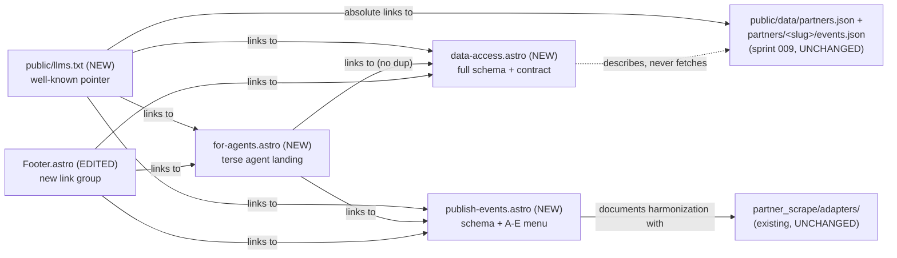

<!-- CLASI: Before changing code or making plans, review the SE process in CLAUDE.md -->

# Sprint 010: Discovery surfaces

## Goals

Make the data sprint 009 publishes easy for both machines and partner
organizations to find and use — two connected discovery surfaces, both
depending on sprint 009's export having landed first.

1. **`llms.txt` and agent discovery pages** (issue 16). Add a
   well-known discovery layer so an LLM/agent landing on the site can
   find the published `partners.json` / per-partner `events.json` /
   past-events files (issue 15, sprint 009) without guessing: an
   `llms.txt` at the site root pointing straight at the data files, a
   human-and-agent-readable "how to consume our data" page documenting
   shape and the "given `partners.json` + a partner's event files you
   can fully reconstruct the site" contract, and a page authored
   specifically for LLM consumption that `llms.txt` links to.
2. **Multi-pronged event-publishing strategy for partners** (issue 17).
   Publish a human- and LLM-readable page telling a partner how to make
   their events easy for the scraper to ingest, offering several
   standard publishing methods a partner can pick from — ordered
   easiest-adoption first: a `.well-known` discovery pointer file (A),
   sitemap + schema.org `Event` JSON-LD (B), an already-supported iCal
   feed (C, pure documentation — the `ical` adapter already ingests
   these), OpenActive as a stretch goal (D), and our own documented JSON
   in the issue-15 schema as a universal fallback (E). Every method
   harmonizes with the existing Adapter framework
   (`partner_scrape/adapters/`) rather than inventing a bespoke
   pipeline, and everything ingested this way lands in sprint 009's
   append-only per-partner store.

Sequencing rationale: issue 17 states explicitly that it builds on issue
16 (the page `llms.txt` points at) and on issue 15's schema (the fields
a published event must carry) — both discovery-surface issues therefore
depend on sprint 009's export landing first, which is why this sprint
follows it. Within this sprint, 16 (the discovery entry points) and 17
(the partner-facing publishing page) are two halves of one surface: 16's
`llms.txt` / LLM page must link to 17's page once it exists, and 17's
page is written for the same agent audience 16's discovery layer
targets — the two are sequenced/reviewed together rather than treated as
fully independent.

Note for detail planning: `docs/design/design.md` (plus per-subsystem
`DESIGN.md`) is being bootstrapped concurrently and `design_docs` is now
`enabled`. This sprint's issue 17 work touches `partner_scrape/adapters/`
(a likely-documented subsystem, if a new JSON-LD extraction rung or a
new `.well-known`/schema-JSON adapter is added) — expect a `design/`
overlay at detail-planning time; no overlay is created now.

## Scope

### In Scope

- `site/public/llms.txt` (or the site's equivalent public root) pointing
  at sprint 009's published data files (issue 16).
- A human/agent-readable "how to consume our data" page documenting the
  export shape and reconstruction contract (issue 16).
- A dedicated LLM-consumption page, linked from `llms.txt` (issue 16).
- A published page documenting the event schema and the A–E
  publishing-method menu for partners (issue 17), prioritizing B
  (schema.org JSON-LD) and C (iCal) per issue 17's own proposed
  first-build order, with A (`.well-known` pointer) to tie discovery
  together.
- Wiring `llms.txt` / the LLM page to link to the future
  publication-workflow page once issue 17's page exists (issue 16's
  explicit scope).

### Out of Scope

- D (OpenActive/RPDE) and E (our-schema JSON fallback) as
  fully-built adapters — issue 17 proposes these as later/stretch work,
  not first-build scope; this sprint may document them on the page
  without shipping the adapters.
- The separate future issue covering how the publication *workflow*
  itself works (the mechanism a partner or agent follows to actually
  publish/consume) — issue 16 only requires linking to that page once it
  exists, not building it now.
- Any change to sprint 009's export shape or storage model — this sprint
  consumes that contract as given; if a mismatch surfaces, it is a
  cross-sprint exception, not silent scope creep here.
- Robot teams work (issue `robot-teams-...`) — entirely independent,
  sprint 011.

## Test Strategy

No new `partner_scrape` production code is written this sprint (see
Architecture) — all four new artifacts live under `site/`, which has no
JS/Astro test harness today (`site/package.json` defines no `test`
script) and this sprint does not add one. Verification is build- and
inspection-based, matching how the site's existing static pages
(`about.astro`, `contact.astro`) are verified.

- **Build check**: `just build` (`--base /partner-scrape`, the GitHub
  Pages configuration) and `just dev` (`--base /`, the default) both
  succeed with all four new artifacts present — exercises both
  base-path configurations any real deployment uses.
- **Link check** (manual): every link `llms.txt`, `data-access.astro`,
  `for-agents.astro`, `publish-events.astro`, and the new footer group
  emit is verified to resolve, including the absolute production data
  URLs in `llms.txt` (Design Rationale D6), checked against what
  `export/publish.py` actually writes
  (`public/data/partners.json`, `public/data/partners/<slug>/events.json`,
  `.../past-events.json`).
- **Schema-drift guard (new pytest)**: one new test in `tests/`
  (ticket 001) asserts every name in `export.writer.SITE_SCHEMA_FIELDS`
  appears in `data-access.astro`'s source text — the one place this
  sprint touches the Python test suite. It guards the site's
  documentation against silently drifting from `export/`'s actual
  contract; it is not a test of new production behavior and does not
  make `export/` a touched subsystem (see Architecture > Design
  Rationale D3).
- **`llms.txt` format check** (manual): validated against the llms.txt
  convention (`# Title`, `> summary` blockquote, `##`-sectioned
  markdown link lists) — no formal linter exists for the format.

## Architecture

**Substantial** — this sprint introduces four new discovery artifacts
(`llms.txt` plus three Astro pages) with a real cross-artifact
dependency graph (`for-agents.astro` links to `publish-events.astro`;
`llms.txt` links to all three pages; `Footer.astro` links to all three
pages), meeting the "3+ modules touched, new cross-module dependency"
substantial signal even though every artifact lives under `site/` — a
directory that is *not* a declared `partner_scrape` source root and
therefore has no `docs/design/` doc.

**Zero `partner_scrape` subsystems are touched by this sprint** (see
Design Rationale D4 for why the ambiguity in this sprint.md's own
detail-planning note is resolved as "documentation only"). Per the
`architecture-authoring` skill's Mode 2a, an opted-in project routes a
compact/substantial sprint's architecture output into the `design/`
overlay *only for changes to a canonical doc the doc set covers* — with
no `partner_scrape` subsystem changed, no canonical doc is affected,
nothing was seeded via `seed_sprint_design_overlay`, and no `design/`
overlay directory exists for this sprint. The full write-up therefore
lives directly in this section, per this sprint's own note ("if you
change none, record the architecture-review gate as skipped with a note
saying why" — the "why" being exactly this: nothing in the covered doc
set changed, not that no architecture happened). A full five-category
self-review was still run against the content below (see this sprint's
planning report); the gate is recorded `passed`, not `skipped`, because
real architectural work exists and was reviewed — see this document's
own Rules on never skipping the self-review for a substantial sprint.

### Architecture Overview

**What changed.** Four new artifacts, all under `site/`:

1. **`site/public/llms.txt`** — Purpose: serve as the well-known entry
   point a machine or agent requests first. Boundary: inside is the
   static pointer file itself (title, summary, and three link
   sections — Data, Documentation, Publishing); outside is the actual
   data serving (sprint 009's `public/data/` tree, unmodified) and the
   documentation content it points to (below). Serves SUC-001.
2. **`site/src/pages/data-access.astro`** (`/data-access`) — Purpose:
   document the published data contract for a reader building an
   integration. Boundary: inside is prose plus a static worked example
   of both file shapes; outside is the live data itself (never fetched
   client-side — Design Rationale D3) and agent-specific terse framing
   (delegated to `for-agents.astro`, not duplicated). Serves SUC-002.
3. **`site/src/pages/for-agents.astro`** (`/for-agents`) — Purpose:
   give an agent a terse, link-dense landing page to act on
   immediately. Boundary: inside is a short statement of what the site
   is, the same data URLs `llms.txt` lists (so the page is
   self-sufficient reached directly), and outbound links; outside is
   the full schema prose (`data-access.astro`) and the publishing menu
   (`publish-events.astro`), both linked rather than restated. Serves
   SUC-003, and the `llms.txt` → page hop of SUC-001.
4. **`site/src/pages/publish-events.astro`** (`/publish-events`) —
   Purpose: tell a partner which standard method makes their events
   easy for the scraper to ingest. Boundary: inside is the event schema
   summary (referencing, not restating, `data-access.astro`'s field
   list) and the A–E method menu, each mapped to the `adapter_type` it
   harmonizes with; outside is any new adapter code (D4 — none ships
   this sprint). Serves SUC-004.
5. **`site/src/components/Footer.astro`** (edited, not new) — Purpose
   of the edit: make the three new pages reachable from every page's
   footer. A new link group is added alongside the existing "Explore"
   group; `Header.astro`'s primary nav is unchanged (D5).

No entity-relationship diagram — no data-model change. No dependency
graph beyond the diagram above — no `partner_scrape` module dependency
changes (nothing in `partner_scrape/` is touched at all; the site
already only ever reads exported JSON, never imports Python, matching
`docs/design/design.md`'s existing repo-boundary description).

**Why.** Sprint 009 shipped the `public/data/` contract but nothing
advertises it: an agent or partner landing on the site has no way to
find it without reading source code. Issues 16 and 17 are two halves of
the same discoverability gap — 16 is the machine-facing entry point,
17 is the partner-facing "how do I contribute to it" counterpart — and
per this sprint's Goals, 16's discovery layer must wire to 17's page,
which is why both ship together rather than as independent sprints.

**Impact on existing components.** `Footer.astro` gains a new link
group (its grid layout goes from four columns to five, including the
existing mobile single-column stack breakpoint); `Header.astro`,
`BaseLayout.astro`, and every existing page are unchanged. No
`partner_scrape` module, test, or CLI surface changes except one new
guard test (Test Strategy) that reads `SITE_SCHEMA_FIELDS` without
modifying `export/`.

### Design Rationale

- **D1 — `llms.txt` lives at `/llms.txt` only, not mirrored under
  `/.well-known/`.** *Context:* issue 16's own open question. `llms.txt`
  (llmstxt.org) is an emerging root-level convention, the same shape as
  `robots.txt`/`sitemap.xml` — not a `.well-known` metadata pointer.
  Issue 17's method A separately proposes a `.well-known` pointer *file*
  for a different purpose (a partner's own feed-location pointer, not
  yet built). Conflating the two would blur two distinct conventions
  under one path. *Alternatives:* mirror at both paths — rejected as a
  second file to keep in sync for no known crawler benefit.
  *Consequences:* none — root-only is what the llms.txt convention
  itself specifies.
- **D2 — `data-access.astro` and `for-agents.astro` are two separate
  pages, not one page serving both audiences.** *Context:* issue 16's
  second open question; issue 16 explicitly names both a full
  human-and-agent page and a distinct terse LLM page. *Alternatives:* a
  single combined page — rejected because full prose (data-access) and
  a terse, link-dense landing page (for-agents, matching the emerging
  llms.txt-companion-page convention) are genuinely different content
  shapes; forcing one page to serve both would compromise either
  readability or terseness. *Consequences:* `for-agents.astro`
  deliberately does not duplicate the schema prose — it links to
  `data-access.astro`, keeping one source of truth for the field list.
- **D3 — documentation pages describe the data contract statically
  (hand-authored example JSON); neither page fetches `public/data/`
  client-side.** *Context:* `public/data/` is pipeline-generated output
  that may not exist in every checkout — confirmed empty in this repo's
  own `site/public/data/` right now. A page that live-fetches it would
  render broken wherever the pipeline hasn't run yet. *Alternatives:*
  client-side fetch of a live example — rejected for that reliability
  reason; an Astro build-time read of a real file — rejected because
  `site/`'s own copy may be stale or absent at any given commit, and
  this is documentation, not a data viewer. *Consequences:* the
  hand-authored example and field list can drift from
  `SITE_SCHEMA_FIELDS` if that ever changes — mitigated, not eliminated,
  by the new pytest guard (Test Strategy), which only catches a field
  being renamed/added/removed, not the worked example's values going
  stale.
- **D4 — no new adapter code, no JSON-LD extraction rung, no
  `.well-known`-pointer-reading logic ships this sprint; methods A–E
  are fully documentation.** *Context:* this sprint.md's own
  detail-planning note flagged this as an open question ("if a new
  JSON-LD extraction rung or a new `.well-known`/schema-JSON adapter is
  added"); issue 17's own Open Questions explicitly leave "which subset
  of A–E do we build first" unresolved and framed "for review"; the
  sprint's In-Scope bullets name only a *published page*, never new
  adapter code. *Alternatives:* build method B (schema.org JSON-LD),
  issue 17's own proposed first-build priority, alongside the page —
  rejected for this sprint because it is a `partner_scrape/extract/`
  and `partner_scrape/adapters/` code change with its own testing
  surface, not a discovery surface, and "which subset to build" is
  explicitly not yet a stakeholder-approved decision. *Consequences:*
  zero `partner_scrape` subsystems are touched this sprint (as stated
  above); a follow-on sprint is needed to actually implement any of A,
  B, D, or E. **Flagged to the team-lead as a scope clarification**:
  sprint.md's own Out-of-Scope bullet named only D and E as
  not-fully-built; this sprint additionally treats A and B the same
  way, for the reasons above.
- **D5 — the three new pages are reachable from `Footer.astro` (a new
  link group), not from `Header.astro`'s primary nav.** *Context:*
  `Header.astro`'s four `navItems` are the primary visitor-facing
  sections (Opportunities/Partners/About/Contact); the new pages target
  a narrower audience (developers, partner-organization staff, and
  agents). *Alternatives:* add a fifth primary nav item — rejected as
  diluting the general-visitor nav with developer-facing content.
  *Consequences:* discoverability for a first-time general visitor is
  intentionally lower than for an `llms.txt`-reading agent — by design,
  matching the existing "Explore" footer group's role as the secondary
  nav tier. `llms.txt` itself is not linked from the footer, matching
  how `robots.txt`/`sitemap.xml` are conventionally undiscoverable from
  human nav.
- **D6 — `llms.txt` uses absolute production URLs
  (`https://www.sdstemecosystem.org/...`), not `BASE_URL`-relative
  paths.** *Context:* `site/public/llms.txt` is a static file copied
  byte-for-byte into every build (`just build`'s `/partner-scrape` base
  included) — unlike `.astro` pages, it cannot read
  `import.meta.env.BASE_URL` at copy time, so a root-relative path
  (`/data/partners.json`) would be wrong under the GitHub Pages base.
  *Alternatives:* per-deployment templating of `llms.txt` at build time
  — rejected as new build tooling for one file; base-relative paths,
  correct only for the `/` deployment — rejected as silently wrong on
  GitHub Pages. *Consequences:* matches `BaseLayout.astro`'s own
  existing canonical-URL fallback (`Astro.site || 'https://www.sdstemecosystem.org'`),
  which already treats that domain as canonical — no new precedent set.

**Open questions carried into implementation:** (1) whether
`data-access.astro`'s schema description should eventually be generated
from `SITE_SCHEMA_FIELDS` at build time rather than hand-authored and
guarded by a test (D3) — deferred; the guard test is sufficient at this
field count; (2) which subset of issue 17's A–E methods actually gets
built, and in what sprint — explicitly left open by D4; (3) whether
production (`sdstemecosystem.org`) already has a real `public/data/`
tree published at the time this sprint ships — an operational question,
not a design one (see Migration Concerns).

**Judged out of scope:** building methods A, B, D, or E as working
code (D4) — recommended as a follow-on sprint once issue 17's "which
subset first" open question gets a stakeholder answer, not folded in
here.

### Migration Concerns

None in the data/schema sense — no `partner_scrape` module changes, so
nothing to re-run or version-bump in the pipeline. All four new
artifacts are purely additive; the only existing file that changes is
`Footer.astro` (a new link group, added alongside the existing ones,
not replacing them).

One deployment-sequencing note, not a migration: `llms.txt` and
`data-access.astro` state, as fact, that `public/data/partners.json`
and per-partner event files exist and are current. That is true of
sprint 009's *code* but depends on an operational step outside this
sprint's control — a real pipeline run followed by `publish.project()`
having executed against whichever site checkout serves production
before these pages go live. If that has not happened yet, the data-file
links in `llms.txt` 404 until the next scheduled run, while the three
documentation pages themselves still render correctly (they describe
the contract; they do not depend on the files existing). Flagged to the
team-lead as a pre-launch check, not solved in code here.

## Use Cases

These four use cases introduce two actors not yet present in the
canonical `docs/design/usecases.md` (whose actor list today is Engine,
Operator, Visitor, Fleet): **Agent** (an LLM/bot consuming published
data) and **Partner** (an organization self-publishing events, distinct
from Operator, who registers sources on partners' behalf in UC-008
today). Each SUC below parents to the closest existing UC rather than
minting a new top-level UC ID, matching sprint 009's SUC-004–007
precedent (new capability, existing parent) — promoting Agent/Partner to
first-class actors in `usecases.md` is a consolidation-time decision,
not this sprint's to make.

### SUC-001: Publish the `llms.txt` discovery pointer
Parent: UC-006

- **Actor**: Agent
- **Preconditions**: Sprint 009's `public/data/` tree is published at
  the serving site; SUC-002, SUC-003, and SUC-004's pages exist at
  their final URLs (this ticket ships last within the sprint — see
  Tickets).
- **Main Flow**:
  1. Agent (or any HTTP client) requests `<site-root>/llms.txt`.
  2. The file's title and one-paragraph summary state the site's
     purpose.
  3. A "Data" section lists the absolute URL of `partners.json` and
     documents the per-partner `events.json`/`past-events.json` URL
     pattern.
  4. A "Documentation" section links to `/data-access` (full contract)
     and `/for-agents` (terse landing).
  5. A "Publishing" section links to `/publish-events`, satisfying
     issue 16's requirement to wire the discovery entry point to the
     partner publication page.
- **Postconditions**: An agent that has read only `/llms.txt` can reach
  every other discovery surface and the raw data files without
  guessing a URL.
- **Error Flows**: None — `llms.txt` is a static file. A linked page
  404ing because production data hasn't been published yet is an
  operational Migration Concern, not a coded error path.
- **Acceptance Criteria**:
  - [ ] `site/public/llms.txt` exists, served at `/llms.txt` under both
        `just dev` and `just build`.
  - [ ] Follows the llms.txt convention: `# Title`, `>` summary,
        `##`-sectioned markdown link lists.
  - [ ] Every link is an absolute `https://www.sdstemecosystem.org/...`
        URL (Design Rationale D6), never base-relative.
  - [ ] Links to `partners.json`, the `events.json`/`past-events.json`
        URL pattern, `/data-access`, `/for-agents`, and
        `/publish-events` are all present.
  - [ ] Not mirrored under `/.well-known/` (Design Rationale D1).

### SUC-002: Publish the "how to consume our data" page
Parent: UC-006

- **Actor**: Agent
- **Preconditions**: Sprint 009's `public/data/` contract is stable
  (it is — sprint 009 closed).
- **Main Flow**:
  1. A reader (human or agent) navigates to `/data-access` — directly,
     via `llms.txt`, or via the footer.
  2. The page documents the two-file shape (`partners.json` roster plus
     per-partner `events.json`/`past-events.json`), the
     `generated_at`/count envelope convention, and the exact event
     field list.
  3. The page states the reconstruction contract in one place: given
     `partners.json` plus each referenced partner's event files, no
     other data source is needed to reproduce the site's opportunity
     data.
  4. A hand-authored, static worked example shows a trimmed
     `partners.json` entry and a matching `events.json` entry (Design
     Rationale D3 — never live-fetched).
- **Postconditions**: A reader can write a client against
  `public/data/` without reading any source code.
- **Error Flows**: None — static documentation page.
- **Acceptance Criteria**:
  - [ ] `site/src/pages/data-access.astro` exists at `/data-access`,
        using `BaseLayout` like every other page.
  - [ ] Documents every name in `export.writer.SITE_SCHEMA_FIELDS`,
        verified by the new pytest guard (Test Strategy).
  - [ ] States the reconstruction contract explicitly, in the page's
        own words.
  - [ ] Includes at least one worked example of both file shapes.
  - [ ] Linked from `llms.txt` and from `Footer.astro`'s new link
        group.

### SUC-003: Publish the LLM-dedicated consumption page
Parent: UC-006

- **Actor**: Agent
- **Preconditions**: SUC-002 (`/data-access`) and SUC-004
  (`/publish-events`) exist at their final URLs — this page links to
  both rather than duplicating their content.
- **Main Flow**:
  1. An agent follows `llms.txt`'s link to `/for-agents`.
  2. The page opens with a short, dense statement of what the site is
     and what data is available — no marketing prose.
  3. It states the exact data URLs (mirroring `llms.txt`'s Data
     section, so the page is self-sufficient reached directly) and
     links to `/data-access` for the full schema rather than repeating
     it.
  4. It links to `/publish-events`, for an agent acting on a partner's
     behalf that wants to know how that partner could publish data
     back.
- **Postconditions**: An agent reaching this page by any route
  (`llms.txt`, footer, direct link) has everything needed to start
  fetching data within one page.
- **Error Flows**: None.
- **Acceptance Criteria**:
  - [ ] `site/src/pages/for-agents.astro` exists at `/for-agents`.
  - [ ] Does not duplicate `data-access.astro`'s full schema prose —
        links to it instead (Design Rationale D2).
  - [ ] Links to `/publish-events` — issue 16's "must link to that
        page" requirement, satisfied within this sprint since issue
        17's page ships alongside.
  - [ ] Reachable from `llms.txt` and `Footer.astro`'s new link group.

### SUC-004: Publish the partner event-publishing-strategy page
Parent: UC-008

- **Actor**: Partner
- **Preconditions**: None beyond the existing Adapter framework
  (`partner_scrape/adapters/`) and issue 15's published schema, both
  already stable.
- **Main Flow**:
  1. A partner (or their developer/agent) reaches `/publish-events` via
     `llms.txt` → `/for-agents`, the footer, or a direct link shared by
     League staff.
  2. The page states the event field set the scraper ultimately needs
     — the same `SITE_SCHEMA_FIELDS` documented on `/data-access`,
     referenced, not re-derived.
  3. The page presents the A–E method menu, easiest-adoption-first,
     each entry naming the existing `adapter_type` it harmonizes with
     today (C → the registered `ical` adapter) versus which are
     proposed/future work not yet built (A, B, D, E — explicitly
     labeled as such, Design Rationale D4).
  4. For each future method, the page states which adapter-framework
     family it would join (a new `adapter_type`, one line in
     `adapters/__init__.py`, per the existing registration pattern)
     without claiming any of them exist yet.
- **Postconditions**: A partner can pick a method and either act on it
  immediately (C, today) or understand what's proposed for later (A,
  B, D, E), without being misled about what's currently supported.
- **Error Flows**: A partner picking a not-yet-built method (A, B, D,
  E) has no path to act today — the page must not imply otherwise.
- **Acceptance Criteria**:
  - [ ] `site/src/pages/publish-events.astro` exists at
        `/publish-events`.
  - [ ] Documents methods A–E in issue 17's easiest-first order, each
        explicitly labeled supported-today (C only) vs.
        proposed/future (A, B, D, E).
  - [ ] References the same field list as `/data-access` rather than
        restating it independently.
  - [ ] Does not claim or imply any new adapter code ships this
        sprint.
  - [ ] Linked from `llms.txt`, `/for-agents`, and `Footer.astro`'s new
        link group.

## GitHub Issues

(GitHub issues linked to this sprint's tickets. Format: `owner/repo#N`.)

## Definition of Ready

Before tickets can be created, all of the following must be true:

- [ ] Sprint planning document is complete (sprint.md, including its
      Architecture and Use Cases sections)
- [ ] Architecture review passed (or skipped, for changes with no
      architectural impact)
- [ ] Stakeholder has approved the sprint plan

## Tickets

| # | Title | Depends On |
|---|-------|------------|
| 001 | Data-access page - how to consume our data | — |
| 003 | Partner event-publishing strategy page | 001 |
| 002 | LLM consumption page (for-agents) | 001, 003 |
| 004 | llms.txt discovery pointer and footer cross-linking | 001, 002, 003 |

Tickets execute serially in the order listed above (001 → 003 → 002 →
004), not by ticket number — 002 (for-agents) links to 003
(publish-events), so 003 must land first; 004 (llms.txt + footer) is
the index and needs all three page URLs finalized, so it runs last.
