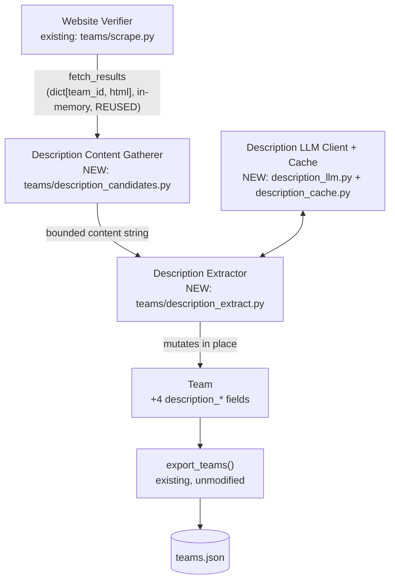
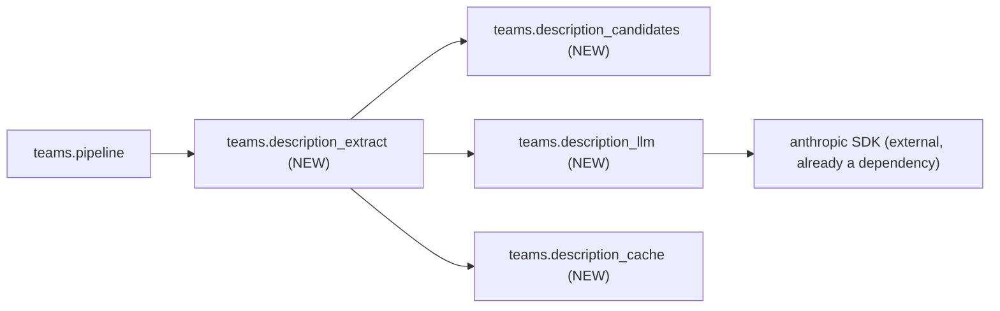

<!-- CLASI: Before changing code or making plans, review the SE process in CLAUDE.md -->

# Sprint 021: Team Website Verification and Description Extraction

## Goals

1. Verify whether the 31 team websites (plus 21 social-only teams)
   discovered by sprint 013's agent-assisted research ever reached
   `teams.json` with a correct `website_status`, and close whatever gap
   the audit finds — without inventing import work that already happened
   (issue 44, part 1).
2. Extract a short "about this team" description from each team's
   confirmed website and publish it as new fields on the team record,
   following the sponsor-extraction anti-hallucination pattern exactly:
   deterministic content gathering first, an LLM that only summarizes
   that gathered text, provenance + fetch date stored, no blurb rather
   than a hallucinated one, cached by content hash, and a structural
   guarantee that no contact email ever reaches the published field
   (issue 44, part 2).

## Problem

Issue 44 was originally filed as a two-part issue covering both this
repo's data pipeline and a team detail page in `stem-ecosystem`. Sprint
019 removed `site/` from partner-scrape entirely, so the site-side half
no longer lives here — it was rescoped 2026-08-31 to the pipeline-side
half only and handed to stem-ecosystem's own backlog (see the issue
file's Handoff section). What remains for this repo:

**Part 1 — did the discovered-website import actually happen?** Sprint
013 ticket 006 added `teams/website_overrides.py` and a committed
`teams/data/discovered-websites.toml`, described in its own module
docstring as "transcribed verbatim" from sprint 013's
`research/discovered-websites.json`. The issue asks us not to trust that
description at face value and to verify directly. A stem-ecosystem peer
also flagged a related, more specific risk during this sprint's own
planning: if `Team.website_status` were ever empty or stuck at a
non-`"confirmed"` value for an overlay-sourced website, a site-side
detail-page guard keyed on `website_status == "confirmed"` would wrongly
hide a real, working link — and that would be a data problem on this
side, not a rendering bug on theirs.

**Part 2 — teams.json carries no descriptive text.** Today `Team`
carries roster/location/sponsor metadata but nothing that tells a site
visitor what a team actually *is* beyond its number and school. The
fetch machinery to reach each team's website already exists (sprint
013's `verify_team_websites()`/`fetch_results`); nothing yet turns that
fetched page into a short, trustworthy description, and any such
extraction carries the same hallucination and privacy risks sponsor
extraction already solved once (a model confidently inventing content,
or a scraped page's contact details leaking into a published field —
`teams/model.py`'s "no email field, ever" invariant exists for exactly
this reason).

## Solution

**Part 1.** Verified directly against the repository (not assumed from
the issue's own framing, and not assumed from the issue's own framing
alone): `teams/data/discovered-websites.toml` contains 52 entries — 31
with a `website` key, 21 social-only — which is an exact match to sprint
013 research's own `meta.websites: 31` / `meta.social_only: 21` counts.
The import already happened. This sprint's ticket 001 is therefore
audit-and-close, not (re-)import: confirm the parity precisely (a
real-data regression test, not just eyeballing), confirm and
regression-test that `website_status` is architecturally guaranteed to
be set for every overlay-sourced website (`teams/pipeline.py`'s stage
order already runs `apply_website_overrides()` immediately before
`verify_team_websites()`, unconditionally, every run — confirmed by
reading the pipeline code, not merely trusting its docstring), and close
the one real coverage gap found: no existing test exercises an
overlay-*only*-sourced website (one absent from the upstream source,
present only in the TOML) through the full `run_teams()` chain end to
end. No production code change is expected; the ticket's scope may only
grow if its own required live-run verification (Test Strategy) surfaces
an actual defect.

**Part 2.** Four new modules under `teams/`, mirroring sprint 013's
sponsor-extraction module set in shape (never by import):
`description_candidates.py` (deterministic, offline: meta description
tag, title, heading/body text from the page already fetched for
sponsors — bounded, never a full page to the LLM), `description_llm.py`
(an injectable client whose only contract is *summarizing* the
already-gathered bounded text, never generating from open context —
mirroring `sponsor_llm.py`'s classify-don't-generate contract, adapted
to summarize-don't-generate), `description_cache.py` (content-hash
cache, mirroring `sponsor_cache.py`), and `description_extract.py`
(orchestration: gather → cache → summarize → validate → guard → publish,
fail-open per team). Reuses the exact same `fetch_results` dict
`verify_team_websites()`/`extract_sponsors()` already produce and
consume — no second fetch, no new transport. Four new flat fields land
on `Team` (`description`, `description_status`, `description_provenance`,
`description_fetched_at`); `teams/export.py` needs no code change at all
— `TEAMS_SCHEMA_FIELDS` already auto-derives from `dataclasses.fields(Team)`.

Per a stem-ecosystem peer's refinement during this sprint's planning,
the new fields deliberately carry **two independent, separately
inspectable signals**, not one collapsed "has a blurb" bit: whether the
site was reachable at all is the *existing* `Team.website_status`
(unchanged, still the dead-link-guard's concern); whether the
deterministic gathering pass found anything worth summarizing is the
*new* `Team.description_status`. A site that is reachable but yields no
usable text (a pure-JS site, a single-image homepage) is a different,
independently-true fact from a site that could not be reached at all —
collapsing them into one flag would force any future consumer to infer
one from the other.

## Success Criteria

- [ ] The parity between `teams/data/discovered-websites.toml` and
      sprint 013's `research/discovered-websites.json` is proven by a
      test against the real committed file, not asserted from memory.
- [ ] A hermetic end-to-end test proves an overlay-only-sourced website
      reaches `website_status confirmed`/`unverified` (never left at an
      unset default) through the real `run_teams()` chain.
- [ ] A live `partner-scrape teams --dry-run -v` run (required before
      close) reports the real `website_status` distribution across the
      current registry, closing out the audit with actual numbers, not
      just code-level reasoning.
- [ ] `Team` carries `description`/`description_status`/
      `description_provenance`/`description_fetched_at`, and a confirmed
      team's fetched page flows through deterministic gathering then LLM
      summarization to populate them.
- [ ] No description is ever published for a site with no usable
      gathered content — `description_status` reads `"unavailable"`,
      never a fabricated sentence.
- [ ] An explicit, dedicated test proves an email address present in
      gathered page content or in an LLM's raw response never reaches
      the published `description` field.
- [ ] Re-running extraction over unchanged fetched content makes zero
      new LLM calls (content-hash cache hit).
- [ ] `teams.json`'s existing whole-payload no-email regression test
      (`TestNoEmailInExport`) is exercised against output that includes
      a generated description, not just sponsor/roster fields.
- [ ] Full existing test suite stays green; no test touches live network
      or writes into this repo's real `data/`, `teams/data/
      discovered-websites.toml`, or `teams/data/fll-sd-teams.tsv`.

## Scope

### In Scope

- Auditing sprint 013's discovered-website import against the real
  committed data file and research artifact.
- Closing the specific end-to-end test gap found (overlay-only website
  → `website_status`), and any production-code gap the required live
  dry-run actually surfaces (not assumed in advance).
- Four new `teams/` modules for deterministic content gathering, LLM
  summarization, caching, and orchestration.
- Four new flat fields on `Team`, auto-published via the existing
  `teams/export.py` field-derivation mechanism (no `export.py` change).
- `teams/pipeline.py` wiring (a new stage, reusing the existing
  `fetch_results` dict) and a `--no-descriptions` CLI escape hatch,
  mirroring `--no-sponsors` exactly.
- The explicit no-email guard and its dedicated test.

### Out of Scope

- Any change to `site/` or `stem-ecosystem` — the site-side half (link-
  visibility audit, rendering the new blurb with attribution) is
  rescoped to stem-ecosystem's own backlog per the issue's Handoff
  section, and this repo has had no `site/` directory since sprint 019.
- Re-running or re-verifying the sprint 013 web-search discovery pass
  itself (finding *more* team websites) — this sprint audits what
  already landed, it does not go looking for new ones.
- Any change to sponsor extraction's own modules/behavior — description
  extraction is a new, parallel subsystem that mirrors sponsor
  extraction's shape, never modifies it.
- Multi-page crawling (a dedicated "/about" page fetch, sitemap
  discovery for team sites) — content gathering operates on the single
  homepage page already fetched for sponsor extraction, matching this
  sprint's tight scope and the issue's explicit "the fetch machinery
  already exists" framing.
- Deciding whether stem-ecosystem's UI actually adopts
  `description_status` for its three rendering surfaces (card badge,
  facet, link guard) — this sprint makes the data available with the
  right shape; that adoption decision belongs to stem-ecosystem's own
  backlog.

## Test Strategy

Fixture-based and hermetic by default, matching sprint 013's own
convention exactly (fixtures captured from or copied verbatim from real
data, never hand-authored — the sprint 011 ticket-011-003 lesson already
on record in this codebase: a hand-authored fixture silently passed
every unit test while the real pipeline dropped 59 of 78 FRC teams).

- **Ticket 001 (audit)**: a real-data regression test parses the actual
  committed `teams/data/discovered-websites.toml` (not a fixture copy)
  and asserts exactly 31 `website` entries and 21 social-only entries
  (52 total), matching sprint 013 research's own meta counts. A new
  hermetic `run_teams()` wiring test (in `tests/teams/test_pipeline.py`,
  alongside the existing sponsor-wiring tests) drives a stub team whose
  `website` is empty on the source but present only in a fixture overlay
  file, through the real `apply_website_overrides()` →
  `verify_team_websites()` chain, and asserts `website_status` ends
  `"confirmed"` (fixture 200) — closing the gap that every existing
  wiring test sets `website=` directly on the stub `Team`, never
  exercising the overlay-population path itself end to end.
- **`teams/description_candidates.py`**: fixture HTML representative of
  real team-site shapes — a page with a `<meta name="description">` tag,
  a page with only a title and headings, a page with a body paragraph
  containing an email address in prose (proving the gathering pass
  strips it before it ever becomes LLM input), and a page with no
  extractable content at all (parked-domain placeholder, pure-JS shell)
  returning empty content — the cost-control gate that keeps the LLM
  stage from ever being called on nothing.
- **`teams/description_llm.py` / `description_cache.py`**: a
  `FixtureDescriptionLLMClient` double, mirroring
  `FixtureSponsorLLMClient`, drives every summarization test with no
  network/API call. A cache hit (same team, same content hash) makes
  zero LLM calls (call-counting assertion, matching
  `enrich/cache.py`'s/`sponsor_cache.py`'s own test convention).
- **`teams/description_extract.py`**: the explicit, dedicated no-email
  guard test the issue calls for — a fixture LLM response containing an
  email address is rejected and never published, `description_status`
  reads `"unavailable"`, logged. An empty LLM response (the model
  correctly found nothing to summarize) also yields `"unavailable"`,
  never an empty-string-but-`"generated"` state. A missing
  `ANTHROPIC_API_KEY` or any LLM/cache failure is caught per team,
  fail-open, and never aborts the run for any other team (matching
  `enrich/`'s and `sponsor_extract.py`'s "fail open, always" convention).
- **`teams/pipeline.py` wiring**: a `--no-descriptions` test mirroring
  the existing `--no-sponsors` wiring test (extraction skipped, website
  verification and sponsor extraction still run); a default-construction
  test mirroring the existing `AnthropicSponsorLLMClient`/`SponsorCache`
  test, proving `AnthropicDescriptionLLMClient()`/`DescriptionCache()`
  construct without raising when no confirmed page has gatherable
  content, so that path never touches the real Anthropic SDK either.
- **Export regression**: `tests/teams/test_export.py`'s
  `_real_fixture_teams()` helper is extended to also run one team's
  fetched page through the new `extract_descriptions()` (fixture client,
  no network) exactly as sprint 013 ticket 005 already extended it for
  sponsor extraction — so `TestNoEmailInExport`'s existing whole-payload
  email-pattern sweep automatically covers the new `description` field,
  plus a new sanity test (mirroring `TestSponsorExtractionFixtureIsWired`)
  proving that fixture path is actually live, not silently vacuous.
- **Pre-close live validation (required, not optional)**: run
  `partner-scrape teams --dry-run -v` against the real, live registry
  and report `website_status` and `description_status` distributions.
  A human samples a handful of generated descriptions for fabrication or
  leaked contact info before this sprint closes — mirroring sprint 013's
  own required sponsor-sampling step.
- Full existing suite (`uv run pytest`) stays green. No test writes into
  this repo's real `data/` directory (the existing `_own_data_dir_default`
  autouse fixture pattern in `tests/teams/test_export.py` is reused/
  extended, not reinvented) or the real `teams/data/
  discovered-websites.toml`/`fll-sd-teams.tsv` (ticket 001's regression
  test only reads the former).

## Architecture

**Substantial** — this sprint composes four new modules
(`description_candidates.py`, `description_llm.py`,
`description_cache.py`, `description_extract.py`) into a new pipeline
stage and changes the `Team` data model (four new fields). Either signal
alone (a data-model change, or 3+ new modules newly composed together)
clears the substantial bar per this project's own sizing convention;
both are present here. Ticket 001 (the import audit) is, on its own, a
verification-and-one-test-gap ticket with no structural change — it does
not push the sprint's tier by itself, but the sprint as a whole is sized
by Part 2's real structural addition.

**What changed, in one paragraph per capability:**

*Website-import verification (ticket 001).* No new module, no new
field. `teams/website_overrides.py`'s existing `apply_website_overrides()`
and `teams/scrape.py`'s existing `verify_team_websites()` are unchanged;
this sprint adds one real-data regression test (parity between the
committed overlay TOML and its research source) and one end-to-end
pipeline wiring test (overlay-only website → `website_status` through
the real `run_teams()` chain) that should already pass against the
current code, closing a coverage gap rather than fixing a defect.

*Description extraction (tickets 002-004).* Mirrors sponsor
extraction's module shape exactly, one module per concern:
`description_candidates.py` (pure, offline HTML → a single bounded
content string — meta description, title, heading/body text, capped,
with page fetched content lifted only from the already-confirmed
homepage), `description_llm.py` (injectable `DescriptionLLMClient`
protocol + `AnthropicDescriptionLLMClient` + `FixtureDescriptionLLMClient`,
mirroring but never importing `sponsor_llm.py`), `description_cache.py`
(content-hash cache, mirroring but never importing `sponsor_cache.py`),
orchestrated by `description_extract.py`, which runs once per team with
an entry in the existing `fetch_results` dict: gather content, check the
cache, summarize on a miss (constrained to *summarizing the given text*,
never generating from open context), reject any result containing an
email-shaped string (defense-in-depth on top of the gathering pass's own
scrub and the prompt's own instruction), and set four new `Team` fields
with provenance and a fetch timestamp. `teams/pipeline.py` gains one new
sequenced stage, after `canonicalize_sponsors()`/`--no-sponsors` and
before `export_teams()`, reusing `fetch_results` — no second fetch.
`cli.py` gains a `--no-descriptions` escape hatch mirroring
`--no-sponsors`. `teams/export.py` is unmodified — its
`TEAMS_SCHEMA_FIELDS` already auto-derives from `dataclasses.fields(Team)`.

### Architecture Overview

| Module | Change | Use case served |
|---|---|---|
| `teams/data/discovered-websites.toml` | No change — verified, not re-imported | SUC-021 |
| `teams/website_overrides.py` | No change — verified via new tests | SUC-021 |
| `teams/scrape.py` | No change — verified via new tests | SUC-021 |
| `teams/model.py` | + `description: str`, + `description_status: str`, + `description_provenance: str`, + `description_fetched_at: str` | SUC-023 |
| `teams/description_candidates.py` (new) | `gather_description_content()`: deterministic, offline HTML → bounded content string | SUC-022 |
| `teams/description_llm.py` (new) | `DescriptionLLMClient` protocol, `DescriptionExtractionResult`, real `AnthropicDescriptionLLMClient`, fixture double | SUC-023 |
| `teams/description_cache.py` (new) | Content-hash cache for description summarization results | SUC-023 |
| `teams/description_extract.py` (new) | Orchestrates gather → cache → summarize → email-guard → publish, fail-open | SUC-023 |
| `teams/pipeline.py` | Sequences `extract_descriptions()` after sponsor canonicalization; new `description_llm_client`/`description_cache`/`no_descriptions` params, lazily constructed | SUC-023 |
| `cli.py` | `--no-descriptions` flag on the `teams` subcommand | SUC-023 |
| `teams/export.py` | No change — `TEAMS_SCHEMA_FIELDS` auto-derives from `Team`'s dataclass fields | SUC-023 |

**Component/Module Diagram** (required: 4 new modules newly composed
into one pipeline stage):

**Dependency Graph** (required: new intra-subsystem edges introduced):

No new edge crosses into `enrich/`, `adapters/`, `normalize.run()`, or
`pipeline.run()` — `teams/`'s standing zero-edges invariant
(`teams/DESIGN.md`'s Purpose/Constraints, `tests/teams/
test_sources_base.py`'s forbidden-import precedent) is unaffected; every
new edge above is internal to `teams/` or a reuse of an already-present
external dependency (the `anthropic` SDK, already imported by
`sponsor_llm.py`).

No entity-relationship diagram: the only data-model change is four new
flat fields on the existing `Team` entity, with no new entity or
relationship — fully described in the table above and in Design
Rationale below.

### Design Rationale

- **Decision: description extraction lives entirely inside `teams/` as
  new modules that mirror, but never import, `sponsor_llm.py`/
  `sponsor_cache.py`/`sponsor_extract.py`.** *Context:* those three
  modules already mirror-not-import `enrich/llm_client.py`/`enrich/cache.py`
  for the identical reason. *Alternatives considered:* import the
  sponsor modules' `SponsorLLMClient`/`SponsorCache`/orchestration
  directly and generalize them — rejected; `SponsorLLMClient.
  classify_sponsors()` is typed to a candidate-*list*-in,
  confirmed-subset-out shape (a selection problem), while description
  extraction is a bounded-text-in, short-summary-out shape (a
  summarization problem) — forcing one protocol to serve both would
  either widen its signature for every existing sponsor call site or
  require an awkward wrapper, for a savings of a few hundred lines of
  structurally similar but semantically distinct code. *Why this
  choice:* `teams/`'s established convention (this is now the second
  mirror-of-a-mirror in this subsystem) is that each LLM-backed concern
  gets its own small client/cache pair rather than a shared abstraction
  reached for prematurely — matching `sponsor_llm.py`'s own stated
  reasoning almost verbatim. *Consequences:* `description_llm.py`
  duplicates `sponsor_llm.py`'s ~15-line JSON-schema-from-dataclass
  helper and `description_cache.py` duplicates `sponsor_cache.py`'s
  content-hash-plus-schema-version shape; both are cheap and
  self-contained, matching the accepted cost sponsor extraction already
  took on for the same tradeoff against `enrich/`.
- **Decision: the LLM's role is constrained summarization of
  deterministically-gathered, bounded text, never open-ended generation
  from raw HTML or open context.** *Context:* the issue explicitly
  requires mirroring sponsor extraction's anti-hallucination shape.
  *Alternatives considered:* send the LLM the whole fetched page (or a
  large HTML slice) and ask it to describe the team — rejected, exactly
  the failure mode sponsor extraction's own Design Rationale already
  named and solved once ("an LLM asked ... over open text will
  confidently return" something not actually on the page); a
  prompt-only "don't make things up" instruction with no bounded-input
  constraint — rejected, no structural backstop, matching sponsor
  extraction's identical rejection of the same shortcut. *Why this
  choice:* narrowing the LLM's input to only what
  `description_candidates.py` deterministically gathered makes
  fabricating a fact about a team not present on its own page
  structurally harder, not merely discouraged — the deterministic
  gathering pass is the boundary, the LLM only summarizes within it,
  exactly sponsor extraction's own framing applied to summarization
  instead of classification. *Consequences:* a team whose real
  distinguishing content lives somewhere the bounded gathering pass
  doesn't reach (a deep "About" page this sprint deliberately does not
  crawl — see Scope) gets no description rather than a plausible-sounding
  guess — the same accepted false-negative-over-false-positive tradeoff
  sponsor extraction's own Design Rationale already made.
- **Decision: two independent, separately-inspectable status signals —
  reuse the existing `Team.website_status` for "the site was reachable,"
  add a new `Team.description_status` for "gathering found something
  worth summarizing" — rather than one collapsed flag.** *Context:*
  raised directly by a stem-ecosystem peer during this sprint's own
  planning: the site wants to converge three currently-inconsistent
  rendering surfaces (a card badge, a "Has a Website" facet, and the
  detail-page link guard) onto "do we have something worth showing a
  visitor," and that answer is not the same question as "did the fetch
  succeed" — a reachable site can still have nothing extractable (a
  pure-JS site with no server-rendered text, a single-image homepage).
  *Alternatives considered:* infer content-usability from
  `description` being non-empty alone, with no separate status field —
  rejected; it conflates "never attempted" (site not `confirmed`) with
  "attempted, found nothing," losing exactly the diagnostic distinction
  the peer asked for, and forces every consumer to re-derive the same
  three-way logic independently (the inconsistency the peer's message
  described as the current problem). *Why this choice:* `website_status`
  keeps doing its existing job unchanged (the dead-link-guard's actual
  concern, per the site's separate issue 49); `description_status` is
  the new, independently-inspectable "worth showing" signal, sized to
  exactly the question the site asked to converge on. *Consequences:*
  four new fields instead of one — an accepted cost for the diagnostic
  and cross-surface-convergence value; `by_description_status` is a
  natural future addition to `teams.json`'s `meta` block (matching
  `by_league`/`by_location_precision`'s existing convention) if the
  operational visibility proves useful, not built this sprint (see Open
  Questions).
- **Decision: no second fetch — description extraction reuses the exact
  `fetch_results` dict `verify_team_websites()`/`extract_sponsors()`
  already produce and consume.** *Context:* the issue states the fetch
  machinery already exists and should be reused, not rebuilt. *Why this
  choice:* a second independent fetch would double network load against
  every confirmed third-party team site for no benefit, and would
  reopen a guarantee sprint 013 already established and tested — fetched
  HTML is a local, non-model `dict[team_id, str]`, never assigned to any
  `Team` field, because `TEAMS_SCHEMA_FIELDS`'s dataclass-derivation
  means anything added to `Team` auto-publishes. Reusing the same dict
  keeps that guarantee unchanged rather than re-deriving it for a second
  fetch path. *Consequences:* `extract_descriptions()` must be sequenced
  inside `run_teams()` after `verify_team_websites()` produces
  `fetch_results`, the same single-call-sequencing coupling
  `extract_sponsors()` already accepts.
- **Decision: the no-email guard is layered three ways — gathered-content
  scrubbing, an explicit prompt instruction, and a code-level regex
  rejection of the final result — mirroring `sponsor_extract.py`'s
  three-layer denylist precedent for a different failure mode.**
  *Context:* `teams/model.py`'s "no email field, ever" invariant is
  structural for `Team`'s own fields, but sponsor names are a *closed*,
  verbatim-validated list (a membership check is sufficient); a
  description is free-form LLM output, where the equivalent structural
  guarantee has to be a content check, not a membership check.
  *Alternatives considered:* rely on the prompt instruction alone —
  rejected, the same "no structural backstop" reasoning sponsor
  extraction already rejected for its own classification step, now
  applied to a PII leak instead of a wrong company name. *Why this
  choice:* three independent layers (strip obvious email-shaped
  substrings before the LLM ever sees the gathered text; instruct the
  model explicitly never to include contact information; reject any
  final result matching an email pattern, in code, before publishing)
  means a single layer's failure — the model echoing something the
  scrub missed, or a malformed prompt — does not alone leak a contact
  detail. *Consequences:* the existing project-wide `TestNoEmailInExport`
  regression (a whole-payload email-pattern sweep over `teams.json`)
  becomes, once this sprint's fixture corpus exercises the new field
  (Test Strategy), an additional fourth, independent backstop layer at
  the export boundary — not relied upon alone, since it would only catch
  a defect after publish, but a real, already-existing safety net this
  sprint inherits for free.
- **Decision: `description_status`/`description_provenance`/
  `description_fetched_at` are new flat string fields, not a nested
  object.** *Context:* every existing status/provenance pair on `Team`
  (`website`/`website_status`, `sponsors`/`sponsor_provenance`) is flat.
  *Alternatives considered:* a single nested `description: {"text":
  ..., "status": ..., "provenance": ..., "fetched_at": ...}` value —
  rejected; it breaks `TEAMS_SCHEMA_FIELDS`'s flat
  dataclass-field-name-to-JSON-key derivation for no benefit, and
  diverges from every existing precedent pair on this dataclass for
  reasons specific to this field alone. *Why this choice:* consistency
  — a consumer already familiar with `website`/`website_status`'s shape
  needs no new convention to read `description`/`description_status`.
  *Consequences:* four separate top-level keys land in `teams.json`
  instead of one nested object — matches the existing shape of every
  other field on the record.

### Migration Concerns

- **No schema/backfill migration.** The four new fields are ordinary
  `dataclasses.fields()`-derived additions, defaulting to `""`/`"none"`
  — the same auto-derivation precedent `sponsor_provenance` and `social`
  already established; no existing `Team` consumer needs to change to
  tolerate their presence.
- **Ticket 001 may require zero production code changes.** This is a
  deliberate, expected outcome per the issue's own instruction not to
  invent import work that already happened — flagged here rather than
  assumed silently, so it is not mistaken for an incomplete plan. If the
  ticket's own required live dry-run (Test Strategy) surfaces an actual
  defect, that is new information this plan does not currently have, and
  the ticket's scope should expand to fix it rather than being
  artificially held to "verification only."
- **`ANTHROPIC_API_KEY` provisioning is not re-verified by this sprint.**
  Sprint 013's own Migration Concerns already flagged this gap for the
  `teams` subcommand's scheduled runs; description extraction reuses the
  identical key/SDK-resolution convention sponsor extraction already
  established and (by the time this sprint runs) has already exercised
  in production scheduled runs — no new provisioning question is opened.
- **No live production `teams.json` is reachable from this checkout.**
  `own_data_dir` (`<repo_root>/data`) is never committed to this repo's
  git history (confirmed: `git log -- data/teams.json` returns nothing),
  and the sibling directory this machine happens to have at
  `../stem-ecosystem` is actually this project's fetch cache
  (`SCRAPE_CACHE_DIR`), not a real `stem-ecosystem` site checkout with a
  built `teams.json`. This plan's website-import audit (ticket 001)
  therefore proceeds from code-level analysis plus new hermetic tests,
  not a directly-inspected live payload — the required pre-close live
  dry-run (Test Strategy) is what closes that gap with real numbers.
- **Cost.** Description extraction adds one more LLM call per confirmed
  team page (Haiku-tier, matching sponsor extraction's own cost profile)
  — roughly doubling a full `teams` run's LLM cost. Still one-time-ish
  per the issue's own "teams data refreshes ~yearly" framing, and
  cache-backed (content-hash keyed) so unchanged pages cost nothing on
  re-runs.

### Open Questions

1. **Should a generated description ever be regenerated once
   `description_status == "generated"`, or does it persist until the
   page's content changes?** `Team` objects are rebuilt fresh from their
   sources on every `run_teams()` call with no read-back of the previous
   `teams.json` — the same "stateless rebuild" convention every other
   stage in this subsystem already follows, including sponsor
   extraction, which already accepts the consequence that a transient
   fetch failure on a later run reverts that team's sponsors (and, after
   this sprint, its description) rather than preserving the last known
   good result. Not solved this sprint; flagged because it is the exact
   same open question sprint 013 already left on record for sponsors,
   now also true of descriptions.
2. **Does the LLM's targeted "1-2 sentence" length actually read well
   across a real sample of confirmed team sites?** This plan sets a hard
   character cap as a safety bound (defense against a runaway response),
   but the *quality* question is a close-time human-sampling question,
   mirroring sprint 013's own required pre-close sponsor-sampling step
   (Test Strategy).
3. **Does stem-ecosystem's UI actually converge its three surfaces onto
   `description_status`, as the peer's planning-time message proposed?**
   Not resolved here — this sprint only makes the data available with
   the right shape and the right independent signals; that adoption
   decision is stem-ecosystem's own, out of this sprint's scope (see
   Scope, Out of Scope).
4. **Should a `website_status == "unverified"` team (robots-disallowed,
   momentarily down) ever get a best-effort description from a stale
   cached fetch?** This sprint's design says no — extraction only ever
   consumes the current run's `fetch_results`, exactly mirroring sponsor
   extraction's identical (and already-accepted) choice. Worth flagging
   as symmetric with sponsor extraction's own unresolved question, not a
   new gap this sprint introduces.

## Use Cases

### SUC-021: Verify discovered team websites reached teams.json with correct status
Parent: UC-005

- **Actor**: Engine / Engineer (audit performed once, during this
  sprint, not a recurring runtime flow)
- **Preconditions**: sprint 013 ticket 006's `teams/website_overrides.py`
  and committed `teams/data/discovered-websites.toml` are already
  shipped; sprint 013 ticket 001's `verify_team_websites()` is already
  shipped and already sequenced immediately after the overlay stage in
  `teams/pipeline.py`.
- **Main Flow**:
  1. A regression test parses the real, committed
     `discovered-websites.toml` and counts `website`-bearing vs.
     social-only entries.
  2. The counts are asserted equal to sprint 013 research's own
     `meta.websites`/`meta.social_only` values (31/21), proving the
     transcription this file's own header claims actually happened.
  3. A new end-to-end `run_teams()` test constructs a stub team with no
     `website` from its source, backed only by a fixture overlay entry,
     and drives it through the real `apply_website_overrides()` →
     `verify_team_websites()` chain.
  4. The resulting `website_status` is asserted `"confirmed"` (fixture
     fetch returns 200) — proving the overlay-to-verification path,
     which no existing test exercises end to end, actually works.
  5. A required pre-close live `partner-scrape teams --dry-run -v` run
     reports the real, current `website_status` distribution across the
     live registry.
- **Postconditions**: the import is confirmed already complete (no
  re-import performed); the one identified coverage gap is closed;
  real, current `website_status` numbers are on record in the ticket's
  own Notes, not merely inferred from code reading.
- **Error Flows**: if the real-data parity test fails (the committed
  TOML has drifted from its research source) or the live dry-run
  reveals overlay-sourced teams stuck without a `website_status`, that
  is new information requiring a scoped fix — not assumed away by this
  plan.
- **Acceptance Criteria**:
  - [ ] A test against the real `teams/data/discovered-websites.toml`
        asserts exactly 31 `website` entries and 21 social-only entries.
  - [ ] A new hermetic `run_teams()` test proves an overlay-only-sourced
        website reaches a non-default `website_status` end to end.
  - [ ] A required pre-close live dry-run reports the actual
        `website_status` distribution, recorded in the ticket.
  - [ ] No production code change is made unless the live dry-run
        surfaces an actual defect (documented if so).

### SUC-022: Gather deterministic description content from a team's website
Parent: UC-003

- **Actor**: Engine
- **Preconditions**: `verify_team_websites()` produced a `fetch_results`
  entry (a confirmed 2xx fetch) for a team.
- **Main Flow**:
  1. `teams.description_candidates.gather_description_content(html,
     page_url)` parses the already-fetched homepage HTML.
  2. It collects, in priority order: the `<meta name="description">`
     tag's content (if present), the `<title>` tag, and heading/body
     text from the page — bounded to a fixed character budget, never
     the whole page.
  3. Obvious email-shaped substrings are stripped from the gathered text
     before it is returned (layer 1 of the no-email guard).
  4. A page with nothing extractable (a parked-domain placeholder, a
     pure-JS shell with no server-rendered text) returns an empty
     string.
- **Postconditions**: a short, bounded content string (or empty) is
  returned — never the raw page, never anything ticket 004's LLM call
  will see beyond this bounded text.
- **Error Flows**: malformed/unparseable HTML returns an empty string
  with a logged warning, never raises — matching
  `sponsor_candidates.py`'s own precedent.
- **Acceptance Criteria**:
  - [ ] Fixture test: a page with a meta description tag returns content
        that includes it.
  - [ ] Fixture test: a page with only a title/headings (no meta
        description) still returns usable bounded content.
  - [ ] Fixture test: a page whose body text contains an email address
        in prose returns content with that address stripped.
  - [ ] Fixture test: a page with no extractable content returns an
        empty string.
  - [ ] Fixture test: unparseable HTML returns an empty string, logged,
        never raises.
  - [ ] The returned content never exceeds the documented character cap.

### SUC-023: Summarize and publish a team's website description
Parent: UC-004

- **Actor**: Engine
- **Preconditions**: SUC-022 produced non-empty gathered content for a
  team.
- **Main Flow**:
  1. `teams.description_extract` looks up `(team_id,
     content_hash(content))` in the description cache; a hit skips the
     LLM call entirely.
  2. On a miss, `teams.description_llm.DescriptionLLMClient.
     summarize_description(content, context)` asks the model to
     summarize *only* the given text into a short (1-2 sentence)
     description, explicitly instructed never to state a fact not
     present in the text and never to include any contact information.
  3. The result is validated: rejected (treated as no result) if it
     matches an email-address pattern (layer 3 of the no-email guard,
     defense-in-depth on top of SUC-022's own scrub and the prompt's own
     instruction) or exceeds a maximum length; an empty result (the
     model correctly found nothing substantive) is accepted as "no
     description," not an error.
  4. On success: `Team.description`, `Team.description_status
     = "generated"`, `Team.description_provenance = "team_website"`, and
     `Team.description_fetched_at` are set; the result is cached.
  5. On a rejected or empty result: `Team.description_status
     = "unavailable"`, `Team.description` stays empty.
  6. A team with no `fetch_results` entry (never `website_status ==
     "confirmed"`) never reaches this flow at all — `description_status`
     stays at its dataclass default, `"none"`.
- **Postconditions**: `teams.json` carries a `description` only where
  gathering found something and the model produced a validated,
  non-empty summary; `description_status` independently answers "was
  there anything worth showing," decoupled from `website_status`'s
  "was the site reachable."
- **Error Flows**: a cache/LLM call failure (network, malformed
  response, missing `ANTHROPIC_API_KEY`) is caught per team and logged;
  that team's description fields are left exactly as their defaults
  (fail-open, matching `enrich/`'s and `sponsor_extract.py`'s "fail
  open, always" convention) — it never aborts the run for any other
  team.
- **Acceptance Criteria**:
  - [ ] Fixture test: gathered content summarizes into a non-empty
        `description` with `description_status == "generated"`,
        `description_provenance == "team_website"`, and a non-empty
        `description_fetched_at`.
  - [ ] Fixture test: a fixture LLM response containing an email address
        is rejected — `description` stays empty,
        `description_status == "unavailable"`, logged, never published.
  - [ ] Fixture test: an empty LLM response yields
        `description_status == "unavailable"`, not `"generated"` with an
        empty string.
  - [ ] Fixture test: a cache hit (same team, same content hash) makes
        zero LLM calls.
  - [ ] Fixture test: a missing `ANTHROPIC_API_KEY` or any LLM/cache
        exception is caught per team, leaves that team's description
        fields at their defaults, and never aborts extraction for any
        other team.
  - [ ] `--no-descriptions` skips this stage entirely while website
        verification and sponsor extraction still run.
  - [ ] `AnthropicDescriptionLLMClient()`/`DescriptionCache()` default-
        construct without raising when no confirmed page has gatherable
        content, touching no real network/API.
  - [ ] `tests/teams/test_export.py`'s `TestNoEmailInExport` sweep is
        exercised against output that includes a generated description.

## GitHub Issues

(GitHub issues linked to this sprint's tickets. Format: `owner/repo#N`.)

## Definition of Ready

Before tickets can be created, all of the following must be true:

- [ ] Sprint planning document is complete (sprint.md, including its
      Architecture and Use Cases sections)
- [ ] Architecture review passed (or skipped, for changes with no
      architectural impact)
- [ ] Stakeholder has approved the sprint plan

## Tickets

| # | Title | Depends On |
|---|-------|------------|
| 001 | Audit sprint 013 website import and verify status wiring | — |
| 002 | Deterministic description content gathering | — |
| 003 | Description extraction LLM client and cache | 002 |
| 004 | Description extraction orchestration and pipeline wiring | 003 |

Tickets execute serially in the order listed. 001 is independent of
002-004 (a different subsystem concern — verification of already-shipped
import code vs. new description-extraction code) and is listed first as
the cheap, mostly-confirmatory piece; 002→003→004 is the real
dependency chain (each stage consumes the previous stage's output
shape), mirroring sprint 013's own 003→004→005 sponsor-extraction
sequencing exactly.
