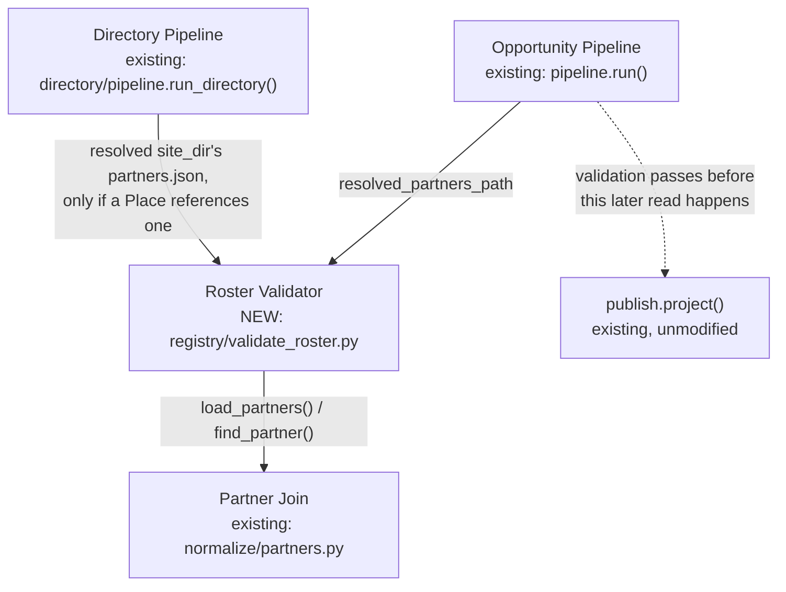
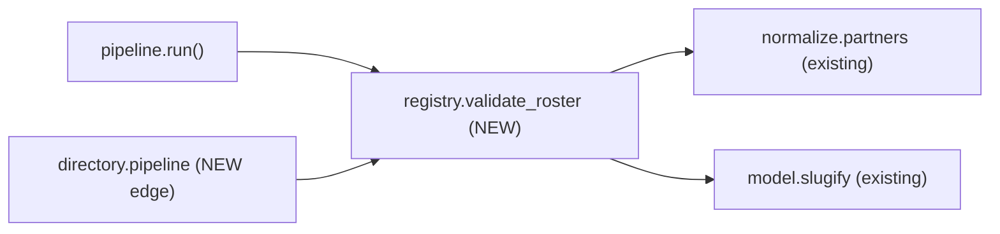

<!-- CLASI: Before changing code or making plans, review the SE process in CLAUDE.md -->

# Sprint 022: Restore Publish-Failure and Roster Data-Quality Coverage

## Goals

1. Restore the exit-code-1 + logged-error test coverage for
   `publish.project()` failures that sprint 019 ticket 001 incidentally
   deleted alongside the (correctly removed) mirror-mechanism test it
   was bundled with — a still-live correctness property from sprint 018
   ticket 010 with no other coverage anywhere (issue 47).
2. Turn the roster data-quality guards sprint 019 ticket 002 had to
   delete — a bare-California-centroid guard, an in-bounds-or-empty
   coordinate guard, a hijacked-domain guard, a registry
   org_name↔roster join-integrity guard, and a places.toml
   `related_partner_id` join-integrity guard — into real pipeline-level
   validation that runs against whatever `partners.json` a live run's
   `--site-dir` resolves, on every run, not test-only assertions against
   a `site/`-checked-out copy that no longer exists in this repo. Also
   close the slug-uniqueness gap issue 46 identified (two exact-duplicate
   roster rows silently overwriting each other's published directory)
   (issue 48).

## Problem

Sprint 019's site consolidation (`site/` → a build-time-only CI
checkout of `stem-ecosystem`, never a persistent local directory) forced
the deletion of 46 tests across four files (verified against the actual
commit, `2cde07c`, not assumed from either issue's own framing), because
they read a live, checked-out `site/src/data/partners.json` (or, for two
of the four files, `site/`'s Astro page/schema content directly) that
this repo no longer carries. Two issues track the regression-value
subset of that deletion worth recovering (the rest — the Astro page/
schema tests, and the old tests' own roster-content-specific pins tied
to the pre-dedup roster's exact row ids or to a `logo_src` file-existence
check that would need image files no local checkout has either — are
genuinely stem-ecosystem's concern now, or obsolete, and are not touched
by this sprint):

- **Issue 47** (small): `test_mirror_still_runs_when_publish_project_raises`
  was deleted for the right reason (the mirror mechanism it exercised is
  gone), but it also incidentally covered a distinct, still-live
  property — `cli.py`'s `main()` returns exit code 1, and logs via
  `logger.exception(...)`, when `publish.project()` raises. Reading
  `partner_scrape/cli.py` confirms this behavior is fully intact today
  (lines 569–617); only its test coverage is gone.
- **Issue 48** (larger): of the 46 deleted tests, the 24 with genuine
  regression value (sprint 018 found 7 real bad entries via the
  bare-California-centroid signature and one real hijacked domain,
  `batiquitosfoundation.org`) lived in two files that both still exist
  today, trimmed rather than removed outright:
  `tests/test_roster_housekeeping.py` (trimmed **twice** — sprint 019
  ticket 002 removed its JSON-side classes reading `site/src/data/
  partners.json`; sprint 020 ticket 002 then also removed its CSV-side
  classes once `data/partners_viable.csv` itself was deleted as dead
  data, issue 60 — 3 registry-TOML-only tests with no roster dependency
  survive there today, confirmed by reading the file directly) and
  `tests/directory/test_dataset_validity.py` (2 tests removed — its
  `TestRelatedPartnerIdJoinIntegrity` class — everything else in that
  file, which has no `partners.json` dependency, survives unchanged
  today). Re-copying `partners.json` back into partner-scrape was
  explicitly rejected (issue 48, "Cause") as recreating the exact
  two-copies-of-the-same-file problem site consolidation exists to
  eliminate.

**Where does `partners.json` actually come from today, and who reads
it?** Verified directly against the current code (not assumed from
either issue's own framing):

- `partners.json` is never committed to or read from anywhere inside
  `partner-scrape` itself. It lives exclusively in the sibling
  `stem-ecosystem` checkout, at `{site_dir}/src/data/partners.json`,
  where `site_dir` resolves via `--site-dir` / `$SITE_DIR` /
  `config.get_site_dir()`'s `../stem-ecosystem` default — the same
  resolution `--site-dir` uses everywhere else in this codebase.
- The `run` command reads it **unconditionally, on every real run**:
  `pipeline.run()` resolves `resolved_partners_path` once
  (`pipeline.py` ~line 553) and passes it to both `normalize_run()`
  (the partner join, `normalize/partners.py`'s `load_partners()`) and
  `partner_log.record()`. `cli.py`'s own separate call to
  `publish.project()` afterward (`cli.py` ~line 571) re-resolves the
  identical path from the identical `args.site_dir`/`get_site_dir()` —
  so a validation that runs once, early, inside `pipeline.run()`
  protects both reads: if `pipeline.run()` raises on a bad roster,
  `main()` never reaches the `publish.project()` call at all.
- The `directory` command's `run_directory()` does **not** currently
  read `partners.json` at all in production — `Place.related_partner_id`
  is a hand-copied value with "no automatic cross-reference join" by
  original design (sprint 018 ticket 007). Only the now-partially-deleted
  test read `partners.json` to check those hand-copied ids resolve.
  Recovering that guard means *adding* a new read, not restoring an old
  one.

A hand-verified check against this machine's real sibling
`stem-ecosystem` checkout (`../stem-ecosystem/src/data/partners.json`,
211 rows) and the real registry confirms the content-only checks (bare-
California centroid, out-of-bounds/malformed coordinate, hijacked
domain, duplicate slug) all currently pass cleanly, and the real
`places.toml` `related_partner_id` references all currently resolve —
but **9 of 93 currently-active registry sources' `org_name` do not
resolve to any roster entry today** (`birch-aquarium`, `boundlessbio`,
`elementbiosciences`, `gossamerbio`, `robotevents-vex-sd`, `sandiego-gov`,
`shieldai`, `ucsd-physics`, `ucsd-qualcomm-institute`) — exactly the gap
the deleted test's own comment already flagged ("Not every registry
source has a roster entry yet"). This is load-bearing for how ticket 003
wires the registry-join check (see Architecture > Design Rationale).

## Solution

**Issue 47** — one small, additive test in `tests/test_cli.py`
(ticket 001): monkeypatch `cli.publish.project` to raise, call
`cli.main()`, assert the exit code is 1 and the failure was logged via
`logger.exception` — no mirror-related assertions, matching the issue's
own proposed fix exactly.

**Issue 48** — a new shared validation module plus two wiring sites
(tickets 002–004):

- `partner_scrape/registry/validate_roster.py` (new, ticket 002): the
  validation primitives themselves, fixture-tested in isolation —
  `validate_roster(partners)` (raises on bare-California centroid,
  out-of-bounds/malformed coordinate, hijacked domain, or duplicate
  `model.slugify()` slug — checked against the **raw** roster list, not
  a name-deduplicated view, so a duplicate-slug pair can't hide from the
  one check meant to catch it), `find_unresolved_active_sources(sources,
  partners_by_norm)` (returns, does not raise, the registry sources
  whose `org_name` resolves to zero roster entries), and
  `check_partner_references(references, partners)` (a generic
  id-reference join-integrity primitive — raises on any `(referencer_id,
  partner_id)` pair whose `partner_id` isn't a real roster row).
  `partner_scrape/registry/` already is a cross-subsystem utility
  package (`registry.loader` is already imported by `teams/pipeline.py`
  and `directory/pipeline.py`, not just the Opportunity pipeline), so
  this is not a new dependency-direction problem.
- Wiring into the `run` command (ticket 003, depends on 002): inside
  `pipeline.run()`, immediately after `resolved_partners_path` is
  computed and before it's used by `normalize_run()`/
  `partner_log.record()` — the one place both real production
  consumers of that path share. Content checks
  (`validate_roster()`) raise uncaught, failing the run loudly before
  any output is written this run. The registry-join check
  (`find_unresolved_active_sources()`) is wired as a **logged warning**,
  not a raise — seeing real production data with a legitimate 9/93 gap
  makes a hard raise here a sprint that breaks every real run on day
  one, not a regression guard (see Design Rationale).
- Wiring into the `directory` command (ticket 004, depends on 002):
  inside `directory.pipeline.run_directory()`, after
  `_apply_geo_fallback()` produces the final `Place` list and before
  `export_directory()` is called — reads `{resolved_site_dir}/src/data/
  partners.json` only if at least one `Place` actually declares a
  `related_partner_id` (so a `directory`-only environment with no
  `partners.json` at all is never forced to have one), then calls
  `check_partner_references()`, raising uncaught on any dangling
  reference. Unlike the registry-join case, this is a small,
  fully hand-curated dataset (19 real places today) with zero known
  gaps — a hard raise is safe and matches the issue's framing of this
  as a real-incident-shaped regression guard.

`cli.py` itself is deliberately untouched by tickets 002–004 — its own
module docstring states it "owns flag parsing and console output only;
every real decision ... belongs to `pipeline.run()` and the modules it
calls," and roster validation is exactly that kind of real decision.

## Success Criteria

- [ ] `tests/test_cli.py` asserts `main()` returns exit code 1 and logs
      the failure (via `logger.exception`) when `publish.project()`
      raises — no mirror-related assertions.
- [ ] `partner_scrape/registry/validate_roster.py` exists with fixture
      tests covering: bare-California centroid, out-of-bounds
      coordinate, malformed/partial coordinate, hijacked domain,
      duplicate slug (issue 46's failure mode), unresolved registry
      source (returned, not raised), and a dangling partner reference
      (issue 48's `related_partner_id` case) — each proven both to fire
      on a bad fixture and to pass cleanly on a good one.
- [ ] `pipeline.run()` raises loudly, before any output is written this
      run, when the roster resolved from `--site-dir` fails a content
      check; logs (does not raise on) unresolved registry sources.
- [ ] `directory.pipeline.run_directory()` raises loudly when a `Place`'s
      hand-copied `related_partner_id` doesn't resolve against the
      roster, and never requires `partners.json` to exist when no
      `Place` references one.
- [ ] A required pre-close live run against this machine's real sibling
      `stem-ecosystem` checkout confirms the new validation neither
      breaks a clean real run nor silently passes a deliberately
      corrupted copy of it.
- [ ] Full existing test suite (`uv run pytest`) stays green; every new
      test is hermetic (fixture-based, no dependency on a live `site/`
      or sibling checkout).

## Scope

### In Scope

- A single restored test in `tests/test_cli.py` for issue 47.
- `partner_scrape/registry/validate_roster.py`: content validation
  (bare-California centroid, out-of-bounds/malformed coordinate,
  hijacked domain, duplicate slug), registry-join-gap detection
  (non-raising), and a generic partner-reference join-integrity check.
- Wiring that validation into `pipeline.run()` (the `run` command) and
  into `directory.pipeline.run_directory()` (the `directory` command).
- Fixture-based hermetic regression tests for every check above.
- A required pre-close live-run validation step against a real roster
  (this machine's sibling `stem-ecosystem` checkout), recorded with
  real numbers.

### Out of Scope

- Re-copying `partners.json` (or any subset of it) into partner-scrape
  as a committed fixture or checkout — explicitly rejected by issue 48
  as recreating the two-copies problem site consolidation eliminated.
- The 22 `tests/test_site_teams_pages.py` and 6
  `tests/test_site_data_access_page.py` tests sprint 019 also deleted —
  Astro page/schema content that lives exclusively in stem-ecosystem now,
  not partner-scrape's concern (issue 48's own framing).
- Reproducing the old tests' roster-content-specific pins (exact
  ticket-018 row ids, batch-A/batch-B new-row counts, logo-backfill
  counts) — those were regression tests for a since-completed, one-time
  data migration, not standing guards; not recovered.
- A `logo_src`-points-at-an-existing-file check (the old
  `TestLogoBackfillIntegrity`). `tests/test_roster_housekeeping.py`'s
  current docstring describes this as "tracked for recovery ... in
  issue 48," but issue 48's own Proposed Fix does not list it, and it
  would need a different validation surface entirely (the actual image
  files under `{site_dir}/public/images/logos/`, not just
  `partners.json`'s own structure) — flagged here as a small,
  pre-existing documentation drift, not silently perpetuated by scoping
  it into this sprint's tickets.
- Promoting the registry-join check from a logged warning to a hard
  raise — today's real 9/93 gap makes that a future decision once those
  sources gain roster rows, not this sprint's (see Open Questions).
- Any change to `cli.py`'s flag parsing, output, or control flow beyond
  what issue 47's test needs — this sprint's validation wiring lives
  entirely inside `pipeline.run()` and `directory.pipeline.py`, per
  `cli.py`'s own documented "thin wrapper" boundary.
- Any change to the `teams` subcommand or `teams.json` — out of scope
  for both issues.

## Test Strategy

Hermetic, fixture-based by default, matching this project's sprint
020/021 convention: small hand-crafted fixture data (one bad row per
failure mode), never a dependency on a live checkout.

- **Ticket 001**: one new test in `tests/test_cli.py`'s existing
  `TestPublishWiring` pattern — `cli.run` monkeypatched to a stub,
  `cli.publish.project` monkeypatched to raise, `caplog` asserts the
  logged message, exit code asserted `1`.
- **Ticket 002**: a new `tests/test_registry_validate_roster.py`
  (matching this project's flat `tests/test_registry_*.py` naming for
  the `registry/` package, e.g. `test_registry.py`,
  `test_registry_candidates.py`). Small in-memory fixture partner lists
  (one bad row per case) and small in-memory `SourceConfig`/
  `partners_by_norm` fixtures for the join checks — no TOML files or
  disk fixtures needed for this module's own unit tests. Each check
  proven both to fire on its bad fixture and to pass cleanly on a good
  one; the duplicate-slug case specifically includes a fixture proving
  the check operates on the raw list (catches a collision that a
  name-deduplicated view would hide).
- **Ticket 003**: `tests/test_pipeline_e2e.py` (or a sibling e2e file,
  matching its existing `--site-dir`-pointed-at-`tmp_path` convention)
  gains: a bad-roster fixture that makes `pipeline.run()` raise before
  `export_opportunities()`/`partner_log.record()` write anything; an
  unresolved-source fixture that logs a warning (`caplog`) but completes
  the run normally; a clean-roster fixture that is unaffected. **Required
  pre-close live validation** (not optional, mirroring sprint 021's
  identical gate): run `partner-scrape run --dry-run -v --site-dir
  ../stem-ecosystem` against this machine's real sibling checkout,
  confirming the new validation passes cleanly against real data and
  reports the real (currently 9/93) unresolved-source count as a
  warning, not a crash.
- **Ticket 004**: `tests/directory/test_pipeline.py` gains a wiring
  test — a fixture `Place` with a dangling `related_partner_id` against
  a fixture `partners.json` written to `tmp_path` raises; a fixture
  `Place` with no `related_partner_id` set at all never requires
  `partners.json` to exist. **Required pre-close live validation**: run
  `partner-scrape directory --dry-run -v --site-dir ../stem-ecosystem`
  against the real sibling checkout and real `places.toml`, confirming
  all 17 currently-set `related_partner_id` references resolve cleanly.
- No test in this sprint touches network, writes into this repo's real
  `data/` directory, or depends on a `site/` directory (this repo has
  had none since sprint 019) or a re-copied `partners.json`.

## Architecture

**Substantial** — driven entirely by issue 48. This sprint composes one
new module (`partner_scrape/registry/validate_roster.py`) into two
existing pipelines from two different subsystems
(`pipeline.run()` and `directory.pipeline.run_directory()`), and
introduces one new cross-subsystem dependency that didn't exist before:
`directory/` gains a path (via `registry.validate_roster`, which itself
uses `normalize.partners.load_partners`/`find_partner`) to consume
roster data it never touched in production before this sprint. Either
signal alone (3+ modules composed together, or a new cross-module
dependency) clears the substantial bar per this project's own sizing
convention; both are present. Issue 47's ticket (001) is a same-file,
test-only addition to already-existing, already-correct production
code — no new module, no new dependency, no data-model change — and does
not push the sprint's tier by itself, exactly mirroring sprint 021's
ticket 001 (audit-only) precedent for a mixed-tier sprint.

**What changed, in one paragraph per capability:**

*Publish-failure exit-code coverage (ticket 001).* No production code
change — `cli.py`'s `main()` already returns 1 and logs via
`logger.exception()` when `publish.project()` raises (sprint 018 ticket
010). This sprint adds the one test that regressed with sprint 019's
otherwise-correct deletion.

*Roster validation (tickets 002–004).* One new module,
`partner_scrape/registry/validate_roster.py`, holds three primitives:
`validate_roster(partners)` (content checks against the raw roster
list), `find_unresolved_active_sources(sources, partners_by_norm)`
(non-raising registry org_name-join gap detection, a string-match check
via `find_partner()`), and `check_partner_references(references,
partners)` (a generic, raising id-reference join check — used only by
the places.toml case in this sprint, written generically per issue 48's
own instruction to reuse "the same validation primitive" rather than a
`directory`-local equivalent, so a future similar hand-copied-id join
elsewhere would not need a second implementation). `pipeline.run()`
gains one new call site using the first two primitives (content checks
hard-raise, registry-join gap logs a warning); `directory.pipeline.
run_directory()` gains one new call site using the third (hard-raise
only, conditional on at least one `Place` actually declaring a
`related_partner_id`). Neither `cli.py` nor any data model changes.

### Architecture Overview

| Module | Change | Use case served |
|---|---|---|
| `tests/test_cli.py` | + one test: exit code 1 + logged error on `publish.project()` failure | SUC-024 |
| `partner_scrape/registry/validate_roster.py` (new) | `validate_roster()`, `find_unresolved_active_sources()`, `check_partner_references()`, `RosterValidationError` | SUC-025, SUC-026 |
| `partner_scrape/pipeline.py` | New call site after `resolved_partners_path` is computed: `validate_roster()` (raises), `find_unresolved_active_sources()` (logs warning) | SUC-025 |
| `partner_scrape/directory/pipeline.py` | New call site after `_apply_geo_fallback()`: reads `partners.json` only if needed, `check_partner_references()` (raises) | SUC-026 |
| `partner_scrape/normalize/partners.py` | No change — `load_partners()`/`find_partner()` reused, not modified | SUC-025, SUC-026 |
| `partner_scrape/cli.py` | No change — validation deliberately does not live here (see Design Rationale) | — |

**Component/Module Diagram** (required: a new module newly composed
into two existing pipelines from two different subsystems):

**Dependency Graph** (required: one new cross-subsystem edge):

`directory/` → `registry.validate_roster` → `normalize.partners` is the
one new edge this sprint introduces. It is not a "semantically
backwards" dependency in this codebase's existing sense (that concern,
documented in `directory/sources/base.py`, is specifically about
`directory/` never importing the peer standing-data subsystem `teams/`)
— `normalize.partners` is a small, dependency-free utility
(`json`/`re`/`pathlib`/`typing` only) already positioned as a shared
primitive, and `partner_scrape.registry` is already a cross-subsystem
package: `registry.loader.load_active_sources` is already imported by
`teams/pipeline.py` and `directory/pipeline.py`, not exclusively by the
Opportunity pipeline. No cycle is introduced: `normalize.partners` gains
no new dependency of its own.

No entity-relationship diagram: no new entity or relationship, and no
change to `partners.json`'s or `Place`'s existing shape — this sprint
adds validation logic over data shapes that already exist, fully
described in the table above.

### Design Rationale

- **Decision: roster validation lives inside `pipeline.run()` and
  `directory.pipeline.run_directory()`, not `cli.py`, even though issue
  48's own Proposed Fix suggested `cli.py` as one option.** *Context:*
  `cli.py`'s module docstring states its boundary explicitly: "a thin
  `argparse` wrapper ... this module owns flag parsing and console
  output only; every real decision ... belongs to `pipeline.run()` and
  the modules it calls." *Alternatives considered:* validate in `cli.py`
  right after `--site-dir` resolves, as the issue's own text floated —
  rejected; `cli.py` resolves `site_dir` independently and redundantly
  in at least two places already (once for `--yield-history`'s default,
  once for `publish.project()`'s call) and never in one place shared
  with `pipeline.run()`'s own resolution, so validating there would mean
  a third independent resolution plus a decision (what counts as valid
  roster data) that this codebase's own documented architecture assigns
  to `pipeline.run()`. *Why this choice:* `pipeline.run()` already
  computes `resolved_partners_path` exactly once, in exactly the form
  both real consumers (`normalize_run()`, `partner_log.record()`) share;
  validating there is zero-redundant-resolution and matches the existing
  architecture boundary precisely. *Consequences:* a caller of
  `pipeline.run()` other than `cli.py` (none exist today, but the
  boundary is what makes this safe to state) automatically gets the same
  guard for free; `cli.py`'s own later `publish.project()` call is
  protected transitively, since `pipeline.run()` runs first and raises
  before `main()` ever reaches that call.
- **Decision: the registry org_name↔roster join-integrity check is wired
  as a logged warning, not a hard raise — a deliberate narrowing of issue
  48's own stated design.** *Context:* issue 48's Proposed Fix lists
  "an active registry source whose org_name resolves to zero roster
  entries" as one of five hard-raise conditions, without qualification.
  The deleted test this recovers (`TestRegistryJoinIntegrity`) already
  carried its own caveat: "Not every registry source has a roster entry
  yet." A live check against this machine's real sibling
  `stem-ecosystem` checkout and the real registry (see Problem) confirms
  that caveat is still true today — 9 of 93 active sources currently
  have no roster match. *Alternatives considered:* implement the hard
  raise exactly as written — rejected; it would make every real `run`
  invocation fail starting the day this ships, for a pre-existing,
  known, non-regressed condition, which is the opposite of this sprint's
  goal (restoring guards against *regressions*, not breaking a currently-
  working pipeline over a gap that predates this sprint entirely).
  Silently dropping the check — rejected; the issue's underlying concern
  (an org_name silently failing to join, hiding a real data gap) is
  real and worth surfacing. *Why this choice:* a logged warning
  preserves full visibility (every real run's `-v` output would show
  exactly which sources aren't joining, the same actionable information
  the hard raise would have surfaced, just not fatally) without
  breaking production on day one. *Consequences:* this is a deviation
  from issue 48's literal text, flagged here rather than silently
  applied — see Open Questions for when a future sprint might promote it
  to a hard raise once the 9 known gaps are closed.
- **Decision: `validate_roster()`'s duplicate-slug check runs against
  the raw partner list, never against a name-deduplicated view like
  `normalize.partners.load_partners()`'s own `partners_by_norm`.**
  *Context:* issue 46's actual incident (the reason this check exists at
  all) was two exact-duplicate rows under different ids silently
  overwriting each other's published directory — `load_partners()`'s own
  `setdefault()` behavior means a second colliding row never even enters
  `partners_by_norm` in the first place, so a check built on that
  dict would be structurally blind to the exact failure mode it exists
  to catch. *Why this choice:* the raw list (a plain
  `json.loads()` of `partners.json`) is the only view where every row,
  including a would-be-collision, is actually visible to the check.
  *Consequences:* `pipeline.run()`'s new call site reads the raw
  partner list itself (one additional `json.loads()` of a small,
  ~211-row file) rather than reusing `normalize_run()`'s or
  `partner_log.record()`'s own internal `load_partners()` calls — a
  third read of the same small file per run, an accepted, documented
  cost matching this codebase's existing precedent (`export/publish.py`'s
  own module docstring already flags and accepts an analogous per-call
  full-history re-read as "negligible while the store is young").
- **Decision: `check_partner_references()` is a generic
  `(referencer_id, partner_id)` primitive, not a places.toml-specific
  function.** *Context:* issue 48 explicitly asks for the places.toml
  check to reuse "the same validation primitive" the roster checks use,
  not a parallel implementation. *Alternatives considered:* a
  `directory`-local, `Place`-typed function — rejected; it would only
  ever be usable for this one join, when the shape (a set of ids
  hand-copied elsewhere, checked against the roster) is generic enough
  to serve any future similar hand-copied reference without a second
  implementation. *Why this choice:* one shared, subsystem-agnostic
  primitive, matching the issue's own instruction and this module's
  existing role as the roster's one validation surface. *Consequences:*
  `directory/pipeline.py` calls it with a list comprehension over
  `Place.related_partner_id`, adding no `directory`-specific validation
  logic of its own.

### Migration Concerns

- **No schema or data migration.** `partners.json`'s shape,
  `places.toml`'s shape, and `Place`'s dataclass are all unchanged —
  this sprint adds validation logic over existing shapes, nothing new to
  backfill.
- **The San Diego bounding box constant must still be kept in sync by
  hand across two repos.** The deleted test's own comment already
  flagged this ("kept in sync by hand since the value lives in an Astro
  page, not an importable Python module") — that Astro page
  (`site/src/pages/partners/index.astro`'s `SD_BOUNDS`) now lives
  exclusively in `stem-ecosystem`, one repo further away than when the
  comment was written. This sprint relocates the constant into
  `validate_roster.py`; it does not solve the hand-sync burden, which
  predates this sprint and is unrelated to the site consolidation that
  motivated it.
- **Real production data currently passes every content check cleanly**
  (verified against this machine's real sibling `stem-ecosystem`
  checkout: 211 roster rows, zero bare-California-centroid hits, zero
  out-of-bounds/malformed coordinates, zero hijacked-domain hits, zero
  duplicate slugs; all 17 currently-set `places.toml`
  `related_partner_id` references resolve). Only the registry-join check
  has a real, currently-nonzero gap (9/93), handled per the Design
  Rationale above. This is planning-time evidence, not a substitute for
  ticket 003/004's own required pre-close live validation against
  whatever the roster and registry look like at execution time.
- **Read-cost.** Three independent reads of the same small
  (~211-row) `partners.json` per real `run` invocation (validation,
  `normalize_run()`, `partner_log.record()`) — an accepted, explicitly
  documented cost (see Design Rationale), not solved speculatively here.

### Open Questions

1. **Should the registry org_name↔roster join-integrity check be
   promoted from a logged warning to a hard raise once the 9
   currently-unresolved sources gain roster rows?** Not decided here —
   flagged for a future sprint once that gap count reaches zero, at
   which point a hard raise would carry no risk of breaking a
   currently-working pipeline the way it would today.
2. **What exactly counts as a "malformed" coordinate?** This plan treats
   a partial pair (one of `latitude`/`longitude` set, the other `None`)
   and a non-numeric value as malformed; real production data has zero
   instances of either today, so this check exists purely as a
   regression guard against a future bad edit, not a current fix.
   Ticket 002's implementer should confirm this definition still matches
   `partners.json`'s real shape at execution time.
3. **Should `RosterValidationError`'s raised message follow a specific
   format for downstream log/CI consumption?** No existing precedent in
   this codebase defines one; this plan follows the existing convention
   `export/publish.py`'s and `directory/export.py`'s own `RuntimeError`
   messages already use — a clear statement of what's wrong plus an
   actionable next step — collecting every offender found across every
   check into one combined report rather than raising on the first
   offender found, so a real bad-data run surfaces the full picture in
   one failure.

## Use Cases

### SUC-024: publish.project() failures are visible via exit code and log
Parent: UC-006 (refines existing test coverage of an already-shipped
export-time contract; no behavior change)

- **Actor**: Engine / CI or operator watching a scheduled run's exit code
- **Preconditions**: sprint 018 ticket 010's exit-code-1/`logger.exception`
  behavior is already shipped and unchanged; this sprint adds coverage
  only.
- **Main Flow**:
  1. A `run` command invocation completes its normal export
     (`opportunities.json`, `teams.json`, etc. already written).
  2. `cli.main()` calls `publish.project()` to refresh `public/data/`.
  3. `publish.project()` raises (e.g. a `KeyError` from a `.jsonl` line
     predating a field, per ticket 018-010's originating incident).
  4. `cli.main()` catches the exception, logs it via
     `logger.exception(...)`, and continues so the rest of the run's
     output (yield report, exit code) is still produced.
  5. `main()` returns exit code 1.
- **Postconditions**: the caller (CI, a scheduled job, an operator)
  observes a non-zero exit code and a logged traceback; every other
  output this run produced is unaffected.
- **Error Flows**: none beyond the flow above — this SUC exists to prove
  the failure *is* visible, not to introduce a new failure mode.
- **Acceptance Criteria**:
  - [ ] A test asserts `main()` returns 1 when `publish.project()`
        raises.
  - [ ] The same test asserts the failure was logged (via `caplog`),
        with no assertion referencing the removed mirror mechanism.

### SUC-025: A structurally bad partner roster fails a real run loudly
Parent: UC-005

- **Actor**: Engine / operator running `partner-scrape run`
- **Preconditions**: `--site-dir` (or `$SITE_DIR`/its default) resolves
  to a directory containing `src/data/partners.json`.
- **Main Flow**:
  1. `pipeline.run()` resolves `resolved_partners_path` as it already
     does today.
  2. The raw `partners.json` list is loaded and passed to
     `validate_roster.validate_roster()`.
  3. Every row is checked for: the bare-California geocoder centroid
     (36.778261, -119.417932), a coordinate outside the San Diego
     bounding box (or a malformed/partial pair), a known-hijacked
     domain, and a `model.slugify()` collision against any other row.
  4. If any check finds an offender, `validate_roster()` raises
     `RosterValidationError` listing every offender found across every
     check, before `normalize_run()`/`partner_log.record()` write
     anything this run.
  5. Separately, `find_unresolved_active_sources()` compares every
     active registry source's `org_name` against the roster; any with
     zero matches are logged as a warning (never raised — see
     Architecture > Design Rationale for why this differs from issue
     48's literal text).
  6. On a clean roster, the run proceeds exactly as it does today, with
     no observable change beyond a possible warning log line.
- **Postconditions**: a structurally bad roster stops the run before any
  output is written, with an actionable message naming every offender;
  a clean roster is unaffected.
- **Error Flows**: `RosterValidationError` propagates uncaught out of
  `pipeline.run()` (and therefore `cli.main()`), matching this
  codebase's existing convention that a structural, non-per-source
  problem is fatal rather than isolated (contrast with
  `pipeline._run_one_source`'s per-source error isolation, which this is
  deliberately not).
- **Acceptance Criteria**:
  - [ ] Fixture test: a roster row at the bare-California centroid
        raises, naming the offending row.
  - [ ] Fixture test: a roster row outside the San Diego bounding box
        raises.
  - [ ] Fixture test: a roster row with a malformed/partial coordinate
        raises.
  - [ ] Fixture test: a roster row whose website contains the known
        hijacked domain raises.
  - [ ] Fixture test: two roster rows whose names `model.slugify()` to
        the same value raise (issue 46's failure mode), verified against
        the raw list, not a name-deduplicated view.
  - [ ] Fixture test: a clean roster does not raise.
  - [ ] Fixture test: an active registry source with no roster match
        is returned by `find_unresolved_active_sources()` and logged as
        a warning by `pipeline.run()`, without raising or aborting the
        run.
  - [ ] A required pre-close live `partner-scrape run --dry-run -v`
        against a real sibling checkout passes cleanly and reports the
        real unresolved-source count.

### SUC-026: A dangling places.toml partner reference fails the directory run loudly
Parent: none (new use case; issue 48's places.toml join-integrity guard
covers the `directory/` standing-data subsystem introduced in sprint
018, which predates this project's top-level UC catalog)

- **Actor**: Engine / operator running `partner-scrape directory`
- **Preconditions**: at least one active Place source entry (e.g.
  `directory/data/places.toml`) sets a hand-copied
  `related_partner_id`.
- **Main Flow**:
  1. `run_directory()` runs its existing source dispatch and
     `_apply_geo_fallback()` exactly as today, producing the final
     `Place` list.
  2. If any `Place.related_partner_id` is non-`None`, `run_directory()`
     resolves `site_dir` (the same way `export_directory()` already
     does) and reads `{site_dir}/src/data/partners.json`.
  3. `validate_roster.check_partner_references()` checks every
     non-`None` `related_partner_id` against the loaded roster's real
     ids.
  4. Any dangling reference raises `RosterValidationError`, naming the
     offending `place_id` and the invalid `partner_id`, before
     `export_directory()` writes `places.json`.
  5. If no `Place` declares a `related_partner_id` at all, step 2's read
     is skipped entirely — a `directory`-only environment is never
     forced to have a `partners.json` present.
- **Postconditions**: a hand-copy typo in `related_partner_id` (issue
  48's cited "real historical incident" class of defect) stops the
  `directory` run before publishing, with an actionable message; a
  places dataset with no partner references, or with only valid ones,
  is unaffected.
- **Error Flows**: `RosterValidationError` propagates uncaught out of
  `run_directory()`, matching SUC-025's "structural problem is fatal"
  convention — never silently dropped, never per-source-isolated (this
  is a curated-dataset integrity problem, not a flaky third-party
  source).
- **Acceptance Criteria**:
  - [ ] Fixture test: a `Place` with a `related_partner_id` absent from
        a fixture `partners.json` raises, naming both ids.
  - [ ] Fixture test: a `Place` with a `related_partner_id` present in
        the fixture roster does not raise.
  - [ ] Fixture test: no `Place` in the run declares a
        `related_partner_id` — `partners.json` is never read, and the
        run succeeds even if no such file exists at `site_dir`.
  - [ ] A required pre-close live `partner-scrape directory --dry-run
        -v` against a real sibling checkout passes cleanly, confirming
        all real `related_partner_id` references resolve.

## GitHub Issues

(GitHub issues linked to this sprint's tickets. Format: `owner/repo#N`.)

## Definition of Ready

Before tickets can be created, all of the following must be true:

- [ ] Sprint planning document is complete (sprint.md, including its
      Architecture and Use Cases sections)
- [ ] Architecture review passed (or skipped, for changes with no
      architectural impact)
- [ ] Stakeholder has approved the sprint plan

## Tickets

| # | Title | Depends On |
|---|-------|------------|
| 001 | Restore exit-code-1 coverage for publish.project() failures | — |
| 002 | Roster validation primitives module and fixture tests | — |
| 003 | Wire roster validation into the run pipeline | 002 |
| 004 | places.toml related_partner_id join-integrity in the directory pipeline | 002 |

Tickets execute serially in the order listed. 001 (issue 47) is
independent of 002–004 (a different file, a different issue, no shared
code) and is listed first as the small, cheap, fully-independent piece.
002→003 and 002→004 are the real dependency chains: 003 and 004 each
consume ticket 002's `validate_roster` module but are otherwise
independent of each other (different pipelines, different subsystems) —
listed 003 before 004 because the `run` command's coverage (a
regression class this codebase treats as more production-critical,
running on every scheduled invocation) is the higher-value recovery,
not because 004 structurally depends on 003.
