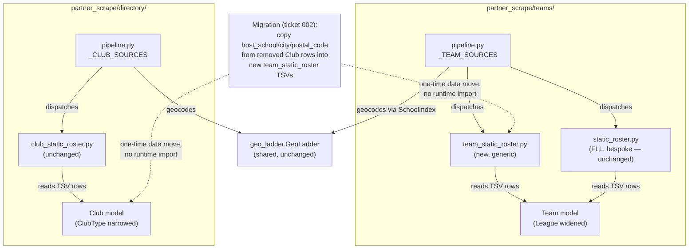

<!-- CLASI: Before changing code or making plans, review the SE process in CLAUDE.md -->

# Sprint 036: Generalize teams to STEM competition teams and narrow clubs

## Goals

Encode the distinction issue 47 draws — **Team = competes, Club =
meets** — into the `Team`/`Club` models and their published data, so
robotics is one instance of a competition team rather than the
definition of one. Concretely: generalize `partner_scrape/teams/`'s
`Team` model and static-roster pattern to carry any STEM competition
team; move the 27 entries sprint 032 mis-populated into `Club` because
`Team` had no home for them (24 Science Olympiad school teams, 3
CyberPatriot teams) over to `Team`, preserving their already-verified
geocoding; drop the 25 club entries that are neither clubs nor
competition teams in scope for this project (4-H 14, Civil Air Patrol
7, Sea Cadets 4); narrow `Club`/`ClubType` to the 5 that are genuinely
clubs (Hack Club 4, Girls Who Code 1); and do a bounded research pass
hunting for other STEM competition-team types with a live, verifiable
San Diego roster.

## Problem

Sprint 032 populated `directory/`'s `Club` standing-entity model with
six curated club types. Four of those six are not clubs by any
reasonable reading — they are **competition teams** (Science Olympiad,
CyberPatriot) or organizations this project has decided not to carry
at all (4-H, Civil Air Patrol, Sea Cadets) — and they ended up in
`Club` only because sprint 011's `Team` model was built exclusively for
FIRST/VEX robotics (`league`/`program` are FIRST/VEX-shaped, and
`teams.json`'s `meta.by_league`/`meta.credential_failures` follow from
that), leaving no home for a non-robotics competition team. The
stakeholder's own framing (2026-09-03, issue 47): "The science olympiad
teams: go move them over to teams. That makes the team category not
just robotics team. That makes a general team."

Left uncorrected, `Club` keeps drifting toward "wherever a curated
roster doesn't obviously fit `Team`," which is exactly the ambiguity
this sprint exists to close off structurally, not just this once.

## Solution

1. Generalize `Team`/`League` (widen the existing `League` Literal,
   documented as the competition-circuit discriminator it already is —
   see Architecture's Design Rationale for why this is preferred over
   adding a new discriminator field) and add a teams-side generic
   curated static-roster source, `team_static_roster.py`, mirroring the
   pattern `directory/sources/club_static_roster.py` already
   generalized to on the `Club` side (sprint 032).
2. Migrate Science Olympiad (24) and CyberPatriot (3) from `Club` to
   `Team`, re-deriving their location through the same deterministic,
   byte-identical-data offline ladder that produced their original
   `Club` geocoding (`teams.geo.geocode_teams()` and
   `directory.pipeline._apply_club_geocoding()` share the same rung
   logic and the same underlying school-directory data — see
   Architecture's Migration Concerns for why this reproduces, not
   re-researches, the verified result) and diff-checking the result
   against the original `Club` rows before removing them.
3. Drop 4-H, Civil Air Patrol, and Sea Cadets (25 entries) from `Club`
   entirely — registry entries and data files removed.
4. Narrow `ClubType` to `{"hack-club", "girls-who-code"}` (5 entries)
   and state the meets-vs-competes rule explicitly in
   `directory/DESIGN.md` so the model doesn't drift back.
5. Update `data/SCHEMA.md` for both files' new shape, counts, and
   vocabularies.
6. Run a bounded research/triage pass over issue 47's starting list of
   16 candidate competition types, live-verifying which (if any) have a
   real, publicly available San Diego team roster, then populate
   whichever types actually clear that bar (0-2 types expected, per the
   sprint 027-032 precedent that "no public roster exists" is a
   recorded finding, not a failure).

## Success Criteria

- `Team`/`League` generalized (new Literal values for the migrated and
  any newly-populated competition types) with zero regressions to
  existing FTC/FRC/FLL/VEX records, `TEAMS_SCHEMA_FIELDS`, or any
  existing consumer of `Team.league`/`Team.number`/`Team.team_id`.
- `teams.json`'s `meta.credential_failures` semantics (a league with NO
  data vs. a league with genuinely zero teams) are unchanged and still
  correct once new, non-credentialed league codes exist.
- 24 Science Olympiad + 3 CyberPatriot rows exist in `teams.json`
  (`teams` total: 278 → 305) with `location_precision`,
  `latitude`/`longitude`, `matched_name`, and `needs_review` identical
  to their original `Club` rows (San Dieguito's `needs_review = true`
  survives, the other 26 school-precision, non-flagged matches
  survive).
- Those same 27 entries no longer exist anywhere in `clubs.json`.
- 4-H, Civil Air Patrol, and Sea Cadets (25 entries) no longer exist in
  `clubs.json`, and their registry/data files are removed from the
  repo.
- `clubs.json` total: 57 → 5 (`hack-club` 4, `girls-who-code` 1);
  `ClubType`/`VALID_CLUB_TYPES` narrowed to match exactly.
- `directory/DESIGN.md` states the meets-vs-competes rule explicitly.
- `data/SCHEMA.md` reflects both files' new shape, counts, and
  vocabularies, including any newly-populated competition type(s).
- Every new-type research finding (roster exists / does not exist, and
  why) is recorded, not silently dropped.
- Nothing writes into the `stem-ecosystem` checkout; `data/` remains
  the sole publish target.
- Full hermetic test suite stays green (no live network, no live
  Anthropic API in tests); baseline 2508 passing, net new/updated tests
  for every changed dataset-validity/schema-drift check.

## Scope

### In Scope

- `partner_scrape/teams/model.py`: widen `League`.
- `partner_scrape/teams/sources/team_static_roster.py` (new): a
  generic curated static-roster `TeamSource`, mirroring
  `directory/sources/club_static_roster.py`'s generalized shape.
- `partner_scrape/teams/pipeline.py`: register the new source in
  `_TEAM_SOURCES`.
- `partner_scrape/teams/data/science-olympiad-sd.tsv`,
  `cyberpatriot-sd.tsv` (new) and `partner_scrape/teams/registry/
  science-olympiad-sd.toml`, `cyberpatriot-sd.toml` (new).
- `partner_scrape/directory/model.py`: narrow `ClubType` in two steps
  (drop `science-olympiad`/`cyberpatriot` on migration, then
  `4-h`/`civil-air-patrol`/`sea-cadets` on removal), landing at
  `{"hack-club", "girls-who-code"}`.
- Removal of `partner_scrape/directory/registry/{science-olympiad,
  cyberpatriot,4-h,civil-air-patrol,sea-cadets}-sd.toml` and the
  matching `partner_scrape/directory/data/*.tsv` files.
- `partner_scrape/teams/DESIGN.md`, `partner_scrape/directory/
  DESIGN.md` (meets-vs-competes rule stated explicitly), `data/
  SCHEMA.md`.
- A bounded research/triage pass over issue 47's 16-item starting list,
  plus population of whichever type(s) clear the "real, live,
  verifiable roster" bar (0-2 types).
- Dataset-validity and schema-drift test updates for every changed
  count/vocabulary.

### Out of Scope

- Any change to `directory/`'s shared `geo_ladder.GeoLadder`, the
  `Place`/`Offering` models, or the Offering pipeline — untouched by
  this sprint.
- Any change to `teams/`'s existing FTCScout/TBA/RobotEvents live
  sources, `merge.py`'s cross-league identity logic, sponsor/
  description extraction, or website verification — this sprint only
  adds a new acquisition source and widens a Literal; it does not touch
  any existing source's behavior.
- Writing into the `stem-ecosystem` checkout, for any file — `data/` is
  the sole publish target (unchanged project-wide invariant).
- Building issue 46's proposed `data/SCHEMA.md` drift guard — that is
  its successor issue's own scope, not this sprint's.
- Exhaustively researching every one of issue 47's 16 candidate
  competition types to the same depth as a dedicated per-type sprint —
  this sprint's research ticket is a bounded first pass; a type with no
  live-verifiable public roster is a recorded finding, to be revisited
  by a future sprint only if new information surfaces.
- Re-deriving Science Olympiad/CyberPatriot's geocoding from scratch
  (fuzzy-matching against the school directories again) — the migration
  reuses the exact `host_school`/`city`/`postal_code` values the
  original `Club` rows already carried and verifies the result against
  those rows, it does not re-run any live research.

## Test Strategy

- **Model/source tests**: `tests/teams/test_model.py` extended for the
  widened `League` (existing `TestNoEmailField`-style structural
  assertions unaffected); a new `tests/teams/
  test_sources_team_static_roster.py` mirroring `tests/directory/
  test_sources_club_static_roster.py`'s existing shape (never touches
  the injected `Fetcher`, per-row validation/skip-and-log, provenance
  derived per registry entry).
- **Pipeline/migration tests**: a dedicated regression test asserting
  every migrated Science Olympiad/CyberPatriot `Team`'s
  `location_precision`/`latitude`/`longitude`/`matched_name`/
  `needs_review` is byte-identical to the corresponding pre-migration
  `Club` row (fixture-captured from `clubs.json` before removal) — this
  is the concrete check that "preserve, don't re-derive" actually held.
- **Dataset validity**: `tests/directory/test_dataset_validity.py`'s
  `Club`-side `club_id` uniqueness/non-blank check continues to pass
  against the narrowed 5-row dataset; `tests/teams/
  test_dataset_validity.py` (or equivalent) gains the same
  uniqueness/non-blank check for the new `team_static_roster` rows if
  no equivalent guard already covers `team_id` uniqueness across all
  sources.
- **Export/schema tests**: `tests/teams/test_export.py`'s existing
  `TestHardInvariants` (byte-identical `opportunities.json`/
  `scrape-meta.json` before/after a `teams` run) and
  `tests/directory/test_export.py`'s equivalent both stay green
  unmodified — this sprint adds no new write target and touches no
  schema-field set (`TEAMS_SCHEMA_FIELDS`/`CLUBS_SCHEMA_FIELDS`
  unchanged).
- **No live network or live Anthropic API in any test** — every
  fixture-driven test uses a `FixtureFetcher`/injected `tmp_path`, per
  this project's existing hermetic-test convention. Live verification
  of any newly-registered event/roster page happens during ticket
  execution via a real `--dry-run` run
  (`dangerouslyDisableSandbox: true` on Bash for that step only), never
  inside the pytest suite.
- Full suite run after every ticket; baseline 2508 passing tracked
  ticket-to-ticket.

## Architecture

**Substantial** — three modules change (`teams/`, `directory/`, and
the published `data/` contract/`SCHEMA.md`), and two of the three
substantial-tier signals are present: a data-model change (`Team`'s
`League` widens; `Club`'s `ClubType` narrows twice) and 3+ modules
touched. There is no *new* cross-module dependency — `teams/` and
`directory/` remain structurally independent, both depending only on
the shared `geo_ladder.GeoLadder` exactly as before — so the component
diagram below is scoped to show that independence is preserved through
the migration, not to introduce a new coupling.

### Architecture Overview

**Step 1 — Understand the problem.** `Team` (`teams/model.py`) is a
standing directory entity with `league`/`program` fields already
shaped as "which named competition circuit" (FTC/FRC/FLL/VEX are four
different sanctioning bodies/programs, not sub-divisions of one
"league"), and a static-roster acquisition pattern already proven
twice — once bespoke (`sources/static_roster.py`, FLL, with real
FLL-specific dirt: Area-column parsing, a `Family/Community` sentinel)
and once fully generalized (`directory/sources/club_static_roster.py`,
sprint 032, serving any curated club type off one reusable TSV shape).
`Club` (`directory/model.py`) currently holds four
entries — Science Olympiad, CyberPatriot, 4-H, Civil Air Patrol, Sea
Cadets, and the two genuine clubs — because `Team` had no
non-robotics home when sprint 032 ran.

**Step 2 — Identify responsibilities.** Four responsibilities change,
each with an independent reason to change:
1. *Team's competition-type vocabulary* — currently closed to
   FTC/FRC/FLL/VEX; needs to admit Science Olympiad, CyberPatriot, and
   whatever the research pass finds.
2. *Team's generic curated-roster acquisition* — currently only FLL's
   bespoke module exists; a second, reusable pattern is needed for
   every non-robotics static roster, matching what `directory/` already
   proved out.
3. *Club's competition-type vocabulary* — currently over-broad (four of
   six types are not clubs); needs to narrow to what is actually a
   club.
4. *Published-contract documentation* (`data/SCHEMA.md`,
   `directory/DESIGN.md`'s stated model boundary) — needs to describe
   the corrected shape, or the fix is invisible to a downstream
   consumer and the ambiguity that caused sprint 032's mis-population
   recurs.

**Step 3 — Define modules.**
- `partner_scrape/teams/model.py` — purpose: define what a STEM
  competition team is. Boundary: field shapes and their valid-value
  sets; no acquisition or geocoding logic. Serves SUC-068.
- `partner_scrape/teams/sources/team_static_roster.py` (new) —
  purpose: acquire a curated STEM-competition-team roster from a
  committed TSV. Boundary: file read + per-row validation only, no
  geocoding, no network — mirrors `club_static_roster.py`'s boundary
  exactly, one level over in `teams/`. Serves SUC-068, SUC-069.
- `partner_scrape/directory/model.py` (`ClubType` narrowing only) —
  purpose: define what a club is, now that competition teams have their
  own home. Boundary: unchanged dataclass shape, narrowed valid-value
  set. Serves SUC-069, SUC-070.
- `data/SCHEMA.md` / `directory/DESIGN.md` — purpose: describe the
  corrected contract and the rule that prevents recurrence. Serves
  SUC-071.

**Step 4 — Diagram.** Component diagram showing the migration path and
that `teams/`/`directory/` independence is preserved (both depend only
on the shared ladder, never on each other):

No ERD — both `Team` and `Club` remain flat dataclasses with no new
relational structure; a data-model change here is a Literal
widening/narrowing, not a schema shape change, so an ERD would not
clarify anything beyond the diagram above. No dependency graph beyond
what's shown — `teams/` and `directory/` gain no new edge between them.

**Step 5 — What Changed / Why / Impact / Migration Concerns.**

*What Changed:*
- `teams/model.py`: `League` widens from
  `Literal["FTC", "FRC", "FLL", "VEX"]` to also include `"SCIOLY"`,
  `"CYBERPATRIOT"`, plus whatever the research ticket (005) finds and
  ticket 006 populates. No new field. `League` currently has no
  `get_args()`-derived frozenset (unlike `ClubType`'s
  `VALID_CLUB_TYPES`) because nothing has ever needed to validate
  `Team.league` at write time — every existing source
  (`ftcscout.py`/`tba.py`/`static_roster.py`/`robotevents.py`) hands it
  a single hard-coded literal it controls itself. The new generic
  `team_static_roster.py` reads `league` from untrusted TSV rows and
  needs something to validate against, the same way
  `club_static_roster.py` validates `club_type` against
  `VALID_CLUB_TYPES` — so ticket 001 adds
  `VALID_LEAGUES: frozenset[str] = frozenset(get_args(League))`,
  matching every other drift-proof derived-frozenset in this codebase
  (`VALID_CLUB_TYPES`, `VALID_CATEGORIES`, `VALID_STATUSES`). This is
  the one genuinely new symbol this sprint adds to `teams/model.py`.
- `teams/sources/team_static_roster.py` (new): a `TeamSource`
  implementation generalized the same way sprint 032 generalized
  `club_static_roster.py` — reads `league`/`program`/`number`/`name`/
  `organization`/`org_type`/`city`/`postal_code`/`website` per TSV row,
  validates `league` against a derived `VALID_LEAGUES` frozenset,
  stamps provenance from the registering `SourceConfig.source_id`
  (never a single hard-coded literal). For a competition type with no
  official team-numbering registry (Science Olympiad, CyberPatriot),
  `number` holds a stable school-name slug instead of a sanctioned
  numeric designator — `team_id = f"{league.lower()}-{number}"` is
  built identically to every other source, collision-free because
  school names are unique within one curated roster, mirroring
  `Club.club_id`'s existing slug convention and the sprint-016
  precedent of widening `number`'s *semantics* (not its type — it was
  already `str`) to fit a new source's identifier shape.
- `teams/pipeline.py`: `_TEAM_SOURCES` gains a
  `"team_static_roster"` entry.
- `teams/registry/science-olympiad-sd.toml`,
  `cyberpatriot-sd.toml` (new); `teams/data/science-olympiad-sd.tsv`,
  `cyberpatriot-sd.tsv` (new, `host_school`/`city`/`postal_code`/
  `website` values copied verbatim from the removed `Club` rows).
- `directory/model.py`: `ClubType` narrows twice — first dropping
  `"science-olympiad"`/`"cyberpatriot"` (ticket 002, on migration),
  then `"4-h"`/`"civil-air-patrol"`/`"sea-cadets"` (ticket 003, on
  removal) — landing at `Literal["hack-club", "girls-who-code"]`.
  `VALID_CLUB_TYPES` picks up the narrowing with no further change.
- `directory/registry/{science-olympiad,cyberpatriot,4-h,
  civil-air-patrol,sea-cadets}-sd.toml` and the matching
  `directory/data/*.tsv` files: removed.
- `directory/DESIGN.md`: states the meets-vs-competes rule explicitly
  (a new §, not a Revision to an existing one — see Design Rationale).
- `data/SCHEMA.md`: `teams.json` section's vocabulary/description
  updated to "any STEM competition team, not exclusively robotics";
  `clubs.json` section's vocabulary/counts updated to the narrowed set.

*Why:* Issue 47's core distinction (Team = competes, Club = meets)
cannot be encoded by data curation alone — sprint 032 already curated
the data correctly by its own lights, and still mis-filed it, because
the *model* offered no other home. Fixing the model is what prevents
recurrence; fixing the data without fixing the model (i.e., just moving
rows without widening `Team`/narrowing `Club`) would leave the next
non-robotics competition type with the identical dilemma sprint 032
faced.

*Impact on Existing Components:* Additive to `Team` (new Literal
values, new source module, no field changes) — every existing
FTC/FRC/FLL/VEX record, `TEAMS_SCHEMA_FIELDS` consumer, and existing
source (`ftcscout.py`/`tba.py`/`static_roster.py`/`robotevents.py`)
untouched. Subtractive to `Club` (narrower Literal, four registry/data
file sets removed) — `hack-club-sd.toml`/`.tsv` and
`girls-who-code-sd.toml`/`.tsv` untouched. No change to either
module's pipeline sequencing, export shape, or schema-field set.

*Migration Concerns:* The one real risk is the Science Olympiad/
CyberPatriot geocoding "preserve, don't re-derive" requirement. This is
achieved architecturally, not by adding a bypass field: `teams.geo.
SchoolIndex` (used by `teams.pipeline.run_teams()`) is a documented
*thin, behavior-identical subclass* of the exact `geo_ladder.GeoLadder`
`directory.pipeline._apply_club_geocoding()` already called to produce
the original `Club` rows' geocoding, and `directory/DESIGN.md` already
documents that `directory/data/`'s school-directory files are a
byte-identical copy of `teams/data/`'s own. Feeding the exact same
`host_school`/`city`/`postal_code` strings the removed `Club` rows
carried through `teams.geo.geocode_teams()` is therefore a
deterministic reproduction of the same match, not a fresh research
pass — ticket 002's acceptance criteria requires an explicit
byte-for-byte diff check (new `Team` row vs. the corresponding
retired `Club` row's `location_precision`/`latitude`/`longitude`/
`matched_name`/`needs_review`) before the `Club` rows are deleted, so
any unexpected divergence is caught before data is destroyed, not
after. If a divergence is found, ticket 002 resolves it via a
`school-overrides.toml` entry (the ladder's existing, designed-for-this
escape hatch) rather than accepting a silent regression or inventing a
new bypass mechanism.

A secondary, accepted loss: the migrated `Club` rows' free-text
`meeting_note` competition-result narrative (e.g. "Fielded 5 teams
(Div. C) at the 2026 San Diego Regional Tournament...") has no `Team`
field to land in — `Team.description` is structurally reserved for
LLM-summarized website content only (`description_status`'s
"generated"/"unavailable"/"none" vocabulary has no room for
hand-curated text, and populating it here would violate that field's
own invariant). This narrative is dropped on migration; issue 47 asks
only that geocoding/`needs_review`/`matched_name` survive, not the
narrative, so this is an accepted, documented scope boundary, not an
oversight.

**Step 6 — Design Rationale.**

*Decision: widen `League`, do not add a new competition-type
discriminator field.*
- **Context:** issue 47 explicitly asks this sprint to decide and
  justify whether to widen `league`/`program` or add a discriminator
  alongside them, since `teams.json` is a published contract consumed
  by `stem-ecosystem`.
- **Alternatives considered:** (a) add a new field, e.g.
  `competition_kind: Literal["robotics", "academic", "cyber", ...]`,
  alongside the existing `league`/`program` pair, giving a coarse
  grouping axis independent of the specific competition code; (b) widen
  `League` itself, treating every new competition (Science Olympiad,
  CyberPatriot, and whatever the research ticket finds) as one more
  value in the same field `FTC`/`FRC`/`FLL`/`VEX` already occupy.
- **Why (b):** `league` and `program` already function exactly as
  "short discriminator code" + "human-readable name" — FTC/FRC/FLL/VEX
  are four different sanctioning organizations/programs, not
  subdivisions of one umbrella "league," so the field was never
  robotics-specific in its *semantics*, only in its *value set*. Every
  real consumer of `Team.league` in this codebase
  (`export._build_meta`'s `by_league` breakdown, `export_teams`'s sort
  key, `pipeline.py`'s `_SOURCE_LEAGUES` credential-alert lookup) is a
  generic breakdown-by-code operation already, with no logic that
  assumes "these four codes are the complete robotics set" — nothing
  breaks by adding a fifth-through-Nth code. A new `competition_kind`
  field would need to be populated, validated, and kept in sync with
  `league` for every current and future value with no current consumer
  need for the coarser axis (nothing in this codebase branches on "is
  this robotics" today) — that is speculative generality this
  project's own anti-pattern list warns against. If a downstream
  consumer ever needs "robotics vs. not," it is trivially derivable
  from `league`'s value (`league in {"FTC", "FRC", "FLL", "VEX"}`)
  without a second, independently-drifting source of truth.
- **Consequences:** `meta.by_league`'s name becomes a mild misnomer (it
  now breaks down by "competition circuit," not literally "FIRST/VEX
  robotics league") — addressed by updating `data/SCHEMA.md`'s prose,
  not the field name, since renaming a published JSON key is a breaking
  change to a contract sprint 025 already committed to publishing
  stably. `meta.credential_failures`'s semantics are unaffected: only
  the two credentialed sources (`tba`, `robotevents`) can ever populate
  it, and every static-roster-sourced league code (`FLL`, `SCIOLY`,
  `CYBERPATRIOT`, and future ones) can never appear there, by
  construction — a league with no data still reads correctly as "check
  `credential_failures`" only for the leagues that could plausibly fail
  a credential check.

*Decision: a new `team_static_roster.py` module, not a further
generalization of `sources/static_roster.py` (FLL) in place.*
- **Context:** `directory/`'s sprint-032 precedent generalized
  `hack_club_static_roster.py` in place (rename + widen). `teams/`'s
  existing static-roster module is FLL's, and it carries real
  FLL-specific dirt: custom "Area / Neighborhood" column parsing
  (`_parse_area`), a `Family/Community` substring-detection sentinel,
  and an FLL-only `PROGRAM_BY_RAW` mapping — none of which any other
  competition type's roster shares.
- **Alternatives considered:** (a) generalize `static_roster.py` in
  place, teaching it to skip FLL-specific parsing for non-FLL rows; (b)
  write a new, genuinely generic module modeled on
  `directory/sources/club_static_roster.py`'s already-proven simple
  shape (read columns straight off the row, validate against the
  model's own derived valid-value set, no bespoke per-column parsing).
- **Why (b):** `club_static_roster.py`'s own generalization worked
  because the pre-existing Hack Club module had *no* type-specific
  parsing logic to begin with — only its name and one constant were
  Hack-Club-specific. FLL's module is the opposite case: its
  type-specific logic is real, load-bearing dirt (documented at length
  in its own module docstring) that a Science Olympiad or CyberPatriot
  roster does not need and should not inherit accidentally. Branching
  that logic behind a per-row type check inside one module would make
  a single function responsible for two unrelated parsing dialects —
  a cohesion violation this project's own quality principles flag.
  Issue 47's own text ("the static-roster source pattern needs to
  exist on the `teams/` side... reuse that shape") points at
  `club_static_roster.py`'s shape specifically, not FLL's.
- **Consequences:** `teams/sources/` now has two static-roster-style
  modules (`static_roster.py` for FLL's bespoke dirt,
  `team_static_roster.py` for every other curated roster) rather than
  one unified module — accepted, since it is the same
  "one live-source-shaped module per genuinely distinct dirt profile"
  convention `teams/sources/` already follows for `ftcscout.py`/
  `tba.py`/`robotevents.py` (three separate live-API modules, not one
  generalized live-API module, because each API's dirt is genuinely
  different).

**Step 7 — Open Questions.**
- Should `sources/static_roster.py` (FLL) eventually be re-expressed as
  a `team_static_roster.py` config variant once FLL's season sunsets
  (2026-27 is announced as FLL's last, per `teams/DESIGN.md`)? Deferred
  — no value in merging two working modules pre-emptively while FLL is
  still live data.
- If the research ticket (005) finds more than two viable new
  competition types, should ticket 006 grow to cover all of them or
  should the excess be deferred to a follow-on sprint? This sprint's
  own scope calls for "one or two population tickets" — if research
  finds more, the programmer executing ticket 006 should stop after the
  first two and surface the remainder as a recorded finding for a
  future sprint, not silently expand ticket 006's scope mid-execution.
- Should a `school-overrides.toml` entry be added proactively for any
  Science Olympiad/CyberPatriot school whose original `Club`-side
  geocoding already carried `needs_review = true` (San Dieguito), now
  that it is migrating? Left to ticket 002's judgment at execution
  time, once the live diff-check (Migration Concerns) confirms whether
  the match reproduces identically or not — no override should be
  added speculatively before the check actually shows a divergence.

## Use Cases

### SUC-068: Publish a non-robotics STEM competition team through `Team`
Parent: UC-008 (Add a new partner source)

- **Actor**: Site consumer of `teams.json` (stem-ecosystem); the
  pipeline operator running `uv run partner-scrape teams`.
- **Preconditions**: A curated, verified roster TSV exists under
  `teams/data/` and a matching `teams/registry/*.toml` entry with
  `adapter_type = "team_static_roster"` is registered and enabled.
- **Main Flow**:
  1. `run_teams()` loads the active Team Registry, including the new
     registry entry.
  2. `team_static_roster.TeamStaticRosterSource` reads the TSV, builds
     one `Team` per row (`league` validated against the widened
     `League` value set), stamping provenance from the registry entry's
     own `source_id`.
  3. `merge_teams()` and `teams.geo.geocode_teams()` run unchanged over
     the combined list, including these new rows.
  4. `export_teams()` writes the enlarged `teams.json`, with the new
     league code appearing in `meta.by_league`.
- **Postconditions**: `teams.json` contains the new competition team
  records, correctly located, with no change to any existing
  FTC/FRC/FLL/VEX record.
- **Acceptance Criteria**:
  - [ ] A `Team` with a non-robotics `league` value round-trips through
        the full pipeline (source -> merge -> geocode -> export)
        without error.
  - [ ] `TEAMS_SCHEMA_FIELDS` is unchanged (no new field was needed).
  - [ ] `meta.credential_failures` never lists a static-roster-sourced
        league code.
  - [ ] A roster row with an unrecognized `league` value is rejected
        (logged and skipped, per-row) by `team_static_roster.py`'s
        validation against the new `VALID_LEAGUES`, matching
        `club_static_roster.py`'s `VALID_CLUB_TYPES` validation
        precedent exactly.

### SUC-069: Migrate a mis-classified competition team from `Club` to `Team`
Parent: UC-008 (Add a new partner source)

- **Actor**: Pipeline operator; sprint-036 migration ticket.
- **Preconditions**: A `Club` row exists whose `club_type` is actually
  a competition team (Science Olympiad, CyberPatriot), already
  geocoded via `directory.pipeline._apply_club_geocoding()`.
- **Main Flow**:
  1. The row's `host_school`/`city`/`postal_code`/`website` values are
     copied into a new `teams/data/*.tsv` row.
  2. The new `Team` is produced by `team_static_roster.py` and geocoded
     by `teams.geo.geocode_teams()`.
  3. The resulting `location_precision`/`latitude`/`longitude`/
     `matched_name`/`needs_review` are diffed against the original
     `Club` row's values.
  4. Once the diff confirms an exact match (or a documented, resolved
     divergence via `school-overrides.toml`), the original `Club` row,
     its registry entry, and its data file are removed.
- **Postconditions**: The entity exists exactly once, in `teams.json`,
  with geocoding identical to its pre-migration `Club` record; it no
  longer appears in `clubs.json`.
- **Acceptance Criteria**:
  - [ ] Every migrated row's five geocoding-related fields are
        byte-identical to its pre-migration `Club` row.
  - [ ] `clubs.json`'s `total` count drops by exactly the number of
        migrated rows at the point of removal.
  - [ ] No `meeting_note` narrative is fabricated into any `Team` field.

### SUC-070: Narrow `Club` to genuine, non-competing club types
Parent: UC-008 (Add a new partner source)

- **Actor**: Pipeline operator; a future sprint-planner reading
  `directory/DESIGN.md`.
- **Preconditions**: `ClubType` currently admits types that are not
  clubs by issue 47's meets-vs-competes rule.
- **Main Flow**:
  1. Registry entries and data files for dropped/migrated club types
     are removed.
  2. `ClubType`/`VALID_CLUB_TYPES` narrows to exactly the remaining
     real club types.
  3. `directory/DESIGN.md` states the meets-vs-competes rule as an
     explicit, standalone statement (not buried in a Revision note), so
     a future sprint populating a seventh club type can check it before
     mis-filing another competition team.
- **Postconditions**: `clubs.json` contains only genuine clubs;
  `ClubType`'s Literal exactly matches what is actually published.
- **Acceptance Criteria**:
  - [ ] `clubs.json`'s `total` is 5, `by_club_type` shows exactly
        `{"hack-club": 4, "girls-who-code": 1}`.
  - [ ] `directory/DESIGN.md` contains an explicit, quotable
        meets-vs-competes rule.
  - [ ] No dangling registry entry references a `ClubType` value no
        longer in the Literal.

### SUC-071: Research and record findings for new competition-team types
Parent: UC-008 (Add a new partner source)

- **Actor**: Pipeline operator running a bounded research pass.
- **Preconditions**: Issue 47's 16-item starting list of candidate
  competition types has not yet been checked for a live, San
  Diego-specific, publicly available team roster.
- **Main Flow**:
  1. For each candidate type, check sprint 029's existing
     `registry/sources/*.toml` event registrations first (the natural
     first place a participating-team roster might already be
     referenced), then search independently for a dedicated roster
     page.
  2. Live-verify any candidate roster page found (real fetch, not a
     WebFetch-only check that never exercises this project's own
     fetcher — per sprint 029's own corrected precedent).
  3. Record, per type: roster found and verified / no public roster
     exists / roster exists but is not usable (and why).
  4. For each type with a real, verified roster (0-2 expected),
     populate it the same way ticket 002 populated Science Olympiad/
     CyberPatriot.
- **Postconditions**: Every candidate type has a recorded disposition;
  any newly-populated type appears in `teams.json` and `data/
  SCHEMA.md`.
- **Acceptance Criteria**:
  - [ ] All 16 starting-list types have a recorded finding (found /
        not found / unusable, with the specific evidence checked).
  - [ ] Any newly-populated type is live-verified via a real `--dry-run`
        run, not a WebFetch-only check.
  - [ ] A type with no public roster is recorded as a finding, not
        silently dropped or padded with a placeholder.

## GitHub Issues

(None — this sprint tracks the internal CLASI issue
`47-generalize-teams-and-narrow-clubs.md` only.)

## Definition of Ready

Before tickets can be created, all of the following must be true:

- [x] Sprint planning document is complete (sprint.md, including its
      Architecture and Use Cases sections)
- [ ] Architecture review passed (or skipped, for changes with no
      architectural impact)
- [ ] Stakeholder has approved the sprint plan

## Tickets

| # | Title | Depends On |
|---|-------|------------|
| 001 | Generalize `Team`/`League` and add the generic `team_static_roster` source | — |
| 002 | Migrate Science Olympiad and CyberPatriot from `Club` to `Team` | 001 |
| 003 | Drop 4-H, Civil Air Patrol, and Sea Cadets; narrow `ClubType` to genuine clubs | 002 |
| 004 | Update `data/SCHEMA.md` and `teams/DESIGN.md` for the restructured contract | 003 |
| 005 | Research new STEM competition-team types for San Diego rosters | 004 |
| 006 | Populate any new competition-team type(s) found by ticket 005 | 005 |

Tickets execute serially in the order listed.
